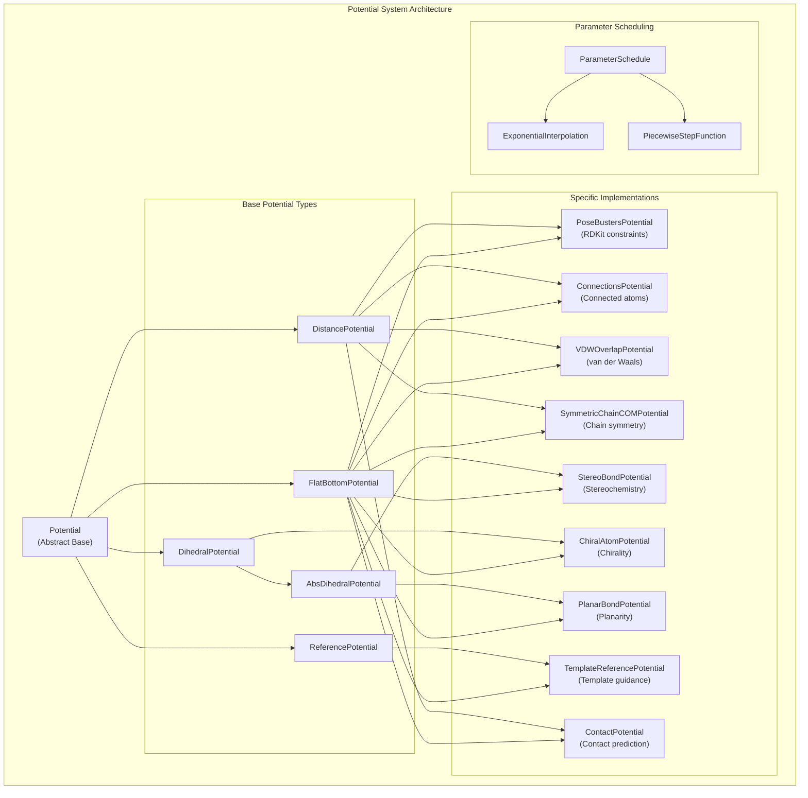
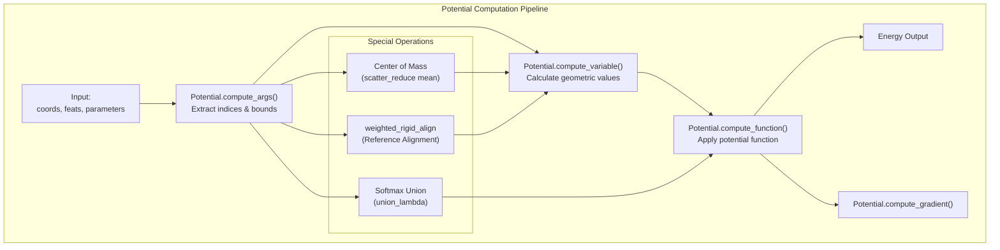
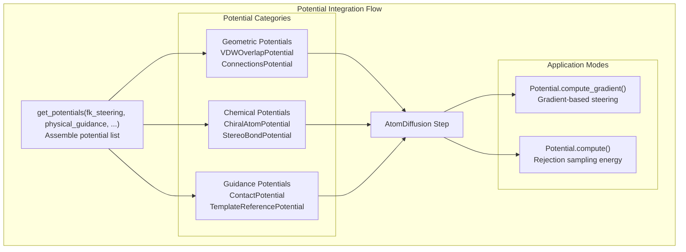

# Physical Guidance and Potentials

> **Relevant source files**
> * [src/boltz/model/potentials/__init__.py](https://github.com/jwohlwend/boltz/blob/b1ebfc46/src/boltz/model/potentials/__init__.py)
> * [src/boltz/model/potentials/potentials.py](https://github.com/jwohlwend/boltz/blob/b1ebfc46/src/boltz/model/potentials/potentials.py)
> * [src/boltz/model/potentials/schedules.py](https://github.com/jwohlwend/boltz/blob/b1ebfc46/src/boltz/model/potentials/schedules.py)

This document explains the potential system in Boltz that provides physics-based guidance during structure prediction. The potential system implements various energy functions that encode chemical and physical constraints, guiding the diffusion process to generate more realistic molecular structures.

For information about the core diffusion system that these potentials guide, see [Diffusion Process](/jwohlwend/boltz/3.4-diffusion-process). For details about confidence scoring of predicted structures, see [Confidence Prediction](/jwohlwend/boltz/3.5-confidence-prediction).

## Overview

The potential system serves as a physics-informed guidance mechanism that constrains the diffusion sampling process to produce chemically and physically plausible molecular structures. It implements various potential energy functions that encode constraints such as bond lengths, angles, chirality, van der Waals interactions, and template-based structural guidance.

**Key Components:**

* Abstract potential framework for implementing energy functions.
* Geometric constraint potentials (distances, angles, dihedrals).
* Chemical constraint potentials (chirality, stereochemistry, planarity).
* Physical interaction potentials (van der Waals, contacts).
* Template-based guidance potentials.
* Time-dependent parameter scheduling system.

Sources: [src/boltz/model/potentials/potentials.py L15-L773](https://github.com/jwohlwend/boltz/blob/b1ebfc46/src/boltz/model/potentials/potentials.py#L15-L773)

## System Architecture

The potential system consists of a hierarchical class structure with abstract base classes defining the interface and specific implementations for different types of constraints.

Sources: [src/boltz/model/potentials/potentials.py L15-L226](https://github.com/jwohlwend/boltz/blob/b1ebfc46/src/boltz/model/potentials/potentials.py#L15-L226)

 [src/boltz/model/potentials/potentials.py L231-L772](https://github.com/jwohlwend/boltz/blob/b1ebfc46/src/boltz/model/potentials/potentials.py#L231-L772)

 [src/boltz/model/potentials/schedules.py L5-L37](https://github.com/jwohlwend/boltz/blob/b1ebfc46/src/boltz/model/potentials/schedules.py#L5-L37)

## Potential Framework

The base `Potential` class defines the core interface that all potential implementations must follow. Each potential computes energy values and gradients for specific geometric or chemical constraints.

### Core Methods

| Method | Purpose | Returns |
| --- | --- | --- |
| `compute()` | Calculate potential energy | Scalar energy value |
| `compute_gradient()` | Calculate energy gradient | Gradient tensor |
| `compute_args()` | Extract constraint data from features | Index tensors and parameters |
| `compute_variable()` | Calculate geometric variable | Distance, angle, or dihedral value |
| `compute_function()` | Apply potential function | Energy from geometric variable |

### Computation Flow

The `compute_gradient` method handles the complex task of backpropagating energy changes through geometric variables (like dihedrals or distances) and optional operators like Softmax unions.

Sources: [src/boltz/model/potentials/potentials.py L24-L90](https://github.com/jwohlwend/boltz/blob/b1ebfc46/src/boltz/model/potentials/potentials.py#L24-L90)

 [src/boltz/model/potentials/potentials.py L91-L200](https://github.com/jwohlwend/boltz/blob/b1ebfc46/src/boltz/model/potentials/potentials.py#L91-L200)

 [src/boltz/model/potentials/potentials.py L213-L225](https://github.com/jwohlwend/boltz/blob/b1ebfc46/src/boltz/model/potentials/potentials.py#L213-L225)

## Potential Types

### Geometric Constraint Potentials

**DistancePotential**: Computes distance-based constraints between atom pairs.

* Calculates pairwise distances: $d_{ij} = | \vec{x}_i - \vec{x}_j |$ [src/boltz/model/potentials/potentials.py L321-L332](https://github.com/jwohlwend/boltz/blob/b1ebfc46/src/boltz/model/potentials/potentials.py#L321-L332)
* Returns distance norm and analytical gradients [src/boltz/model/potentials/potentials.py L334-L343](https://github.com/jwohlwend/boltz/blob/b1ebfc46/src/boltz/model/potentials/potentials.py#L334-L343)
* Used by: `PoseBustersPotential`, `ConnectionsPotential`, `VDWOverlapPotential`.

**DihedralPotential**: Computes dihedral angle constraints for four-atom sequences.

* Calculates dihedral angles using cross products of bond vectors and the `atan2` function [src/boltz/model/potentials/potentials.py L355-L373](https://github.com/jwohlwend/boltz/blob/b1ebfc46/src/boltz/model/potentials/potentials.py#L355-L373)
* Used by: `ChiralAtomPotential`, `StereoBondPotential`, `PlanarBondPotential`.

Sources: [src/boltz/model/potentials/potentials.py L302-L382](https://github.com/jwohlwend/boltz/blob/b1ebfc46/src/boltz/model/potentials/potentials.py#L302-L382)

### Chemical Constraint Potentials

**PoseBustersPotential**: Enforces RDKit-derived geometric constraints including bond lengths, angles, and clash prevention.

* Uses `rdkit_bounds_index`, `rdkit_lower_bounds`, and `rdkit_upper_bounds` from features [src/boltz/model/potentials/potentials.py L392-L402](https://github.com/jwohlwend/boltz/blob/b1ebfc46/src/boltz/model/potentials/potentials.py#L392-L402)
* Applies different buffers for bonds vs angles vs clashes [src/boltz/model/potentials/potentials.py L408-L413](https://github.com/jwohlwend/boltz/blob/b1ebfc46/src/boltz/model/potentials/potentials.py#L408-L413)

**ChiralAtomPotential**: Maintains correct chirality at stereogenic centers.

* Uses `chiral_atom_index` and `chiral_atom_orientations` from features [src/boltz/model/potentials/potentials.py L553-L563](https://github.com/jwohlwend/boltz/blob/b1ebfc46/src/boltz/model/potentials/potentials.py#L553-L563)
* Applies dihedral constraints to preserve R/S stereochemistry with a default buffer of 0.52360 radians (30 degrees) [src/boltz/model/potentials/potentials.py L568-L571](https://github.com/jwohlwend/boltz/blob/b1ebfc46/src/boltz/model/potentials/potentials.py#L568-L571)

**StereoBondPotential**: Enforces E/Z stereochemistry for double bonds.

* Uses `stereo_bond_index` and `stereo_bond_orientations` from features [src/boltz/model/potentials/potentials.py L518-L528](https://github.com/jwohlwend/boltz/blob/b1ebfc46/src/boltz/model/potentials/potentials.py#L518-L528)
* Applies absolute dihedral constraints for cis/trans geometry [src/boltz/model/potentials/potentials.py L534-L540](https://github.com/jwohlwend/boltz/blob/b1ebfc46/src/boltz/model/potentials/potentials.py#L534-L540)

Sources: [src/boltz/model/potentials/potentials.py L384-L581](https://github.com/jwohlwend/boltz/blob/b1ebfc46/src/boltz/model/potentials/potentials.py#L384-L581)

### Physical Interaction Potentials

**VDWOverlapPotential**: Prevents atomic overlap using van der Waals radii.

* Computes pairwise distances between non-bonded atoms using `vdw_radii` from `boltz.data.const` [src/boltz/model/potentials/potentials.py L448-L460](https://github.com/jwohlwend/boltz/blob/b1ebfc46/src/boltz/model/potentials/potentials.py#L448-L460)
* Excludes connected chains and single-atom ions [src/boltz/model/potentials/potentials.py L438-L442](https://github.com/jwohlwend/boltz/blob/b1ebfc46/src/boltz/model/potentials/potentials.py#L438-L442)
* Buffer parameter: 22.5% reduction in VDW radii by default [src/boltz/model/potentials/potentials.py L465](https://github.com/jwohlwend/boltz/blob/b1ebfc46/src/boltz/model/potentials/potentials.py#L465-L465)

**SymmetricChainCOMPotential**: Enforces symmetry constraints between chain centers of mass.

* Uses `symmetric_chain_index` to identify symmetric chain pairs [src/boltz/model/potentials/potentials.py L488-L490](https://github.com/jwohlwend/boltz/blob/b1ebfc46/src/boltz/model/potentials/potentials.py#L488-L490)
* Computes center of mass for each chain and constrains symmetric chains to have similar distances [src/boltz/model/potentials/potentials.py L504-L515](https://github.com/jwohlwend/boltz/blob/b1ebfc46/src/boltz/model/potentials/potentials.py#L504-L515)

Sources: [src/boltz/model/potentials/potentials.py L422-L515](https://github.com/jwohlwend/boltz/blob/b1ebfc46/src/boltz/model/potentials/potentials.py#L422-L515)

### Template and Contact Guidance

**TemplateReferencePotential**: Guides structure prediction using template structures.

* Uses `template_coords` and `template_mask` features [src/boltz/model/potentials/potentials.py L612-L622](https://github.com/jwohlwend/boltz/blob/b1ebfc46/src/boltz/model/potentials/potentials.py#L612-L622)
* Performs rigid alignment between template and predicted coordinates using `weighted_rigid_align` [src/boltz/model/potentials/potentials.py L12](https://github.com/jwohlwend/boltz/blob/b1ebfc46/src/boltz/model/potentials/potentials.py#L12-L12)  [src/boltz/model/potentials/potentials.py L598-L608](https://github.com/jwohlwend/boltz/blob/b1ebfc46/src/boltz/model/potentials/potentials.py#L598-L608)

**ContactPotential**: Incorporates contact prediction guidance.

* Uses `contact_pair_index`, `contact_thresholds`, and `contact_union_index` [src/boltz/model/potentials/potentials.py L642-L652](https://github.com/jwohlwend/boltz/blob/b1ebfc46/src/boltz/model/potentials/potentials.py#L642-L652)
* Supports union operations for alternative contact predictions using `union_lambda` for Softmax aggregation [src/boltz/model/potentials/potentials.py L75-L87](https://github.com/jwohlwend/boltz/blob/b1ebfc46/src/boltz/model/potentials/potentials.py#L75-L87)

Sources: [src/boltz/model/potentials/potentials.py L584-L653](https://github.com/jwohlwend/boltz/blob/b1ebfc46/src/boltz/model/potentials/potentials.py#L584-L653)

## Parameter Scheduling

The potential system supports time-dependent parameter scheduling to adjust constraint strength during the diffusion process via `ParameterSchedule` classes.

### Schedule Types

| Schedule Type | Purpose | Implementation |
| --- | --- | --- |
| `ExponentialInterpolation` | Exponential decay/growth | [src/boltz/model/potentials/schedules.py L10-L23](https://github.com/jwohlwend/boltz/blob/b1ebfc46/src/boltz/model/potentials/schedules.py#L10-L23) |
| `PiecewiseStepFunction` | Step-wise changes | [src/boltz/model/potentials/schedules.py L25-L37](https://github.com/jwohlwend/boltz/blob/b1ebfc46/src/boltz/model/potentials/schedules.py#L25-L37) |

### Example Parameter Configurations

Potentials are configured with schedules for `guidance_weight` and `resampling_weight`. For instance, `VDWOverlapPotential` often uses a `PiecewiseStepFunction` to turn off guidance at late diffusion steps [src/boltz/model/potentials/potentials.py L676-L687](https://github.com/jwohlwend/boltz/blob/b1ebfc46/src/boltz/model/potentials/potentials.py#L676-L687)

Sources: [src/boltz/model/potentials/potentials.py L202-L211](https://github.com/jwohlwend/boltz/blob/b1ebfc46/src/boltz/model/potentials/potentials.py#L202-L211)

 [src/boltz/model/potentials/schedules.py L5-L37](https://github.com/jwohlwend/boltz/blob/b1ebfc46/src/boltz/model/potentials/schedules.py#L5-L37)

## Integration with Diffusion System

The potential system integrates with the diffusion process through the `get_potentials()` function, which assembles the appropriate set of potentials based on steering configuration.

### Steering Modes

The `get_potentials` function populates a list of `Potential` objects based on flags like `fk_steering`, `physical_guidance_update`, and `contact_guidance_update` [src/boltz/model/potentials/potentials.py L655-L666](https://github.com/jwohlwend/boltz/blob/b1ebfc46/src/boltz/model/potentials/potentials.py#L655-L666)

| Mode | Description | Active Potentials |
| --- | --- | --- |
| `fk_steering` | Forward kinematics steering | `PoseBusters`, `ChiralAtom`, `StereoBond`, `PlanarBond` |
| `physical_guidance` | Physics-based guidance | `VDWOverlap`, `Connections`, `SymmetricChainCOM` |
| `contact_guidance` | Contact/Template guidance | `ContactPotential`, `TemplateReferencePotential` |

### Guidance vs Resampling

Each potential supports two operation modes:

* **Guidance Weight**: Applied as a gradient update to the coordinates during diffusion steps.
* **Resampling Weight**: Applied during rejection sampling steps to filter out invalid geometries.
* **Guidance Interval**: Frequency of potential application (every N steps) defined in the configuration.

Sources: [src/boltz/model/potentials/potentials.py L655-L772](https://github.com/jwohlwend/boltz/blob/b1ebfc46/src/boltz/model/potentials/potentials.py#L655-L772)