# Prediction Pipeline

> **Relevant source files**
> * [docs/prediction.md](https://github.com/jwohlwend/boltz/blob/b1ebfc46/docs/prediction.md?plain=1)
> * [src/boltz/data/msa/mmseqs2.py](https://github.com/jwohlwend/boltz/blob/b1ebfc46/src/boltz/data/msa/mmseqs2.py)
> * [src/boltz/data/parse/pdb.py](https://github.com/jwohlwend/boltz/blob/b1ebfc46/src/boltz/data/parse/pdb.py)
> * [src/boltz/main.py](https://github.com/jwohlwend/boltz/blob/b1ebfc46/src/boltz/main.py)

This document covers the complete prediction workflow in Boltz, from input processing through model inference to output generation. The prediction pipeline orchestrates all components needed to transform molecular input data into structural predictions and confidence metrics.

For detailed information about the command-line interface options, see [Command-Line Interface](/jwohlwend/boltz/2.1-command-line-interface). For input format specifications, see [Input Formats](/jwohlwend/boltz/2.2-input-formats). For MSA generation details, see [MSA Generation](/jwohlwend/boltz/2.3-msa-generation). For output interpretation, see [Output Formats and Interpretation](/jwohlwend/boltz/2.4-output-formats-and-interpretation).

## Pipeline Overview

The Boltz prediction pipeline consists of several sequential stages that transform user input into structural predictions:

### High-Level Prediction Flow

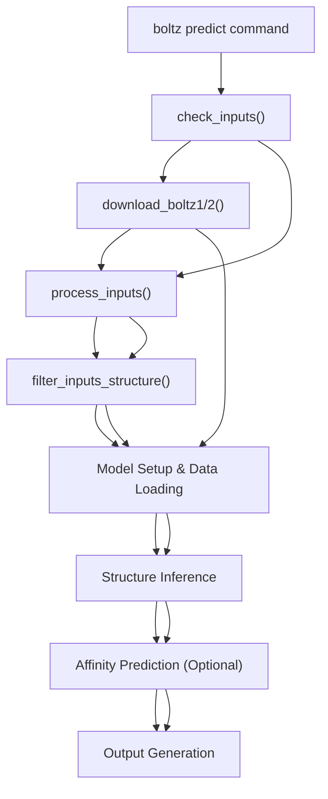

Sources: [src/boltz/main.py L946-L1284](https://github.com/jwohlwend/boltz/blob/b1ebfc46/src/boltz/main.py#L946-L1284)

### Core Pipeline Stages

The prediction pipeline implements five primary stages, each handling a specific aspect of the molecular prediction workflow:

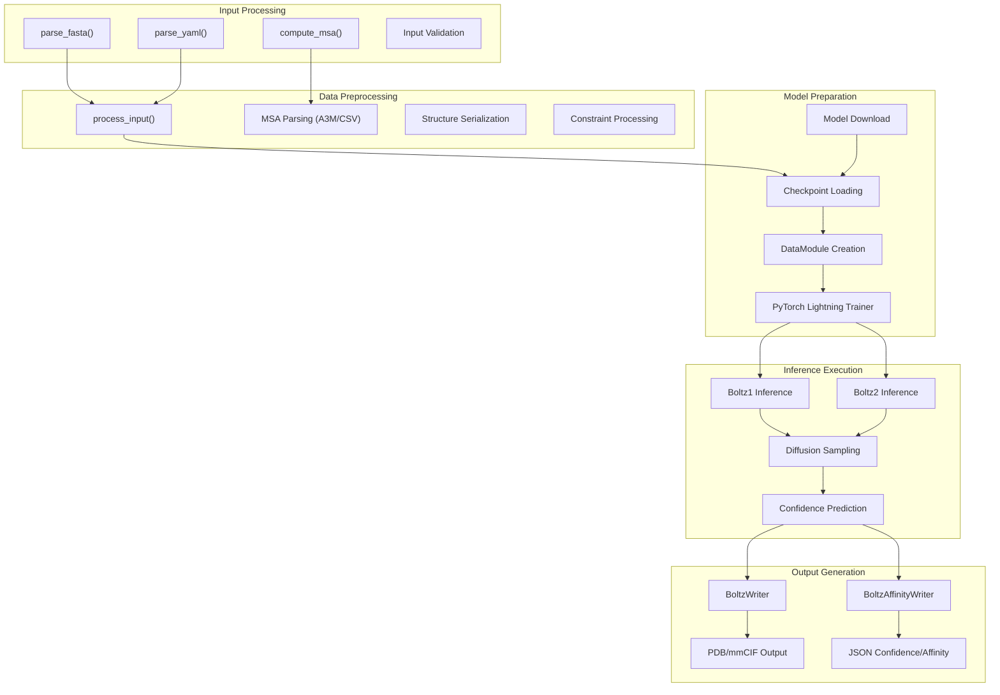

Sources: [src/boltz/main.py L487-L616](https://github.com/jwohlwend/boltz/blob/b1ebfc46/src/boltz/main.py#L487-L616)

 [src/boltz/main.py L619-L737](https://github.com/jwohlwend/boltz/blob/b1ebfc46/src/boltz/main.py#L619-L737)

 [src/boltz/main.py L1126-L1212](https://github.com/jwohlwend/boltz/blob/b1ebfc46/src/boltz/main.py#L1126-L1212)

## Input Processing and Validation

The pipeline begins by validating and processing molecular input data. The system supports both FASTA and YAML input formats, with automatic format detection based on file extensions.

### Input Validation Flow

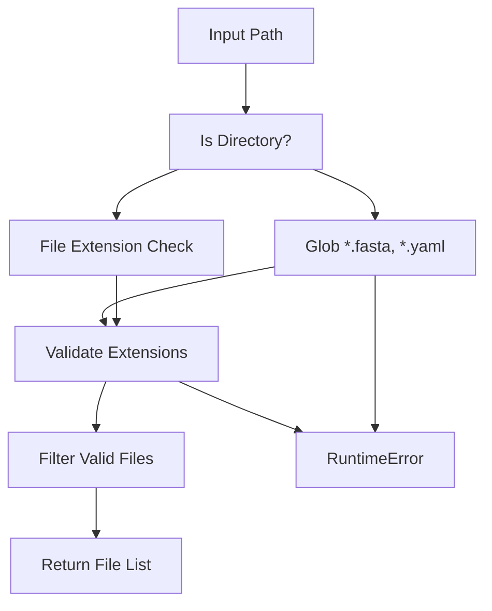

The `check_inputs()` function handles input validation and supports the following file types:

| Extension | Format | Description |
| --- | --- | --- |
| `.fa`, `.fas`, `.fasta` | FASTA | Simple sequence format |
| `.yml`, `.yaml` | YAML | Complex molecular specification |

Sources: [src/boltz/main.py L281-L316](https://github.com/jwohlwend/boltz/blob/b1ebfc46/src/boltz/main.py#L281-L316)

### Input Parsing Functions

The pipeline uses different parsing functions based on input format:

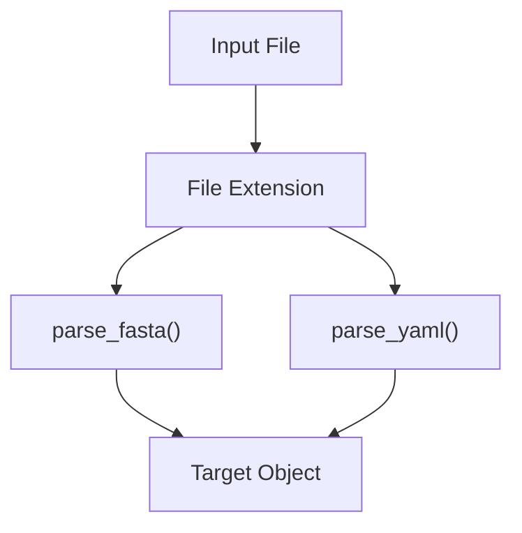

Both parsing functions create a `Target` object containing:

* `record`: Structured representation of chains and entities
* `sequences`: Mapping of entity IDs to sequences
* `templates`: Optional structural templates
* `residue_constraints`: Distance and contact constraints
* `extra_mols`: Additional molecules for Boltz-2

Sources: [src/boltz/main.py L547-L560](https://github.com/jwohlwend/boltz/blob/b1ebfc46/src/boltz/main.py#L547-L560)

### Data Processing Pipeline

Each input file undergoes comprehensive processing through the `process_input()` function:

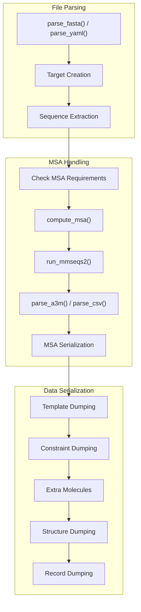

Sources: [src/boltz/main.py L525-L656](https://github.com/jwohlwend/boltz/blob/b1ebfc46/src/boltz/main.py#L525-L656)

## MSA Generation and Server Authentication

The pipeline includes sophisticated MSA generation capabilities through the `compute_msa()` function, which interfaces with MMSeqs2 servers for sequence alignment.

### MSA Server Integration

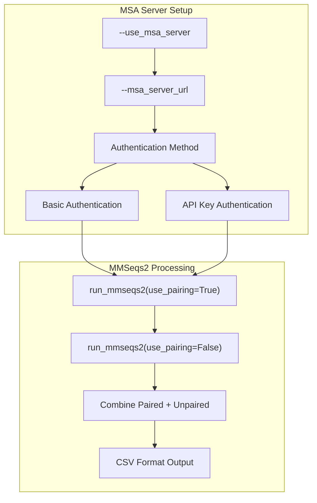

### Authentication Methods

The system supports two mutually exclusive authentication methods:

| Method | CLI Parameters | Environment Variables | Headers |
| --- | --- | --- | --- |
| Basic Auth | `--msa_server_username`, `--msa_server_password` | `BOLTZ_MSA_USERNAME`, `BOLTZ_MSA_PASSWORD` | `Authorization: Basic` |
| API Key | `--api_key_header`, `--api_key_value` | `MSA_API_KEY_VALUE` | Custom header (default: `X-API-Key`) |

The MSA generation process handles sequence pairing using configurable strategies:

* `greedy`: Default pairing strategy for faster processing [src/boltz/data/msa/mmseqs2.py L27](https://github.com/jwohlwend/boltz/blob/b1ebfc46/src/boltz/data/msa/mmseqs2.py#L27-L27)
* `complete`: Comprehensive pairing for better alignment quality [src/boltz/data/msa/mmseqs2.py L174-L175](https://github.com/jwohlwend/boltz/blob/b1ebfc46/src/boltz/data/msa/mmseqs2.py#L174-L175)

Sources: [src/boltz/main.py L415-L523](https://github.com/jwohlwend/boltz/blob/b1ebfc46/src/boltz/main.py#L415-L523)

 [src/boltz/data/msa/mmseqs2.py L21-L85](https://github.com/jwohlwend/boltz/blob/b1ebfc46/src/boltz/data/msa/mmseqs2.py#L21-L85)

## Model Setup and Configuration

The pipeline configures different model variants based on the specified model type (`boltz1` or `boltz2`), each with distinct parameter sets and capabilities.

### Model Configuration Matrix

| Component | Boltz-1 | Boltz-2 |
| --- | --- | --- |
| Diffusion Params | `BoltzDiffusionParams` | `Boltz2DiffusionParams` |
| Pairformer Args | `PairformerArgs` (48 blocks) | `PairformerArgsV2` (64 blocks) |
| Default Step Scale | 1.638 | 1.5 |
| Precision | 32-bit | bf16-mixed |
| Affinity Support | No | Yes |
| DataModule | `BoltzInferenceDataModule` | `Boltz2InferenceDataModule` |
| MSA Paired Features | No | Yes |
| Default Gamma | γ₀=0.605, γₘᵢₙ=1.107 | γ₀=0.8, γₘᵢₙ=1.0 |
| Noise Scale | 0.901 | 1.003 |
| Rho Parameter | 8 | 7 |

### Diffusion Parameter Differences

The two model variants use different diffusion process parameters optimized for their respective architectures:

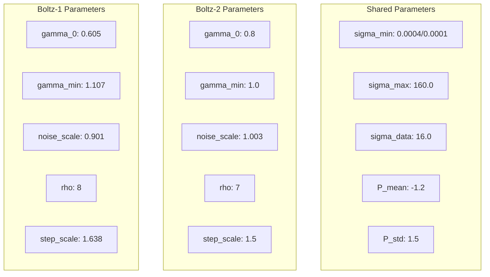

Sources: [src/boltz/main.py L109-L146](https://github.com/jwohlwend/boltz/blob/b1ebfc46/src/boltz/main.py#L109-L146)

 [src/boltz/main.py L1228-L1244](https://github.com/jwohlwend/boltz/blob/b1ebfc46/src/boltz/main.py#L1228-L1244)

### Model Loading and Setup

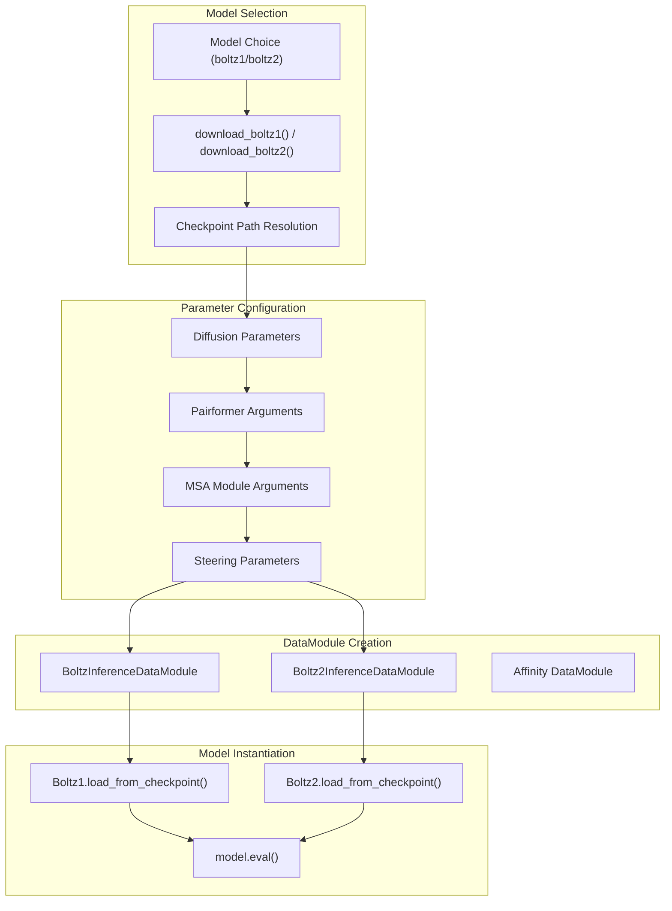

Sources: [src/boltz/main.py L1021-L1027](https://github.com/jwohlwend/boltz/blob/b1ebfc46/src/boltz/main.py#L1021-L1027)

 [src/boltz/main.py L1108-L1124](https://github.com/jwohlwend/boltz/blob/b1ebfc46/src/boltz/main.py#L1108-L1124)

 [src/boltz/main.py L1192-L1204](https://github.com/jwohlwend/boltz/blob/b1ebfc46/src/boltz/main.py#L1192-L1204)

## Inference Execution

The inference stage orchestrates model prediction using PyTorch Lightning's `Trainer` class, handling both structure and affinity predictions.

### Structure Prediction Flow

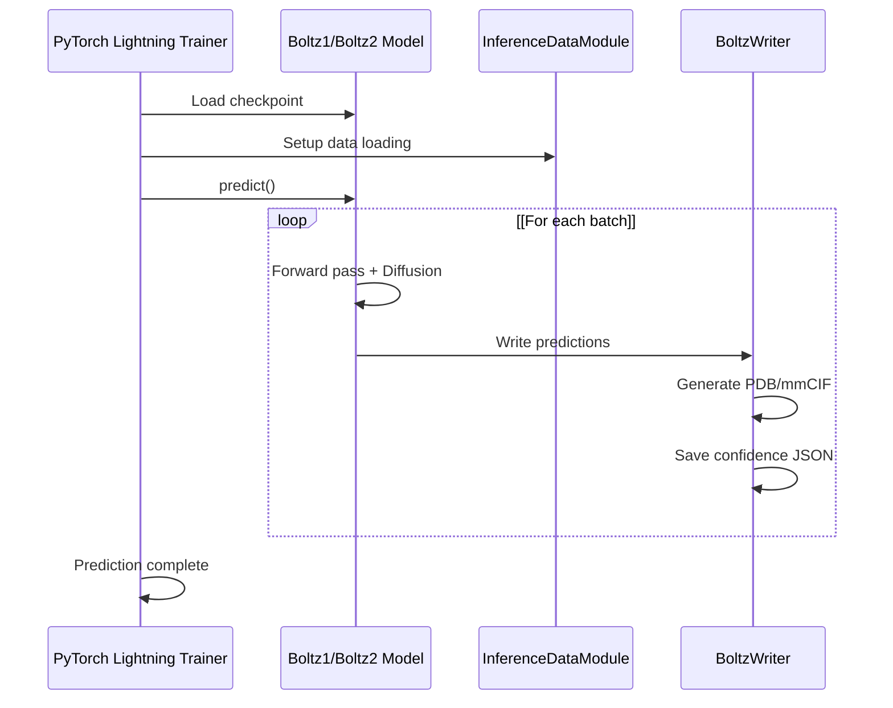

### Prediction Parameters

The system uses different parameter sets for structure vs. affinity prediction:

| Parameter | Structure Prediction | Affinity Prediction |
| --- | --- | --- |
| Recycling Steps | User-defined (default: 3) | Fixed: 5 |
| Sampling Steps | User-defined (default: 200) | User-defined (default: 200) |
| Diffusion Samples | User-defined (default: 1) | User-defined (default: 5) |
| Max Parallel Samples | User-defined (default: 5) | Fixed: 1 |
| Write PAE/PDE | Optional | False |
| Method Override | User-defined or None | Fixed: "other" |
| Model Checkpoint | `boltz1_conf.ckpt` or `boltz2_conf.ckpt` | `boltz2_aff.ckpt` |

### Steering and Guidance Parameters

The pipeline supports optional steering mechanisms through `BoltzSteeringParams`:

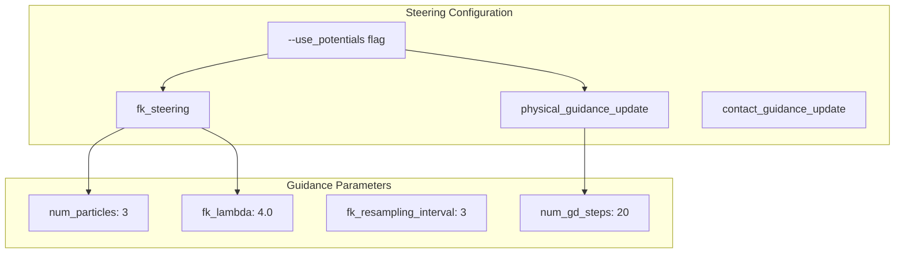

For affinity prediction, all steering mechanisms are disabled to ensure consistent scoring:

* `fk_steering: False` [src/boltz/main.py L1255](https://github.com/jwohlwend/boltz/blob/b1ebfc46/src/boltz/main.py#L1255-L1255)
* `physical_guidance_update: False` [src/boltz/main.py L1258](https://github.com/jwohlwend/boltz/blob/b1ebfc46/src/boltz/main.py#L1258-L1258)
* `contact_guidance_update: False` [src/boltz/main.py L1259](https://github.com/jwohlwend/boltz/blob/b1ebfc46/src/boltz/main.py#L1259-L1259)

Sources: [src/boltz/main.py L1299-L1324](https://github.com/jwohlwend/boltz/blob/b1ebfc46/src/boltz/main.py#L1299-L1324)

 [src/boltz/main.py L1372-L1400](https://github.com/jwohlwend/boltz/blob/b1ebfc46/src/boltz/main.py#L1372-L1400)

 [src/boltz/main.py L148-L158](https://github.com/jwohlwend/boltz/blob/b1ebfc46/src/boltz/main.py#L148-L158)

### Affinity Prediction Pipeline

For inputs with affinity requirements, the pipeline executes a separate affinity prediction stage:

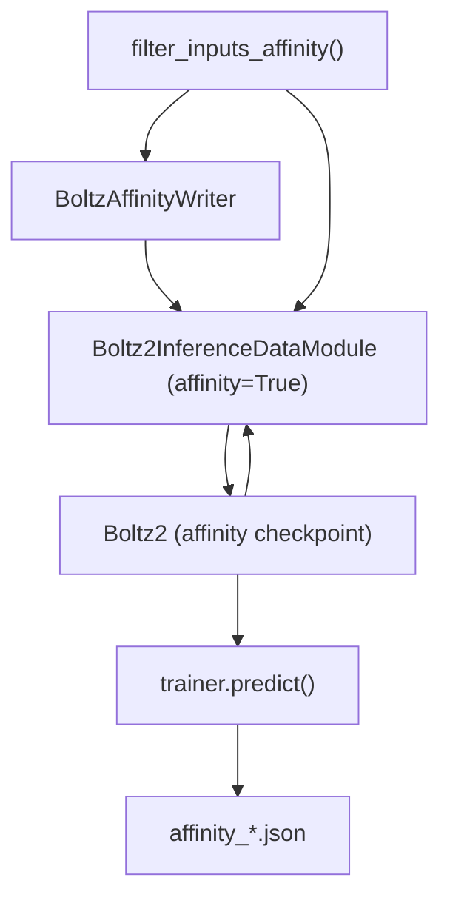

Sources: [src/boltz/main.py L1215-L1284](https://github.com/jwohlwend/boltz/blob/b1ebfc46/src/boltz/main.py#L1215-L1284)

## Output Generation and Organization

The pipeline generates structured output using specialized writer classes that handle different prediction types and formats.

### Output Directory Structure

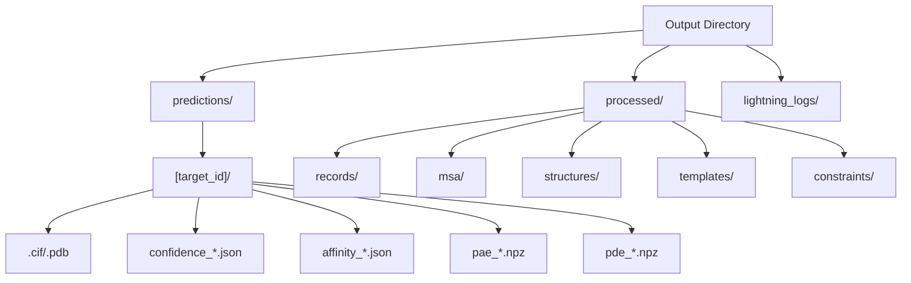

### Writer Class Responsibilities

| Writer Class | Output Type | File Formats | Confidence Data |
| --- | --- | --- | --- |
| `BoltzWriter` | Structure predictions | PDB, mmCIF | JSON + NPZ matrices |
| `BoltzAffinityWriter` | Affinity predictions | JSON only | Affinity scores |

The `BoltzWriter` class handles the primary structure prediction output, generating multiple files per prediction:

* Structure files (PDB/mmCIF format)
* Confidence summary JSON
* Optional full PAE/PDE matrices (NPZ format)

Sources: [src/boltz/data/write/writer.py L32](https://github.com/jwohlwend/boltz/blob/b1ebfc46/src/boltz/data/write/writer.py#L32-L32)

 [src/boltz/main.py L1126-L1132](https://github.com/jwohlwend/boltz/blob/b1ebfc46/src/boltz/main.py#L1126-L1132)

 [src/boltz/main.py L1233-L1236](https://github.com/jwohlwend/boltz/blob/b1ebfc46/src/boltz/main.py#L1233-L1236)

## Pipeline Configuration Classes

The prediction pipeline uses several dataclasses to manage configuration and parameters:

### Core Configuration Classes

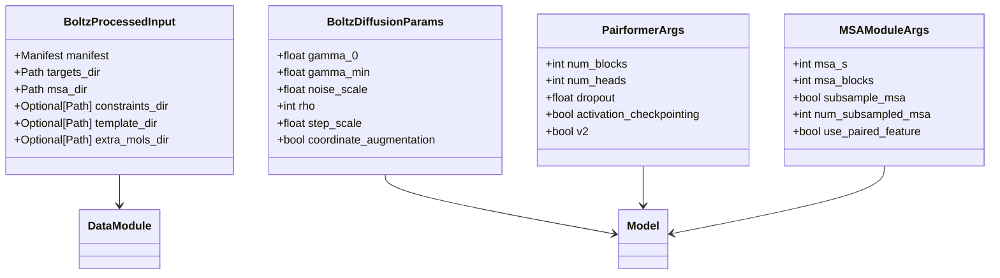

Sources: [src/boltz/main.py L55-L158](https://github.com/jwohlwend/boltz/blob/b1ebfc46/src/boltz/main.py#L55-L158)

## Error Handling and Validation

The pipeline implements comprehensive error handling at multiple stages:

### Input Validation Errors

* Unsupported file extensions [src/boltz/main.py L314-L316](https://github.com/jwohlwend/boltz/blob/b1ebfc46/src/boltz/main.py#L314-L316)
* Missing MSA files when `--use_msa_server` not set [src/boltz/main.py L440-L443](https://github.com/jwohlwend/boltz/blob/b1ebfc46/src/boltz/main.py#L440-L443)
* Invalid directory structures [src/boltz/main.py L289-L291](https://github.com/jwohlwend/boltz/blob/b1ebfc46/src/boltz/main.py#L289-L291)

### Processing Errors

* Failed MSA generation [src/boltz/data/msa/mmseqs2.py L91-L94](https://github.com/jwohlwend/boltz/blob/b1ebfc46/src/boltz/data/msa/mmseqs2.py#L91-L94)
* Corrupted molecular data
* Template alignment failures

### Model Execution Errors

* Insufficient GPU memory
* Invalid checkpoint files
* Network download failures [src/boltz/main.py L191-L193](https://github.com/jwohlwend/boltz/blob/b1ebfc46/src/boltz/main.py#L191-L193)

The pipeline uses `@rank_zero_only` decorators for functions like `download_boltz1()`, `download_boltz2()`, and `process_inputs()` to ensure download operations only occur on the main process in distributed settings, preventing race conditions during model and data downloads.

Sources: [src/boltz/main.py L158-L252](https://github.com/jwohlwend/boltz/blob/b1ebfc46/src/boltz/main.py#L158-L252)

 [src/boltz/main.py L601-L605](https://github.com/jwohlwend/boltz/blob/b1ebfc46/src/boltz/main.py#L601-L605)