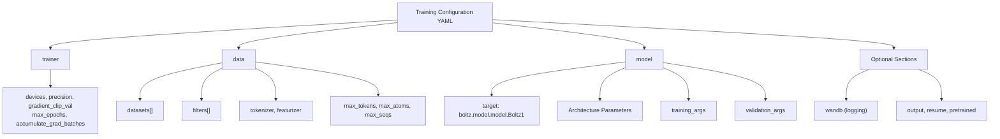
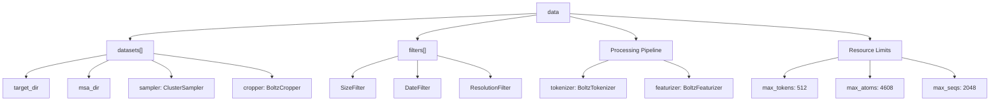
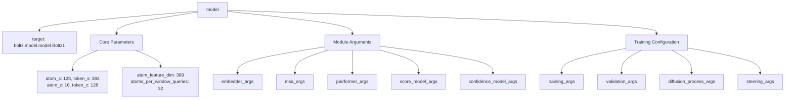

# Training Configuration

> **Relevant source files**
> * [scripts/process/README.md](https://github.com/jwohlwend/boltz/blob/b1ebfc46/scripts/process/README.md?plain=1)
> * [scripts/train/README.md](https://github.com/jwohlwend/boltz/blob/b1ebfc46/scripts/train/README.md?plain=1)
> * [scripts/train/configs/confidence.yaml](https://github.com/jwohlwend/boltz/blob/b1ebfc46/scripts/train/configs/confidence.yaml)
> * [scripts/train/configs/full.yaml](https://github.com/jwohlwend/boltz/blob/b1ebfc46/scripts/train/configs/full.yaml)
> * [scripts/train/configs/structure.yaml](https://github.com/jwohlwend/boltz/blob/b1ebfc46/scripts/train/configs/structure.yaml)
> * [src/boltz/data/filter/dynamic/filter.py](https://github.com/jwohlwend/boltz/blob/b1ebfc46/src/boltz/data/filter/dynamic/filter.py)
> * [src/boltz/data/filter/static/filter.py](https://github.com/jwohlwend/boltz/blob/b1ebfc46/src/boltz/data/filter/static/filter.py)
> * [src/boltz/data/sample/cluster.py](https://github.com/jwohlwend/boltz/blob/b1ebfc46/src/boltz/data/sample/cluster.py)

This document covers the configuration system for training Boltz models, including the structure of configuration files, data filters, sampling strategies, and model architecture settings.

## Overview

The Boltz training system uses YAML configuration files to specify all aspects of the training process. The system supports three distinct training stages: structure, confidence, and full training. These configurations manage the data flow from raw records to model-ready tensors and define the hyperparameters for the underlying architecture.

## Configuration File Structure

All training configurations follow a consistent hierarchical structure with four main sections:

**Sources:** [scripts/train/configs/structure.yaml L1-L194](https://github.com/jwohlwend/boltz/blob/b1ebfc46/scripts/train/configs/structure.yaml#L1-L194)

 [scripts/train/configs/confidence.yaml L1-L201](https://github.com/jwohlwend/boltz/blob/b1ebfc46/scripts/train/configs/confidence.yaml#L1-L201)

 [scripts/train/configs/full.yaml L1-L200](https://github.com/jwohlwend/boltz/blob/b1ebfc46/scripts/train/configs/full.yaml#L1-L200)

### Trainer Configuration

The `trainer` section configures PyTorch Lightning training parameters:

| Parameter | Description | Typical Values |
| --- | --- | --- |
| `accelerator` | Hardware accelerator type | `gpu` |
| `devices` | Number of devices to use | `1` |
| `precision` | Training precision | `32` |
| `gradient_clip_val` | Gradient clipping threshold | `10.0` |
| `max_epochs` | Maximum training epochs | `-1` (infinite) |
| `accumulate_grad_batches` | Gradient accumulation steps | `128` |

**Sources:** [scripts/train/configs/structure.yaml L1-L7](https://github.com/jwohlwend/boltz/blob/b1ebfc46/scripts/train/configs/structure.yaml#L1-L7)

### Data Configuration

The data section defines datasets, processing pipelines, and resource limits:

**Sources:** [scripts/train/configs/structure.yaml L22-L76](https://github.com/jwohlwend/boltz/blob/b1ebfc46/scripts/train/configs/structure.yaml#L22-L76)

#### Dataset and Sampling

Each dataset uses a `ClusterSampler` which implements a weighted sampling approach based on cluster sizes and molecular types (Protein, Nucleic Acid, Ligand) [src/boltz/data/sample/cluster.py L164-L181](https://github.com/jwohlwend/boltz/blob/b1ebfc46/src/boltz/data/sample/cluster.py#L164-L181)

Weights are calculated using the formula:
`w = beta / n_clust * (alpha_prot * n_prot + alpha_nuc * n_nuc + alpha_ligand * n_ligand)` [src/boltz/data/sample/cluster.py L169-L171](https://github.com/jwohlwend/boltz/blob/b1ebfc46/src/boltz/data/sample/cluster.py#L169-L171)

| Sampler Parameter | Default Value | Description |
| --- | --- | --- |
| `alpha_prot` | 3.0 | Weight for protein chains |
| `alpha_nucl` | 3.0 | Weight for nucleic acid chains |
| `alpha_ligand` | 1.0 | Weight for ligands |
| `beta_chain` | 0.5 | Base weight for chains |
| `beta_interface` | 1.0 | Base weight for interfaces |

**Sources:** [src/boltz/data/sample/cluster.py L176-L180](https://github.com/jwohlwend/boltz/blob/b1ebfc46/src/boltz/data/sample/cluster.py#L176-L180)

 [scripts/train/configs/structure.yaml L28-L29](https://github.com/jwohlwend/boltz/blob/b1ebfc46/scripts/train/configs/structure.yaml#L28-L29)

#### Data Filters

Boltz uses dynamic filters to include or exclude data records during training:

* **SizeFilter**: Filters based on the number of chains (e.g., `min_chains: 1`, `max_chains: 300`) [scripts/train/configs/structure.yaml L37-L39](https://github.com/jwohlwend/boltz/blob/b1ebfc46/scripts/train/configs/structure.yaml#L37-L39)
* **DateFilter**: Filters records based on their release date (e.g., `date: "2021-09-30"`) [scripts/train/configs/structure.yaml L40-L42](https://github.com/jwohlwend/boltz/blob/b1ebfc46/scripts/train/configs/structure.yaml#L40-L42)
* **ResolutionFilter**: Filters based on experimental resolution (e.g., `resolution: 9.0` for structure, `4.0` for confidence) [scripts/train/configs/structure.yaml L43-L44](https://github.com/jwohlwend/boltz/blob/b1ebfc46/scripts/train/configs/structure.yaml#L43-L44)  [scripts/train/configs/full.yaml L44-L45](https://github.com/jwohlwend/boltz/blob/b1ebfc46/scripts/train/configs/full.yaml#L44-L45)

**Sources:** [src/boltz/data/filter/dynamic/filter.py L6-L24](https://github.com/jwohlwend/boltz/blob/b1ebfc46/src/boltz/data/filter/dynamic/filter.py#L6-L24)

 [scripts/train/configs/structure.yaml L36-L45](https://github.com/jwohlwend/boltz/blob/b1ebfc46/scripts/train/configs/structure.yaml#L36-L45)

### Model Configuration

The model section specifies the target model class and all architecture parameters:

**Sources:** [scripts/train/configs/structure.yaml L77-L194](https://github.com/jwohlwend/boltz/blob/b1ebfc46/scripts/train/configs/structure.yaml#L77-L194)

## Training Stages

The Boltz system supports three distinct training stages, each with specific objectives and configurations:

### Structure Training Stage

Focuses on learning accurate 3D molecular structure prediction using diffusion models.

* **Confidence Prediction**: Disabled (`confidence_prediction: false`) [scripts/train/configs/structure.yaml L127](https://github.com/jwohlwend/boltz/blob/b1ebfc46/scripts/train/configs/structure.yaml#L127-L127)
* **Sampling**: Lower `sampling_steps` (20) and `diffusion_samples` (2) for speed [scripts/train/configs/structure.yaml L143-L145](https://github.com/jwohlwend/boltz/blob/b1ebfc46/scripts/train/configs/structure.yaml#L143-L145)

### Confidence Training Stage

Learns to predict reliability metrics (pLDDT, PAE, PDE) from a pre-trained structure model.

* **Structure Training**: Disabled (`structure_prediction_training: false`) [scripts/train/configs/confidence.yaml L129](https://github.com/jwohlwend/boltz/blob/b1ebfc46/scripts/train/configs/confidence.yaml#L129-L129)
* **Weights**: Higher `confidence_loss_weight` (3e-3) [scripts/train/configs/confidence.yaml L151](https://github.com/jwohlwend/boltz/blob/b1ebfc46/scripts/train/configs/confidence.yaml#L151-L151)

### Full Training Stage

Combines both structure and confidence prediction in a unified training loop.

* **Structure & Confidence**: Both enabled (`structure_prediction_training: true`, `confidence_prediction: true`) [scripts/train/configs/full.yaml L128-L129](https://github.com/jwohlwend/boltz/blob/b1ebfc46/scripts/train/configs/full.yaml#L128-L129)

## Hyperparameters and Optimization

### Learning Rate and Optimization

All training modes use the AlphaFold3-style learning rate scheduler with a warmup and decay phase [scripts/train/configs/structure.yaml L152-L158](https://github.com/jwohlwend/boltz/blob/b1ebfc46/scripts/train/configs/structure.yaml#L152-L158)

| Parameter | Value |
| --- | --- |
| `lr_scheduler` | `af3` |
| `max_lr` | `0.0018` |
| `lr_warmup_no_steps` | `1000` |
| `lr_decay_factor` | `0.95` |
| `adam_beta_1` | `0.9` |
| `adam_beta_2` | `0.95` |

**Sources:** [scripts/train/configs/structure.yaml L149-L158](https://github.com/jwohlwend/boltz/blob/b1ebfc46/scripts/train/configs/structure.yaml#L149-L158)

### Loss Weights

Weights for different components of the multi-task loss:

| Loss Component | Default Weight | Source |
| --- | --- | --- |
| `diffusion_loss_weight` | 4.0 | [scripts/train/configs/structure.yaml L147](https://github.com/jwohlwend/boltz/blob/b1ebfc46/scripts/train/configs/structure.yaml#L147-L147) |
| `confidence_loss_weight` | 1e-4 (struct) / 3e-3 (full) | [scripts/train/configs/structure.yaml L146](https://github.com/jwohlwend/boltz/blob/b1ebfc46/scripts/train/configs/structure.yaml#L146-L146) |
| `distogram_loss_weight` | 3e-2 | [scripts/train/configs/structure.yaml L148](https://github.com/jwohlwend/boltz/blob/b1ebfc46/scripts/train/configs/structure.yaml#L148-L148) |
| `nucleotide_loss_weight` | 5.0 | [scripts/train/configs/structure.yaml L185](https://github.com/jwohlwend/boltz/blob/b1ebfc46/scripts/train/configs/structure.yaml#L185-L185) |
| `ligand_loss_weight` | 10.0 | [scripts/train/configs/structure.yaml L186](https://github.com/jwohlwend/boltz/blob/b1ebfc46/scripts/train/configs/structure.yaml#L186-L186) |

## Advanced Configuration Options

### Physical Guidance and Steering

Boltz allows for optional physics-based steering during the diffusion process to enforce physical constraints [scripts/train/configs/structure.yaml L188-L194](https://github.com/jwohlwend/boltz/blob/b1ebfc46/scripts/train/configs/structure.yaml#L188-L194)

* `fk_steering`: Enables steering based on forward kinematics.
* `physical_guidance_update`: Enables gradient-based updates using physical potentials.

### Memory Optimization

For large-scale training, the following parameters help manage GPU memory:

* `activation_checkpointing`: Enabled for MSA and Pairformer modules [scripts/train/configs/structure.yaml L104-L111](https://github.com/jwohlwend/boltz/blob/b1ebfc46/scripts/train/configs/structure.yaml#L104-L111)
* `offload_to_cpu`: Optionally offloads activations to CPU [scripts/train/configs/structure.yaml L105-L112](https://github.com/jwohlwend/boltz/blob/b1ebfc46/scripts/train/configs/structure.yaml#L105-L112)
* `matmul_precision`: Can be set to `medium` or `high` for Ampere+ GPUs [scripts/train/configs/structure.yaml L19](https://github.com/jwohlwend/boltz/blob/b1ebfc46/scripts/train/configs/structure.yaml#L19-L19)

**Sources:** [scripts/train/configs/structure.yaml L104-L194](https://github.com/jwohlwend/boltz/blob/b1ebfc46/scripts/train/configs/structure.yaml#L104-L194)