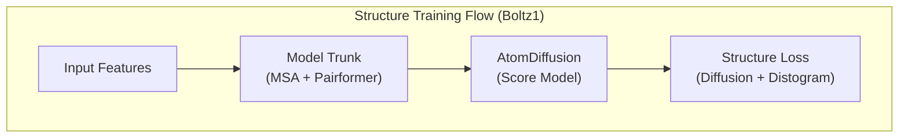
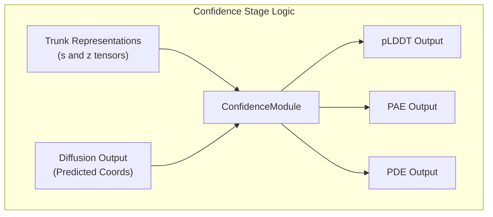

# Training Stages

> **Relevant source files**
> * [docs/training.md](https://github.com/jwohlwend/boltz/blob/b1ebfc46/docs/training.md?plain=1)
> * [scripts/train/configs/confidence.yaml](https://github.com/jwohlwend/boltz/blob/b1ebfc46/scripts/train/configs/confidence.yaml)
> * [scripts/train/configs/full.yaml](https://github.com/jwohlwend/boltz/blob/b1ebfc46/scripts/train/configs/full.yaml)
> * [scripts/train/configs/structure.yaml](https://github.com/jwohlwend/boltz/blob/b1ebfc46/scripts/train/configs/structure.yaml)
> * [src/boltz/data/module/trainingv2.py](https://github.com/jwohlwend/boltz/blob/b1ebfc46/src/boltz/data/module/trainingv2.py)

The Boltz training process is divided into three distinct stages: **Structure**, **Full**, and **Confidence**. Each stage focuses on different aspects of the model's capabilities, ranging from learning basic atomic geometry to refining multi-chain interactions and predicting the reliability of its own outputs.

## Overview of Training Stages

The training stages are defined by specific configuration files located in `scripts/train/configs/`. These configurations adjust loss weights, data filters, and model components to transition the model from a structural backbone to a complete prediction system.

| Stage | Config File | Primary Objective | Key Difference |
| --- | --- | --- | --- |
| **Structure** | `structure.yaml` | Learn atomic coordinates and local geometry. | Confidence prediction is disabled; focus on diffusion loss. |
| **Full** | `full.yaml` | Refine structure and start confidence training. | Structure and confidence trained simultaneously. |
| **Confidence** | `confidence.yaml` | Fine-tune reliability metrics (pLDDT, PAE). | Structure weights are frozen or structure training is disabled. |

Sources: [docs/training.md L42-L47](https://github.com/jwohlwend/boltz/blob/b1ebfc46/docs/training.md?plain=1#L42-L47)

 [docs/training.md L108-L111](https://github.com/jwohlwend/boltz/blob/b1ebfc46/docs/training.md?plain=1#L108-L111)

## Stage 1: Structure Training

The structure stage is the initial phase where the model learns to generate 3D coordinates. During this stage, the model is trained primarily on the diffusion loss to minimize the difference between predicted and ground-truth atomic positions.

### Configuration Characteristics

* **Confidence Prediction**: Disabled (`confidence_prediction: false`). [scripts/train/configs/structure.yaml L127](https://github.com/jwohlwend/boltz/blob/b1ebfc46/scripts/train/configs/structure.yaml#L127-L127)
* **Data Filtering**: Uses a more permissive resolution filter (e.g., 9.0Å) to maximize data volume. [scripts/train/configs/structure.yaml L44](https://github.com/jwohlwend/boltz/blob/b1ebfc46/scripts/train/configs/structure.yaml#L44-L44)
* **Loss Weights**: High weight on `diffusion_loss_weight` (4.0) and `distogram_loss_weight` (3e-2). [scripts/train/configs/structure.yaml L147-L148](https://github.com/jwohlwend/boltz/blob/b1ebfc46/scripts/train/configs/structure.yaml#L147-L148)
* **Sampling**: Lower `sampling_steps` (20) are often used to speed up training iterations. [scripts/train/configs/structure.yaml L143](https://github.com/jwohlwend/boltz/blob/b1ebfc46/scripts/train/configs/structure.yaml#L143-L143)

### Implementation Flow

Sources: [scripts/train/configs/structure.yaml L78-L194](https://github.com/jwohlwend/boltz/blob/b1ebfc46/scripts/train/configs/structure.yaml#L78-L194)

## Stage 2: Full Training

In the Full stage, the model continues to refine its structural predictions while simultaneously learning to predict confidence scores. This stage bridges the gap between raw coordinate generation and usable biological predictions.

### Configuration Characteristics

* **Confidence Prediction**: Enabled (`confidence_prediction: true`). [scripts/train/configs/full.yaml L129](https://github.com/jwohlwend/boltz/blob/b1ebfc46/scripts/train/configs/full.yaml#L129-L129)
* **Structure Training**: Remains active (`structure_prediction_training: true`). [scripts/train/configs/full.yaml L128](https://github.com/jwohlwend/boltz/blob/b1ebfc46/scripts/train/configs/full.yaml#L128-L128)
* **Data Filtering**: Stricter resolution requirements (e.g., 4.0Å) to ensure the confidence module learns from high-quality data. [scripts/train/configs/full.yaml L45](https://github.com/jwohlwend/boltz/blob/b1ebfc46/scripts/train/configs/full.yaml#L45-L45)
* **Loss Integration**: Introduces `confidence_loss_weight` (3e-3). [scripts/train/configs/full.yaml L150](https://github.com/jwohlwend/boltz/blob/b1ebfc46/scripts/train/configs/full.yaml#L150-L150)
* **Symmetry**: `return_train_symmetries` is set to `true` to handle ligand permutations during loss calculation. [scripts/train/configs/full.yaml L66](https://github.com/jwohlwend/boltz/blob/b1ebfc46/scripts/train/configs/full.yaml#L66-L66)

Sources: [scripts/train/configs/full.yaml L1-L200](https://github.com/jwohlwend/boltz/blob/b1ebfc46/scripts/train/configs/full.yaml#L1-L200)

## Stage 3: Confidence Training

The final stage focuses exclusively on the `ConfidenceModule`. The goal is to calibrate the model's self-assessment metrics: pLDDT (local quality), PAE (alignment error), and PDE (distance error).

### Configuration Characteristics

* **Structure Training**: Disabled (`structure_prediction_training: false`). The trunk weights are typically frozen or the gradients are not backpropagated to the diffusion module. [scripts/train/configs/confidence.yaml L129](https://github.com/jwohlwend/boltz/blob/b1ebfc46/scripts/train/configs/confidence.yaml#L129-L129)
* **Confidence Imitation**: `confidence_imitate_trunk` is set to `true` to ensure the confidence features align with the Pairformer's representations. [scripts/train/configs/confidence.yaml L132](https://github.com/jwohlwend/boltz/blob/b1ebfc46/scripts/train/configs/confidence.yaml#L132-L132)
* **Pretrained Loading**: The model starts from a checkpoint that has already completed structure training. [scripts/train/configs/confidence.yaml L17](https://github.com/jwohlwend/boltz/blob/b1ebfc46/scripts/train/configs/confidence.yaml#L17-L17)
* **Validation**: Uses `run_confidence_sequentially: true` to accurately measure validation metrics without memory overflow. [scripts/train/configs/confidence.yaml L172](https://github.com/jwohlwend/boltz/blob/b1ebfc46/scripts/train/configs/confidence.yaml#L172-L172)

### Data Flow for Confidence Prediction

Sources: [scripts/train/configs/confidence.yaml L129-L144](https://github.com/jwohlwend/boltz/blob/b1ebfc46/scripts/train/configs/confidence.yaml#L129-L144)

 [src/boltz/model/model.py](https://github.com/jwohlwend/boltz/blob/b1ebfc46/src/boltz/model/model.py)

## Summary of Configuration Parameters

The following table highlights the critical parameters in `DataConfig` and `Model` that change across stages.

| Parameter | Structure | Full | Confidence |
| --- | --- | --- | --- |
| `resolution` filter | 9.0 | 4.0 | 4.0 |
| `confidence_prediction` | `false` | `true` | `true` |
| `structure_prediction_training` | N/A | `true` | `false` |
| `diffusion_samples` (train) | 2 | 1 | 1 |
| `confidence_loss_weight` | 1e-4 | 3e-3 | 3e-3 |
| `sampling_steps` (train) | 20 | 200 | 200 |

Sources: [scripts/train/configs/structure.yaml](https://github.com/jwohlwend/boltz/blob/b1ebfc46/scripts/train/configs/structure.yaml)

 [scripts/train/configs/full.yaml](https://github.com/jwohlwend/boltz/blob/b1ebfc46/scripts/train/configs/full.yaml)

 [scripts/train/configs/confidence.yaml](https://github.com/jwohlwend/boltz/blob/b1ebfc46/scripts/train/configs/confidence.yaml)