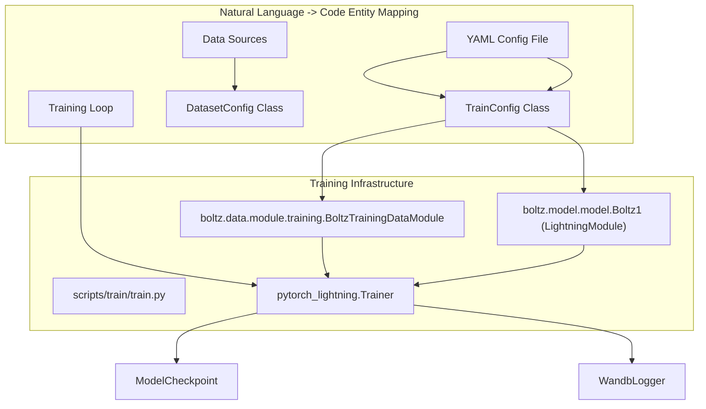
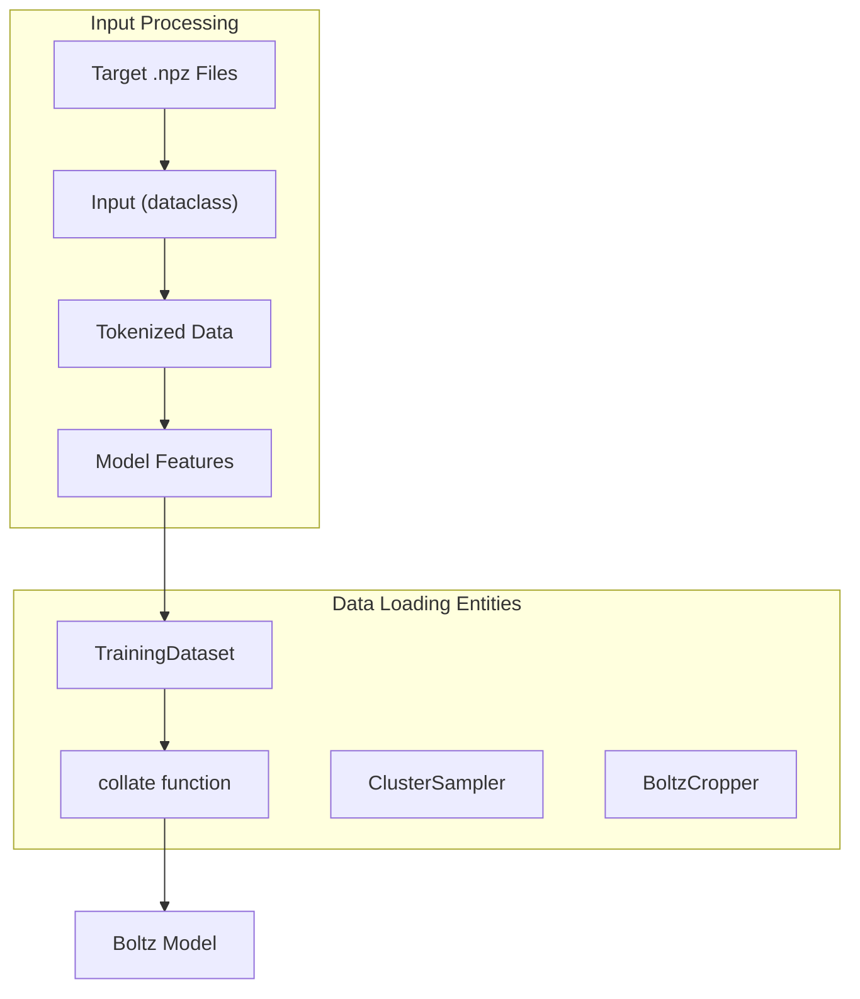

# Training System

> **Relevant source files**
> * [docs/training.md](https://github.com/jwohlwend/boltz/blob/b1ebfc46/docs/training.md?plain=1)
> * [scripts/train/train.py](https://github.com/jwohlwend/boltz/blob/b1ebfc46/scripts/train/train.py)
> * [src/boltz/data/feature/symmetry.py](https://github.com/jwohlwend/boltz/blob/b1ebfc46/src/boltz/data/feature/symmetry.py)
> * [src/boltz/data/filter/static/ligand.py](https://github.com/jwohlwend/boltz/blob/b1ebfc46/src/boltz/data/filter/static/ligand.py)
> * [src/boltz/data/module/inference.py](https://github.com/jwohlwend/boltz/blob/b1ebfc46/src/boltz/data/module/inference.py)
> * [src/boltz/data/module/training.py](https://github.com/jwohlwend/boltz/blob/b1ebfc46/src/boltz/data/module/training.py)

The Training System in Boltz provides a framework for training the Boltz-1 and Boltz-2 models for biomolecular structure prediction. This system handles the complete training workflow, from data preparation and loading to model configuration, training loop execution, and checkpoint management. The Training System leverages PyTorch Lightning for efficient multi-GPU training and supports different training configurations, including structure-only training, full model training, and confidence-only training.

For details on configuration, see [Training Configuration](/jwohlwend/boltz/5.1-training-configuration). For details on the three training phases, see [Training Stages](/jwohlwend/boltz/5.2-training-stages). For details on losses and optimization, see [Loss Functions and Optimization](/jwohlwend/boltz/5.3-loss-functions-and-optimization).

## Training System Architecture

The Training System consists of several interconnected components that work together to train the Boltz models. The `train.py` script serves as the entry point, orchestrating the interaction between Hydra-based configurations, PyTorch Lightning modules, and the data pipeline.

### High-Level Training Flow



Sources:

* [scripts/train/train.py L24-L77](https://github.com/jwohlwend/boltz/blob/b1ebfc46/scripts/train/train.py#L24-L77)
* [scripts/train/train.py L98-L100](https://github.com/jwohlwend/boltz/blob/b1ebfc46/scripts/train/train.py#L98-L100)
* [src/boltz/data/module/training.py L22-L69](https://github.com/jwohlwend/boltz/blob/b1ebfc46/src/boltz/data/module/training.py#L22-L69)

## Data Preparation and Loading

The training system requires pre-processed structural data and MSA files. The `BoltzTrainingDataModule` handles the complexity of loading multiple datasets (e.g., PDB and OpenFold distillation sets) with specific sampling probabilities.

### Data Processing Components



Sources:

* [src/boltz/data/module/training.py L85-L141](https://github.com/jwohlwend/boltz/blob/b1ebfc46/src/boltz/data/module/training.py#L85-L141)
* [src/boltz/data/module/training.py L187-L211](https://github.com/jwohlwend/boltz/blob/b1ebfc46/src/boltz/data/module/training.py#L187-L211)
* [src/boltz/data/module/training.py L144-L184](https://github.com/jwohlwend/boltz/blob/b1ebfc46/src/boltz/data/module/training.py#L144-L184)

### Data Sources

The system is built to ingest:

1. **RCSB (PDB) Structures**: Processed targets and MSAs [docs/training.md L9-L21](https://github.com/jwohlwend/boltz/blob/b1ebfc46/docs/training.md?plain=1#L9-L21)
2. **OpenFold Structures**: Distillation datasets used to improve model robustness [docs/training.md L23-L35](https://github.com/jwohlwend/boltz/blob/b1ebfc46/docs/training.md?plain=1#L23-L35)
3. **Ligand Symmetries**: Pre-computed symmetry files (`symmetry.pkl`) for small molecule handling [docs/training.md L37-L40](https://github.com/jwohlwend/boltz/blob/b1ebfc46/docs/training.md?plain=1#L37-L40)

## Training Configurations

Boltz uses YAML files managed via Hydra. These files define hyperparameters, model dimensions, and training behavior.

| Configuration File | Training Stage | Key Purpose |
| --- | --- | --- |
| `structure.yaml` | Structure Stage | Initial training of the structure module only [docs/training.md L46](https://github.com/jwohlwend/boltz/blob/b1ebfc46/docs/training.md?plain=1#L46-L46) |
| `full.yaml` | Full Stage | Joint training of structure and confidence modules. |
| `confidence.yaml` | Confidence Stage | Fine-tuning confidence prediction on a frozen or pre-trained trunk [docs/training.md L108-L110](https://github.com/jwohlwend/boltz/blob/b1ebfc46/docs/training.md?plain=1#L108-L110) |

For details, see [Training Configuration](/jwohlwend/boltz/5.1-training-configuration).

## Training Stages and Workflow

The Boltz training process is typically divided into stages to ensure stability and accuracy. The system supports resuming from checkpoints and specialized loading logic, such as `load_confidence_from_trunk`, which broadcasts trunk weights to the confidence module [scripts/train/train.py L58-L59](https://github.com/jwohlwend/boltz/blob/b1ebfc46/scripts/train/train.py#L58-L59)

### Execution Command

The training is executed via the CLI:

```
python scripts/train/train.py scripts/train/configs/structure.yaml [overrides]
```

Common overrides include `debug=1` (disables DDP and wandb) or setting `devices` for multi-GPU execution [docs/training.md L100-L106](https://github.com/jwohlwend/boltz/blob/b1ebfc46/docs/training.md?plain=1#L100-L106)

For details, see [Training Stages](/jwohlwend/boltz/5.2-training-stages).

## Loss and Optimization

The `LightningModule` implementation in Boltz defines the training step, where multiple loss components (Diffusion loss, Distogram loss, Confidence loss) are weighted and combined. The system uses specific schedulers like the "af3" scheduler for learning rate management.

For details, see [Loss Functions and Optimization](/jwohlwend/boltz/5.3-loss-functions-and-optimization).

Sources:

* [scripts/train/train.py L130-L166](https://github.com/jwohlwend/boltz/blob/b1ebfc46/scripts/train/train.py#L130-L166)
* [src/boltz/data/module/training.py L214-L235](https://github.com/jwohlwend/boltz/blob/b1ebfc46/src/boltz/data/module/training.py#L214-L235)