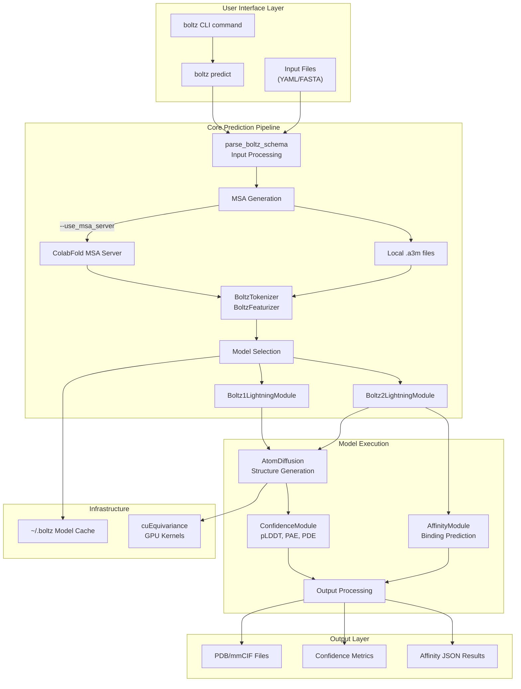
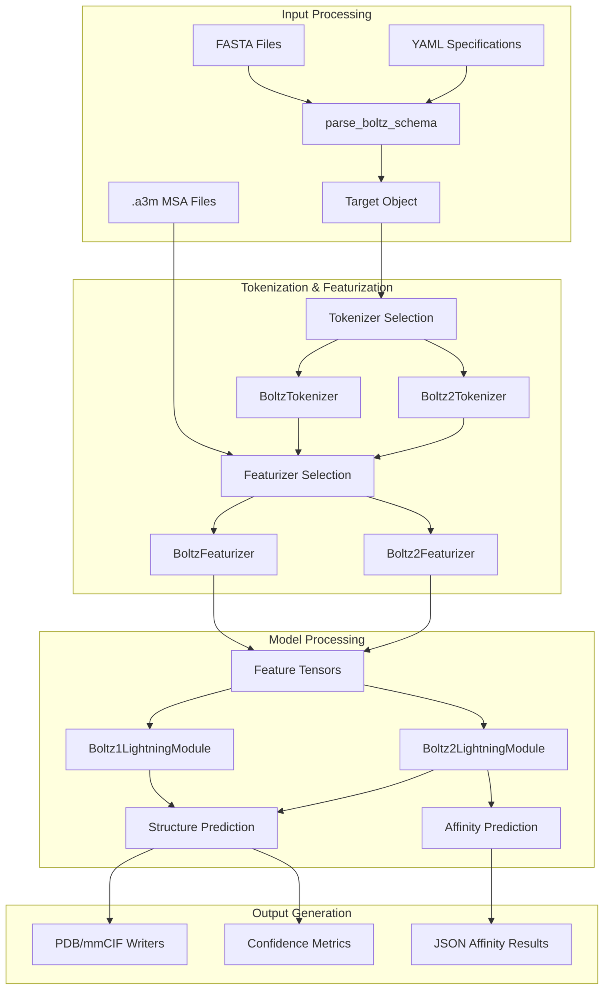

# Boltz Overview

# Boltz Overview

> **Relevant source files**
> - [README\.md](https://github.com/jwohlwend/boltz/blob/cb04aecc/README.md?plain=1)
> - [examples/prot\_no\_msa\.yaml](https://github.com/jwohlwend/boltz/blob/cb04aecc/examples/prot_no_msa.yaml)
> - [pyproject\.toml](https://github.com/jwohlwend/boltz/blob/cb04aecc/pyproject.toml)
> - [src/boltz/data/msa/mmseqs2\.py](https://github.com/jwohlwend/boltz/blob/cb04aecc/src/boltz/data/msa/mmseqs2.py)
> - [src/boltz/main\.py](https://github.com/jwohlwend/boltz/blob/cb04aecc/src/boltz/main.py)
> - [src/boltz/model/layers/triangular\_mult\.py](https://github.com/jwohlwend/boltz/blob/cb04aecc/src/boltz/model/layers/triangular_mult.py)

## Purpose and Scope

 This document provides an introduction to the Boltz system, a biomolecular interaction prediction framework that uses deep learning models to predict protein structures and binding affinities\. It covers the system's purpose, architecture overview, and key capabilities\. For detailed usage instructions, see [Command\-Line Interface](https://deepwiki.com/jwohlwend/boltz/2.1-command-line-interface)\. For technical details about model architectures, see [Model Architecture](https://deepwiki.com/jwohlwend/boltz/3-model-architecture)\. For training procedures, see [Training System](https://deepwiki.com/jwohlwend/boltz/5-training-system)\.

## System Introduction

 Boltz is a family of deep learning models designed for biomolecular interaction prediction\. The system provides two main model variants:

 - **Boltz\-1**: The first fully open\-source model to approach AlphaFold3 accuracy for structure prediction
- **Boltz\-2**: An enhanced biomolecular foundation model that jointly predicts complex structures and binding affinities

 The system operates 1000x faster than traditional physics\-based free\-energy perturbation \(FEP\) methods while approaching their accuracy, making it suitable for large\-scale molecular screening applications\.

| Model | Primary Capabilities | Key Features |
| --- | --- | --- |
| Boltz\-1 | Structure prediction, confidence estimation | Basic structure folding, pLDDT confidence scores |
| Boltz\-2 | Structure \+ affinity prediction | Enhanced features, binding affinity estimation, B\-factor prediction |

 Sources: [README\.md?plain=1 L15-L19](https://github.com/jwohlwend/boltz/blob/cb04aecc/README.md?plain=1#L15-L19)

## Model Variants and Capabilities

### Boltz\-1 Model

 Boltz\-1 focuses on accurate structure prediction using a diffusion\-based approach\. It processes input sequences and multiple sequence alignments \(MSAs\) to generate 3D molecular structures with confidence estimates\.

### Boltz\-2 Model

 Boltz\-2 extends Boltz\-1 with binding affinity prediction capabilities\. It provides two types of affinity predictions:

 - `affinity_probability_binary`: Probability score \(0\-1\) for detecting binders from decoys
- `affinity_pred_value`: Quantitative binding affinity as log\(IC50\) in μM units

 Sources: [README\.md?plain=1 L51-L52](https://github.com/jwohlwend/boltz/blob/cb04aecc/README.md?plain=1#L51-L52)

## High\-Level System Architecture



 Sources: [README\.md?plain=1 L42-L48](https://github.com/jwohlwend/boltz/blob/cb04aecc/README.md?plain=1#L42-L48) [README\.md?plain=1 L51-L52](https://github.com/jwohlwend/boltz/blob/cb04aecc/README.md?plain=1#L51-L52)

## Key System Components

 The Boltz system consists of several interconnected components that handle the complete prediction pipeline:

### Input Processing Layer

 - `parse_boltz_schema`: Parses YAML and FASTA input formats into structured representations
- `BoltzTokenizer`/`Boltz2Tokenizer`: Converts parsed structures into model\-ready tokens
- `BoltzFeaturizer`/`Boltz2Featurizer`: Generates feature tensors from tokenized data

### Neural Network Core

 - `InputEmbedder`: Processes input features into embedding space
- `MSAModule`: Handles multiple sequence alignment processing
- `PairformerModule`: Computes pairwise representations
- `AtomDiffusion`: Performs diffusion\-based structure generation

### Output Processing

 - `ConfidenceModule`: Estimates prediction confidence \(pLDDT, PAE, PDE\)
- `AffinityModule`: Predicts binding affinities \(Boltz\-2 only\)
- Structure writers: Output PDB/mmCIF format files

 Sources: Based on system architecture diagrams provided

## Core Data Flow



 Sources: Based on data processing pipeline diagrams provided

## Installation and Dependencies

 Boltz can be installed via PyPI with CUDA support:

```
pip install boltz[cuda] -U
```

 For CPU\-only installations:

```
pip install boltz -U
```

 The system leverages several key dependencies:

 - PyTorch Lightning for training infrastructure
- cuEquivariance for GPU\-accelerated operations on NVIDIA hardware
- ColabFold API for MSA generation
- Standard scientific computing libraries \(NumPy, PyTorch\)

 Sources: [README\.md?plain=1 L25-L38](https://github.com/jwohlwend/boltz/blob/cb04aecc/README.md?plain=1#L25-L38)

## Usage Workflow

 The typical Boltz prediction workflow follows this pattern:

 1. **Input Preparation**: Create YAML configuration files or FASTA sequences
2. **MSA Generation**: Optionally use `--use_msa_server` for automatic MSA generation
3. **Model Execution**: Run `boltz predict input_path` to generate predictions
4. **Output Analysis**: Examine structure files and confidence/affinity metrics

 For detailed instructions on each step, see [Command\-Line Interface](https://deepwiki.com/jwohlwend/boltz/2.1-command-line-interface) and [Input Formats](https://deepwiki.com/jwohlwend/boltz/2.2-input-formats)\.

 The system automatically selects the appropriate model variant \(Boltz\-1 or Boltz\-2\) based on the input specifications and requested prediction types\.

 Sources: [README\.md?plain=1 L42-L48](https://github.com/jwohlwend/boltz/blob/cb04aecc/README.md?plain=1#L42-L48)

## License and Availability

 Boltz is released under the MIT License, making it freely available for both academic and commercial use\. All model weights and source code are provided without restrictions\.

 Sources: [README\.md?plain=1 L81-L83](https://github.com/jwohlwend/boltz/blob/cb04aecc/README.md?plain=1#L81-L83)

---
*Source: [https://deepwiki.com/jwohlwend/boltz/1-boltz-overview](https://deepwiki.com/jwohlwend/boltz/1-boltz-overview) on DeepWiki*