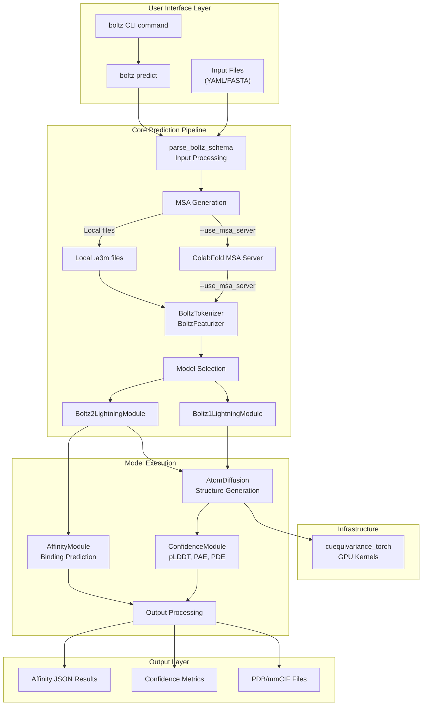
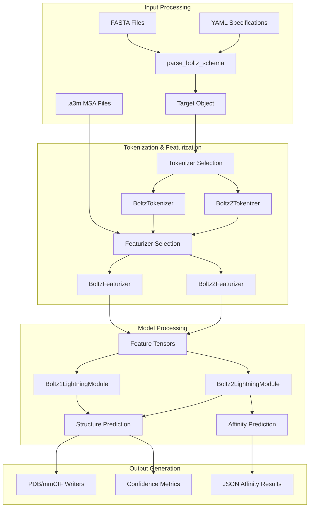

# Boltz Overview

# Boltz Overview

> **Relevant source files**
> - [README\.md](https://github.com/jwohlwend/boltz/blob/b1ebfc46/README.md?plain=1)
> - [examples/prot\_no\_msa\.yaml](https://github.com/jwohlwend/boltz/blob/b1ebfc46/examples/prot_no_msa.yaml)
> - [pyproject\.toml](https://github.com/jwohlwend/boltz/blob/b1ebfc46/pyproject.toml)
> - [src/boltz/\_\_init\_\_\.py](https://github.com/jwohlwend/boltz/blob/b1ebfc46/src/boltz/__init__.py)
> - [src/boltz/model/layers/triangular\_mult\.py](https://github.com/jwohlwend/boltz/blob/b1ebfc46/src/boltz/model/layers/triangular_mult.py)

## Purpose and Scope

 This document introduces the Boltz system, a biomolecular interaction prediction framework that utilizes deep learning models to predict protein structures and binding affinities\. It covers the system's purpose, architectural overview, and high\-level capabilities\.

 For detailed setup, see [Installation and Setup](https://deepwiki.com/jwohlwend/boltz/1.1-installation-and-setup)\. For a comparison of model versions, see [Boltz\-1 vs Boltz\-2](https://deepwiki.com/jwohlwend/boltz/1.2-boltz-1-vs-boltz-2)\. Technical details regarding the prediction workflow are found in [Prediction Pipeline](https://deepwiki.com/jwohlwend/boltz/2-prediction-pipeline)\.

## System Introduction

 Boltz is a family of deep learning models designed for biomolecular interaction prediction\. The system provides two main model variants:

 - **Boltz\-1**: The first fully open\-source model to approach AlphaFold3 accuracy for structure prediction [README\.md?plain=1 L17-L19](https://github.com/jwohlwend/boltz/blob/b1ebfc46/README.md?plain=1#L17-L19)
- **Boltz\-2**: A biomolecular foundation model that jointly models complex structures and binding affinities [README\.md?plain=1 L17-L19](https://github.com/jwohlwend/boltz/blob/b1ebfc46/README.md?plain=1#L17-L19)

 The system operates up to 1000x faster than traditional physics\-based free\-energy perturbation \(FEP\) methods while approaching their accuracy, making it suitable for large\-scale molecular screening in early\-stage drug discovery [README\.md?plain=1 L17-L18](https://github.com/jwohlwend/boltz/blob/b1ebfc46/README.md?plain=1#L17-L18)

| Model | Primary Capabilities | Key Features |
| --- | --- | --- |
| Boltz\-1 | Structure prediction, confidence estimation | Open source, diffusion\-based folding README\.md17\-19 |
| Boltz\-2 | Structure \+ affinity prediction | FEP\-level accuracy, binder detection, $log\_\{10\}\(IC\_\{50\}\)$ estimation README\.md17\-19 README\.md51\-52 |

 Sources: [README\.md?plain=1 L15-L19](https://github.com/jwohlwend/boltz/blob/b1ebfc46/README.md?plain=1#L15-L19) [README\.md?plain=1 L51-L52](https://github.com/jwohlwend/boltz/blob/b1ebfc46/README.md?plain=1#L51-L52)

## Model Variants and Capabilities

### Boltz\-1 Model

 Boltz\-1 focuses on accurate structure prediction\. It processes input sequences and multiple sequence alignments \(MSAs\) to generate 3D molecular structures with confidence estimates like pLDDT and PAE\.

### Boltz\-2 Model

 Boltz\-2 extends Boltz\-1 by incorporating an `AffinityModule` for binding affinity prediction [README\.md?plain=1 L51-L52](https://github.com/jwohlwend/boltz/blob/b1ebfc46/README.md?plain=1#L51-L52) It provides two types of affinity outputs:

 - `affinity_probability_binary`: A value from 0 to 1 representing the probability that a ligand is a binder, used for hit\-discovery [README\.md?plain=1 L51-L52](https://github.com/jwohlwend/boltz/blob/b1ebfc46/README.md?plain=1#L51-L52)
- `affinity_pred_value`: A quantitative value reported as $log\_\{10\}\(IC\_\{50\}\)$, derived from $IC\_\{50\}$ measured in $\\mu M$, used for lead optimization [README\.md?plain=1 L51-L52](https://github.com/jwohlwend/boltz/blob/b1ebfc46/README.md?plain=1#L51-L52)

 Sources: [README\.md?plain=1 L51-L52](https://github.com/jwohlwend/boltz/blob/b1ebfc46/README.md?plain=1#L51-L52)

## High\-Level System Architecture



 Sources: [README\.md?plain=1 L42-L48](https://github.com/jwohlwend/boltz/blob/b1ebfc46/README.md?plain=1#L42-L48) [README\.md?plain=1 L51-L52](https://github.com/jwohlwend/boltz/blob/b1ebfc46/README.md?plain=1#L51-L52) [pyproject\.toml L44-L46](https://github.com/jwohlwend/boltz/blob/b1ebfc46/pyproject.toml#L44-L46) [triangular\_mult\.py L22-L36](https://github.com/jwohlwend/boltz/blob/b1ebfc46/src/boltz/model/layers/triangular_mult.py#L22-L36)

## Core Data Flow



 Sources: [README\.md?plain=1 L42-L52](https://github.com/jwohlwend/boltz/blob/b1ebfc46/README.md?plain=1#L42-L52) [prot\_no\_msa\.yaml L1-L6](https://github.com/jwohlwend/boltz/blob/b1ebfc46/examples/prot_no_msa.yaml#L1-L6)

## Installation and Dependencies

 Boltz is primarily written in Python \(\>=3\.10\) [pyproject\.toml L8](https://github.com/jwohlwend/boltz/blob/b1ebfc46/pyproject.toml#L8-L8) It can be installed via PyPI with optional CUDA support for accelerated kernels:

```
pip install boltz[cuda] -U
```

 The system leverages several key technical components:

 - **NVIDIA cuEquivariance**: Provides accelerated kernels for equivariant operations [README\.md?plain=1 L79](https://github.com/jwohlwend/boltz/blob/b1ebfc46/README.md?plain=1#L79-L79) [triangular\_mult\.py L22-L23](https://github.com/jwohlwend/boltz/blob/b1ebfc46/src/boltz/model/layers/triangular_mult.py#L22-L23)
- **MMseqs2/ColabFold**: Used for automatic MSA generation [README\.md?plain=1 L108-L117](https://github.com/jwohlwend/boltz/blob/b1ebfc46/README.md?plain=1#L108-L117)
- **PyTorch & Lightning**: The underlying deep learning framework [pyproject\.toml L12-L15](https://github.com/jwohlwend/boltz/blob/b1ebfc46/pyproject.toml#L12-L15)

 Sources: [README\.md?plain=1 L25-L38](https://github.com/jwohlwend/boltz/blob/b1ebfc46/README.md?plain=1#L25-L38) [pyproject\.toml L5-L47](https://github.com/jwohlwend/boltz/blob/b1ebfc46/pyproject.toml#L5-L47) [triangular\_mult\.py L22-L36](https://github.com/jwohlwend/boltz/blob/b1ebfc46/src/boltz/model/layers/triangular_mult.py#L22-L36)

## Usage Workflow

 The typical Boltz prediction workflow follows this pattern:

 1. **Input Preparation**: Create YAML configuration files \(specifying sequences, MSAs, and properties\) or FASTA sequences [README\.md?plain=1 L48](https://github.com/jwohlwend/boltz/blob/b1ebfc46/README.md?plain=1#L48-L48)
2. **MSA Generation**: Use the `--use_msa_server` flag to fetch alignments automatically [README\.md?plain=1 L45](https://github.com/jwohlwend/boltz/blob/b1ebfc46/README.md?plain=1#L45-L45)
3. **Model Execution**: Run the `boltz predict` command, which serves as the main entry point [pyproject\.toml L38](https://github.com/jwohlwend/boltz/blob/b1ebfc46/pyproject.toml#L38-L38) [README\.md?plain=1 L42-L45](https://github.com/jwohlwend/boltz/blob/b1ebfc46/README.md?plain=1#L42-L45)
4. **Output Analysis**: Review generated mmCIF/PDB structures and affinity JSON results [README\.md?plain=1 L52](https://github.com/jwohlwend/boltz/blob/b1ebfc46/README.md?plain=1#L52-L52)

 For detailed instructions on each step, see [Command\-Line Interface](https://deepwiki.com/jwohlwend/boltz/2.1-command-line-interface) and [Input Formats](https://deepwiki.com/jwohlwend/boltz/2.2-input-formats)\.

 Sources: [README\.md?plain=1 L40-L52](https://github.com/jwohlwend/boltz/blob/b1ebfc46/README.md?plain=1#L40-L52) [pyproject\.toml L37-L38](https://github.com/jwohlwend/boltz/blob/b1ebfc46/pyproject.toml#L37-L38)

## License and Availability

 Boltz is released under the **MIT License**, making it freely available for both academic and commercial purposes [README\.md?plain=1 L81-L83](https://github.com/jwohlwend/boltz/blob/b1ebfc46/README.md?plain=1#L81-L83)

 Sources: [README\.md?plain=1 L81-L83](https://github.com/jwohlwend/boltz/blob/b1ebfc46/README.md?plain=1#L81-L83)

---
*Source: [https://deepwiki.com/jwohlwend/boltz/1-boltz-overview](https://deepwiki.com/jwohlwend/boltz/1-boltz-overview) on DeepWiki*