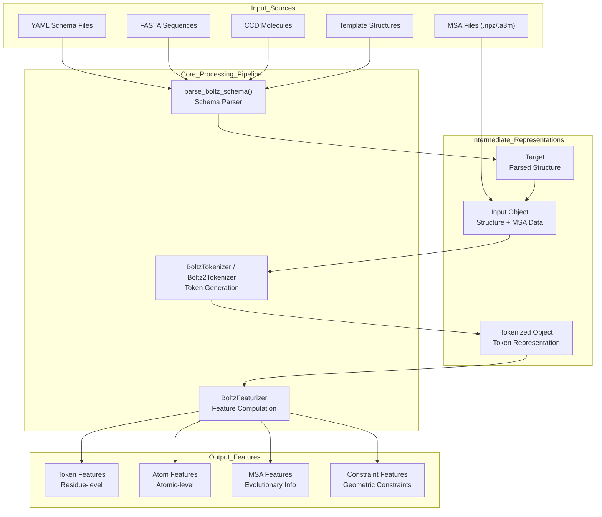
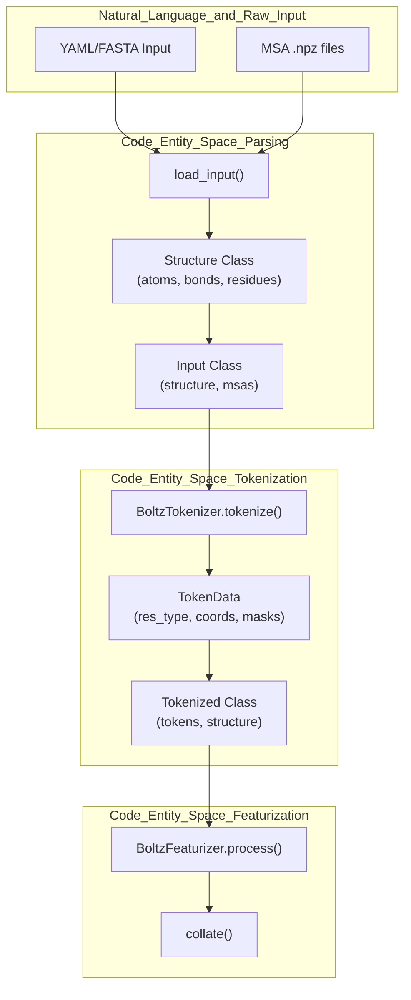

# Data Processing

# Data Processing

> **Relevant source files**
> - [src/boltz/data/module/inference\.py](https://github.com/jwohlwend/boltz/blob/b1ebfc46/src/boltz/data/module/inference.py)
> - [src/boltz/data/module/training\.py](https://github.com/jwohlwend/boltz/blob/b1ebfc46/src/boltz/data/module/training.py)
> - [src/boltz/data/types\.py](https://github.com/jwohlwend/boltz/blob/b1ebfc46/src/boltz/data/types.py)

 This document provides a comprehensive overview of Boltz's data processing pipeline, which transforms raw molecular input specifications into model\-ready feature tensors\. The pipeline consists of three main stages: input parsing, tokenization, and featurization\. The system supports both Boltz\-1 and Boltz\-2 architectures with different tokenization strategies and feature requirements\.

## Pipeline Overview

 The data processing system converts molecular structure definitions from YAML/FASTA inputs into structured tensor representations that the neural network can process\. This transformation involves parsing molecular schemas, creating token representations via `BoltzTokenizer` or `Boltz2Tokenizer`, and computing features for different molecular components\. In training, the `TrainingDataset` [training\.py L187-L211](https://github.com/jwohlwend/boltz/blob/b1ebfc46/src/boltz/data/module/training.py#L187-L211) and `load_input` [training\.py L85-L141](https://github.com/jwohlwend/boltz/blob/b1ebfc46/src/boltz/data/module/training.py#L85-L141) functions orchestrate the loading of structures and MSAs from disk\. For inference, the `PredictionDataset` [inference\.py L121-L150](https://github.com/jwohlwend/boltz/blob/b1ebfc46/src/boltz/data/module/inference.py#L121-L150) manages the sequence of parsing, tokenization, and featurization\.

 Sources: [inference\.py L151-L212](https://github.com/jwohlwend/boltz/blob/b1ebfc46/src/boltz/data/module/inference.py#L151-L212) [training\.py L85-L141](https://github.com/jwohlwend/boltz/blob/b1ebfc46/src/boltz/data/module/training.py#L85-L141) [types\.py L169-L204](https://github.com/jwohlwend/boltz/blob/b1ebfc46/src/boltz/data/types.py#L169-L204)

## Core Components

 The data processing pipeline consists of three main components that work sequentially:

### Schema Parser

 The `parse_boltz_schema()` function handles the initial parsing of molecular specifications\. It processes polymer chains, ligands, and constraints into structured `Target` objects\. The `Structure` class [types\.py L169-L179](https://github.com/jwohlwend/boltz/blob/b1ebfc46/src/boltz/data/types.py#L169-L179) serves as the primary container for the parsed molecular data, including atoms, bonds, residues, and connectivity\.

### Tokenizers

 The system provides two tokenizer implementations:

 - **BoltzTokenizer**: [boltz\.py L32-L34](https://github.com/jwohlwend/boltz/blob/b1ebfc46/src/boltz/data/tokenize/boltz.py#L32-L34) Used for Boltz\-1\. It creates token representations where standard residues become single tokens and non\-standard residues are tokenized at the atomic level\.
- **Boltz2Tokenizer**: Used for Boltz\-2, adding support for frames and enhanced template processing\.

### BoltzFeaturizer

 The `BoltzFeaturizer` [featurizer\.py L1127-L1128](https://github.com/jwohlwend/boltz/blob/b1ebfc46/src/boltz/data/feature/featurizer.py#L1127-L1128) class computes model\-ready features\. It handles the conversion of `Tokenized` data into tensors, including the processing of MSAs and geometric constraints\.

 Sources: [types\.py L169-L204](https://github.com/jwohlwend/boltz/blob/b1ebfc46/src/boltz/data/types.py#L169-L204) [inference\.py L148-L150](https://github.com/jwohlwend/boltz/blob/b1ebfc46/src/boltz/data/module/inference.py#L148-L150) [training\.py L81-L82](https://github.com/jwohlwend/boltz/blob/b1ebfc46/src/boltz/data/module/training.py#L81-L82)

## Data Flow Architecture

 The following diagram illustrates the detailed data transformations and key data structures used throughout the pipeline, specifically highlighting the transition from raw data to the `Input` and `Tokenized` objects\.

 **Detailed Data Processing Pipeline**

 Sources: [inference\.py L25-L74](https://github.com/jwohlwend/boltz/blob/b1ebfc46/src/boltz/data/module/inference.py#L25-L74) [inference\.py L77-L118](https://github.com/jwohlwend/boltz/blob/b1ebfc46/src/boltz/data/module/inference.py#L77-L118) [types\.py L169-L179](https://github.com/jwohlwend/boltz/blob/b1ebfc46/src/boltz/data/types.py#L169-L179) [types\.py L302-L308](https://github.com/jwohlwend/boltz/blob/b1ebfc46/src/boltz/data/types.py#L302-L308)

## Processing Stages

### Input Parsing and Schema

 The parsing stage converts raw specifications into structured Python objects\. It validates input formats and creates `Structure` objects [types\.py L169-L179](https://github.com/jwohlwend/boltz/blob/b1ebfc46/src/boltz/data/types.py#L169-L179) containing NumPy arrays for `atoms`, `bonds`, and `residues`\. For details, see [Input Parsing and Schema](https://deepwiki.com/jwohlwend/boltz/4.1-input-parsing-and-schema)\.

### Tokenization

 Tokenization converts structures into discrete tokens\. The `BoltzTokenizer` processes the `Input` object [types\.py L302-L308](https://github.com/jwohlwend/boltz/blob/b1ebfc46/src/boltz/data/types.py#L302-L308) to produce a `Tokenized` representation\. This involves mapping chemical entities to specific token types and handling atomic coordinates\. For details, see [Tokenization](https://deepwiki.com/jwohlwend/boltz/4.2-tokenization)\.

### Feature Generation

 The `BoltzFeaturizer.process()` method [inference\.py L194-L206](https://github.com/jwohlwend/boltz/blob/b1ebfc46/src/boltz/data/module/inference.py#L194-L206) generates the final tensors\. This includes token\-level features, atom\-level features, and complex MSA representations\. The pipeline also supports `pad_to_max` [training\.py L15](https://github.com/jwohlwend/boltz/blob/b1ebfc46/src/boltz/data/module/training.py#L15-L15) to ensure uniform batch sizes\. For details, see [Feature Generation](https://deepwiki.com/jwohlwend/boltz/4.3-feature-generation)\.

### MSA Processing

 MSA processing involves loading evolutionary data from `.npz` files [training\.py L138-L139](https://github.com/jwohlwend/boltz/blob/b1ebfc46/src/boltz/data/module/training.py#L138-L139) and pairing sequences\. The `MSA` dataclass [types\.py L279-L286](https://github.com/jwohlwend/boltz/blob/b1ebfc46/src/boltz/data/types.py#L279-L286) stores sequences, deletion matrices, and taxonomy information\. For details, see [MSA Processing](https://deepwiki.com/jwohlwend/boltz/4.4-msa-processing)\.

 Sources: [inference\.py L177-L206](https://github.com/jwohlwend/boltz/blob/b1ebfc46/src/boltz/data/module/inference.py#L177-L206) [training\.py L133-L141](https://github.com/jwohlwend/boltz/blob/b1ebfc46/src/boltz/data/module/training.py#L133-L141) [types\.py L279-L286](https://github.com/jwohlwend/boltz/blob/b1ebfc46/src/boltz/data/types.py#L279-L286)

## Key Data Structures

 The pipeline uses several important data structures to represent molecular information:

| Stage | Data Structure | Purpose | Key Fields |
| --- | --- | --- | --- |
| Loading | Structure | Raw molecular data | atoms, bonds, residues, chains |
| Loading | MSA | Evolutionary data | sequences, deletion\_matrix, taxonomy |
| Assembly | Input | Combined target data | structure, msas, record |
| Tokenization | Tokenized | Discrete representation | tokens, bonds, structure |
| Featurization | Tensor | Model\-ready input | res\_type, msa, atom\_coords |

 Sources: [types\.py L169-L179](https://github.com/jwohlwend/boltz/blob/b1ebfc46/src/boltz/data/types.py#L169-L179) [types\.py L279-L286](https://github.com/jwohlwend/boltz/blob/b1ebfc46/src/boltz/data/types.py#L279-L286) [types\.py L302-L308](https://github.com/jwohlwend/boltz/blob/b1ebfc46/src/boltz/data/types.py#L302-L308) [inference\.py L77-L118](https://github.com/jwohlwend/boltz/blob/b1ebfc46/src/boltz/data/module/inference.py#L77-L118)

---
*Source: [https://deepwiki.com/jwohlwend/boltz/4-data-processing](https://deepwiki.com/jwohlwend/boltz/4-data-processing) on DeepWiki*