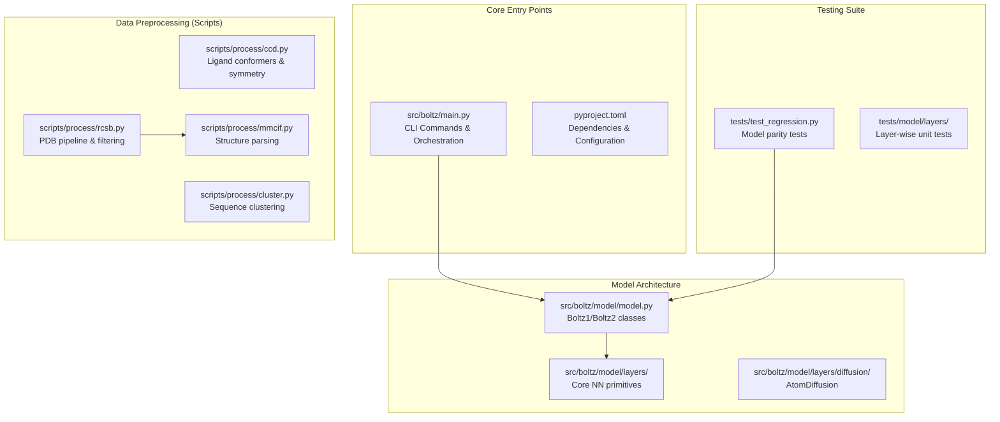
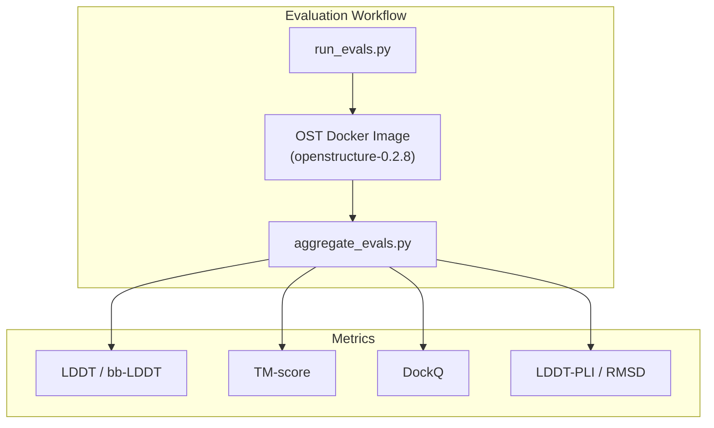

# Developer Guide

# Developer Guide

> **Relevant source files**
> - [\.gitignore](https://github.com/jwohlwend/boltz/blob/b1ebfc46/.gitignore)
> - [docs/evaluation\.md](https://github.com/jwohlwend/boltz/blob/b1ebfc46/docs/evaluation.md?plain=1)
> - [scripts/eval/aggregate\_evals\.py](https://github.com/jwohlwend/boltz/blob/b1ebfc46/scripts/eval/aggregate_evals.py)
> - [scripts/eval/run\_evals\.py](https://github.com/jwohlwend/boltz/blob/b1ebfc46/scripts/eval/run_evals.py)
> - [scripts/process/ccd\.py](https://github.com/jwohlwend/boltz/blob/b1ebfc46/scripts/process/ccd.py)
> - [scripts/process/cluster\.py](https://github.com/jwohlwend/boltz/blob/b1ebfc46/scripts/process/cluster.py)
> - [scripts/process/mmcif\.py](https://github.com/jwohlwend/boltz/blob/b1ebfc46/scripts/process/mmcif.py)
> - [scripts/process/rcsb\.py](https://github.com/jwohlwend/boltz/blob/b1ebfc46/scripts/process/rcsb.py)
> - [tests/model/layers/test\_outer\_product\_mean\.py](https://github.com/jwohlwend/boltz/blob/b1ebfc46/tests/model/layers/test_outer_product_mean.py)
> - [tests/model/layers/test\_triangle\_attention\.py](https://github.com/jwohlwend/boltz/blob/b1ebfc46/tests/model/layers/test_triangle_attention.py)
> - [tests/profiling\.py](https://github.com/jwohlwend/boltz/blob/b1ebfc46/tests/profiling.py)
> - [tests/test\_kernels\.py](https://github.com/jwohlwend/boltz/blob/b1ebfc46/tests/test_kernels.py)
> - [tests/test\_regression\.py](https://github.com/jwohlwend/boltz/blob/b1ebfc46/tests/test_regression.py)
> - [tests/test\_utils\.py](https://github.com/jwohlwend/boltz/blob/b1ebfc46/tests/test_utils.py)

 This document provides a technical reference for developers working with the Boltz codebase, including project structure, data preprocessing scripts, testing protocols, and core architectural abstractions\.

## Project Structure Overview

 The Boltz codebase is organized into modules handling data ingestion, neural architecture, training orchestration, and preprocessing utilities\.

 **Sources:** [main\.py L1-L1080](https://github.com/jwohlwend/boltz/blob/b1ebfc46/src/boltz/main.py#L1-L1080) [ccd\.py L1-L217](https://github.com/jwohlwend/boltz/blob/b1ebfc46/scripts/process/ccd.py#L1-L217) [rcsb\.py L1-L254](https://github.com/jwohlwend/boltz/blob/b1ebfc46/scripts/process/rcsb.py#L1-L254) [test\_regression\.py L1-L113](https://github.com/jwohlwend/boltz/blob/b1ebfc46/tests/test_regression.py#L1-L113)

## Data Preprocessing Pipeline

 For developers working on the training data pipeline, Boltz provides scripts to process raw PDB/CCD data into optimized formats\.

### Ligand Processing \(`ccd.py`\)

 This script processes the Chemical Component Dictionary \(CCD\) to generate 3D conformers and compute molecular symmetries\.

 - **Conformer Generation:** Uses RDKit's `ETKDGv3` method to generate coordinates [ccd\.py L46-L90](https://github.com/jwohlwend/boltz/blob/b1ebfc46/scripts/process/ccd.py#L46-L90)
- **Symmetry Computation:** Computes index permutations for symmetric atoms using `GetSubstructMatches`, filtering out leaving atoms [ccd\.py L127-L166](https://github.com/jwohlwend/boltz/blob/b1ebfc46/scripts/process/ccd.py#L127-L166)
- **Parallelization:** Utilizes `p_uimap` for multi\-core processing of CCD components [ccd\.py L241-L256](https://github.com/jwohlwend/boltz/blob/b1ebfc46/scripts/process/ccd.py#L241-L256)

### PDB Processing \(`rcsb.py` & `mmcif.py`\)

 Handles the ingestion of MMCIF files and applies biological filters\.

 - **Structure Parsing:** `parse_mmcif` \(in `mmcif.py`\) extracts atom coordinates, resolutions, and experimental methods [mmcif\.py L133-L179](https://github.com/jwohlwend/boltz/blob/b1ebfc46/scripts/process/mmcif.py#L133-L179)
- **Filtering:** `StaticFilter` subclasses \(e\.g\., `ClashingChainsFilter`, `MinimumLengthFilter`\) are applied to remove low\-quality structures [rcsb\.py L18-L25](https://github.com/jwohlwend/boltz/blob/b1ebfc46/scripts/process/rcsb.py#L18-L25) [rcsb\.py L206-L215](https://github.com/jwohlwend/boltz/blob/b1ebfc46/scripts/process/rcsb.py#L206-L215)
- **Manifest Generation:** `finalize` groups processed records into a single `manifest.json` for the training `DataLoader` [rcsb\.py L80-L110](https://github.com/jwohlwend/boltz/blob/b1ebfc46/scripts/process/rcsb.py#L80-L110)

### Sequence Clustering \(`cluster.py`\)

 Creates a mapping from structure IDs to MSA indices to prevent data leakage\.

 - **MMSeqs2 Integration:** Uses `mmseqs easy-cluster` on protein sequences with a 40% identity threshold [cluster\.py L43-L52](https://github.com/jwohlwend/boltz/blob/b1ebfc46/scripts/process/cluster.py#L43-L52)
- **Nucleotide/Ligand Handling:** Assigns unique IDs to RNA/DNA and CCD codes, ensuring they are represented in the clustering manifest [cluster\.py L62-L78](https://github.com/jwohlwend/boltz/blob/b1ebfc46/scripts/process/cluster.py#L62-L78)

 **Sources:** [ccd\.py L46-L166](https://github.com/jwohlwend/boltz/blob/b1ebfc46/scripts/process/ccd.py#L46-L166) [mmcif\.py L1-L179](https://github.com/jwohlwend/boltz/blob/b1ebfc46/scripts/process/mmcif.py#L1-L179) [rcsb\.py L175-L239](https://github.com/jwohlwend/boltz/blob/b1ebfc46/scripts/process/rcsb.py#L175-L239) [cluster\.py L19-L82](https://github.com/jwohlwend/boltz/blob/b1ebfc46/scripts/process/cluster.py#L19-L82)

## Testing and Quality Assurance

 The `tests/` directory contains regression and unit tests to ensure model stability and numerical precision\.

### Regression Testing

 `tests/test_regression.py` ensures that changes to the codebase do not alter model outputs for known inputs\.

| Test Case | Entity Validated | Logic |
| --- | --- | --- |
| test\_input\_embedder | Boltz1\.input\_embedder | Compares s\_inputs against stored tensors tests/test\_regression\.py61\-65 |
| test\_rel\_pos | Boltz1\.rel\_pos | Validates relative position encoding tests/test\_regression\.py67\-71 |
| test\_structure\_output | Boltz1\.structure\_module | Checks noised\_atom\_coords with sigma\_data=0 for determinism tests/test\_regression\.py74\-109 |

### Layer Unit Tests

 Individual layers are tested for feature parity and chunking support\.

 - **`OuterProductMeanTest`**: Validates that chunked execution matches the standard forward pass within `1e-8` tolerance [test\_outer\_product\_mean\.py L27-L38](https://github.com/jwohlwend/boltz/blob/b1ebfc46/tests/model/layers/test_outer_product_mean.py#L27-L38)
- **`TriangleAttention`**: Tests `TriangleAttention` layers with varying `chunk_size` to ensure memory\-efficient paths produce identical results [test\_triangle\_attention\.py L24-L35](https://github.com/jwohlwend/boltz/blob/b1ebfc46/tests/model/layers/test_triangle_attention.py#L24-L35)

 **Sources:** [test\_regression\.py L23-L110](https://github.com/jwohlwend/boltz/blob/b1ebfc46/tests/test_regression.py#L23-L110) [test\_outer\_product\_mean\.py L10-L38](https://github.com/jwohlwend/boltz/blob/b1ebfc46/tests/model/layers/test_outer_product_mean.py#L10-L38) [test\_triangle\_attention\.py L10-L35](https://github.com/jwohlwend/boltz/blob/b1ebfc46/tests/model/layers/test_triangle_attention.py#L10-L35)

## Model Evaluation Scripts

 Boltz includes utilities for comparing predicted structures against experimental ground truth using OpenStructure \(OST\)\.

 - **`run_evals.py`**: Orchestrates Docker containers running `compare-structures` and `compare-ligand-structures` [run\_evals\.py L8-L43](https://github.com/jwohlwend/boltz/blob/b1ebfc46/scripts/eval/run_evals.py#L8-L43)
- **`aggregate_evals.py`**: Parses JSON outputs from OST to compute "Oracle" \(best of N\) and "Top\-1" \(ranked by confidence\) metrics [aggregate\_evals\.py L12-L105](https://github.com/jwohlwend/boltz/blob/b1ebfc46/scripts/eval/aggregate_evals.py#L12-L105) It handles model\-specific confidence ranking for AF3 \(`ranking_score`\), Chai\-1 \(`aggregate_score`\), and Boltz [aggregate\_evals\.py L24-L27](https://github.com/jwohlwend/boltz/blob/b1ebfc46/scripts/eval/aggregate_evals.py#L24-L27) [aggregate\_evals\.py L117-L120](https://github.com/jwohlwend/boltz/blob/b1ebfc46/scripts/eval/aggregate_evals.py#L117-L120)

 **Sources:** [run\_evals\.py L46-L92](https://github.com/jwohlwend/boltz/blob/b1ebfc46/scripts/eval/run_evals.py#L46-L92) [aggregate\_evals\.py L12-L105](https://github.com/jwohlwend/boltz/blob/b1ebfc46/scripts/eval/aggregate_evals.py#L12-L105) [aggregate\_evals\.py L108-L180](https://github.com/jwohlwend/boltz/blob/b1ebfc46/scripts/eval/aggregate_evals.py#L108-L180)

## Developer Guidelines

### Linting and Formatting

 The project uses standard Python byte\-code and cache exclusions in `.gitignore` [1\-5](https://github.com/jwohlwend/boltz/blob/b1ebfc46/1-5) Developers should ensure that all generated result folders \(pattern `boltz_results_*`\) are not committed to the repository [\.gitignore L164-L166](https://github.com/jwohlwend/boltz/blob/b1ebfc46/.gitignore#L164-L166)

### Contributing New Features

 1. **Layers:** Implement new modules in `src/boltz/model/layers/`\. If the layer supports chunking, add a corresponding test in `tests/model/layers/`\.
2. **Data:** If adding support for new molecular entities, update `scripts/process/mmcif.py` to handle the new `gemmi.PolymerType` [mmcif\.py L202-L226](https://github.com/jwohlwend/boltz/blob/b1ebfc46/scripts/process/mmcif.py#L202-L226)
3. **Regression:** After significant architectural changes, update the regression tensors by running the model on the reference inputs and saving the outputs via `torch.save` [test\_regression\.py L35-L42](https://github.com/jwohlwend/boltz/blob/b1ebfc46/tests/test_regression.py#L35-L42)

 **Sources:** [\.gitignore L1-L166](https://github.com/jwohlwend/boltz/blob/b1ebfc46/.gitignore#L1-L166) [mmcif\.py L202-L226](https://github.com/jwohlwend/boltz/blob/b1ebfc46/scripts/process/mmcif.py#L202-L226) [test\_regression\.py L35-L59](https://github.com/jwohlwend/boltz/blob/b1ebfc46/tests/test_regression.py#L35-L59)

---
*Source: [https://deepwiki.com/jwohlwend/boltz/6-developer-guide](https://deepwiki.com/jwohlwend/boltz/6-developer-guide) on DeepWiki*