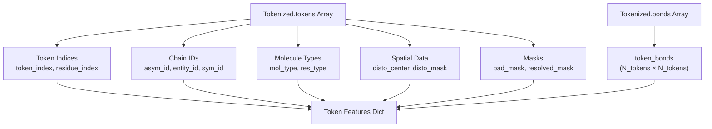
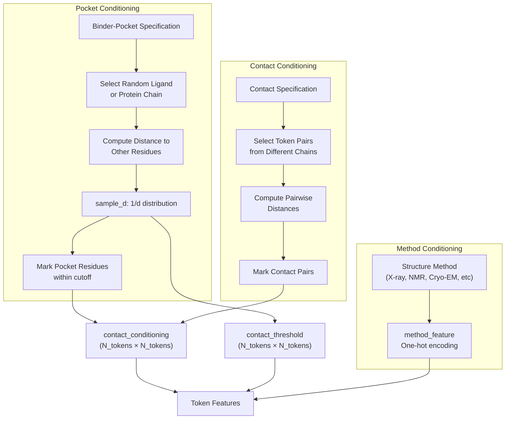
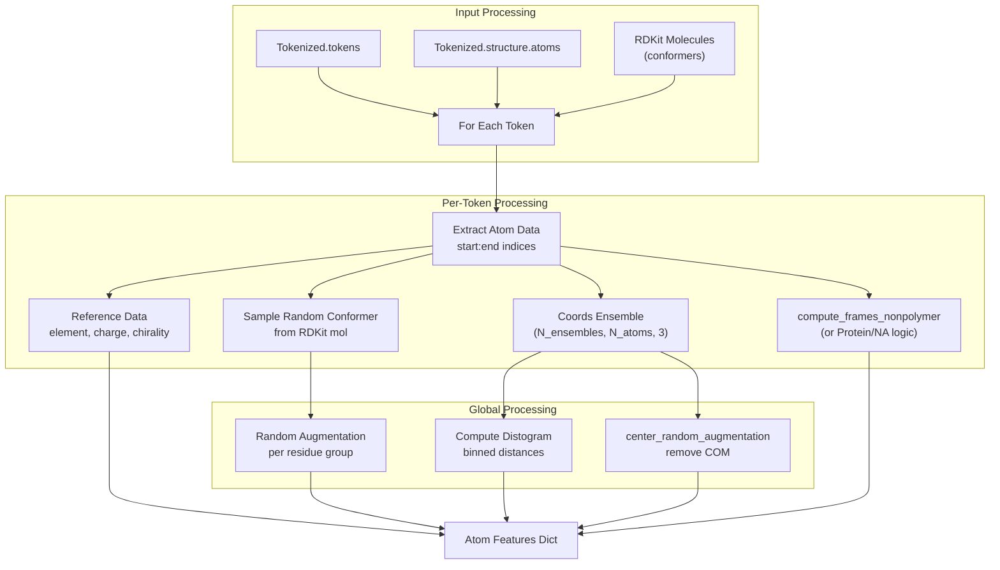
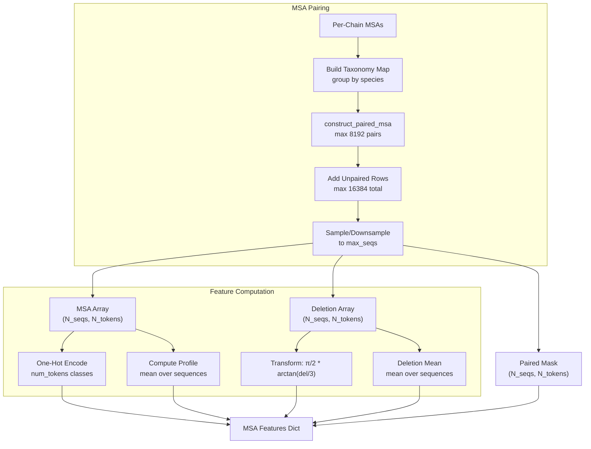
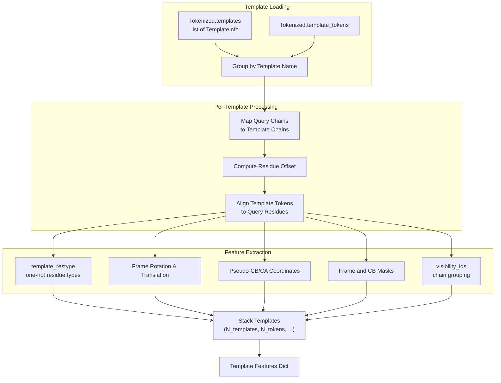
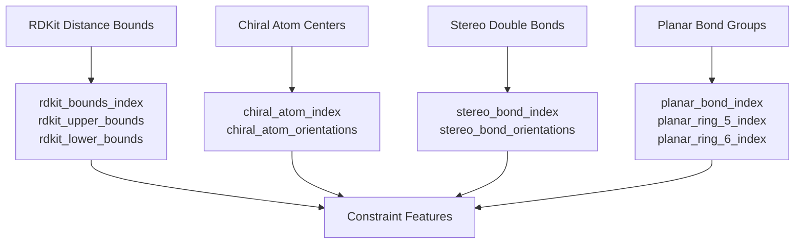
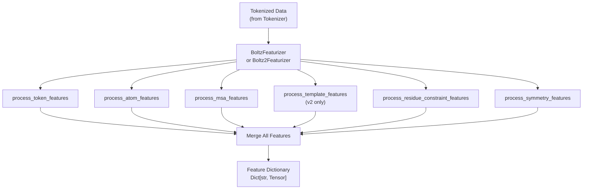

# Feature Generation

# Feature Generation

> **Relevant source files**
> - [examples/pocket\.yaml](https://github.com/jwohlwend/boltz/blob/b1ebfc46/examples/pocket.yaml)
> - [src/boltz/data/crop/affinity\.py](https://github.com/jwohlwend/boltz/blob/b1ebfc46/src/boltz/data/crop/affinity.py)
> - [src/boltz/data/crop/boltz\.py](https://github.com/jwohlwend/boltz/blob/b1ebfc46/src/boltz/data/crop/boltz.py)
> - [src/boltz/data/feature/featurizer\.py](https://github.com/jwohlwend/boltz/blob/b1ebfc46/src/boltz/data/feature/featurizer.py)
> - [src/boltz/data/feature/featurizerv2\.py](https://github.com/jwohlwend/boltz/blob/b1ebfc46/src/boltz/data/feature/featurizerv2.py)

## Purpose and Scope

 Feature Generation is the third stage of the data processing pipeline, converting tokenized molecular structures into numerical tensor representations that can be consumed by the Boltz models\. This stage takes `Tokenized` data objects \(see [Tokenization](https://deepwiki.com/jwohlwend/boltz/4.2-tokenization)\) and produces dictionaries of PyTorch tensors containing multiple feature types: token\-level, atom\-level, MSA, templates, and constraints\.

 For information about the preceding tokenization step, see [Tokenization](https://deepwiki.com/jwohlwend/boltz/4.2-tokenization)\. For details on MSA pairing algorithms, see [MSA Processing](https://deepwiki.com/jwohlwend/boltz/4.4-msa-processing)\. For model architecture details, see [Model Architecture](https://deepwiki.com/jwohlwend/boltz/3-model-architecture)\.

 **Sources:** [featurizer\.py L1122-L1225](https://github.com/jwohlwend/boltz/blob/b1ebfc46/src/boltz/data/feature/featurizer.py#L1122-L1225) [featurizerv2\.py L1-L50](https://github.com/jwohlwend/boltz/blob/b1ebfc46/src/boltz/data/feature/featurizerv2.py#L1-L50)

---

## Featurizer Classes

 Boltz provides two featurizer implementations corresponding to the two model versions:

| Featurizer | Model | Key Features | Template Support | Conditioning Features |
| --- | --- | --- | --- | --- |
| BoltzFeaturizer | Boltz\-1 | Basic token/atom/MSA features | No | Pocket conditioning only |
| Boltz2Featurizer | Boltz\-2 | Enhanced features with ensembles | Yes | Pocket \+ contact conditioning \+ method conditioning |

 Both featurizers share the same core processing pipeline but differ in the richness of features and conditioning capabilities\. `Boltz2Featurizer` supports multiple ensemble members for coordinates and distograms [featurizerv2\.py L2152-L2180](https://github.com/jwohlwend/boltz/blob/b1ebfc46/src/boltz/data/feature/featurizerv2.py#L2152-L2180)

 **Sources:** [featurizer\.py L1122-L1225](https://github.com/jwohlwend/boltz/blob/b1ebfc46/src/boltz/data/feature/featurizer.py#L1122-L1225) [featurizerv2\.py L2149-L2354](https://github.com/jwohlwend/boltz/blob/b1ebfc46/src/boltz/data/feature/featurizerv2.py#L2149-L2354)

---

## Feature Types

### Token Features

 Token features represent residue\-level properties and relationships\. The `process_token_features` function generates these features from tokenized data\.

#### Core Token Features



 **Key Output Fields:**

| Field | Shape | Description |
| --- | --- | --- |
| token\_index | \(N\_tokens,\) | Sequential token indices src/boltz/data/feature/featurizer\.py537\-538 |
| residue\_index | \(N\_tokens,\) | Residue index within chain src/boltz/data/feature/featurizer\.py539\-540 |
| asym\_id | \(N\_tokens,\) | Chain/assembly ID src/boltz/data/feature/featurizer\.py541\-542 |
| entity\_id | \(N\_tokens,\) | Entity \(sequence\) ID src/boltz/data/feature/featurizer\.py543\-544 |
| mol\_type | \(N\_tokens,\) | Molecule type \(protein/DNA/RNA/ligand\) src/boltz/data/feature/featurizer\.py547\-548 |
| res\_type | \(N\_tokens, num\_tokens\) | One\-hot residue type src/boltz/data/feature/featurizer\.py550\-552 |
| token\_bonds | \(N\_tokens, N\_tokens, 1\) | Inter\-token bond connectivity src/boltz/data/feature/featurizer\.py575\-585 |
| disto\_center | \(N\_tokens, 3\) | Representative coordinates for distogram src/boltz/data/feature/featurizer\.py614\-617 |
| token\_pad\_mask | \(N\_tokens,\) | Valid token indicator src/boltz/data/feature/featurizer\.py632\-633 |
| token\_resolved\_mask | \(N\_tokens,\) | Resolved structure indicator src/boltz/data/feature/featurizer\.py635\-636 |

 **Sources:** [featurizer\.py L482-L665](https://github.com/jwohlwend/boltz/blob/b1ebfc46/src/boltz/data/feature/featurizer.py#L482-L665) [featurizerv2\.py L608-L1110](https://github.com/jwohlwend/boltz/blob/b1ebfc46/src/boltz/data/feature/featurizerv2.py#L608-L1110)

#### Conditioning Features \(Boltz\-2\)

 Boltz\-2 adds sophisticated conditioning mechanisms for guided structure generation:



 The contact conditioning feature uses states defined in `const.contact_conditioning` [featurizerv2\.py L734-L738](https://github.com/jwohlwend/boltz/blob/b1ebfc46/src/boltz/data/feature/featurizerv2.py#L734-L738):

 - `UNSPECIFIED`: No conditioning applied\.
- `UNSELECTED`: Conditioning active but token not selected\.
- `BINDER>POCKET`: Token is binder, interacts with pocket\.
- `POCKET>BINDER`: Token is pocket, interacts with binder\.
- `CONTACT`: General contact constraint\.

 During training, pocket and contact conditioning are applied probabilistically according to `binder_pocket_conditioned_prop` and `contact_conditioned_prop` parameters [featurizerv2\.py L716-L724](https://github.com/jwohlwend/boltz/blob/b1ebfc46/src/boltz/data/feature/featurizerv2.py#L716-L724) The cutoff distance is sampled from a 1/d distribution between `binder_pocket_cutoff_min` and `binder_pocket_cutoff_max` using the `sample_d` helper [featurizerv2\.py L58-L94](https://github.com/jwohlwend/boltz/blob/b1ebfc46/src/boltz/data/feature/featurizerv2.py#L58-L94)

 **Sources:** [featurizerv2\.py L709-L1028](https://github.com/jwohlwend/boltz/blob/b1ebfc46/src/boltz/data/feature/featurizerv2.py#L709-L1028) [pocket\.yaml L1-L12](https://github.com/jwohlwend/boltz/blob/b1ebfc46/examples/pocket.yaml#L1-L12)

---

### Atom Features

 Atom features provide fine\-grained structural information at the atomic level\. The `process_atom_features` function computes these features\.



 **Key Output Fields:**

| Field | Shape | Description |
| --- | --- | --- |
| ref\_pos | \(N\_atoms, 3\) | Reference conformer positions \(augmented\) src/boltz/data/feature/featurizer\.py829\-830 |
| atom\_resolved\_mask | \(N\_atoms,\) | Present atom indicator src/boltz/data/feature/featurizer\.py832\-833 |
| ref\_element | \(N\_atoms, num\_elements\) | One\-hot element type src/boltz/data/feature/featurizer\.py834\-835 |
| ref\_charge | \(N\_atoms,\) | Formal charge src/boltz/data/feature/featurizer\.py836\-837 |
| ref\_atom\_name\_chars | \(N\_atoms, 64\) | One\-hot atom name characters src/boltz/data/feature/featurizer\.py841\-843 |
| coords | \(N\_ensembles, N\_atoms, 3\) | Ground truth coordinates \(centered\) src/boltz/data/feature/featurizerv2\.py1487\-1502 |
| atom\_to\_token | \(N\_atoms, N\_tokens\) | Atom\-to\-token mapping \(one\-hot\) src/boltz/data/feature/featurizer\.py877\-878 |
| disto\_target | \(N\_tokens, N\_tokens, num\_bins\) | Distogram target distribution src/boltz/data/feature/featurizerv2\.py1403\-1414 |
| frames\_idx | \(N\_tokens, 3\) | Frame atom indices \(N, CA, C\) src/boltz/data/feature/featurizer\.py887\-888 |
| frame\_resolved\_mask | \(N\_tokens,\) | Valid frame indicator src/boltz/data/feature/featurizer\.py889\-890 |

#### Frame Computation

 Frames define local coordinate systems for each token:

 - **Proteins:** N\-CA\-C backbone atoms [featurizer\.py L724-L733](https://github.com/jwohlwend/boltz/blob/b1ebfc46/src/boltz/data/feature/featurizer.py#L724-L733)
- **Nucleic Acids:** C1'\-C3'\-C4' sugar atoms [featurizer\.py L734-L743](https://github.com/jwohlwend/boltz/blob/b1ebfc46/src/boltz/data/feature/featurizer.py#L734-L743)
- **Ligands:** Three nearest non\-collinear atoms [featurizer\.py L744-L750](https://github.com/jwohlwend/boltz/blob/b1ebfc46/src/boltz/data/feature/featurizer.py#L744-L750)

 For non\-polymer tokens, `compute_frames_nonpolymer` finds the three closest atoms that form a valid frame \(non\-collinear with angle < ~25°\) [featurizer\.py L34-L114](https://github.com/jwohlwend/boltz/blob/b1ebfc46/src/boltz/data/feature/featurizer.py#L34-L114)

 **Sources:** [featurizer\.py L668-L891](https://github.com/jwohlwend/boltz/blob/b1ebfc46/src/boltz/data/feature/featurizer.py#L668-L891) [featurizerv2\.py L1113-L1568](https://github.com/jwohlwend/boltz/blob/b1ebfc46/src/boltz/data/feature/featurizerv2.py#L1113-L1568) [featurizerv2\.py L97-L187](https://github.com/jwohlwend/boltz/blob/b1ebfc46/src/boltz/data/feature/featurizerv2.py#L97-L187)

#### Distogram

 The distogram represents pairwise token distances binned into 64 bins spanning 2\-22 Å\. In Boltz\-2, multiple distograms are computed across ensemble members [featurizerv2\.py L1403-L1414](https://github.com/jwohlwend/boltz/blob/b1ebfc46/src/boltz/data/feature/featurizerv2.py#L1403-L1414):

```
# Compute distogram for each ensemble memberfor i, e_idx in enumerate(idx_list):    t_center = torch.Tensor(disto_coords_ensemble[:, e_idx, :])    t_dists = torch.cdist(t_center, t_center)    boundaries = torch.linspace(min_dist, max_dist, num_bins - 1)    distogram = (t_dists.unsqueeze(-1) > boundaries).sum(dim=-1).long()    disto_target[:, :, i, :] = one_hot(distogram, num_classes=num_bins)
```

 **Sources:** [featurizerv2\.py L1403-L1414](https://github.com/jwohlwend/boltz/blob/b1ebfc46/src/boltz/data/feature/featurizerv2.py#L1403-L1414)

---

### MSA Features

 MSA \(Multiple Sequence Alignment\) features provide evolutionary information\. The `process_msa_features` function constructs paired MSAs from per\-chain MSAs\.



 **Key Output Fields:**

| Field | Shape | Description |
| --- | --- | --- |
| msa | \(N\_seqs, N\_tokens, num\_tokens\) | One\-hot MSA sequences src/boltz/data/feature/featurizer\.py946\-947 |
| msa\_paired | \(N\_seqs, N\_tokens\) | Paired sequence indicator src/boltz/data/feature/featurizer\.py949\-950 |
| deletion\_value | \(N\_seqs, N\_tokens\) | Deletion counts \(transformed\) src/boltz/data/feature/featurizer\.py953\-954 |
| has\_deletion | \(N\_seqs, N\_tokens\) | Deletion presence indicator src/boltz/data/feature/featurizer\.py956\-957 |
| deletion\_mean | \(N\_tokens,\) | Mean deletion across sequences src/boltz/data/feature/featurizer\.py959\-960 |
| profile | \(N\_tokens, num\_tokens\) | Mean amino acid profile src/boltz/data/feature/featurizer\.py962\-963 |
| msa\_mask | \(N\_seqs, N\_tokens\) | Valid MSA position indicator src/boltz/data/feature/featurizer\.py965\-966 |

#### MSA Pairing Algorithm

 The `construct_paired_msa` function implements a sophisticated pairing strategy [featurizer\.py L151-L334](https://github.com/jwohlwend/boltz/blob/b1ebfc46/src/boltz/data/feature/featurizer.py#L151-L334):

 1. **Taxonomy\-based pairing:** Group sequences by species, create paired rows for sequences from the same organism [featurizer\.py L190-L206](https://github.com/jwohlwend/boltz/blob/b1ebfc46/src/boltz/data/feature/featurizer.py#L190-L206)
2. **Chain coverage:** Ensure all chains have sequences in each row \(use gaps if unavailable\) [featurizer\.py L222-L223](https://github.com/jwohlwend/boltz/blob/b1ebfc46/src/boltz/data/feature/featurizer.py#L222-L223)
3. **Paired rows:** Up to 8,192 rows with taxonomy\-matched sequences [featurizer\.py L226-L267](https://github.com/jwohlwend/boltz/blob/b1ebfc46/src/boltz/data/feature/featurizer.py#L226-L267)
4. **Unpaired rows:** Additional rows up to 16,384 total with remaining sequences [featurizer\.py L269-L289](https://github.com/jwohlwend/boltz/blob/b1ebfc46/src/boltz/data/feature/featurizer.py#L269-L289)
5. **Random sampling:** During training, randomly downsample to `max_seqs` [featurizer\.py L295-L316](https://github.com/jwohlwend/boltz/blob/b1ebfc46/src/boltz/data/feature/featurizer.py#L295-L316)

 **Sources:** [featurizer\.py L151-L334](https://github.com/jwohlwend/boltz/blob/b1ebfc46/src/boltz/data/feature/featurizer.py#L151-L334) [featurizer\.py L894-L966](https://github.com/jwohlwend/boltz/blob/b1ebfc46/src/boltz/data/feature/featurizer.py#L894-L966) [featurizerv2\.py L214-L448](https://github.com/jwohlwend/boltz/blob/b1ebfc46/src/boltz/data/feature/featurizerv2.py#L214-L448)

---

### Template Features \(Boltz\-2 Only\)

 Template features incorporate known structures to guide prediction\. The `process_template_features` function aligns template structures to the query [featurizerv2\.py L1696-L1837](https://github.com/jwohlwend/boltz/blob/b1ebfc46/src/boltz/data/feature/featurizerv2.py#L1696-L1837)



 **Key Output Fields:**

| Field | Shape | Description |
| --- | --- | --- |
| template\_restype | \(N\_templates, N\_tokens, num\_tokens\) | One\-hot template residue types src/boltz/data/feature/featurizerv2\.py1796\-1798 |
| template\_frame\_rot | \(N\_templates, N\_tokens, 3, 3\) | Local frame rotation matrices src/boltz/data/feature/featurizerv2\.py1800\-1802 |
| template\_frame\_t | \(N\_templates, N\_tokens, 3\) | Local frame translations src/boltz/data/feature/featurizerv2\.py1804\-1806 |
| template\_cb | \(N\_templates, N\_tokens, 3\) | Pseudo\-CB coordinates src/boltz/data/feature/featurizerv2\.py1808\-1810 |
| template\_ca | \(N\_templates, N\_tokens, 3\) | CA coordinates src/boltz/data/feature/featurizerv2\.py1812\-1814 |
| template\_mask\_frame | \(N\_templates, N\_tokens\) | Valid frame indicator src/boltz/data/feature/featurizerv2\.py1816\-1818 |
| visibility\_ids | \(N\_templates, N\_tokens\) | Chain visibility grouping src/boltz/data/feature/featurizerv2\.py1828\-1830 |

 **Sources:** [featurizerv2\.py L1762-L1837](https://github.com/jwohlwend/boltz/blob/b1ebfc46/src/boltz/data/feature/featurizerv2.py#L1762-L1837) [featurizerv2\.py L1696-L1759](https://github.com/jwohlwend/boltz/blob/b1ebfc46/src/boltz/data/feature/featurizerv2.py#L1696-L1759)

---

### Constraint Features

 Constraint features encode geometric constraints from RDKit molecular analysis and user\-specified connections\.

#### Residue Constraints

 Derived from RDKit molecule analysis \(see [Input Parsing](https://deepwiki.com/jwohlwend/boltz/4.1-input-parsing-and-schema)\):



 **Key Fields:**

| Field | Shape | Description |
| --- | --- | --- |
| rdkit\_bounds\_index | \(2, N\_constraints\) | Atom pair indices src/boltz/data/feature/featurizer\.py1012\-1013 |
| rdkit\_upper\_bounds | \(N\_constraints,\) | Upper distance bounds src/boltz/data/feature/featurizer\.py1014\-1015 |
| rdkit\_lower\_bounds | \(N\_constraints,\) | Lower distance bounds src/boltz/data/feature/featurizer\.py1016\-1017 |
| chiral\_atom\_index | \(4, N\_chiral\) | Four atoms defining chirality src/boltz/data/feature/featurizer\.py1022\-1023 |
| chiral\_atom\_orientations | \(N\_chiral,\) | R/S configuration src/boltz/data/feature/featurizer\.py1024\-1025 |

 **Sources:** [featurizer\.py L992-L1086](https://github.com/jwohlwend/boltz/blob/b1ebfc46/src/boltz/data/feature/featurizer.py#L992-L1086) [featurizerv2\.py L2051-L2147](https://github.com/jwohlwend/boltz/blob/b1ebfc46/src/boltz/data/feature/featurizerv2.py#L2051-L2147)

#### Chain Constraints

 Chain\-level connectivity and symmetry constraints [featurizer\.py L1089-L1119](https://github.com/jwohlwend/boltz/blob/b1ebfc46/src/boltz/data/feature/featurizer.py#L1089-L1119):

| Field | Shape | Description |
| --- | --- | --- |
| connected\_chain\_index | \(2, N\_connections\) | Inter\-chain connections |
| connected\_atom\_index | \(2, N\_connections\) | Connected atom indices |
| symmetric\_chain\_index | \(2, N\_symmetric\_pairs\) | Symmetric chain pairs \(same entity\) |

 **Sources:** [featurizer\.py L1089-L1119](https://github.com/jwohlwend/boltz/blob/b1ebfc46/src/boltz/data/feature/featurizer.py#L1089-L1119)

---

### Symmetry Features

 Symmetry features identify permutation symmetries for loss computation\. These are processed by dedicated functions:

 - `get_chain_symmetries`: Identifies chains with identical sequences \(same entity\_id\) [featurizer\.py L14-L18](https://github.com/jwohlwend/boltz/blob/b1ebfc46/src/boltz/data/feature/featurizer.py#L14-L18)
- `get_amino_acids_symmetries`: Identifies symmetric atoms within amino acids [mol\.py L17-L21](https://github.com/jwohlwend/boltz/blob/b1ebfc46/src/boltz/data/mol.py#L17-L21)
- `get_ligand_symmetries`: Identifies symmetric atoms in ligands based on automorphism groups [mol\.py L19-L21](https://github.com/jwohlwend/boltz/blob/b1ebfc46/src/boltz/data/mol.py#L19-L21)

 **Sources:** [featurizer\.py L969-L989](https://github.com/jwohlwend/boltz/blob/b1ebfc46/src/boltz/data/feature/featurizer.py#L969-L989) [featurizerv2\.py L1840-L1860](https://github.com/jwohlwend/boltz/blob/b1ebfc46/src/boltz/data/feature/featurizerv2.py#L1840-L1860) [mol\.py L1-L50](https://github.com/jwohlwend/boltz/blob/b1ebfc46/src/boltz/data/mol.py#L1-L50)

---

## Feature Processing Pipeline

 The complete feature generation pipeline follows this flow:



 **Sources:** [featurizer\.py L1125-L1225](https://github.com/jwohlwend/boltz/blob/b1ebfc46/src/boltz/data/feature/featurizer.py#L1125-L1225) [featurizerv2\.py L2152-L2354](https://github.com/jwohlwend/boltz/blob/b1ebfc46/src/boltz/data/feature/featurizerv2.py#L2152-L2354)

---

## Training vs Inference Modes

 Feature generation behaves differently during training and inference:

| Aspect | Training | Inference |
| --- | --- | --- |
| MSA Sampling | Random subset \(max\_seqs sampled\) | Deterministic first max\_seqs src/boltz/data/feature/featurizerv2\.py2234\-2246 |
| MSA Subset Selection | random\_subset=True in construct\_paired\_msa | random\_subset=False src/boltz/data/feature/featurizer\.py151\-157 |
| Conditioning | Probabilistic pocket/contact conditioning | Explicit constraints from YAML src/boltz/data/feature/featurizerv2\.py716\-764 |
| Padding | To batch max or global max | To global max src/boltz/data/pad\.py1\-50 |

 **Sources:** [featurizer\.py L1168-L1172](https://github.com/jwohlwend/boltz/blob/b1ebfc46/src/boltz/data/feature/featurizer.py#L1168-L1172) [featurizerv2\.py L2234-L2246](https://github.com/jwohlwend/boltz/blob/b1ebfc46/src/boltz/data/feature/featurizerv2.py#L2234-L2246) [featurizerv2\.py L716-L764](https://github.com/jwohlwend/boltz/blob/b1ebfc46/src/boltz/data/feature/featurizerv2.py#L716-L764)

---

## Feature Dimensions and Padding

 All features are padded to specified maximum dimensions to enable batching\. Padding is applied using `pad_dim` [pad\.py L1-L50](https://github.com/jwohlwend/boltz/blob/b1ebfc46/src/boltz/data/pad.py#L1-L50)

| Parameter | Typical Value \(Inference\) |
| --- | --- |
| max\_tokens | Structure length src/boltz/data/feature/featurizer\.py1125\-1135 |
| max\_seqs | 4096 src/boltz/data/feature/featurizer\.py1125\-1135 |
| atoms\_per\_window\_queries | 32 src/boltz/data/feature/featurizer\.py1125\-1135 |

 **Sources:** [featurizer\.py L632-L647](https://github.com/jwohlwend/boltz/blob/b1ebfc46/src/boltz/data/feature/featurizer.py#L632-L647) [featurizer\.py L845-L874](https://github.com/jwohlwend/boltz/blob/b1ebfc46/src/boltz/data/feature/featurizer.py#L845-L874) [pad\.py L1-L50](https://github.com/jwohlwend/boltz/blob/b1ebfc46/src/boltz/data/pad.py#L1-L50)

---

## Implementation Details

### Numba Optimization

 The MSA pairing inner loop is optimized with Numba JIT compilation in `_prepare_msa_arrays_inner` [featurizer\.py L400-L458](https://github.com/jwohlwend/boltz/blob/b1ebfc46/src/boltz/data/feature/featurizer.py#L400-L458)

### Random Number Generation

 Boltz\-2 uses a `np.random.Generator` object passed through the feature pipeline for reproducible randomness [featurizerv2\.py L2152-L2177](https://github.com/jwohlwend/boltz/blob/b1ebfc46/src/boltz/data/feature/featurizerv2.py#L2152-L2177)

### Coordinate Centering

 Ground truth coordinates are centered by removing the center of mass of resolved atoms using `center_random_augmentation` [featurizerv2\.py L1487-L1500](https://github.com/jwohlwend/boltz/blob/b1ebfc46/src/boltz/data/feature/featurizerv2.py#L1487-L1500)

 **Sources:** [featurizer\.py L400-L458](https://github.com/jwohlwend/boltz/blob/b1ebfc46/src/boltz/data/feature/featurizer.py#L400-L458) [featurizerv2\.py L2152-L2177](https://github.com/jwohlwend/boltz/blob/b1ebfc46/src/boltz/data/feature/featurizerv2.py#L2152-L2177) [featurizerv2\.py L1487-L1500](https://github.com/jwohlwend/boltz/blob/b1ebfc46/src/boltz/data/feature/featurizerv2.py#L1487-L1500)

---
*Source: [https://deepwiki.com/jwohlwend/boltz/4.3-feature-generation](https://deepwiki.com/jwohlwend/boltz/4.3-feature-generation) on DeepWiki*