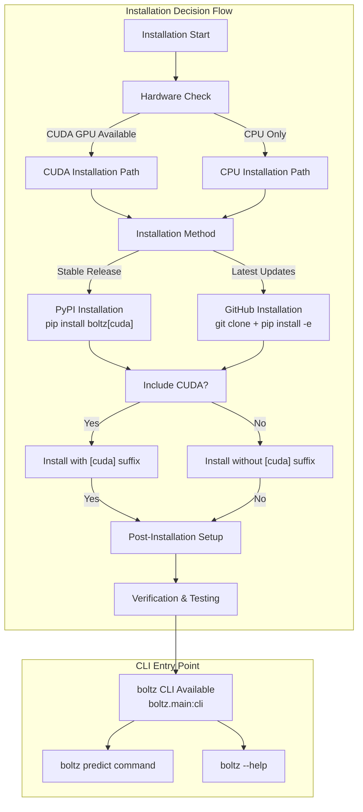
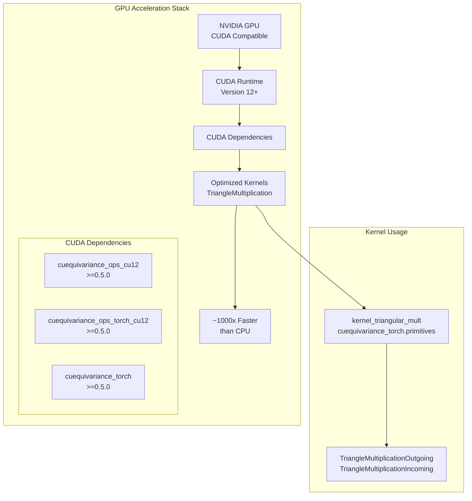
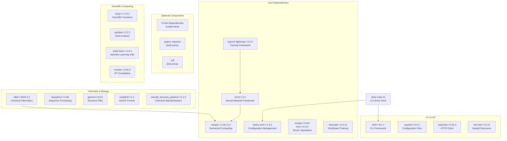

# Installation and Setup

# Installation and Setup

> **Relevant source files**
> - [README\.md](https://github.com/jwohlwend/boltz/blob/b1ebfc46/README.md?plain=1)
> - [examples/prot\_no\_msa\.yaml](https://github.com/jwohlwend/boltz/blob/b1ebfc46/examples/prot_no_msa.yaml)
> - [pyproject\.toml](https://github.com/jwohlwend/boltz/blob/b1ebfc46/pyproject.toml)
> - [src/boltz/model/layers/triangular\_mult\.py](https://github.com/jwohlwend/boltz/blob/b1ebfc46/src/boltz/model/layers/triangular_mult.py)

 This document covers the installation process, hardware requirements, dependencies, and initial configuration for the Boltz biomolecular interaction prediction framework\. This includes both Boltz\-1 and Boltz\-2 model installations and their respective requirements\.

 For information about using Boltz for predictions after installation, see [Command\-Line Interface](https://deepwiki.com/jwohlwend/boltz/2.1-command-line-interface)\. For training setup and data preparation, see [Training System](https://deepwiki.com/jwohlwend/boltz/5-training-system)\.

## Installation Overview

 Boltz supports multiple installation methods and hardware configurations\. The system is designed to work optimally with CUDA\-enabled GPUs but also supports CPU\-only execution with reduced performance\.



 **Installation Decision Flow**

 Sources: [README\.md?plain=1 L21-L48](https://github.com/jwohlwend/boltz/blob/b1ebfc46/README.md?plain=1#L21-L48) [pyproject\.toml L37-L47](https://github.com/jwohlwend/boltz/blob/b1ebfc46/pyproject.toml#L37-L47)

## Hardware Requirements

### Python Version Support

 Boltz requires Python 3\.10 or higher, with an upper bound below Python 3\.13:

| Component | Requirement | Source |
| --- | --- | --- |
| Python Version | \>=3\.10,<3\.13 | pyproject\.toml8 |
| PyTorch | \>=2\.2 | pyproject\.toml12 |

### GPU Requirements \(Recommended\)

 For optimal performance, Boltz leverages NVIDIA CUDA GPUs with cuEquivariance acceleration\. On recent NVIDIA GPUs, Boltz leverages the acceleration provided by `NVIDIA cuEquivariance` kernels [README\.md?plain=1 L79](https://github.com/jwohlwend/boltz/blob/b1ebfc46/README.md?plain=1#L79-L79)



 **GPU Acceleration Architecture**

 The system automatically detects and uses CUDA kernels when available through the `use_kernels` parameter in neural network layers such as `TriangleMultiplicationOutgoing` [triangular\_mult\.py L73-L105](https://github.com/jwohlwend/boltz/blob/b1ebfc46/src/boltz/model/layers/triangular_mult.py#L73-L105) and `TriangleMultiplicationIncoming` [triangular\_mult\.py L161-L193](https://github.com/jwohlwend/boltz/blob/b1ebfc46/src/boltz/model/layers/triangular_mult.py#L161-L193)

 Sources: [pyproject\.toml L43-L47](https://github.com/jwohlwend/boltz/blob/b1ebfc46/pyproject.toml#L43-L47) [triangular\_mult\.py L22-L36](https://github.com/jwohlwend/boltz/blob/b1ebfc46/src/boltz/model/layers/triangular_mult.py#L22-L36) [README\.md?plain=1 L79](https://github.com/jwohlwend/boltz/blob/b1ebfc46/README.md?plain=1#L79-L79)

### CPU\-Only Support

 CPU execution is supported but significantly slower than GPU execution\. If you are installing on CPU\-only or non\-CUDA GPU hardware, remove `[cuda]` from the installation commands [README\.md?plain=1 L38](https://github.com/jwohlwend/boltz/blob/b1ebfc46/README.md?plain=1#L38-L38)

 Sources: [README\.md?plain=1 L38](https://github.com/jwohlwend/boltz/blob/b1ebfc46/README.md?plain=1#L38-L38)

## Installation Methods

### Method 1: PyPI Installation \(Recommended\)

 For stable releases, install directly from PyPI [README\.md?plain=1 L25-L29](https://github.com/jwohlwend/boltz/blob/b1ebfc46/README.md?plain=1#L25-L29):

```
# With CUDA support (recommended for GPU systems)pip install boltz[cuda] -U # CPU-only installationpip install boltz -U
```

 This method installs the `boltz` package with all core dependencies from `pyproject.toml` [pyproject\.toml L11-L35](https://github.com/jwohlwend/boltz/blob/b1ebfc46/pyproject.toml#L11-L35)

### Method 2: Development Installation

 For the latest updates and development features [README\.md?plain=1 L31-L36](https://github.com/jwohlwend/boltz/blob/b1ebfc46/README.md?plain=1#L31-L36):

```
git clone https://github.com/jwohlwend/boltz.gitcd boltzpip install -e .[cuda]  # With CUDA# orpip install -e .        # CPU-only
```

 The `-e` flag creates an editable installation that reflects code changes immediately\.

 Sources: [README\.md?plain=1 L25-L36](https://github.com/jwohlwend/boltz/blob/b1ebfc46/README.md?plain=1#L25-L36)

### Fresh Environment Recommendation

 The documentation strongly recommends installing Boltz in a fresh Python environment to avoid dependency conflicts [README\.md?plain=1 L23](https://github.com/jwohlwend/boltz/blob/b1ebfc46/README.md?plain=1#L23-L23):

```
# Using condaconda create -n boltz python=3.11conda activate boltzpip install boltz[cuda] -U # Using venvpython -m venv boltz-envsource boltz-env/bin/activate  # Linux/Mac# or boltz-env\Scripts\activate  # Windowspip install boltz[cuda] -U
```

 Sources: [README\.md?plain=1 L23](https://github.com/jwohlwend/boltz/blob/b1ebfc46/README.md?plain=1#L23-L23)

## Dependencies Architecture



 **Dependency Architecture and Relationships**

 Sources: [pyproject\.toml L11-L47](https://github.com/jwohlwend/boltz/blob/b1ebfc46/pyproject.toml#L11-L47)

## Configuration and Model Cache

### Model Cache Directory

 Boltz automatically downloads and caches model weights\. The system is designed to run the latest version of the model by default [README\.md?plain=1 L48](https://github.com/jwohlwend/boltz/blob/b1ebfc46/README.md?plain=1#L48-L48) The model and code are released under the MIT License [README\.md?plain=1 L83](https://github.com/jwohlwend/boltz/blob/b1ebfc46/README.md?plain=1#L83-L83)

### CLI Entry Point Configuration

 The installation creates a `boltz` command\-line interface through the entry point defined in `pyproject.toml` [pyproject\.toml L37-L38](https://github.com/jwohlwend/boltz/blob/b1ebfc46/pyproject.toml#L37-L38):

```
# pyproject.toml configuration creates:# boltz = "boltz.main:cli"
```

 This enables the `boltz predict` command [README\.md?plain=1 L42-L48](https://github.com/jwohlwend/boltz/blob/b1ebfc46/README.md?plain=1#L42-L48) and other CLI functionality\.

 Sources: [pyproject\.toml L37-L38](https://github.com/jwohlwend/boltz/blob/b1ebfc46/pyproject.toml#L37-L38) [README\.md?plain=1 L42-L48](https://github.com/jwohlwend/boltz/blob/b1ebfc46/README.md?plain=1#L42-L48)

## Installation Verification

### Basic Verification

 After installation, verify the setup using the help command [README\.md?plain=1 L48](https://github.com/jwohlwend/boltz/blob/b1ebfc46/README.md?plain=1#L48-L48):

```
# Check if boltz command is availableboltz predict --help
```

### Inference Test

 Test basic prediction using the MSA server [README\.md?plain=1 L45-L46](https://github.com/jwohlwend/boltz/blob/b1ebfc46/README.md?plain=1#L45-L46):

```
boltz predict input_path --use_msa_server
```

### CUDA Kernel Verification

 For GPU installations, verify CUDA kernels are available by checking the `TriangleMultiplication` primitives [triangular\_mult\.py L8-L36](https://github.com/jwohlwend/boltz/blob/b1ebfc46/src/boltz/model/layers/triangular_mult.py#L8-L36):

```python
try:    from cuequivariance_torch.primitives.triangle import triangle_multiplicative_update    print("CUDA kernels available: Yes")except ImportError:    print("CUDA kernels available: No")
```

 Sources: [triangular\_mult\.py L22-L36](https://github.com/jwohlwend/boltz/blob/b1ebfc46/src/boltz/model/layers/triangular_mult.py#L22-L36)

## Troubleshooting Common Issues

### Installation Issues

| Issue | Solution | Reference |
| --- | --- | --- |
| CUDA dependencies not found | Install with \[cuda\] suffix: pip install boltz\[cuda\] | pyproject\.toml43\-47 |
| Python version incompatible | Use Python 3\.10\-3\.12 | pyproject\.toml8 |
| Dependency conflicts | Use fresh virtual environment | README\.md23 |

### Runtime Issues

| Issue | Solution |
| --- | --- |
| Slow performance on GPU | Verify CUDA installation and that cuequivariance is being used\. |
| MSA Server Errors | When using \-\-use\_msa\_server with a server requiring auth, provide credentials as per instructions\. |

 Sources: [README\.md?plain=1 L21-L79](https://github.com/jwohlwend/boltz/blob/b1ebfc46/README.md?plain=1#L21-L79) [pyproject\.toml L1-L47](https://github.com/jwohlwend/boltz/blob/b1ebfc46/pyproject.toml#L1-L47) [triangular\_mult\.py L1-L212](https://github.com/jwohlwend/boltz/blob/b1ebfc46/src/boltz/model/layers/triangular_mult.py#L1-L212)

---
*Source: [https://deepwiki.com/jwohlwend/boltz/1.1-installation-and-setup](https://deepwiki.com/jwohlwend/boltz/1.1-installation-and-setup) on DeepWiki*