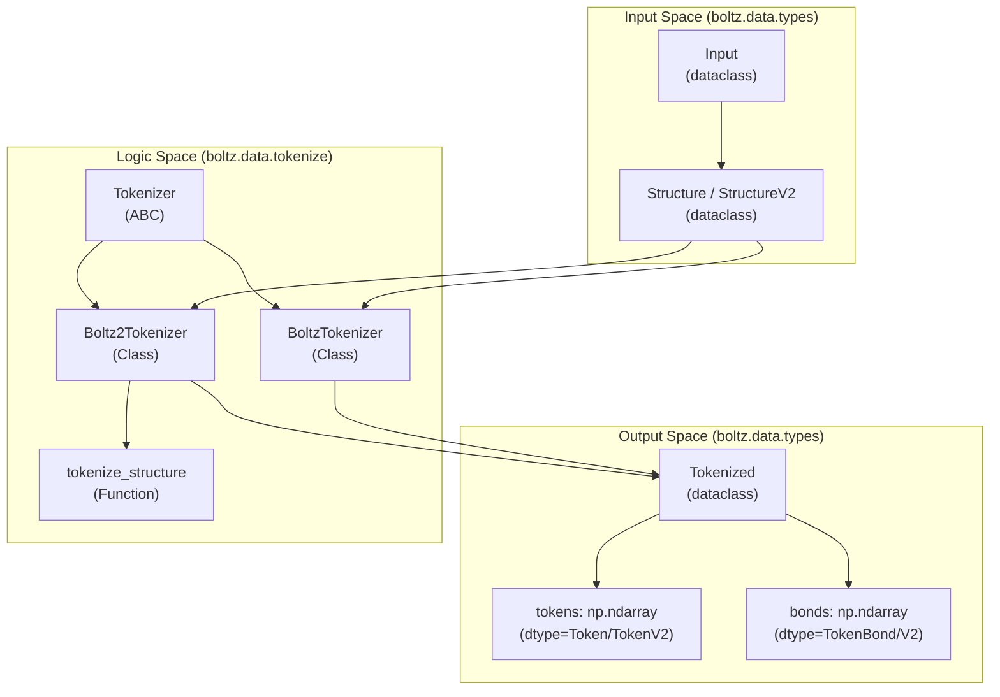
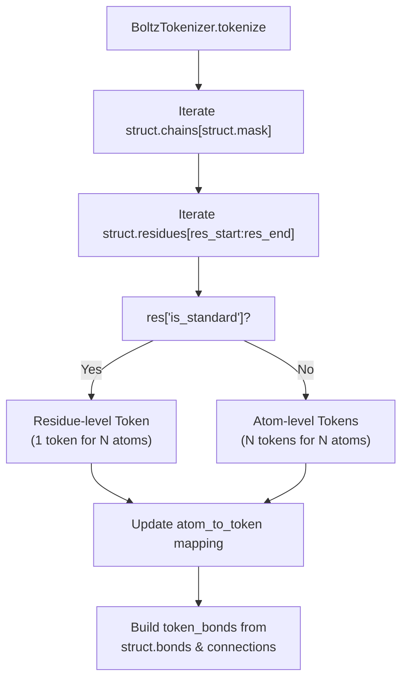

# Tokenization

# Tokenization

> **Relevant source files**
> - [src/boltz/data/tokenize/boltz\.py](https://github.com/jwohlwend/boltz/blob/b1ebfc46/src/boltz/data/tokenize/boltz.py)
> - [src/boltz/data/tokenize/boltz2\.py](https://github.com/jwohlwend/boltz/blob/b1ebfc46/src/boltz/data/tokenize/boltz2.py)
> - [src/boltz/data/tokenize/tokenizer\.py](https://github.com/jwohlwend/boltz/blob/b1ebfc46/src/boltz/data/tokenize/tokenizer.py)
> - [src/boltz/data/types\.py](https://github.com/jwohlwend/boltz/blob/b1ebfc46/src/boltz/data/types.py)

 Tokenization is the process of converting parsed molecular structures into discrete token\-level representations that can be consumed by the Boltz model\. This stage sits between input parsing \([src/boltz/data/parse/boltz\.py](https://github.com/jwohlwend/boltz/blob/b1ebfc46/src/boltz/data/parse/boltz.py)\) and feature generation \([src/boltz/data/feature/boltz\.py](https://github.com/jwohlwend/boltz/blob/b1ebfc46/src/boltz/data/feature/boltz.py)\) in the data processing pipeline\. The tokenizer transforms the hierarchical structure data \(chains → residues → atoms\) into flat arrays of tokens with associated connectivity information\.

## Purpose and Scope

 This document covers:

 - The `Tokenizer` abstract interface and its two implementations: `BoltzTokenizer` and `Boltz2Tokenizer`\.
- Token data structures \(`TokenData`, `Token`, `TokenV2`\) that represent residue\-level and atom\-level tokens\.
- Tokenization strategies for standard residues, non\-standard residues, and ligands\.
- Bond tokenization that captures molecular connectivity\.
- Template tokenization in Boltz\-2\.

## Tokenization Pipeline Overview

 The following diagram shows how tokenization fits into the data processing pipeline, mapping the logical flow to specific code entities\.

### Data Flow Diagram

 Sources: [tokenizer\.py L6-L24](https://github.com/jwohlwend/boltz/blob/b1ebfc46/src/boltz/data/tokenize/tokenizer.py#L6-L24) [boltz\.py L54-L70](https://github.com/jwohlwend/boltz/blob/b1ebfc46/src/boltz/data/tokenize/boltz.py#L54-L70) [boltz2\.py L132-L152](https://github.com/jwohlwend/boltz/blob/b1ebfc46/src/boltz/data/tokenize/boltz2.py#L132-L152) [types\.py L209-L217](https://github.com/jwohlwend/boltz/blob/b1ebfc46/src/boltz/data/types.py#L209-L217)

## Token Data Structures

### TokenData Dataclass

 Both `BoltzTokenizer` and `Boltz2Tokenizer` use an internal `TokenData` dataclass to represent individual tokens during construction\. The Boltz\-1 version contains:

| Field | Type | Description |
| --- | --- | --- |
| token\_idx | int | Sequential token index src/boltz/data/tokenize/boltz\.py14 |
| atom\_idx | int | Starting atom index in structure\.atoms src/boltz/data/tokenize/boltz\.py15 |
| atom\_num | int | Number of atoms in this token src/boltz/data/tokenize/boltz\.py16 |
| res\_idx | int | Residue index in structure\.residues src/boltz/data/tokenize/boltz\.py17 |
| res\_type | int | Residue type ID \(from const\.token\_ids\) src/boltz/data/tokenize/boltz\.py18 |
| center\_coords | np\.ndarray | 3D coordinates of center atom src/boltz/data/tokenize/boltz\.py25 |
| disto\_coords | np\.ndarray | 3D coordinates of distogram atom src/boltz/data/tokenize/boltz\.py26 |

 Boltz\-2 extends this with additional fields for templates and affinity prediction:

| Field | Type | Description |
| --- | --- | --- |
| res\_name | str | Original residue name src/boltz/data/tokenize/boltz2\.py27 |
| modified | bool | Whether this is a modified residue src/boltz/data/tokenize/boltz2\.py38 |
| frame\_rot | np\.ndarray | Rotation matrix for protein backbone frame src/boltz/data/tokenize/boltz2\.py39 |
| frame\_t | np\.ndarray | Translation vector for protein backbone frame src/boltz/data/tokenize/boltz2\.py40 |
| affinity\_mask | bool | Whether token belongs to affinity chain src/boltz/data/tokenize/boltz2\.py43 |

 Sources: [boltz\.py L10-L30](https://github.com/jwohlwend/boltz/blob/b1ebfc46/src/boltz/data/tokenize/boltz.py#L10-L30) [boltz2\.py L18-L44](https://github.com/jwohlwend/boltz/blob/b1ebfc46/src/boltz/data/tokenize/boltz2.py#L18-L44)

### TokenBond Structures

 Token bonds represent connectivity between tokens and are stored as structured NumPy arrays\.

 - **Boltz\-1 \(`TokenBond`\)**: Simple 2\-tuple representing undirected edges [boltz\.py L188-L192](https://github.com/jwohlwend/boltz/blob/b1ebfc46/src/boltz/data/tokenize/boltz.py#L188-L192)
- **Boltz\-2 \(`TokenBondV2`\)**: Adds bond type information \(e\.g\., SINGLE, DOUBLE, AROMATIC\) [boltz2\.py L363-L371](https://github.com/jwohlwend/boltz/blob/b1ebfc46/src/boltz/data/tokenize/boltz2.py#L363-L371)

## BoltzTokenizer \(Boltz\-1\)

 The `BoltzTokenizer` follows a residue\-first strategy with fallback to atom\-level tokenization for non\-standard residues\.

### Tokenization Strategy

 Sources: [boltz\.py L81-L206](https://github.com/jwohlwend/boltz/blob/b1ebfc46/src/boltz/data/tokenize/boltz.py#L81-L206)

### Standard vs\. Non\-Standard Logic

 - **Standard Residues**: Creates one token per residue\. The center and distogram atoms \(e\.g\., CA and CB\) are identified via `res["atom_center"]` and `res["atom_disto"]` [boltz\.py L94-L133](https://github.com/jwohlwend/boltz/blob/b1ebfc46/src/boltz/data/tokenize/boltz.py#L94-L133)
- **Non\-Standard Residues**: Each atom becomes its own token \(`atom_num=1`\)\. The residue type is defaulted to `const.unk_token["PROTEIN"]` [boltz\.py L135-L176](https://github.com/jwohlwend/boltz/blob/b1ebfc46/src/boltz/data/tokenize/boltz.py#L135-L176)

## Boltz2Tokenizer \(Boltz\-2\)

 The `Boltz2Tokenizer` extends the pipeline with frame computation, affinity masking, and multi\-structure \(template\) support\.

### Frame Computation

 For protein residues, Boltz\-2 computes a local coordinate frame from the backbone atoms \(N, CA, C\) using `compute_frame` [boltz2\.py L74-L104](https://github.com/jwohlwend/boltz/blob/b1ebfc46/src/boltz/data/tokenize/boltz2.py#L74-L104)

 1. **Basis 1 \(`e1`\)**: Normalized vector from CA to C [boltz2\.py L96-L98](https://github.com/jwohlwend/boltz/blob/b1ebfc46/src/boltz/data/tokenize/boltz2.py#L96-L98)
2. **Basis 2 \(`e2`\)**: Gram\-Schmidt orthogonalized vector from CA to N [boltz2\.py L99-L100](https://github.com/jwohlwend/boltz/blob/b1ebfc46/src/boltz/data/tokenize/boltz2.py#L99-L100)
3. **Basis 3 \(`e3`\)**: Cross product of `e1` and `e2` [boltz2\.py L101](https://github.com/jwohlwend/boltz/blob/b1ebfc46/src/boltz/data/tokenize/boltz2.py#L101-L101)
4. **Translation \(`t`\)**: The CA atom coordinates [boltz2\.py L103](https://github.com/jwohlwend/boltz/blob/b1ebfc46/src/boltz/data/tokenize/boltz2.py#L103-L103)

### Modified Residue Handling

 Unlike Boltz\-1, Boltz\-2 can tokenize modified polymer residues at the residue level rather than splitting them into atoms\. It flags these with `modified=True` while using the appropriate `UNK` type for the polymer class \(DNA, RNA, or Protein\) via `get_unk_token` [boltz2\.py L107-L129](https://github.com/jwohlwend/boltz/blob/b1ebfc46/src/boltz/data/tokenize/boltz2.py#L107-L129) [boltz2\.py L259-L357](https://github.com/jwohlwend/boltz/blob/b1ebfc46/src/boltz/data/tokenize/boltz2.py#L259-L357)

### Template Tokenization

 `Boltz2Tokenizer` iterates through `data.templates` and applies `tokenize_structure` to each template entry [boltz2\.py L401-L411](https://github.com/jwohlwend/boltz/blob/b1ebfc46/src/boltz/data/tokenize/boltz2.py#L401-L411) This generates `template_tokens` and `template_bonds` dictionaries that are included in the final `Tokenized` object [boltz2\.py L414-L426](https://github.com/jwohlwend/boltz/blob/b1ebfc46/src/boltz/data/tokenize/boltz2.py#L414-L426)

## Implementation Details

### Coordinate Offsets

 Boltz\-2 supports ensembles\. Tokenization explicitly uses the 0th conformer's offset: `offset = struct.ensemble[0]["atom_coord_idx"]` [boltz2\.py L165](https://github.com/jwohlwend/boltz/blob/b1ebfc46/src/boltz/data/tokenize/boltz2.py#L165-L165) All coordinates for centers and distograms are fetched using this offset [boltz2\.py L193-L194](https://github.com/jwohlwend/boltz/blob/b1ebfc46/src/boltz/data/tokenize/boltz2.py#L193-L194)

### Bond Mapping

 Atom\-level bonds are converted to token\-level bonds using the `atom_to_token` dictionary created during the residue iteration loop [boltz\.py L182-L192](https://github.com/jwohlwend/boltz/blob/b1ebfc46/src/boltz/data/tokenize/boltz.py#L182-L192) [boltz2\.py L359-L371](https://github.com/jwohlwend/boltz/blob/b1ebfc46/src/boltz/data/tokenize/boltz2.py#L359-L371)

 Sources: [boltz\.py L1-L217](https://github.com/jwohlwend/boltz/blob/b1ebfc46/src/boltz/data/tokenize/boltz.py#L1-L217) [boltz2\.py L1-L426](https://github.com/jwohlwend/boltz/blob/b1ebfc46/src/boltz/data/tokenize/boltz2.py#L1-L426) [types\.py L85-L210](https://github.com/jwohlwend/boltz/blob/b1ebfc46/src/boltz/data/types.py#L85-L210)

---
*Source: [https://deepwiki.com/jwohlwend/boltz/4.2-tokenization](https://deepwiki.com/jwohlwend/boltz/4.2-tokenization) on DeepWiki*