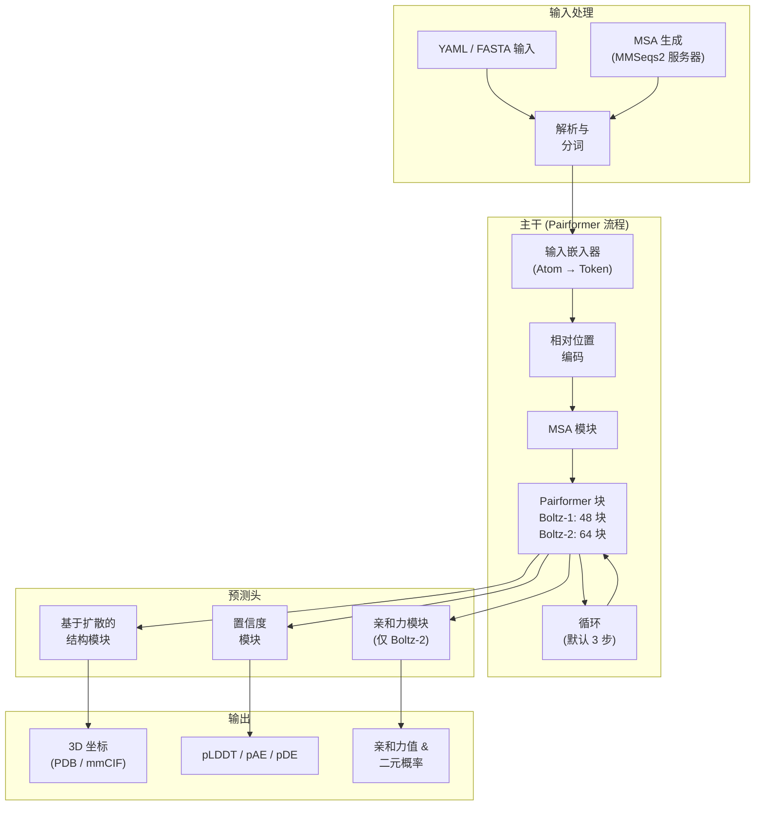

---
slug:1-overview
blog_type:normal
---


**Boltz** 是一个用于生物分子相互作用预测的开源基础模型家族，能够联合建模复杂的 3D 结构和结合亲和力。它在 MIT 许可证下开发，使得学术界和商业界均可免费使用最先进的结构预测技术。Boltz-1 是首个在精度上接近 AlphaFold3 的完全开源模型，而其继任者 **Boltz-2** 则更进一步，在结构建模之外增加了结合亲和力预测功能——这是 AlphaFold3 和 Boltz-1 均不具备的能力。


来源: [README.md](/README.md#L1-L118), [__init__.py](/src/boltz/__init__.py#L1-L8)

## Boltz 能做什么

Boltz 解决了计算生物学和药物发现领域的三个核心预测任务。**结构预测** 接收序列规范（蛋白质、DNA、RNA 和小分子配体），并生成完整的原子级分辨率 3D 坐标。**置信度估计** 提供残基级 (pLDDT)、成对 (pAE, pDE) 和界面级质量分数，以便你评估预测的可靠性。**结合亲和力预测** 是 Boltz-2 的新功能，用于估计指定结合剂与其靶点之间的结合强度，并输出连续的亲和力值和二元的结合概率。

| 功能 | Boltz-1 | Boltz-2 |
|---|---|---|
| 结构预测（蛋白质、DNA、RNA、配体） | ✅ | ✅ |
| 置信度分数 (pLDDT, pAE, pDE) | ✅ | ✅ |
| 结合亲和力预测 | ❌ | ✅ |
| 模板条件化 | ❌ | ✅ |
| 接触/口袋条件化 | ❌ | ✅ |
| 环肽支持 | ❌ | ✅ |
| B 因子预测 | ❌ | ✅ |
| 实验方法条件化（X-ray, Cryo-EM, NMR） | ❌ | ✅ |
| MSA 子采样 | ❌ | ✅ |
| NVIDIA cuEquivariance 内核加速 | ❌ | ✅ |


来源: [boltz1.py](/src/boltz/model/models/boltz1.py#L1-L200), [boltz2.py](/src/boltz/model/models/boltz2.py#L1-L200), [README.md](/README.md#L1-L118)

## 架构概览

Boltz 遵循一个模块化的四阶段流程，两代模型共享此流程，但 Boltz-2 对每个阶段都进行了加深和拓宽。下图描绘了从原始输入到最终预测的端到端流程：



**输入处理** 解析 YAML 或 FASTA 文件，通过可选的 MMSeqs2 服务器生成多序列比对 (MSA)，对残基和配体进行分词，并计算输入特征。**主干** 将原子嵌入为 Token 级别的表示，利用 MSA 和相对位置信号对其进行丰富，然后通过带循环的 Pairformer 块（Boltz-1 为 48 个块，Boltz-2 为 64 个块）进行迭代，以精炼单一表示 和成对表示。**预测头** 随后分叉：扩散模块对原子坐标进行去噪，置信度模块预测质量指标，亲和力模块（在 Boltz-2 中）估计结合强度。每个头都基于共享的主干输出运行，使得系统既模块化又高效。

来源: [main.py](/src/boltz/main.py#L63-L98), [trunkv2.py](/src/boltz/model/modules/trunkv2.py#L1-L100), [affinity.py](/src/boltz/model/modules/affinity.py#L1-L100)

## 项目结构

代码库在 `src/boltz/` 下组织为两个主要包——**data** 用于处理所有输入，**model** 用于神经网络架构——此外还包含用于训练和评估的顶级脚本：

```
boltz/
├── src/boltz/
│   ├── main.py              ← CLI 入口 (预测, 训练)
│   ├── data/                ← 数据处理流程
│   │   ├── parse/           ← YAML, FASTA, mmCIF, A3M 解析器
│   │   ├── tokenize/        ← Boltz-1 与 Boltz-2 分词器
│   │   ├── feature/         ← 特征生成器 (v1 & v2) + 对称性
│   │   ├── msa/             ← MMSeqs2 集成
│   │   ├── crop/            ← 训练裁剪策略
│   │   ├── sample/          ← 采样策略
│   │   ├── filter/          ← 静态与动态数据过滤器
│   │   ├── module/          ← PyTorch Lightning 数据模块
│   │   ├── write/           ← PDB / mmCIF 输出写入器
│   │   ├── const.py         ← 常量 (Token, 链类型等)
│   │   ├── mol.py           ← 分子数据加载
│   │   └── types.py         ← 核心数据类型 (Structure, Record, MSA)
│   └── model/               ← 神经网络架构
│       ├── models/          ← Boltz1 与 Boltz2 顶级模块
│       ├── modules/         ← 主干、扩散、置信度、亲和力
│       ├── layers/          ← 注意力、Pairformer、转换层
│       ├── loss/            ← 损失函数 (v1 & v2 变体)
│       ├── optim/           ← EMA、学习率调度器
│       └── potentials/      ← 引导势与调度
├── examples/                ← 示例 YAML/FASTA 输入文件
├── scripts/                 ← 训练、评估、数据处理脚本
└── tests/                   ← 单元与回归测试
```

`data` 包遵循流程顺序：**parse → tokenize → feature → module**，其中每个阶段都基于前一个阶段的输出构建。`model` 包反映了上面的架构图：`models/` 包含顶层的 `LightningModule` 类，`modules/` 包含每个架构头，`layers/` 提供可复用的构建块，如注意力和 Pairformer 层。值得注意的是，Boltz-2 的组件通常与 Boltz-1 的对应组件并排存放，并带有 `v2` 后缀（例如 `trunkv2.py`、`diffusionv2.py`、`confidencev2.py`），使得两代模型之间的对比更加直观。

来源: [main.py](/src/boltz/main.py#L1-L50), [types.py](/src/boltz/data/types.py#L1-L200), [const.py](/src/boltz/data/const.py#L1-L150)

## 支持的生物分子与输入格式

Boltz 原生支持四种分子类型——**蛋白质**、**DNA**、**RNA** 和 **小分子配体**——它们可以自由组合成多链复合物。输入通过简单的 YAML 文件声明，指定每条链的标识、序列和可选元数据：

| 分子类型 | YAML 中的键 | 序列来源 | 示例 |
|---|---|---|---|
| 蛋白质 | `protein` | 氨基酸序列字符串 | `sequence: QLEDSEVEAVAK...` |
| DNA | `dna` | 核苷酸序列 | `sequence: ATCG...` |
| RNA | `rna` | 核苷酸序列 | `sequence: AUCG...` |
| 配体 (CCD) | `ligand` | 来自化学组分字典的 CCD 代码 | `ccd: SAH` |
| 配体 (SMILES) | `ligand` | SMILES 字符串 | `smiles: 'N[C@@H](Cc1ccc(O)cc1)C(=O)O'` |

每条链接收一个 `id`（单字母或列表），亲和力预测或口袋约束等附加属性在顶层声明。MSA 可以作为自定义的 `.a3m` 文件提供，也可以通过 `--use_msa_server` 由 MMSeqs2 服务器自动生成，或者在省略 `--use_msa_server` 时完全跳过。

<CgxTip>YAML 文件支持在单个文件中包含不同类型的多条链，从而能够在单次运行中预测蛋白质-配体、蛋白质-蛋白质、蛋白质-DNA/RNA 及其他多组分复合物。</CgxTip>

来源: [prot.yaml](/examples/prot.yaml#L1-L7), [ligand.yaml](/examples/ligand.yaml#L1-L13), [affinity.yaml](/examples/affinity.yaml#L1-L12), [pocket.yaml](/examples/pocket.yaml#L1-L13), [multimer.yaml](/examples/multimer.yaml#L1-L9), [cyclic_prot.yaml](/examples/cyclic_prot.yaml#L1-L8)

## 快速安装与运行

Boltz 可作为标准 Python 包安装，并带有可选的 CUDA 加速依赖项：

```bash
# 从 PyPI 安装（推荐）
pip install boltz[cuda] -U

# 或者从源码安装以获取最新更新
git clone https://github.com/jwohlwend/boltz.git
cd boltz && pip install -e .[cuda]
```

运行预测只需要一个 YAML 或 FASTA 输入文件和一条命令：

```bash
# 结构预测（自动生成 MSA）
boltz predict examples/prot.yaml --use_msa_server

# 亲和力预测（Boltz-2）
boltz predict examples/affinity.yaml --use_msa_server

# 显式指定模型
boltz predict examples/multimer.yaml --model boltz2 --use_msa_server
```

在首次运行时，Boltz 会自动将所需的模型权重和化学参考数据 (CCD) 下载到 `~/.boltz/` 目录（可通过 `BOLTZ_CACHE` 环境变量覆盖）。CLI 通过 `boltz predict --help` 提供了对循环步数、扩散采样步数、结构样本数量、输出格式（PDB 或 mmCIF）等参数的细粒度控制。

来源: [main.py](/src/boltz/main.py#L841-L990), [pyproject.toml](/pyproject.toml#L1-L95), [README.md](/README.md#L28-L60)

## 接下来去哪

既然你已经对 Boltz 是什么以及它是如何组织的有了宏观的了解，以下是文档的推荐阅读路径：

1. **[快速入门](2-quick-start)** — 按照分步说明，几分钟内即可在你自己的数据上运行 Boltz。
2. **[输入格式指南](3-input-format-guide)** — 掌握蛋白质、核酸、配体、亲和力和口袋约束的 YAML/FASTA 输入规范。
3. **[架构概览](7-architecture-overview)** — 借助详细的数据流图，深入了解四阶段流程。
4. 从这里开始，探索符合你兴趣的**深入探讨**部分：模型核心（第 8-11 页）、数据处理（第 12-14 页）、训练与推理（第 15-17 页），或引导势和模板条件化等高级功能（第 18-20 页）。