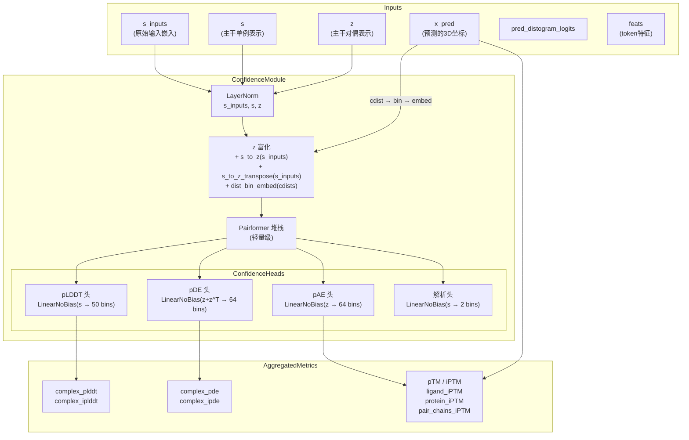
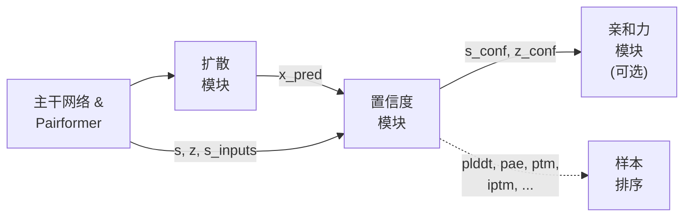

---
slug:10-confidence-prediction-module
blog_type:normal
---


置信度预测模块是模型的自我评估系统——一条专用的神经通路，用于评估其自身结构预测的质量。在扩散模块生成3D坐标后，该模块会接收主干网络的隐层表示以及预测结构，生成一系列丰富的每个 token 和每个复合体的置信度指标：pLDDT、pAE、pDE、解析概率、pTM 和 iPTM。这些信号对于必须判断预测结构是否可靠的下游用户至关重要，同时对于训练循环本身也必不可少，因为它们提供了校准模型不确定性估计的监督梯度。

## 架构概述

置信度模块作为**后验评估器**运行——它接收已计算的表示和预测坐标，然后运行自己的轻量级 Pairformer 堆栈，最后分支到专门的预测头。这种设计映射了 AlphaFold3 的方法：置信度模块在结构上独立于主干网络，使其能够开发专门为质量估计而非结构生成量身定制的内部表示。



该模块存在两个版本：Boltz-1 变体（[confidence.py](/src/boltz/model/modules/confidence.py)）和改进的 Boltz-2 变体（[confidencev2.py](/src/boltz/model/modules/confidencev2.py)）。两者共享相同的基础流水线——归一化输入、富化对偶表示、运行 Pairformer 并分支到各个头——但在反映系统演进的关键架构细节上有所不同。

来源: [confidence.py](/src/boltz/model/modules/confidence.py#L1-L484), [confidencev2.py](/src/boltz/model/modules/confidencev2.py#L1-L498)

## 表示富化流水线

在 Pairformer 堆栈处理表示之前，置信度模块会执行一系列富化步骤，将结构信息和输入级信息注入到对偶表示 `z` 中。这就是预测的3D坐标进入置信度估计路径的地方——这与主干网络形成了关键区别，主干网络永远不会看到最终预测的结构。

**归一化与输入注入。** 单例输入嵌入 `s_inputs` 总是经过层归一化。主干网络的单例表示 `s` 可以选择通过 `add_s_input_to_s` 接收来自 `s_inputs` 的残差连接，而对偶表示 `z` 可以通过 `add_z_input_to_z` 接收新的相对位置编码、token 键特征和接触条件。在 Boltz-2 中，此 `add_z_input_to_z` 路径还额外包含了键类型嵌入和带有可配置截断值的 `ContactConditioning` 模块。仅当 `no_update_s` 为 `False` 时，主干单例表示 `s` 才会进行层归一化。

**外积富化。** 归一化后的 `s_inputs` 通过两个独立的线性映射投影到对偶维度，并求和到 `z` 中：

```
z = z + s_to_z(s_inputs)[:, :, None, :] + s_to_z_transpose(s_inputs)[:, None, :, :]
```

这产生了一种类似非对称外积的信号——`(i,j)` 对通过 `s_to_z` 接收来自 token `i` 的信息，并通过 `s_to_z_transpose` 接收来自 token `j` 的信息。当启用 `add_s_to_z_prod` 时，还会添加两个独立投影的逐元素乘积，从而提供更具表达力的双线性交互。

**预测距离嵌入。** 预测的3D坐标 `x_pred` 通过 `token_to_rep_atom` 映射到 token 级别的代表原子位置，然后使用 `torch.cdist` 计算成对欧几里得距离。这些连续的距离被离散化为由 `boundaries = torch.linspace(2, max_dist, num_dist_bins - 1)` 定义的区间，并通过可学习的 `dist_bin_pairwise_embed` 层进行嵌入。此嵌入被直接加到 `z` 中，使置信度模块能够显式访问其必须评估的几何结构。门控初始化模式（`init.gating_init_`）应用于此嵌入和所有投影权重，这有助于通过控制注入信号的幅度来稳定早期训练。

来源: [confidence.py](/src/boltz/model/modules/confidence.py#L148-L297), [confidencev2.py](/src/boltz/model/modules/confidencev2.py#L80-L171)

## 模拟主干模式 (Boltz-1)

Boltz-1 的置信度模块提供了一种 `imitate_trunk` 模式，从根本上改变了模块的架构。启用时，置信度模块包含自己完整的 `InputEmbedder`、`MSAModule` 和 `PairformerModule`，实质上复制了主干网络的结构。在此模式下，`s_inputs` 通过 `self.input_embedder(feats)` 从头重新计算，创建新的 `s_init` 和 `z_init`，并且循环投影在运行 MSA 模块和 Pairformer 堆栈之前，将主干网络的输出与置信度模块自身初始化的表示进行合并。

这种模式在计算上代价显著，但允许置信度模块开发完全独立的表示，而不是依赖于主干网络可能带有偏差的特征。在默认（非模拟）模式下，置信度模块仅接收主干网络最终的 `s` 和 `z` 表示，对其进行归一化，并通过一个没有残差连接的独立 Pairformer 堆栈——代码中的注释明确指出“AF3 具有残差连接，我们移除了它们。”

<CgxTip>`imitate_trunk` 模式以内存和计算换取表示的独立性。对于注重速度的生产推理，首选默认模式。`use_s_diffusion` 选项（仅限 Boltz-1）进一步允许注入扩散模块的单例表示作为额外信号，为置信度模块提供对结构模块内部状态的直接访问。</CgxTip>

来源: [confidence.py](/src/boltz/model/modules/confidence.py#L80-L145), [confidence.py](/src/boltz/model/modules/confidence.py#L234-L284)

## Boltz-2 的改进

Boltz-2 的置信度模块（[confidencev2.py](/src/boltz/model/modules/confidencev2.py)）完全移除了 `imitate_trunk` 模式，并引入了几项结构改进：

| 特性 | Boltz-1 | Boltz-2 |
|---------|---------|---------|
| 模拟主干模式 | ✅ 支持 | ❌ 已移除 |
| `use_s_diffusion` | ✅ 可选注入 | ❌ 不可用 |
| Token 级置信度 | 始终为 Token 级 | 可配置 (`token_level_confidence`) |
| 独立的链内/链间头 | ❌ 单一头 | ✅ `use_separate_heads` 选项 |
| 键类型特征 | ❌ 未包含 | ✅ `bond_type_feature` 选项 |
| 接触条件 | ❌ 不在置信度中 | ✅ 集成 `ContactConditioning` |
| 隐层特征返回 | ❌ 不支持 | ✅ `return_latent_feats` 选项 |
| 循环位置编码 | ❌ 不支持 | ✅ `cyclic_pos_enc` 选项 |
| 相对置信度监督 | ❌ 不可用 | ✅ `relative_supervision_weight` |

**独立的链内/链间头。** 当启用 `use_separate_heads` 时，Boltz-2 将 pAE 和 pDE 预测拆分为独立的链内和链间头。每个头仅为其相关的对生成 logits（链内为相同的 `asym_id`，链间为不同的 `asym_id`），并且输出通过掩码进行合并。这种特化允许模型学习链内关系与链间关系截然不同的不确定性模式。

**原子级置信度。** 当 `token_level_confidence=False` 时，Boltz-2 在原子级别而非 token 级别预测 pLDDT 和解析概率。pLDDT 头为每个 token 输出 `num_plddt_bins * max_num_atoms_per_token` 个 logits，然后使用 `atom_to_token` 特征对其进行重塑和掩码处理，以匹配每个 token 的实际原子数。这提供了更细粒度的质量评估，但代价是输出维度的增加。

来源: [confidencev2.py](/src/boltz/model/modules/confidencev2.py#L1-L498)

## 置信度头与输出指标

`ConfidenceHeads` 模块将富化后的表示转换为可解释的置信度预测。它处理来自 Pairformer 堆栈更新后的 `s`（单例）和 `z`（对偶）表示。

### 预测头

| 头 | 输入 | 输出形状 | 区间数 | 范围 |
|------|-------|-------------|------|-------|
| **pLDDT** | `s` | `(B, N, 50)` | 50 | 0–1 |
| **pDE** | `z + z^T` | `(B, N, N, 64)` | 64 | 0–32 Å |
| **pAE** | `z` | `(B, N, N, 64)` | 64 | 0–32 Å |
| **Resolved** | `s` | `(B, N, 2)` | 2 | 二元 |

**pLDDT 头**预测每个 token 的局部距离差异测试分数，表示每个 token 的局部邻域与真实情况的匹配程度。**pDE 头**使用对称化的对偶表示 `z + z.transpose(1,2)` 预测预测距离误差——即预测与真实 token 间距离的绝对差值。**pAE 头**预测预测对齐误差，该误差衡量局部坐标系最优对齐后的位置误差。**解析头**是一个二元分类器，预测每个 token 的代表原子是否在真实结构中被解析。

### 聚合的复合体级指标

原始的逐 token 和逐对 logits 通过 `compute_aggregated_metric` 转换为标量值，该函数在各区间上应用 softmax 并使用区间中心值计算加权和。这从离散分类中产生连续的分数。

**pLDDT 聚合**计算 token 的简单掩码均值。**界面 pLDDT (ipLDDT)** 应用非对称加权：配体 token 权重为 2（Boltz-1）或 20（Boltz-2），界面 token 权重为 1 或 10，非界面非配体 token 权重为 1。界面 token 定义为与来自不同链的 token 至少有一个接触（距离 < 8Å）的 token。

**pDE 聚合**使用接触加权方案。预测的 distogram 概率用于识别可能的接触（区间 0-19 对应距离 < ~8Å），这些接触概率作为平均 pDE 值的权重。这使得该指标聚焦于可能近距离接触的 token 对，在这些地方距离误差最为关键。界面 pDE (ipDE) 进一步将其限制在链间对。

<CgxTip>Boltz-2 的 ipLDDT 中配体权重显著更高（20 对比 Boltz-1 的 2），反映了一种校准洞察：配体 token 通常数量很少，但在评估结合预测时却具有不成比例的重要性。如果不进行这种增权，ipLDDT 将被大量蛋白质界面残基主导，从而稀释了配体特异性的信号。</CgxTip>

来源: [confidence.py](/src/boltz/model/modules/confidence.py#L335-L484), [confidencev2.py](/src/boltz/model/modules/confidencev2.py#L207-L498), [confidence_utils.py](/src/boltz/model/modules/confidence_utils.py#L1-L182)

## pTM 和 iPTM 计算

预测模板建模分数（pTM）和界面 pTM（iPTM）是架构最复杂的置信度输出。它们由 `compute_ptms` 函数计算，该函数使用标准的 TM-score 缩放函数将 pAE logits 转换为 TM-score 估计值：

```
d0 = 1.24 * (clip(Nres, min=19) - 15)^(1/3) - 1.8
tm(d) = 1 / (1 + (d / d0)^2)
```

计算过程如下：(1) 通过 softmax 加权区间求和将 pAE logits 转换为期望的 TM 值，(2) 应用帧有效性掩码以排除共线和重叠的 token（由 `compute_frame_pred` 计算），以及 (3) 通过对 TM 值之和执行 `torch.max` 找到最优对齐列。

**非聚合物的帧计算。** 一个关键的细节是，聚合物 token 具有固定的帧定义（基于骨架原子），但非聚合物（配体）token 需要动态帧构建。对于每个配体链，`compute_frame_pred` 按距离对所有原子对进行排序，选择最近的非共线三元组，并从这三个原子构建局部坐标系。这对预测坐标和真实坐标分别执行，确保 PAE 指标在一致的局部坐标系中评估误差。

**多尺度 iPTM。** 在基本的 pTM 和 iPTM 之外，该模块还计算配体特异性的 iPTM（仅限配体-蛋白质对）、蛋白质特异性的 iPTM（仅限蛋白质-蛋白质链间对），以及一个完整的链对 iPTM 矩阵，报告复合体中每对链的 iPTM。这提供了关于哪些链界面预测可靠、哪些不可靠的细粒度视图。

来源: [confidence_utils.py](/src/boltz/model/modules/confidence_utils.py#L87-L182), [confidence_utils.py](/src/boltz/model/layers/confidence_utils.py#L79-L232)

## 顺序多样本处理

当 `multiplicity > 1`（每个输入生成多个扩散样本）时，置信度模块必须独立评估每个样本。如果 `run_sequentially=True`，它将逐个迭代样本而不是将它们批量处理，这以增加延迟为代价降低了峰值内存。这对于大型复合体至关重要，因为如果同时处理所有样本，形状为 `(B*M, N, N, token_z)` 的对偶表示 `z` 将超出 GPU 内存。

顺序路径在多样性维度上连接所有标量输出，并特别处理嵌套的 `pair_chains_iptm` 字典，独立连接每对链的 iPTM 值。

来源: [confidence.py](/src/boltz/model/modules/confidence.py#L198-L231), [confidencev2.py](/src/boltz/model/modules/confidencev2.py#L119-L155)

## 损失函数与训练信号

置信度模块使用复合损失进行训练，该损失根据来自真实值的靶标监督每个头。损失函数位于专用模块中：Boltz-1 对应 [confidence.py](/src/boltz/model/loss/confidence.py)，Boltz-2 对应 [confidencev2.py](/src/boltz/model/loss/confidencev2.py)。

### 损失组成

```
total_loss = plddt_loss + pde_loss + resolved_loss + alpha_pae * pae_loss
           + relative_supervision_weight * (rel_plddt + rel_pde + alpha_pae * rel_pae)  # 仅限 Boltz-2
```

**pLDDT 损失**使用在 0.5、1.0、2.0 和 4.0 Å 阈值下的标准 LDDT 公式，计算预测坐标与真实坐标之间的真实 LDDT 分数。连续的 LDDT 靶标被离散化为区间（通过 `floor(target * num_bins)`），损失是针对这些分箱靶标的交叉熵。值得注意的是，核苷酸 token 接受了 30Å 的扩展距离截断（而默认为 15Å），以考虑其更大的结构变异性。

**pDE 损失**计算预测与真实成对距离之间的绝对差值，对结果进行分箱，并应用交叉熵。`token_to_rep_atom` 映射确保在 token 级别的代表原子之间计算距离。

**pAE 损失**最为复杂。它将预测坐标和真实坐标分别表示在各自的局部坐标系中（由 `compute_frame_pred` 计算），然后测量帧变换坐标之间的欧几里得距离。非聚合物的帧计算涉及按成对距离对原子进行排序并选择最近的非共线三元组——这是一种近似方法，避免了对最优帧分配的组合搜索。

**解析损失**是一个简单的二元交叉熵，预测每个 token 的代表原子是否在实验结构中被解析。

**相对置信度监督 (Boltz-2)。** v2 损失引入了 `relative_supervision_weight`，激活了一个辅助损失，用于比较同一批次内多个扩散样本的置信度预测。这教导模型按质量对样本进行排序，而不仅仅是预测绝对分数——这是一种对比学习形式，可改善置信度估计的校准。

来源: [confidence.py](/src/boltz/model/loss/confidence.py#L1-L200), [confidencev2.py](/src/boltz/model/loss/confidencev2.py#L1-L200)

## 与模型流水线的集成

在 Boltz-1 和 Boltz-2 中，置信度模块在扩散模块生成预测坐标后被调用。模型的 `training_step` 和 `validation_step` 方法在计算扩散和 distogram 损失的同时计算置信度损失。在推理期间，置信度输出被收集并排序——选择置信度最高（通常按 iPTM 或 pLDDT 排序）的样本作为最终预测。

置信度模块在训练期间是可选的（`confidence_prediction` 标志），但在推理期间始终启用以提供质量估计。在 Boltz-2 中，该模块可以选择返回其中间隐层特征（`return_latent_feats`）供亲和力预测模块下游使用，在结构质量评估与结合亲和力估计之间建立桥梁。



来源: [boltz1.py](/src/boltz/model/models/boltz1.py#L1-L200), [boltz2.py](/src/boltz/model/models/boltz2.py#L1-L200)

## 关键配置参数

| 参数 | 默认值 | 描述 |
|-----------|---------|-------------|
| `num_dist_bins` | 64 | 距离离散化的区间数 |
| `max_dist` | 22 | 区间边界的最大距离 (Å) |
| `add_s_to_z_prod` | False | 启用双线性 s→z 乘积富化 |
| `add_s_input_to_s` | False | 从 s_inputs 到 s 的残差连接 |
| `add_z_input_to_z` | False | 将相对位置和键重新注入 z |
| `compute_pae` | True | 启用 pAE 头和 pTM/iPTM 计算 |
| `token_level_confidence` | True | Token 级与原子级置信度 (Boltz-2) |
| `use_separate_heads` | False | 独立的链内/链间 pAE 和 pDE 头 (Boltz-2) |
| `return_latent_feats` | False | 返回 s_conf, z_conf 用于亲和力模块 (Boltz-2) |
| `compile_pairformer` | False | `torch.compile` 置信度 Pairformer 堆栈 |
| `alpha_pae` | 0.0 | pAE 损失在总置信度损失中的权重 |

来源: [confidence.py](/src/boltz/model/modules/confidence.py#L12-L75), [confidencev2.py](/src/boltz/model/modules/confidencev2.py#L10-L77)

## 下一步

置信度模块的隐层表示直接输入到亲和力预测路径中。要了解置信度特征如何实现结合亲和力估计，请参阅[结合亲和力预测](11-binding-affinity-prediction)。对于生成此模块所消耗的 `x_pred` 坐标的扩散模块，请参阅[基于扩散的结构模块](9-diffusion-based-structure-module)。对于作为置信度模块主要输入的主干网络表示（`s`、`z`、`s_inputs`），请参阅[主干网络与 Pairformer 流水线](8-trunk-and-pairformer-pipeline)。