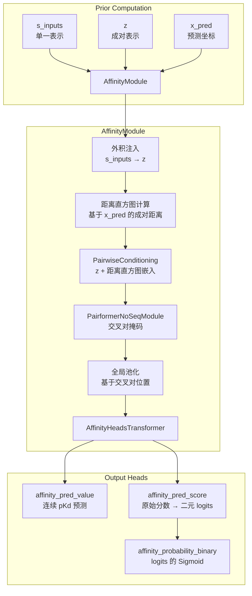
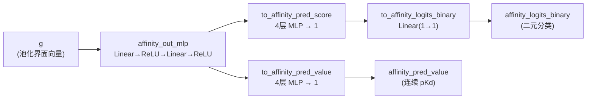

---
slug:11-binding-affinity-prediction
blog_type:normal
---


结合亲和力预测模块是 Boltz-2 中的一个结构预测后置头部，用于估计受体与指定结合物之间的分子相互作用强度。单独的结构预测仅回答两个分子**是否**结合，而亲和力预测则回答它们结合得**有多强**，同时输出连续的结合亲和力值和二进制的结合物/非结合物概率。该模块基于主干网络生成的成对表示和单一表示进行操作，以预测的 3D 坐标为条件，在架构设计上通过精心构建的交叉对掩码，使其专注于受体-配体界面。

来源: [affinity.py](src/boltz/model/modules/affinity.py#L1-L224), [boltz2.py](src/boltz/model/models/boltz2.py#L27-L300)

## 架构概述

亲和力预测流程位于主干/Pairformer 和结构模块的下游。它消费来自先前计算的三个产物：单一表示 `s_inputs`、成对表示 `z` 和预测的 3D 坐标 `x_pred`。然后，该模块应用一系列变换——基于距离直方图的成对条件化、聚焦界面的 Pairformer 传递，以及跨交叉对位置的全局池化——以产生其输出。整个流程由 Boltz2 模型上的 `affinity_prediction` 标志进行门控。



<CgxTip>亲和力模块在处理前会使用 `affinity=True` 重新嵌入输入特征，允许输入嵌入器生成有别于结构预测的、亲和力专属的表示。这一点至关重要——模型为亲和力任务学习了一条独立的嵌入路径，而不是简单地复用结构嵌入。</CgxTip>

来源: [boltz2.py](src/boltz/model/models/boltz2.py#L600-L700), [affinity.py](src/boltz/model/modules/affinity.py#L56-L155)

## AffinityModule：核心计算

`AffinityModule` 实现了代码库中标记为 **Algorithm 31** 的算法。其前向传播过程分为五个不同阶段，每个阶段都在前一个阶段的基础上细化界面表示。

**阶段 1 — 外积注入。** 单一表示 `s_inputs` 通过两个线性投影（`s_to_z_prod_in1`、`s_to_z_prod_in2`）投影到成对维度，并以外积的形式添加到归一化的成对表示中：`z = z + proj1(s_inputs)[:,:,None,:] + proj2(s_inputs)[:,None,:,:]`。在任何距离条件化之前，这通过逐 token 的信息丰富了成对张量。

**阶段 2 — 基于预测坐标的距离直方图。** 预测的 3D 坐标通过 `token_to_rep_atom` 投影为代表原子位置，并使用 `torch.cdist` 计算成对的欧几里得距离。随后，这些距离被离散化到由线性间隔边界定义的分箱中（范围从 2Å 到 `max_dist` Å，默认为 22Å，分箱数 `num_dist_bins` 默认为 64）。生成的离散距离直方图通过 `dist_bin_pairwise_embed` 嵌入到成对维度中，这是一个使用门控初始化的 `nn.Embedding` 层。

**阶段 3 — 成对条件化。** `PairwiseConditioning` 模块（与扩散条件化路径共享架构）将距离直方图嵌入作为相对位置特征整合到成对表示中，生成几何感知的 `z` 细化表示。

**阶段 4 — 聚焦界面的 Pairformer。** `PairformerNoSeqModule` 处理成对表示，但关键在于，它在一个**交叉对掩码**下运行，该掩码将注意力限制在仅包含受体-配体和配体-配体的位置。该掩码的构造如下：

| 掩码组件 | 公式 | 语义含义 |
|---|---|---|
| 受体 ← 配体 | `lig_mask[:,:,None] * rec_mask[:,None,:]` | 配体 token 关注受体 token |
| 配体 ← 受体 | `rec_mask[:,:,None] * lig_mask[:,None,:]` | 受体 token 关注配体 token |
| 配体 ← 配体 | `lig_mask[:,:,None] * lig_mask[:,None,:]` | 配体自相互作用 |

其中 `rec_mask` 选择蛋白质 token（`mol_type == 0`），`lig_mask` 选择由 `affinity_token_mask` 标记的 token。受体-受体位置被显式置零，强制 Pairformer 仅对界面进行建模。

**阶段 5 — 全局池化和预测头。** 成对表示通过掩码平均池化在所有交叉对位置上进行池化：`g = sum(z * cross_pair_mask) / (sum(cross_pair_mask) + ε)`。这产生了一个固定大小的全局向量，无论输入大小如何，该向量随后都会通过输出头。

来源: [affinity.py](src/boltz/model/modules/affinity.py#L56-L155), [affinity.py](src/boltz/model/modules/affinity.py#L157-L224)

## AffinityHeadsTransformer：双重输出架构

`AffinityHeadsTransformer` 将池化后的界面表示 `g` 分支为两个并行的预测路径，反映了结合亲和力预测的双重性质：



| 输出 | 形状 | 激活函数 | 解释 |
|---|---|---|---|
| `affinity_pred_value` | `(B, 1)` | 无（原始值） | 以 pKd 为单位的预测结合亲和力 |
| `affinity_logits_binary` | `(B, 1)` | 外部应用 Sigmoid | 作为结合物与非结合物的对数几率 |
| `affinity_probability_binary` | `(B, 1)` | logits 的 Sigmoid | 结合概率 |

值头和分数头各自使用一个 4 层 MLP（两个 `Linear→ReLU` 块后跟一个 `Linear→1` 投影），而二元分类头则是分数输出的简单线性变换。这种设计将回归和分类目标分离开来，同时允许它们通过共同的 `affinity_out_mlp` 预处理共享学习到的特征。

<CgxTip>`affinity_probability_binary` 是在模型层面（在 `Boltz2.forward` 中）通过对 `affinity_logits_binary` 应用 `torch.sigmoid` 计算得出的，而不是在 `AffinityHeadsTransformer` 内部。这种分离允许在训练时使用 `BCEWithLogitsLoss` 以保证数值稳定性，同时在推理时仍能输出概率。</CgxTip>

来源: [affinity.py](src/boltz/model/modules/affinity.py#L157-L224), [boltz2.py](src/boltz/model/models/boltz2.py#L680-L700)

## 集成预测与分子量校正

为了提高预测的可靠性，Boltz-2 支持**集成模式**（`affinity_ensemble=True`），该模式实例化两个具有独立参数的 `AffinityModule`。在推理时，两个模块处理相同的输入，其输出取平均值：

| 量 | 集成计算 |
|---|---|
| `affinity_pred_value` | `(value1 + value2) / 2` |
| `affinity_probability_binary` | `(prob1 + prob2) / 2` |

当启用 `affinity_mw_correction` 时（默认启用），将对集成平均后的值预测应用线性分子量校正：

```
corrected_value = 1.03525938 × predicted_value + (-0.59992683) × mw^0.3 + 2.83288489
```

其中 `mw` 是结合物的分子量，通过 `feats["affinity_mw"]` 获取。指数 `0.3` 压缩了分子量范围，三个校正系数（模型系数、MW 系数、偏置）是在验证数据上校准的硬编码常数。该校正考虑了较大的配体结合时产生的众所周知的熵惩罚——原始模型预测往往会高估小分子的亲和力，而低估大分子的亲和力。

来源: [boltz2.py](src/boltz/model/models/boltz2.py#L640-L700), [boltz2.py](src/boltz/model/models/boltz2.py#L1100-L1170)

## 推理编排：最佳样本选择

在推理时，亲和力模块不会独立处理所有的扩散样本。相反，Boltz2 模型选择由 iPTM（界面预测 TM-score）排名决定的**最佳结构样本**：

1. 扩散模块生成多个结构样本（`diffusion_samples`）。
2. 置信度模块计算每个样本的 iPTM。
3. 样本按 iPTM 降序排列；选择排名最高的样本。
4. 仅将此最佳样本的坐标作为 `coords_affinity` 输入到亲和力模块中。

这种设计反映了一个实际考量：亲和力预测的质量在很大程度上取决于预测结合姿态的准确性，而 iPTM 分数可作为姿态质量的代理指标。通过在亲和力预测之前选择最置信的结构，模型避免了因低质量结构样本而导致预测性能下降。

来源: [boltz2.py](src/boltz/model/models/boltz2.py#L615-L640)

## 亲和力感知的裁剪策略

亲和力预测的训练数据需要专门的裁剪策略，以保留具有生物学相关性的界面区域。`AffinityCropper` 实现了一种**距离加权空间裁剪**方法，优先处理靠近配体的 token：

1. **距离计算**：对于每个 token，从 `center_coords` 计算到任何配体 token（由 `affinity_mask` 标识）的最小欧几里得距离。
2. **近邻排序**：Token 按到配体的距离升序排序。
3. **邻域扩展**：对于每个 token（按近邻顺序），从同一链中提取以该 token 的残基索引为中心、大小为 `neighborhood_size`（默认为 10）的连续邻域。如果链短于邻域大小，则包含整条链。
4. **预算强制**：当超出 `max_tokens` 或 `max_tokens_protein`（默认为 200）时，裁剪停止。

`neighborhood_size` 参数调节裁剪范围：较小的值产生空间上更聚焦的裁剪（仅限直接结合口袋），而较大的值产生更连续的裁剪（扩展的蛋白质上下文）。这种在空间裁剪和连续裁剪之间的插值，确保模型在结合位点周围能看到足够的结构上下文，而不会超出内存限制。

来源: [affinity.py](src/boltz/data/crop/affinity.py#L1-L165)

## 输入规范

结合亲和力预测由输入 YAML 中的 `properties` 部分触发。结合物由其链 ID 标识，模型在特征化过程中自动构建 `affinity_token_mask`：

```yaml
version: 1
sequences:
  - protein:
      id: A
      sequence: MVTPEGNVSLVDESLLVGVTDEDRAVRSAHQ...
  - ligand:
      id: B
      smiles: 'N[C@@H](Cc1ccc(O)cc1)C(=O)O'
properties:
  - affinity:
      binder: B
```

| 字段 | 类型 | 必需 | 描述 |
|---|---|---|---|
| `version` | int | 否 | Schema 版本，默认为 1 |
| `sequences` | list | 是 | 蛋白质和配体链定义 |
| `properties.affinity.binder` | str | 是 | 结合物（通常是配体）的链 ID |

`binder` 字段指定哪条链是用于亲和力计算的配体。这决定了哪些 token 被赋予 `affinity_token_mask=True`，进而决定了将哪个分子量存储在 `affinity_mw` 中以用于 MW 校正。

来源: [affinity.yaml](examples/affinity.yaml#L1-L12)

## 预测输出

当启用亲和力预测时，`predict_step` 方法在输出字典中暴露以下键：

| 键 | 可用条件 | 描述 |
|---|---|---|
| `affinity_pred_value` | `affinity_prediction=True` | 预测的结合亲和力（pKd） |
| `affinity_probability_binary` | `affinity_prediction=True` | 作为结合物的概率 |
| `affinity_pred_value1` | `affinity_ensemble=True` | 集成成员 1 的值预测 |
| `affinity_probability_binary1` | `affinity_ensemble=True` | 集成成员 1 的二元概率 |
| `affinity_pred_value2` | `affinity_ensemble=True` | 集成成员 2 的值预测 |
| `affinity_probability_binary2` | `affinity_ensemble=True` | 集成成员 2 的二元概率 |

来源: [boltz2.py](src/boltz/model/models/boltz2.py#L1100-L1140)

## 训练考量

通过设置 `structure_prediction_training=False`，可以单独训练亲和力模块。在这种模式下，除了属于 `confidence_module`、`affinity_module` 和 `out_token_feat_update` 的参数外，所有参数的梯度都会被禁用。这允许在带亲和力标签的数据集上微调亲和力头部，而无需修改预训练的结构预测主干——由于主干、MSA 和扩散模块被冻结，这显著提高了效率。

当亲和力模块与结构预测一起训练时，它共享相同的前向传播，并接收来自主干网络的 `s_inputs` 和 `z` 的 detached 副本，确保没有梯度从亲和力损失流回结构流程。亲和力损失与距离直方图、扩散和置信度损失一起被纳入总训练损失中，每个损失都由其各自的损失权重超参数加权。

来源: [boltz2.py](src/boltz/model/models/boltz2.py#L290-L310), [boltz2.py](src/boltz/model/models/boltz2.py#L860-L920)

## 高斯展宽：距离编码原语

`GaussianSmearing` 模块提供了一种替代的连续距离编码方法，将标量距离扩展为径向基函数表示。给定参数 `start`、`stop` 和 `num_gaussians`，它会在距离范围内放置等间距的高斯中心，并为每个中心计算 `exp(coeff × (d - μ)²)`，其中 `coeff = -0.5 / (Δμ)²`。虽然此原语定义在亲和力模块中，但它遵循 SchNet 风格的距离编码模式，可用于扩展或替代的亲和力头部架构。

| 参数 | 默认值 | 描述 |
|---|---|---|
| `start` | 0.0 | 高斯中心的最小距离（Å） |
| `stop` | 5.0 | 高斯中心的最大距离（Å） |
| `num_gaussians` | 50 | 高斯基函数的数量 |

来源: [affinity.py](src/boltz/model/modules/affinity.py#L9-L28)

## 后续步骤

结合亲和力模块依赖于主干网络的成对和单一表示（参见[主干与 Pairformer 流程](8-trunk-and-pairformer-pipeline)），消费来自[基于扩散的结构模块](9-diffusion-based-structure-module)的预测坐标，并利用来自[置信度预测模块](10-confidence-prediction-module)的置信度分数。要了解 `affinity_token_mask` 和 `affinity_mw` 等亲和力专属特征是如何构建的，请参阅[特征化与特征工程](14-featurization-and-feature-engineering)。有关包括损失权重在内的完整训练配置，请参见[训练流程与配置](15-training-pipeline-and-configuration)。