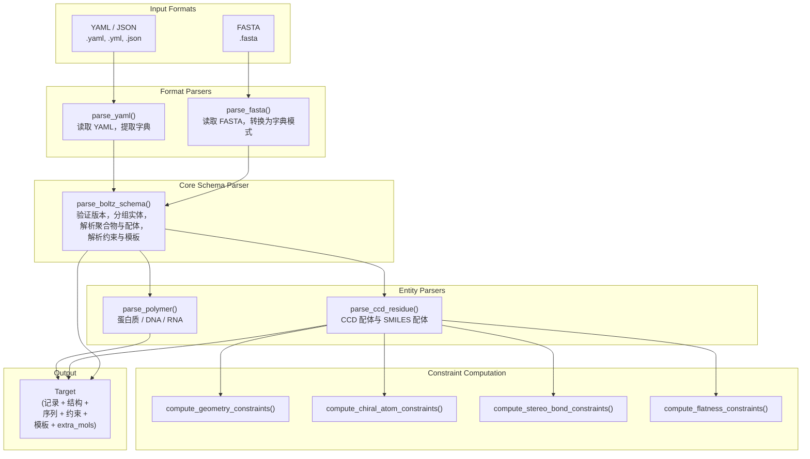

---
slug:12-parsing-and-input-handling
blog_type:normal
---


Boltz 的解析层是面向用户的输入文件与下游分词及特征化所使用的结构化内部表示之间的网关。它支持两种主要的输入格式——**YAML** 和 **FASTA**——两者都汇聚于一个统一的模式解析器（`parse_boltz_schema`），该解析器将异构的生物实体（蛋白质、DNA、RNA、配体）归一化为一个统一的 `Target` 对象。这种设计确保了无论你如何描述输入，相同的验证、构象生成和约束解析逻辑都能一致地应用。理解这一层对于调试输入错误、扩展实体支持，或推理为何特定结构在预测时失败至关重要。

来源: [yaml.py](src/boltz/data/parse/yaml.py#L1-L69), [fasta.py](src/boltz/data/parse/fasta.py#L1-L139), [schema.py](src/boltz/data/parse/schema.py#L1-L200)

## 架构概览：解析流水线

解析系统遵循**漏斗模式**：特定格式的解析器（YAML、FASTA）处理语法问题，并将其委托给处理语义的共享模式解析器。这种分离意味着添加新的输入格式只需编写一个轻量级适配器来生成标准字典模式——无需更改核心的实体解析逻辑。



关键的架构洞察在于，`parse_fasta` **并不**直接生成 `Target`——它首先将 FASTA 记录转换为与 `parse_yaml` 原生生成的相同字典模式，然后调用 `parse_boltz_schema`。这消除了重复的验证和解析逻辑。

来源: [yaml.py](src/boltz/data/parse/yaml.py#L56-L69), [fasta.py](src/boltz/data/parse/fasta.py#L104-L139), [schema.py](src/boltz/data/parse/schema.py#L896-L960)

## 输入格式参考

### YAML 输入格式

YAML 格式是最丰富且最具表现力的输入方法，支持所有实体类型、约束、模板和亲和力属性。它直接映射到内部模式字典。

```yaml
version: 1
sequences:
  - protein:
      id: A
      sequence: "MADQLTEEQIAEFKEAFSLF"
      msa: path/to/msa.a3m        # 可选：自定义 MSA 路径
      modifications:               # 可选：翻译后修饰
        - ccd: SEP
          position: 1
      cyclic: false                # 可选：环肽标志
  - protein:
      id: [B, C]                   # 同源拷贝共享一个条目
      sequence: "AKLSILPWGHC"
  - rna:
      id: D
      sequence: "GCAUAGC"
  - ligand:
      id: E
      smiles: "CC1=CC=CC=C1"      # SMILES 字符串或 CCD 代码
  - ligand:
      id: [F, G]
      ccd: [ATP, HEM]             # CCD 残基代码
constraints:
  - bond:
      atom1: [A, 1, CA]
      atom2: [A, 2, N]
  - pocket:
      binder: E
      contacts: [[B, 1], [B, 2]]
      max_distance: 6.0
  - contact:
      token1: [A, 1]
      token2: [B, 1]
      max_distance: 6.0
templates:
  - cif: /path/to/template.cif
    ids: [A]                       # 可选：应用模板的链
properties:
  - affinity:
      binder: E                    # 仅限 Boltz2
```

`version` 字段是必填的，且当前必须为 `1`。解析器会对此进行显式验证，并对任何其他版本引发 `ValueError`，以防未来出现格式不兼容的情况。

来源: [yaml.py](src/boltz/data/parse/yaml.py#L13-L53), [schema.py](src/boltz/data/parse/schema.py#L896-L950)

### FASTA 输入格式

FASTA 格式提供了一种为快速原型设计优化的轻量级替代方案。它使用管道分隔的约定在标题行中编码实体类型和链标识：

```
> CHAIN_ID|ENTITY_TYPE|MSA_ID
SEQUENCE
```

其中 `ENTITY_TYPE` 为 `protein`、`dna`、`rna`、`ccd` 或 `smiles` 之一，`MSA_ID` 是可选的且仅对蛋白质有效。解析器会验证每条记录的标题，并对缺少链 ID、实体类型为空或实体类型字符串无效的情况引发描述性错误。

| FASTA 标题字段 | 是否必填 | 有效值 | 说明 |
|---|---|---|---|
| `CHAIN_ID` | 是 | 任意非空字符串 | 在所有记录中必须唯一 |
| `ENTITY_TYPE` | 是 | `protein`, `dna`, `rna`, `ccd`, `smiles` | 在标题中不区分大小写 |
| `MSA_ID` | 否 | 文件路径字符串 | 仅当实体为 `protein` 时允许 |

在内部，FASTA 解析器将每条记录转换为与 YAML 所使用的相同字典模式——例如，`ccd` 实体类型会变为 `{"ligand": {"id": chain_id, "ccd": seq}}`——然后再将其传递给 `parse_boltz_schema`。这意味着 FASTA 输入无法指定约束、模板或亲和力属性；若需使用这些功能，请选用 YAML。

来源: [fasta.py](src/boltz/data/parse/fasta.py#L11-L139)

## 实体解析与链分组

`parse_boltz_schema` 中的一个关键步骤是**实体分组**：共享相同类型和内容的序列会被合并为一个实体，即使它们作为单独的条目出现。这对链、对称性和 MSA 的处理方式具有重要影响。

当多个 YAML 序列条目共享相同的 `(entity_type, sequence)` 元组时，它们会被分组在一起。每个组接收一个单一的 `entity_id`，组内的各个链 ID 接收递增的 `sym_id` 值。例如，如果链 B 和链 C 具有相同的蛋白质序列，它们将成为同一实体下的对称拷贝。解析器强制要求共享同一实体的所有链必须使用**相同的 MSA**——尝试为同源拷贝分配不同的 MSA 会引发错误。

<CgxTip>当你为蛋白质指定 `id: [B, C]` 时，你声明了 B 和 C 是同一实体的对称拷贝。这不仅仅是一种便捷的简写——它会在下游模型的注意力机制中触发特定的对称性处理。如果 B 和 C 是*不同*的蛋白质但恰好具有相同的序列，你仍然应该将它们列在一起，因为模型在设计上会将同一实体的链视为对称的。</CgxTip>

来源: [schema.py](src/boltz/data/parse/schema.py#L970-L1060), [schema.py](src/boltz/data/parse/schema.py#L1060-L1140)

## 聚合物解析：蛋白质、DNA、RNA

聚合物序列经历两个阶段的转换：**字母到 token 的映射**，随后是**残基级别的原子解析**。

**阶段 1 — Token 映射**：原始序列字符串中的每个字符都使用特定实体的查找表（`prot_letter_to_token`、`rna_letter_to_token`、`dna_letter_to_token`）映射到一个 token 名称。未知字符映射到特定实体的未知 token。修饰在初始映射后应用，通过将指定位置（1 索引）的 token 替换为修饰的 CCD 代码。

**阶段 2 — 原子解析**：对于映射序列中的每个 token，`parse_polymer` 解析完整的原子级细节。标准残基（即 `const.tokens` 中的残基）使用快速路径，从 `const.ref_atoms` 加载参考原子并按规范顺序排列。非标准残基（包括带有 CCD 代码的修饰残基）则采用较慢的 `parse_ccd_residue` 路径，该路径执行基于 RDKit 的完整原子和键解析以及几何约束。

当 `cyclic` 标志设置为 `True` 时，会将序列长度记录为结果 `ParsedChain` 上的 `cyclic_period`。这向下游发出信号，表明该聚合物是环肽，应被视为没有末端。

来源: [schema.py](src/boltz/data/parse/schema.py#L800-L895), [schema.py](src/boltz/data/parse/schema.py#L1125-L1180)

## 配体解析：CCD 代码与 SMILES

配体根据是由 CCD 代码还是 SMILES 字符串指定，遵循两条截然不同的解析路径。这两条路径最终都会生成 `NONPOLYMER` 类型的 `ParsedChain`，但它们在获取和验证分子结构的方式上有显著差异。

| 方面 | CCD 配体 | SMILES 配体 |
|---|---|---|
| **来源** | CCD 字典中预计算的 RDKit `Mol` | 通过 `MolFromSmiles` 运行时解析 SMILES |
| **构象** | 从缓存的构象中检索（`get_conformer`） | 通过 ETKDGv3 + UFF 优化生成 |
| **原子命名** | 来自 CCD 参考（`atom.GetProp("name")`） | 自动生成：`Symbol + CanonicalRank` |
| **标准化** | 无 | 请求亲和力时使用 ChEMBL `standardize()` |
| **氢处理** | 在 CCD 中预处理 | 通过 `AddHs` 添加，然后移除以仅保留重原子 |
| **多残基** | 支持（CCD 代码列表） | 仅限单残基 |
| **约束计算** | 完整的几何、手性、立体化学、平面度 | 完整的几何、手性、立体化学、平面度 |

对于 **SMILES 配体**，解析器执行几个关键步骤：(1) 在激活亲和力预测时通过 ChEMBL 结构流水线进行可选的标准化，(2) 添加氢并分配立体化学信息，(3) 使用 `CanonicalRankAtoms` 进行规范原子命名，(4) 使用 ETKDGv3 结合 UFF 细化（最多 1000 次迭代）生成 3D 构象，以及 (5) 如果 ETKDG 失败，则回退到随机坐标。最终仅含重原子的分子以生成的键（`LIG1`、`LIG2`、...）存储在 `extra_mols` 中，供下游参考。

<CgxTip>当 ETKDGv3 构象生成失败（返回 `conf_id == -1`）时，解析器会自动以 `useRandomCoords=True` 重试。如果这也失败，则会引发 `ValueError`。这种回退对于 ETKDG 无法仅从距离几何嵌入的大环或高应变配体非常重要。然而，使用随机起始坐标的模型性能尚未得到正式验证——请谨慎对待此类情况。</CgxTip>

来源: [schema.py](src/boltz/data/parse/schema.py#L1200-L1320), [schema.py](src/boltz/data/parse/schema.py#L640-L780)

## 构象生成与检索

`compute_3d_conformer` 函数为缺乏任何 3D 坐标的 SMILES 指定配体实现了一种稳健的构象生成策略。它使用 RDKit 的 ETKDGv3 算法，该算法结合了实验性的扭转角偏好与基于知识的距离几何。嵌入后，使用 UFF（通用力场）优化对构象进行多达 1000 次迭代的细化。

对于基于 CCD 的配体和聚合物参考残基，`get_conformer` 使用优先链：**Computed** → **Ideal** → **first available** 从预计算的 RDKit `Mol` 对象中检索现有构象。此优先级确保在可用时使用物理上最真实的坐标。

```
构象检索优先级：
  1. "Computed" — 由 ETKDG 生成，最真实
  2. "Ideal"    — CCD 理想坐标，几何完美
  3. First ID   — boltz2 格式分子的回退方案
```

来源: [schema.py](src/boltz/data/parse/schema.py#L200-L268)

## 几何约束计算

配体残基（包括 CCD 和 SMILES）经历广泛的约束计算，以保留扩散模块的立体化学信息。这些约束由五个专门的函数计算，每个函数针对分子几何的不同方面：

| 约束类型 | 函数 | 原子数 | 用途 |
|---|---|---|---|
| **RDKit 边界** | `compute_geometry_constraints` | 2 | 原子对之间的距离边界（键、角或一般） |
| **手性原子** | `compute_chiral_atom_constraints` | 4 | 四面体中心的 R/S 立体化学 |
| **立体键** | `compute_stereo_bond_constraints` | 4 | 双键的 E/Z 立体化学 |
| **平面键** | `compute_flatness_constraints` | 6 | sp2 双键周围的平面性 |
| **5/6元平面环** | `compute_flatness_constraints` | 5 或 6 | 芳香环平面性强制执行 |

**RDKit 边界约束**使用 `GetMoleculeBoundsMatrix` 结合三角平滑来计算所有原子对的上限和下限距离边界。每个约束记录该原子对是直接键（1-2）、角（1-3）还是都不是，从而允许扩散模块应用不同程度的强制执行。

**手性原子约束**使用 CIP（Cahn-Ingold-Prelog）排序来确定 R/S 构型。对于每个具有 4 个相邻原子的手性中心，解析器生成一个参考约束（排名前 3 的相邻原子 + 中心）和多个检查约束（4 个相邻原子中每种可能的 3 原子组合），使模型能够从部分原子观测中验证手性。

来源: [schema.py](src/boltz/data/parse/schema.py#L270-L398), [schema.py](src/boltz/data/parse/schema.py#L440-L570)

## 约束与模板解析

除了每个残基的几何约束外，模式解析器还解析在 YAML `constraints` 部分中指定的**链间约束**。支持三种约束类型：

**键约束**定义了特定原子之间的共价键，由 `[chain_id, residue_index, atom_name]` 元组标识。这些使用跟踪所有链中每个原子全局索引的 `atom_idx_map` 进行解析。

**口袋约束**定义了配体周围的结合口袋，指定哪些残基应与结合物接触以及最大距离。这些存储在 `InferenceOptions.pocket_constraints` 中。

**接触约束**通过距离阈值强制特定 token 对之间的接近性。这些存储在 `InferenceOptions.contact_constraints` 中。

**模板**为特定链提供结构模板。解析器通过 `parse_mmcif` 或 `parse_pdb` 从 CIF 或 PDB 文件加载模板结构，然后使用 `get_local_alignments`（使用 BLASTP 评分和高 gap 罚分以优先选择连续比对）计算查询链与模板链之间的序列比对。结果 `TemplateInfo` 记录捕获了用于下游模板条件的比对坐标。

来源: [schema.py](src/boltz/data/parse/schema.py#L490-L570), [schema.py](src/boltz/data/parse/schema.py#L896-L960)

## 解析过程中的 MSA 处理

解析器将每条蛋白质链的 MSA 分类为三种模式之一，且关键的是，**强制**在单个输入中不能混合使用这些模式：

| MSA 模式 | 值 | 行为 |
|---|---|---|
| **自动生成** | `0`（默认） | MSA 将在推理时通过 MMseqs2 生成 |
| **自定义** | 文件路径字符串 | 从指定的 `.a3m` 文件加载 MSA |
| **空** | `"empty"` | 以单序列模式运行（无 MSA） |

解析器会显式检查是否有链使用自定义 MSA 而其他链使用自动生成，如果同时检测到这两种模式则会引发 `ValueError`。当指定 `msa: "empty"` 时，解析器会警告在没有 MSA 信息的情况下预测结果将次优——这是一个针对常见用户错误的实用防护措施。

来源: [schema.py](src/boltz/data/parse/schema.py#L1065-L1110)

## 亲和力预测设置

结合亲和力预测是 Boltz2 独有的功能，通过 YAML 中的 `properties` 部分激活。解析器验证了几个约束：(1) 仅当 `boltz_2=True` 时才允许亲和力，(2) 结合物必须是单条配体链，(3) 配体不能有多个对称拷贝，(4) 亲和力不支持多残基 CCD 配体，以及 (5) 配体不得超过 128 个原子（硬性限制），超过 56 个原子（训练限制）会发出警告。

当对 SMILES 配体请求亲和力时，会在构象生成之前应用 ChEMBL 标准化流水线。分子量通过 `AllChem.Descriptors.MolWt` 计算并存储在 `AffinityInfo` 中，供下游亲和力预测头使用。

来源: [schema.py](src/boltz/data/parse/schema.py#L990-L1060), [schema.py](src/boltz/data/parse/schema.py#L1200-L1230)

## 输出：Target 对象

所有解析路径最终都汇聚于生成一个 `Target` 对象——一个冻结的数据类，封装了下游流水线所需的一切：

| 字段 | 类型 | 描述 |
|---|---|---|
| `record` | `Record` | 元数据：链信息、接口、推理选项、模板、亲和力 |
| `structure` | `Structure` | 用于原子、键、残基、链、连接、接口的 NumPy 数组 |
| `sequences` | `dict[str, str]` | 按实体类型键控的原始序列字符串 |
| `residue_constraints` | `ResidueConstraints` | 配体残基的几何约束 |
| `templates` | `dict[str, StructureV2]` | 按模板名称键控的模板结构 |
| `extra_mols` | `dict[str, Mol]` | SMILES 指定配体的 RDKit Mol 对象 |

`Structure` 对象使用具有固定数据类型（例如，原子名称为 `4i1`，坐标为 `3f4`，元素类型为 `i1`）的结构化 NumPy 数组，以实现内存效率和快速向量化访问。这种表示是专门为随后的分词阶段设计的，在该阶段中，原子被分组为 token，残基被映射到 token 索引。

来源: [types.py](src/boltz/data/types.py#L630-L665), [types.py](src/boltz/data/types.py#L90-L195)

## 常见解析错误与诊断

了解解析器的验证检查点有助于快速诊断常见的输入错误：

| 错误信息 | 原因 | 解决方案 |
|---|---|---|
| `Invalid version X in input!` | 模式版本不是 `1` | 在 YAML 中设置 `version: 1` |
| `Invalid entity type: X` | 序列列表中的未知实体 | 使用 `protein`、`dna`、`rna` 或 `ligand` |
| `All proteins with the same sequence must share the same MSA!` | 具有不同 MSA 路径的同源链 | 为所有拷贝分配相同的 MSA |
| `Cannot mix custom and auto-generated MSAs` | 某些链具有自定义 MSA，其他使用默认 | 为所有链选择一种 MSA 策略 |
| `Failed to compute 3D conformer for X` | ETKDG 即使使用随机坐标也失败 | 简化 SMILES 或提供 CCD 代码 |
| `Binder must be a single chain` | 亲和力规格中存在多链结合物 | 确切指定一条配体链 |
| `Affinity prediction is only supported for Boltz2!` | 在 Boltz1 中使用了亲和力属性 | 移除亲和力或使用 Boltz2 |

来源: [schema.py](src/boltz/data/parse/schema.py#L960-L1010), [schema.py](src/boltz/data/parse/schema.py#L1100-L1150)

## 下一步

理解了解析层之后，自然的进展是跟进 `Target` 对象如何流入分词系统，在那里结构化的 NumPy 数组被转换为模型实际消耗的基于 token 的表示。有关该转换的详情，请参见[分词系统](13-tokenization-system)，或参阅[特征化与特征工程](14-featurization-and-feature-engineering)了解原始结构数据如何变为模型可用的特征。