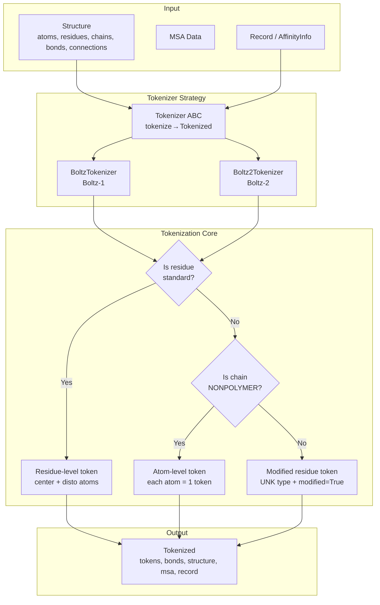

---
slug:13-tokenization-system
blog_type:normal
---


分词系统是 Boltz 的原始结构数据与神经网络流水线之间的关键桥梁。它将分层的分子结构——蛋白质、核酸和小分子配体——转换为模型可以处理的扁平化**token**序列，同时保留结构预测所需的关键空间、化学和拓扑信息。该系统采用了双粒度策略：标准聚合物残基被折叠为单个 token，而非标准或非聚合物实体则被展开为原子级别的 token，从而确保特征明确的化学部分与罕见的化学部分都能得到忠实表示。

来源：[tokenizer.py](src/boltz/data/tokenize/tokenizer.py#L1-L25), [boltz.py](src/boltz/data/tokenize/boltz.py#L1-L30), [boltz2.py](src/boltz/data/tokenize/boltz2.py#L1-L40)

## 架构概述

分词系统遵循**策略模式**，其中抽象基类 `Tokenizer` 定义了 `tokenize()` 契约，而具体的实现则提供了特定版本的逻辑。两个实现——`BoltzTokenizer` 和 `Boltz2Tokenizer`——共享相同的基础算法骨架，但在处理修饰残基、键类型、局部坐标系计算以及亲和力感知的 token 标记方面存在差异。



`tokenize_structure` 函数（在 Boltz-2 中独立存在）遍历所有有效的链及其残基，对每个残基应用双粒度决策逻辑，然后根据原始的原子键和残基间的共价连接构建 token 键。最终生成的 `Tokenized` 对象捆绑了 token 数组、键数组以及所有供下游特征化使用的原始数据引用。

来源：[tokenizer.py](src/boltz/data/tokenize/tokenizer.py#L1-L25), [boltz.py](src/boltz/data/tokenize/boltz.py#L47-L218), [boltz2.py](src/boltz/data/tokenize/boltz2.py#L57-L427)

## Token 词表与常量

Boltz 定义了一个固定的 token 词表，编码了三大主要聚合物类别的所有规范残基类型以及特殊 token。该词表是有序且带索引的，每个 token 都映射到流水线中全局使用的唯一整数 ID。

| Token 类别 | Token | 数量 | 未知 Token |
|---|---|---|---|
| **特殊** | `<pad>`, `-` | 2 | — |
| **蛋白质** | ALA, ARG, ASN, ASP, CYS, GLN, GLU, GLY, HIS, ILE, LEU, LYS, MET, PHE, PRO, SER, THR, TRP, TYR, VAL, UNK | 21 | `UNK` |
| **RNA** | A, G, C, U, N | 5 | `N` |
| **DNA** | DA, DG, DC, DT, DN | 5 | `DN` |
| **总计** | — | **33** | — |

每个未知 token 都是特定于分子类型的：蛋白质为 `UNK`，RNA 为 `N`，DNA 为 `DN`。这种区分至关重要，因为不同聚合物上下文中的非标准残基必须被赋予正确的未知 token 类型，Boltz-2 通过 `get_unk_token()` 辅助函数强制执行了这一点，该函数在选择合适的 UNK 变体之前会检查链的 `mol_type`。

来源：[const.py](src/boltz/data/const.py#L93-L132), [boltz2.py](src/boltz/data/tokenize/boltz2.py#L68-L86)

## Token 数据模式：Boltz-1 与 Boltz-2 对比

Token 数据结构在 Boltz-1 和 Boltz-2 之间发生了显著演变。两者都使用 NumPy 结构化数组以提高内存效率，但 Boltz-2 引入了几个新字段，以支持局部参考系、修饰残基标记和结合亲和力预测。

| 字段 | `Token` (Boltz-1) | `TokenV2` (Boltz-2) | 用途 |
|---|---|---|---|
| `token_idx` | i4 | i4 | 顺序 token 索引 |
| `atom_idx` | i4 | i4 | 结构中的起始原子索引 |
| `atom_num` | i4 | i4 | token 包含的原子数 |
| `res_idx` | i4 | i4 | 结构中的残基索引 |
| `res_type` | **i1** | **i4** | Token 类型 ID（为未来的 token 扩展了位宽） |
| `res_name` | — | `<U8` | 残基名称字符串（新增） |
| `sym_id` | i4 | i4 | 实体内的对称 ID |
| `asym_id` | i4 | i4 | 不对称（链）ID |
| `entity_id` | i4 | i4 | 实体 ID |
| `mol_type` | i1 | i4 | 分子类型 (PROTEIN/DNA/RNA/NONPOLYMER) |
| `center_idx` | i4 | i4 | 中心原子索引 |
| `disto_idx` | i4 | i4 | 距离图原子索引 |
| `center_coords` | 3f4 | 3f4 | 中心原子坐标 |
| `disto_coords` | 3f4 | 3f4 | 距离图原子坐标 |
| `resolved_mask` | ? | ? | Token 是否已解析/存在 |
| `disto_mask` | ? | ? | 距离图原子是否存在 |
| `modified` | — | ? | 是否为修饰残基（新增） |
| `frame_rot` | — | 9f4 | 局部参考系旋转矩阵（新增） |
| `frame_t` | — | 3f4 | 局部参考系平移向量（新增） |
| `frame_mask` | — | i4 | 参考系是否有效（新增） |
| `cyclic_period` | i4 | i4 | 环肽周期 |
| `affinity_mask` | — | ? | 亲和力预测链标记（新增） |

关键的架构变化是增加了**局部参考系**（`frame_rot`、`frame_t`、`frame_mask`），它由蛋白质残基的 N-CA-C 骨架原子计算得出，从而在 Boltz-2 中实现了基于模板的条件设定。`res_type` 字段的位宽从 `i1` 扩展到了 `i4`，`mol_type` 也从 `i1` 扩展到了 `i4`，以容纳扩展的词表并确保 4 字节对齐。`affinity_mask` 字段标记了属于参与结合亲和力预测链的 token，使亲和力预测模块能够识别相关的结合物。

来源：[types.py](src/boltz/data/types.py#L622-L667), [boltz2.py](src/boltz/data/tokenize/boltz2.py#L18-L56)

## 双粒度分词逻辑

核心分词算法采用了**双粒度**策略，以不同方式处理标准和非标准残基。这种设计选择平衡了计算效率（每个特征明确的残基对应一个 token）与表示保真度（针对化学结构多样的配体和修饰残基使用原子级别的 token）。

### 标准残基：每个残基一个 Token

对于标记为 `is_standard` 的残基，分词器会创建一个代表整个残基的**单一 token**。该 token 捕获了残基的身份（`res_type`）、其位置锚点原子（`center_idx`、`disto_idx`）及其坐标。对于蛋白质，中心原子始终是 **CA**（C-alpha），距离图原子通常是 **CB**（C-beta），但甘氨酸例外，它的两个锚点原子都使用 **CA**。对于核酸，中心原子是 **C1'**，距离图原子则因碱基类型而异（例如，嘌呤为 **C4**，嘧啶为 **C2**）。属于该残基的所有原子都会通过 `atom_to_token` 字典映射到这个单一的 token 索引。

来源：[boltz.py](src/boltz/data/tokenize/boltz.py#L62-L112), [const.py](src/boltz/data/const.py#L280-L370)

### 非标准残基：关键分歧点

这正是 Boltz-1 和 Boltz-2 存在根本差异的地方。两个版本都将 **NONPOLYMER**（配体）残基逐原子进行分词——每个原子都成为独立的 token，其 `atom_num=1`，`center_idx` 和 `disto_idx` 均指向自身，且 `res_type` 设置为蛋白质的 UNK token。然而，对于聚合物链（作为蛋白质/RNA/DNA 链一部分的非标准残基）中的**修饰残基**，两者的行为产生了分歧：

| 场景 | Boltz-1 | Boltz-2 |
|---|---|---|
| 标准聚合物残基 | 1 个 token（残基级） | 1 个 token（残基级） |
| NONPOLYMER 残基 | N 个 token（原子级） | N 个 token（原子级） |
| 修饰的聚合物残基 | N 个 token（原子级，蛋白质 UNK） | **1 个 token（残基级，UNK 类型，`modified=True`）** |

在 Boltz-1 中，所有非标准残基——无论是配体还是修饰的聚合物——都被逐原子分词。Boltz-2 引入了**第三条分支**：聚合物链中的修饰残基在分词时处于残基级别，并带有 `modified=True` 标记，使用特定于分子类型的 UNK token（例如，修饰的 RNA 残基使用 `N`，修饰的 DNA 残基使用 `DN`），并保留了残基的中心/距离图原子引用。这保留了原子级分词会破坏的分层链上下文，使模型能够更好地处理翻译后修饰，同时为 Pairformer 维持链级别的 token 对齐。

<CgxTip>在实现自定义分词器或扩展词表时，请确保每个原子索引恰好被一个 token 覆盖。`atom_to_token` 字典必须是从所有原子索引到其所属 token 索引的完整映射——任何遗漏都会导致键分词静默丢弃涉及未映射原子的连接。</CgxTip>

来源：[boltz.py](src/boltz/data/tokenize/boltz.py#L114-L184), [boltz2.py](src/boltz/data/tokenize/boltz2.py#L210-L340)

## 局部参考系计算

Boltz-2 为标准蛋白质残基引入了**逐 token 的局部参考系**，该参考系使用 Gram-Schmidt 正交化方法由骨架 N-CA-C 原子计算得出。该参考系编码了残基在 3D 空间中的朝向，对于基于模板的结构条件设定至关重要。

`compute_frame()` 函数根据三个骨架原子构建正交标准基：它沿 CA→C 向量定义 `e1`，将 N→CA 向量投影到 `e1` 的正交方向以获得 `e2`，并通过叉积计算得到 `e3`。旋转矩阵 `R = [e1 | e2 | e3]` 和平移向量 `t = CA_coords` 分别被存储为扁平化的 9 元素和 3 元素数组。布尔值 `frame_mask` 指示是否三个骨架原子（N、CA、C）都存在——如果其中任何一个缺失，则将参考系设置为单位矩阵且 `frame_mask=False`。非聚合物和修饰残基的 token 会接收单位矩阵作为参考系，且 `frame_mask=False`。

```
输入：N_coords, CA_coords, C_coords
e1 = normalize(C - CA)
u2 = (N - CA) - dot(e1, N-CA) * e1
e2 = normalize(u2)
e3 = cross(e1, e2)
R = [e1 | e2 | e3],  t = CA_coords
```

来源：[boltz2.py](src/boltz/data/tokenize/boltz2.py#L59-L86), [boltz2.py](src/boltz/data/tokenize/boltz2.py#L165-L198)

## Token 键构建

在构建了 token 数组之后，分词器通过将原子级别的键和残基间的连接转换为 token 空间的关系来构建 **token 键**。此映射使用 `atom_to_token` 字典将原子索引对转换为 token 索引对。

Boltz-1 的 `TokenBond` 模式仅存储 `(token_1, token_2)`——即两个相连的 token 索引。Boltz-2 的 `TokenBondV2` 增加了一个 `type` 字段，存储 `bond_type + 1`（偏移 1 以将 0 保留用于填充）。键类型遵循 `bond_types` 枚举：OTHER (0)、SINGLE (1)、DOUBLE (2)、TRIPLE (3)、AROMATIC (4)、COVALENT (5)。此类型信息使模型能够在结构生成过程中区分不同化学键的特性。

键来源于两个来源：(1) 来自结构 `bonds` 数组的**分子内键**（通常是配体内部键），以及 (2) 来自 `connections` 数组的**共价连接**（残基间的共价连接，如二硫键或交联）。如果任何一个原子在 `atom_to_token` 中找不到，该键或连接就会被静默跳过。

<CgxTip>`TokenBondV2` 中键类型的 `+1` 偏移量意味着 SINGLE 键 (type_id=1) 被存储为 2，而 COVALENT 键 (type_id=5) 被存储为 6。在下游消费键特征时，请减去 1 以恢复原始的键类型索引，或者将 0 视为“无键”。</CgxTip>

来源：[boltz.py](src/boltz/data/tokenize/boltz.py#L186-L218), [boltz2.py](src/boltz/data/tokenize/boltz2.py#L342-L370), [const.py](src/boltz/data/const.py#L373-L386), [types.py](src/boltz/data/types.py#L649-L667)

## 模板分词 (Boltz-2)

Boltz-2 中的一个重要新增功能是**模板分词**——当输入中提供模板结构时，每个模板都会使用相同的 `tokenize_structure()` 函数独立进行分词。`Boltz2Tokenizer.tokenize()` 方法遍历输入中的所有模板，为每个模板生成独立的 token 和键数组，并以模板 ID 为键存储为字典。这些模板 token 随后作为 `template_tokens` 和 `template_bonds` 被包含在 `Tokenized` 输出中，使模型的模板条件设定通路能够在推理期间消费结构对齐的参考系。

来源：[boltz2.py](src/boltz/data/tokenize/boltz2.py#L399-L427)

## 亲和力感知的 Token 掩码

当结合亲和力预测处于激活状态时（由记录中存在 `AffinityInfo` 指示），Boltz-2 会使用 `affinity_mask=True` 标记属于亲和力链的 token。这是通过将每条链的 `asym_id` 与 `affinity.chain_id` 进行比较来确定的。亲和力链中的所有 token——无论是标准的、非聚合物的还是修饰的——都会接收此标志，使模型中的亲和力预测模块能够选择性地关注结合物链的 token 表示，而无需单独的分词过程。

来源：[boltz2.py](src/boltz/data/tokenize/boltz2.py#L102-L106), [boltz2.py](src/boltz/data/tokenize/boltz2.py#L270-L275)

## 中心原子与距离图原子选择

每个 token 携带两个特殊的原子引用，在模型中扮演不同的角色：**中心原子**为 token 在 3D 空间中提供规范位置，而**距离图原子**为成对距离分布预测提供参考点。该选择遵循生物学动机的约定：

| 分子类型 | 中心原子 | 距离图原子 | 依据 |
|---|---|---|---|
| 蛋白质（所有） | CA | CB（GLY 为 CA） | C-alpha 锚定主链；C-beta 捕获侧链方向 |
| RNA (A, G) | C1' | C4 | 糖锚点；嘌呤环中心 |
| RNA (C, U) | C1' | C2 | 糖锚点；嘧啶环中心 |
| RNA (N) | C1' | C1' | 未知——均指向糖 |
| DNA (DA, DG) | C1' | C4 | 脱氧核糖锚点；嘌呤环中心 |
| DNA (DC, DT) | C1' | C2 | 脱氧核糖锚点；嘧啶环中心 |
| DNA (DN) | C1' | C1' | 未知——均指向糖 |
| 配体原子 | 自身 | 自身 | 每个原子都是自身的中心和距离图参考点 |

这些映射在 `res_to_center_atom` 和 `res_to_disto_atom` 字典中定义，并带有预计算的索引查找（`res_to_center_atom_id`、`res_to_disto_atom_id`），用于将残基类型映射到参考原子列表中的原子索引。

来源：[const.py](src/boltz/data/const.py#L280-L370), [const.py](src/boltz/data/const.py#L373-L386)

## 分词输出

最终的 `Tokenized` 数据类捆绑了下游特征化器所需的所有内容：

| 字段 | 类型 | 描述 |
|---|---|---|
| `tokens` | np.ndarray (Token/TokenV2) | Token 数组 |
| `bonds` | np.ndarray (TokenBond/TokenBondV2) | Token 空间键图 |
| `structure` | Structure | 原始结构引用 |
| `msa` | dict[str, MSA] | 每条链的多序列比对 |
| `record` | Record | 元数据与亲和力信息 |
| `residue_constraints` | ResidueConstraints | 可选的立体化学约束 |
| `templates` | dict[str, StructureV2] | 模板结构（仅 Boltz-2） |
| `template_tokens` | dict[str, np.ndarray] | 模板 token 数组（仅 Boltz-2） |
| `template_bonds` | dict[str, np.ndarray] | 模板键数组（仅 Boltz-2） |
| `extra_mols` | dict[str, Mol] | 配体的 RDKit 分子对象（仅 Boltz-2） |

此输出由特征化器消费（参见[特征化与特征工程](14-featurization-and-feature-engineering)），该模块将 token 级别的数据转换为经过填充和批处理的 PyTorch 张量，包含 MSA 特征、成对表示和原子级别的坐标映射，以供模型主干使用。

来源：[types.py](src/boltz/data/types.py#L669-L685)

## 总结：Boltz-1 与 Boltz-2 分词对比

| 方面 | Boltz-1 | Boltz-2 |
|---|---|---|
| 修饰残基处理 | 原子级 token（与配体相同） | 残基级 token，带有 `modified=True` |
| UNK token 选择 | 始终为蛋白质 UNK | 特定于分子类型的 UNK |
| 局部参考系 | 不计算 | 蛋白质残基的 N-CA-C Gram-Schmidt 参考系 |
| 键类型信息 | 不存储（仅保存对） | 存储键类型（+1 偏移量） |
| 亲和力掩码 | 不支持 | 每 token 的 `affinity_mask` |
| 模板分词 | 不支持 | 每个模板独立分词 |
| `res_type` 数据类型 | i1 | i4（扩展位宽） |
| `mol_type` 数据类型 | i1 | i4（扩展位宽） |
| 额外分子 | 不携带 | 包含 RDKit 对象的 `extra_mols` |

要了解这些 token 如何转换为模型就绪的特征，请继续阅读[特征化与特征工程](14-featurization-and-feature-engineering)。有关分词如何融入数据处理流水线的更广阔背景，请参阅[解析与输入处理](12-parsing-and-input-handling)。