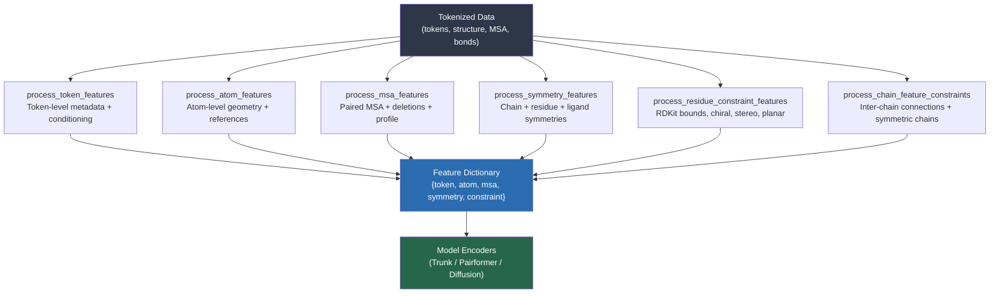

---
slug:14-featurization-and-feature-engineering
blog_type:normal
---

特征化层是 Boltz 将原始分词结构转换为丰富张量字典的地方，这些张量字典随后会输入到模型的编码器和主干网络中。它是残基、原子和序列的符号世界与学习表示的数值世界之间的桥梁。Boltz 实现了两条并行的特征化流水线——**BoltzFeaturizer**（v1，适用于 Boltz-1）和 **BoltzFeaturizerV2**（适用于 Boltz-2）——它们共享共同的架构理念，但在关键之处存在差异：v2 引入了系综坐标采样、接触条件矩阵、键类型编码、实验方法特征、修饰残基标志、亲和力掩码，以及带有完整手性标注的 RDKit 构象异构体参考。对于任何想要扩展模型输入词表或调试数据处理流水线问题的人来说，理解这一层都是必不可少的。

## 特征化架构概述

特征化流水线遵循确定性的分解过程：一个 `Tokenized` 对象（由[分词系统](13-tokenization-system)生成）进入，然后产生五个正交的特征组。每个特征组由专用的 `process_*` 函数计算，并合并为一个扁平的张量字典。v1 流水线生成 token、原子、MSA、对称性和约束特征；v2 流水线扩展了每个特征组，并将接触条件作为一等 token 级特征加入。

来源: [featurizer.py](src/boltz/data/feature/featurizer.py#L1100-L1226), [featurizerv2.py](src/boltz/data/feature/featurizerv2.py#L1-L40)

## Token 特征：逐残基元数据与条件化

Token 特征编码了模型在看到原子坐标之前所了解的关于每个残基级 token 的所有信息。核心标识特征——`res_type`（在 `num_tokens` 个类别上的独热编码）、`mol_type`、`asym_id`、`entity_id`、`sym_id`、`residue_index` 和 `token_index`——确立了每个 token *是什么*以及它在结构层次中的归属。`disto_center` 张量携带了每个 token 的分布图代表原子（蛋白质为 CA，核酸为 C1'）的 3D 坐标，用于计算成对距离目标。掩码特征——`token_pad_mask`、`token_resolved_mask`、`token_disto_mask`——向下游注意力机制发出有效性和可观测性信号。

### Token 级别的键编码

Token 间的共价键被编码为形状为 `(N_tokens, N_tokens, 1)` 的稀疏对称矩阵 `token_bonds`。在 v1 中，这是一个二值指示器；在 v2 中，并行的 `type_bonds` 矩阵使用 `const.bond_type_ids` 中定义的枚举来编码键类型（SINGLE, DOUBLE, TRIPLE, AROMATIC, COVALENT, OTHER）。这种区分很重要，因为芳香键和双键在扩散去噪过程中会施加更强的几何约束。

### 口袋条件化 (v1) vs. 接触条件化 (v2)

两代特征化器在结构条件化方面采用了截然不同的方法。在 v1 中，口袋条件化是一个**逐 token** 的特征：每个 token 接收一个来自 `{UNSPECIFIED, BINDER, POCKET, UNSELECTED}` 的独热标签，其中 POCKET token 是那些在结合物链原子的距离截断范围内的 token。在 v2 中，这被泛化为形状为 `(N_tokens, N_tokens, num_contact_classes)` 的**成对**接触条件矩阵，其条目包括 `BINDER>POCKET`、`POCKET>BINDER`、`CONTACT`、`UNSELECTED` 和 `UNSPECIFIED`，外加一个携带距离截断值的并行 `contact_threshold` 矩阵。这种成对公式允许 v2 模型关注特定的链间接触模式，而不仅仅是与单个结合物的接近度。

| 特征 | Boltz-1 (v1) | Boltz-2 (v2) |
|---|---|---|
| 键编码 | 二值 (0/1) | 二值 + 类型化（6 个类别） |
| 条件化粒度 | 逐 token（口袋） | 成对（接触矩阵） |
| 距离阈值 | 固定截断值 | 从 1/d 分布中采样 |
| 实验方法 | 未编码 | `method_feature`（独热编码） |
| 修饰残基 | 未编码 | `modified` 标志 |
| 亲和力预测 | 不支持 | `affinity_token_mask` |
| 环周期 | 直接来自 token | 取 token 与键检测中的最大值 |

v2 的 `method_feature` 将实验测定方法（例如，“x-ray diffraction”、“cryo-em”）编码为独热向量，使模型能够根据数据质量调整其不确定性估计。`modified` 标志标记翻译后或化学修饰的残基，而 `affinity_token_mask` 标识属于参与亲和力预测链的 token。

<CgxTip>v2 的 `sample_d` 函数从 **1/d 分布**中提取口袋/接触截断距离（逆 CDF：`d = min_d * (max_d/min_d)^u`），这使得训练期间偏向于更严格的截断值。这种课程式的采样教会模型处理宽松和严格的条件化，提高了推理时当用户指定精确接触约束的泛化能力。</CgxTip>

来源: [featurizer.py](src/boltz/data/feature/featurizer.py#L502-L698), [featurizerv2.py](src/boltz/data/feature/featurizerv2.py#L530-L1100), [const.py](src/boltz/data/const.py#L287-L295)

## 原子特征：几何、参考系与分布图

原子特征是计算量最大的特征组，将逐原子结构数据转换为扩散模块去噪所依据的参考坐标系。关键设计原则是**双重性**：对于每个原子，特征化器同时存储真实坐标（用于监督）和参考位置（用于输入），由模型必须学习弥合的增强间隙分隔。

### 核心原子级张量

每个原子产生以下特征张量：`ref_pos`（3D 参考位置）、`ref_element`（128 种元素类型的独热编码）、`ref_charge`（形式电荷）、`ref_atom_name_chars`（4 字符原子名编码，独热分箱）和 `ref_space_uid`（将属于同一残基的原子分组的整数）。`atom_resolved_mask` 指示每个原子的位置是否在实验结构中实际观测到。两个映射矩阵——`atom_to_token` 和 `token_to_rep_atom`——是独热编码的查找表，建立了多对一的原子到 token 的关系及反向的代表原子映射。

### 参考系计算

局部参考系对于扩散模块的等变去噪至关重要。对于**聚合物 token**，参考系是确定性的：蛋白质使用 (N, CA, C) 骨架原子，核酸使用 (C1', C3', C4')。对于**非聚合物 token**（配体），`compute_frames_nonpolymer` 为每个 token 选择三个最近的已解析原子，通过 0.9063（约 25°）的余弦阈值拒绝共线三元组。这种最近邻方法确保配体参考系在原子命名不规范时也始终具有良好几何条件。

### 分布图目标

分布图由 `disto_coords`（每个 token 的代表原子位置）计算得出，是一个成对距离矩阵，被分入跨越 `[min_dist, max_dist]`（默认：2.0–22.0 Å，64 个分箱）的等宽 `num_bins` 个分箱中。此目标在训练期间由分布图损失头使用。分箱操作使用累积比较技巧：`(dists.unsqueeze(-1) > boundaries).sum(dim=-1)`，它将每个距离高效地映射到其分箱索引。

### 系综坐标采样 (v2)

v2 的一项重大创新是多构象坐标处理。v2 的 `process_atom_features` 接收一个包含采样系综参考索引的 `ensemble_features` 字典，以及 `molecules`——每个残基一个 RDKit `Mol` 对象。对于每个 token，从**多个系综模型**中提取坐标（当来自 NMR 或多模型 X-ray 条目时），为扩散模块提供结构不确定性信息。此外，v2 特征化器为每个残基采样随机的 **RDKit 构象异构体**，使用构象异构体的 3D 几何作为参考位置，而不是来自 `const.ref_atoms` 的理想化坐标。这为参考系引入了自然的构象方差，使模型对输入坐标噪声更具鲁棒性。

### 骨架特征索引 (v2)

v2 特征化器为每个原子计算一个 `backbone_feat_index`，编码原子是属于蛋白质骨架（索引 1–4 映射到 N, CA, C, O）、核酸骨架（索引 5–16 映射到 P, OP1, OP2, O5', C5', C4', O4', C3', O3', C2', O2', C1'），还是两者皆非（索引 0）。该索引使模型的原子编码器能够为携带不成比例结构信号的骨架原子应用专门的嵌入层。

<CgxTip>`center_random_augmentation` 函数对 `ref_pos` 应用随机旋转，同时保持真实的 `coords` 不增强。这种不对称是故意的：模型必须学会从随机旋转的参考中预测真实结构，在扩散模块中强制执行 SE(3) 等变性，而无需显式构造旋转不变特征。</CgxTip>

来源: [featurizer.py](src/boltz/data/feature/featurizer.py#L700-L899), [featurizerv2.py](src/boltz/data/feature/featurizerv2.py#L1100-L1300), [const.py](src/boltz/data/const.py#L200-L350)

## MSA 特征：配对、删除与谱

多序列比对特征捕获了进化保守性和协同进化信号，这些信号是残基-残基接触最强的预测因子之一。`process_msa_features` 函数在将结果编码为张量之前，编排了一个复杂的配对算法。

### 配对 MSA 构建

`construct_paired_msa` 函数实现了一种分类感知的配对策略。对于多聚体输入，它按分类标识符对 MSA 序列进行分组，并创建多个链共享相同生物来源的配对行。算法优先考虑跨最多链共享的分类，然后用未配对的序列填充剩余位置，直到达到 `max_pairs`（8192）个配对行和 `max_total`（16384）个总行数。在训练期间，从 1 到配置的最大值中随机二次采样 `max_seqs`，在 MSA 维度提供数据增强。没有 MSA 数据的链接收一个 `dummy_msa`，仅包含带有缺口 token 的查询序列。

配对算法通过 Numba（`_prepare_msa_arrays_inner`）进行 JIT 编译以提高性能，在预扁平化的 numpy 数组上操作，以避免内层循环中 Python 级别的迭代开销。

### MSA 特征张量

输出的 MSA 特征字典包含：`msa`（独热编码的残基类型，形状 `(N_msa, N_tokens, num_tokens)`）、`msa_paired`（每个位置的二元指示器）、`deletion_value`（反正切缩放的删除计数：`π/2 * arctan(deletion/3)`）、`has_deletion`（二元）、`deletion_mean`（逐 token 平均值）、`profile`（来自 MSA 的逐 token 残基频率）和 `msa_mask`（有效性掩码）。删除值的反正切缩放将长尾删除计数分布压缩到有界范围内，防止梯度爆炸。

### v2 MSA 验证

v2 的 `construct_paired_msa` 添加了一个关键验证步骤：它检查第一个 MSA 序列是否与输入序列匹配，如果检测到不匹配，它会纠正 MET/UNK 差异或回退到虚拟 MSA。这防止了损坏的 MSA 数据悄无声息地降低模型性能。

来源: [featurizer.py](src/boltz/data/feature/featurizer.py#L132-L499), [featurizerv2.py](src/boltz/data/feature/featurizerv2.py#L200-L500), [featurizer.py](src/boltz/data/feature/featurizer.py#L900-L980)

## 对称性特征：利用结构等价性

对称性特征告知模型哪些原子和残基是可以互换而不改变结构有效性的。这对于配体对称性（例如，旋转苯环的取代基标签）和对称链组装（例如，同源接口）至关重要。

`process_symmetry_features` 函数委托给三个专门的提取器：`get_chain_symmetries` 识别共享相同 `entity_id` 的链，`get_amino_acids_symmetries` 处理氨基酸侧链对称性（例如，ASP OD1↔OD2、PHE CD1↔CD2/CE1↔CE2、GLU OE1↔OE2），而 `get_ligand_symmetries` 使用 RDKit 检测小分子配体中的自同构群。这些对称群存储为置换索引，损失函数使用它们来寻找最佳匹配的原子分配，避免因预测有效的对称排列而惩罚模型。

参考对称性在 `const.ref_symmetries` 中定义，它将每个规范 token 映射到一个原子索引交换对列表。例如，ASP 映射到 `[[(6,7), (7,6)]]`，表示索引 6 和 7 处的原子（OD1, OD2）是可互换的。

来源: [featurizer.py](src/boltz/data/feature/featurizer.py#L982-L998), [const.py](src/boltz/data/const.py#L263-L285)

## 约束特征：化学几何强制

约束特征编码了扩散模块必须遵守的硬化学几何规则。它们仅在 `compute_constraint_features=True` 时计算，并分为两组。

### 残基级约束

`process_residue_constraint_features` 从 `Tokenized` 对象的 `residue_constraints` 字段中提取五种类型的几何约束：

| 约束类型 | 索引形状 | 用途 |
|---|---|---|
| `rdkit_bounds_index` | `(2, N)` | 具有距离界限的原子对 |
| `chiral_atom_index` | `(4, N)` | 四面体手性中心 |
| `stereo_bond_index` | `(4, N)` | E/Z 立体键规范 |
| `planar_bond_index` | `(6, N)` | 定义平面键的原子 |
| `planar_ring_5/6_index` | `(5/6, N)` | 5/6 元平面环中的原子 |

每种约束类型都包含伴随张量：`rdkit_bounds_bond_mask` 和 `rdkit_bounds_angle_mask` 区分键约束和角约束；`chiral_atom_orientations` 和 `stereo_bond_orientations` 编码手性方向（R/S, E/Z）。这些特征在扩散采样期间直接输入到[转向势和引导](18-steering-potentials-and-guidance)中。

### 链级约束

`process_chain_feature_constraints` 编码链间连接性：`connected_chain_index` 和 `connected_atom_index` 标识在链间形成共价键的原子对（例如，二硫键、配体-金属配位），而 `symmetric_chain_index` 列出共享实体 ID 的链对。

来源: [featurizer.py](src/boltz/data/feature/featurizer.py#L1000-L1098), [featurizer.py](src/boltz/data/feature/featurizer.py#L1099-L1140)

## 特征填充与批处理策略

所有特征张量必须符合固定维度以便进行批量 GPU 计算。特征化器沿 token 维度应用 `pad_dim`（填充至 `max_tokens`）和沿原子维度应用填充（填充至 `max_atoms`，向上取整到最接近的 `atoms_per_window_queries` 倍数，默认 32）。MSA 特征沿序列维度（至 `max_seqs`）和 token 维度进行填充。填充值是特定于领域的：MSA 使用缺口 token，坐标和掩码使用零，残基类型使用填充 token ID。

v2 特征化器增加了一个额外约束：即使未指定 `max_atoms`，原子填充也必须对齐到 `atoms_per_window_queries` 边界，确保 v2 编码器中的原子注意力窗口始终在完整窗口上操作。

来源: [featurizer.py](src/boltz/data/feature/featurizer.py#L835-L870), [featurizerv2.py](src/boltz/data/feature/featurizerv2.py#L1060-L1080)

## Boltz-1 vs. Boltz-2 特征化器对比

下表提供了两个特征化器实现的全面并排比较，突出了从 v1 到 v2 的架构演变：

| 维度 | Boltz-1 (BoltzFeaturizer) | Boltz-2 (BoltzFeaturizerV2) |
|---|---|---|
| 条件化 | 逐 token 口袋标签 | 成对接触矩阵 + 阈值 |
| 原子参考坐标 | 结构 `conformer` 字段 | RDKit 构象异构体采样 |
| 键特征 | 二值邻接 | 类型化邻接（6 种键类型） |
| 系综支持 | 单一构象 | 多构象系综 |
| 手性编码 | 不包括 | 逐原子手性类型 |
| 骨架标注 | 不包括 | 每个原子的 `backbone_feat_index` |
| 实验方法 | 未编码 | 独热 `method_feature` |
| 修饰残基 | 未标记 | `modified` token 标志 |
| 亲和力支持 | 不可用 | `affinity_token_mask` |
| MSA 验证 | 基本配对 | 序列不匹配检测 |
| 环检测 | 来自 token 字段 | Token 字段 + 键图分析 |
| 口袋截断 | 固定值 | 1/d 分布采样 |
| 接触条件化 | 不可用 | 成对 + 链内接触 |
| 参考系计算 | 始终计算 | 条件计算（`compute_frames` 标志） |

v2 特征化器更丰富的特征集直接赋能了 [Boltz-1 vs Boltz-2 差异](21-boltz-1-vs-boltz-2-differences)中描述的增强功能：亲和力预测需要 `affinity_token_mask`，接触条件化生成需要成对条件化矩阵，而改进的配体处理源于 RDKit 构象异构体参考和手性编码。

来源: [featurizer.py](src/boltz/data/feature/featurizer.py#L1100-L1226), [featurizerv2.py](src/boltz/data/feature/featurizerv2.py#L1-L40)

## 下游流向：从特征到模型

特征化器生成的特征字典流入数据模块的整理层，该层沿批次维度堆叠填充的张量，并将其传递给模型的输入编码器。Token 特征输入 token 嵌入和配对嵌入初始化；原子特征输入原子编码器和扩散条件化；MSA 特征输入 MSA 编码器；约束特征在推理期间输入转向势。要了解这些特征如何被模型的主干和 Pairformer 消耗，请参见[主干与 Pairformer 流水线](8-trunk-and-pairformer-pipeline)；关于扩散模块对原子坐标和参考系的使用，请参见[基于扩散的结构模块](9-diffusion-based-structure-module)。