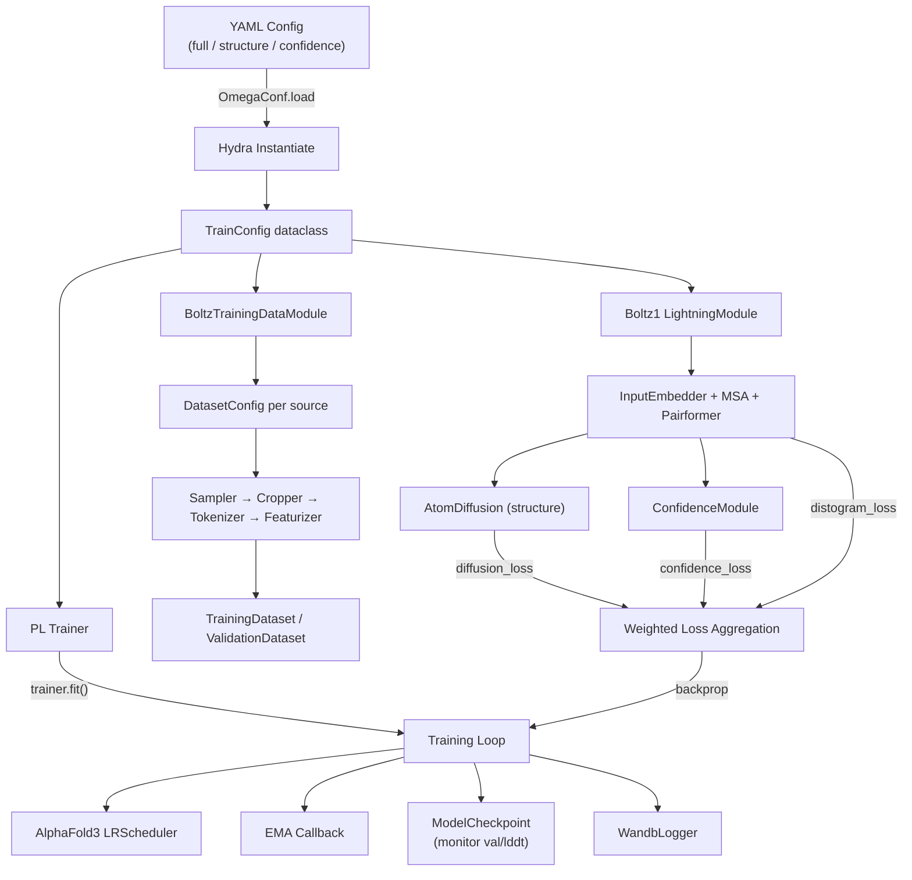
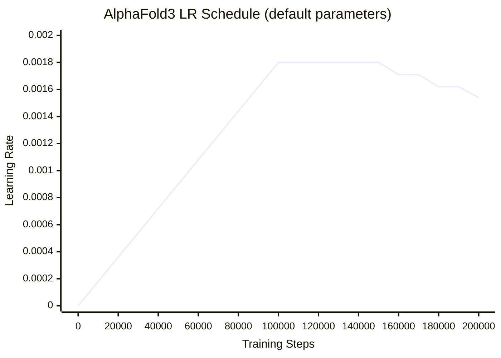

---
slug:15-training-pipeline-and-configuration
blog_type:normal
---


Boltz 采用了由 PyTorch Lightning 编排的**两阶段训练范式**：首先训练结构预测模块，随后将其冻结，并在其之上微调置信度预测模块。本页涵盖了完整的训练生命周期——从 YAML 配置、数据加载、优化、损失聚合到检查点管理——为你提供运行、自定义和调试训练流水线所需的架构图谱。

来源: [train.py](scripts/train/train.py#L1-L242), [boltz1.py](src/boltz/model/models/boltz1.py#L1-L80)

## 训练架构概述

训练流水线建立在三大支柱之上：一个由 Hydra 实例化、基于 YAML 组合模型与数据的**配置系统**；一个处理分布式训练与检查点的 **PyTorch Lightning 训练循环**；以及一个将采样、裁剪、分词和特征化串联成单一 `DataModule` 的**模块化数据流水线**。下图展示了这些组件从配置到检查点之间的交互方式：



<CgxTip>两阶段训练的划分由单个布尔值 `structure_prediction_training` 控制。当其为 `false` 时，`confidence_module` 之外的所有参数都会禁用梯度，将主干和结构模块完全冻结。这正是使 `confidence.yaml` 配置作为独立微调阶段运行的机制。</CgxTip>

来源: [train.py](scripts/train/train.py#L80-L235), [training.py](src/boltz/data/module/training.py#L492-L597), [boltz1.py](src/boltz/model/models/boltz1.py#L258-L263)

## 配置系统

所有训练行为均通过位于 `scripts/train/configs/` 的 YAML 文件指定。三个预定义配置对应三种训练模式。每个配置由 `OmegaConf` 加载，与所有 CLI 点列表覆盖项合并，然后通过 Hydra 的 `instantiate` 工具实例化，以生成活跃的 Python 对象（采样器、特征化器、过滤器及模型本身）。

### 配置层级

| 配置文件 | 训练模式 | `structure_prediction_training` | `confidence_prediction` | 用途 |
|---|---|---|---|---|
| `structure.yaml` | 仅结构 | `true`（隐式） | `false` | 训练主干 + 扩散模块 |
| `confidence.yaml` | 仅置信度 | `false` | `true` | 在冻结主干的情况下微调置信度头 |
| `full.yaml` | 联合 | `true` | `true` | 端到端训练所有模块 |

来源: [full.yaml](scripts/train/configs/full.yaml#L1-L200), [structure.yaml](scripts/train/configs/structure.yaml#L1-L195), [confidence.yaml](scripts/train/configs/confidence.yaml#L1-L202)

### 顶层训练参数

`TrainConfig` 数据类控制着最外层的训练行为。这些参数控制的是基础设施层面的问题——检查点、精度、分布式策略和权重加载——而非模型架构。

| 参数 | 类型 | 默认值 | 描述 |
|---|---|---|---|
| `output` | `str` | 必填 | 检查点和日志的目录 |
| `pretrained` | `Optional[str]` | `None` | 用于迁移学习的检查点路径 |
| `resume` | `Optional[str]` | `None` | 用于恢复训练的检查点路径 |
| `load_confidence_from_trunk` | `bool` | `False` | 将主干权重复制到置信度模块 |
| `disable_checkpoint` | `bool` | `False` | 禁用模型检查点 |
| `save_top_k` | `int` | `1` | 保留的最佳检查点数量 |
| `validation_only` | `bool` | `False` | 仅运行验证，不进行训练 |
| `debug` | `bool` | `False` | 单设备，无 worker，无 WandB |
| `matmul_precision` | `Optional[str]` | `None` | 设置 `torch.float32_matmul_precision` |
| `find_unused_parameters` | `bool` | `False` | 针对未使用参数的 DDP 标志 |
| `strict_loading` | `bool` | `True` | 检查点权重不匹配时失败 |

<CgxTip>当 `load_confidence_from_trunk` 为 `True` 时，训练脚本会创建一个临时修改过的检查点，其中所有主干权重（不包括 `structure_module` 和 `distogram_module`）都会被复制并添加 `confidence_module.` 前缀。这允许在 `confidence_imitate_trunk: true` 时与主干架构完全镜像的置信度模块，能够从预训练的主干表征中进行初始化。该临时文件在加载后会被删除。</CgxTip>

来源: [train.py](scripts/train/train.py#L24-L77), [train.py](scripts/train/train.py#L130-L166)

### Trainer 配置

`trainer` 子字典会直接传递给 `pl.Trainer`。所有三个配置中的默认值都是相同的：

| 参数 | 默认值 | 备注 |
|---|---|---|
| `accelerator` | `gpu` | 需要 GPU 训练 |
| `devices` | `1` | 扩展至多 GPU；自动触发 DDP |
| `precision` | `32` | 完整 float32 精度 |
| `gradient_clip_val` | `10.0` | 全局梯度范数裁剪 |
| `max_epochs` | `-1` | 无限周期（由 samples_per_epoch 控制） |
| `accumulate_grad_batches` | `128` | 有效批量大小 = 128 × num_devices |

当指定多个设备时，流水线会自动从 `"auto"` 策略切换为 `DDPStrategy`，并从配置中转发 `find_unused_parameters`。这在仅置信度训练期间是必要的，因为冻结的主干参数参与前向传播但不接收梯度。

来源: [train.py](scripts/train/train.py#L204-L219), [full.yaml](scripts/train/configs/full.yaml#L1-L7)

## 数据流水线

`BoltzTrainingDataModule` 编排了完整的数据生命周期：加载清单、将记录拆分为训练/验证集、应用动态过滤器，以及构建将采样 → 裁剪 → 分词 → 特征化串联至单个 `__getitem__` 调用的数据集对象。

### 数据配置参数

| 参数 | 类型 | 默认值 | 描述 |
|---|---|---|---|
| `max_tokens` | `int` | `512` | 每次裁剪的最大 token 数 |
| `max_atoms` | `int` | `4608` | 每次裁剪的最大原子数 |
| `max_seqs` | `int` | `2048` | 最大 MSA 序列数 |
| `samples_per_epoch` | `int` | `100000` | 每轮的训练样本数 |
| `batch_size` | `int` | `1` | 每设备批量大小（有效大小 = ×128 累积） |
| `num_workers` | `int` | `4` | DataLoader worker 数 |
| `pad_to_max_tokens` | `bool` | `true` | 填充至固定的 token 维度 |
| `pad_to_max_atoms` | `bool` | `true` | 填充至固定的原子维度 |
| `crop_validation` | `bool` | 不定 | 在验证期间应用裁剪 |
| `train_binder_pocket_conditioned_prop` | `float` | `0.3` | 口袋条件化概率（训练） |
| `val_binder_pocket_conditioned_prop` | `float` | `0.3` | 口袋条件化概率（验证） |
| `binder_pocket_cutoff` | `float` | `6.0` | 口袋定义的埃半径 |
| `compute_constraint_features` | `bool` | `false` | 启用约束特征计算 |

### 不同训练模式的关键差异

数据配置在结构训练和置信度训练之间有细微差异。在**仅结构**模式（`structure.yaml`）下，`crop_validation` 为 `false`（评估完整结构），`return_train_symmetries` 为 `false`，且分辨率过滤阈值放宽至 `9.0`Å 以包含更多训练数据。在**置信度**和**完整**模式下，`crop_validation` 为 `true`，`return_train_symmetries` 为 `true`，且分辨率过滤器更严格地设为 `4.0`Å——这反映了置信度模块对输入质量的敏感性。

来源: [training.py](src/boltz/data/module/training.py#L36-L68), [structure.yaml](scripts/train/configs/structure.yaml#L36-L75), [full.yaml](scripts/train/configs/full.yaml#L36-L77)

### 数据集组成与采样

`datasets` 列表中的每个数据集条目都指定了一个 `target_dir`（预处理过的 `.npz` 结构）、一个 `msa_dir`、一个采样 `prob`（概率）、一个 `Sampler` 和一个 `Cropper`。默认采样器为 `ClusterSampler`，它将结构相似的蛋白质分组并跨簇采样以确保多样性。默认裁剪器为 `BoltzCropper`，其 `min_neighborhood: 0` 且 `max_neighborhood: 40`，用于控制围绕所选链或接口的裁剪空间范围。

训练数据集的 `__getitem__` 执行四阶段流水线：(1) 按概率选择一个数据集，(2) 从该数据集的采样器迭代器中提取下一个样本，(3) 从磁盘加载结构和 MSA，进行分词并裁剪以适应 `max_tokens`/`max_atoms`，以及 (4) 使用口袋条件化和对称性计算进行特征化。任何阶段失败的样本都会通过递归重新调用被静默跳过。

来源: [training.py](src/boltz/data/module/training.py#L187-L336), [training.py](src/boltz/data/module/training.py#L85-L141)

### 过滤流水线

动态过滤器在加载清单时应用于训练记录，排除不符合质量标准的结构：

| 过滤器 | 参数 | 用途 |
|---|---|---|
| `SizeFilter` | `min_chains: 1`, `max_chains: 300` | 排除链数过少或过多的结构 |
| `DateFilter` | `date: "2021-09-30"`, `ref: released` | 训练/验证分离的时间截点 |
| `ResolutionFilter` | `resolution: 4.0`（或 `9.0`） | 以埃为单位的质量阈值 |

拆分文件（例如 `validation_ids.txt`）提供了一种独立机制：ID 出现在拆分文件中的任何记录都会被路由到验证集，而所有其他记录保留在训练集中。这确保了训练数据和评估数据在时间和结构上的清晰分离。

来源: [training.py](src/boltz/data/module/training.py#L528-L556), [full.yaml](scripts/train/configs/full.yaml#L37-L46)

## 模型架构配置

YAML 配置的 `model` 部分使用深层嵌套的参数字典实例化 `Boltz1` LightningModule。下表总结了关键的架构超参数及其在各配置中的默认值：

### 核心维度

| 参数 | 默认值 | 描述 |
|---|---|---|
| `atom_s` | `128` | 原子单一表征维度 |
| `atom_z` | `16` | 原子对表征维度 |
| `token_s` | `384` | Token 单一表征维度 |
| `token_z` | `128` | Token 对表征维度 |
| `atom_feature_dim` | `389` | 输入原子特征向量大小 |
| `num_bins` | `64` | Distogram 分箱数 |
| `atoms_per_window_queries` | `32` | 注意力查询的原子窗口大小 |
| `atoms_per_window_keys` | `128` | 注意力键的原子窗口大小 |

### 模块特定参数

| 模块 | 关键参数 | 默认值 |
|---|---|---|
| **Embedder** | `atom_encoder_depth`, `atom_encoder_heads` | 3, 4 |
| **MSA** | `msa_s`, `msa_blocks`, `msa_dropout`, `z_dropout` | 64, 4, 0.15, 0.25 |
| **Pairformer** | `num_blocks`, `num_heads`, `dropout` | 48, 16, 0.25 |
| **Score Model** | `dim_fourier`, `token_transformer_depth/heads` | 256, 24, 16 |
| **Confidence** | `num_dist_bins`, `num_plddt_bins`, `num_pde_bins`, `num_pae_bins` | 64, 50, 64, 64 |

所有模块均支持 `activation_checkpointing: true` 和 `offload_to_cpu: false`，用于在训练期间进行内存与计算资源的权衡。

来源: [full.yaml](scripts/train/configs/full.yaml#L78-L200), [boltz1.py](src/boltz/model/models/boltz1.py#L43-L80)

## 损失函数与权重

总训练损失是**三个组件损失的加权和**，每个损失由 `training_args` 中专用的权重控制：

$$\mathcal{L}_{total} = w_{conf} \cdot \mathcal{L}_{conf} + w_{diff} \cdot \mathcal{L}_{diff} + w_{disto} \cdot \mathcal{L}_{disto}$$

| 损失组件 | 权重参数 | 结构配置 | 置信度配置 | 完整配置 |
|---|---|---|---|---|
| 扩散损失 | `diffusion_loss_weight` | `4.0` | `4.0` | `4.0` |
| Distogram 损失 | `distogram_loss_weight` | `3e-2` | `3e-2` | `3e-2` |
| 置信度损失 | `confidence_loss_weight` | `1e-4` | `3e-3` | `3e-3` |

在仅结构配置中，置信度损失权重明显更低（`1e-4`），因为置信度预测被禁用（`confidence_prediction: false`），该损失仅产生微不足道的贡献。在置信度和完整训练模式下，该权重提升至 `3e-3`，以便为置信度头提供有意义的监督。

扩散损失本身通过 `diffusion_loss_args` 支持额外的子权重：`nucleotide_loss_weight: 5.0` 和 `ligand_loss_weight: 10.0` 增加了这些更难预测实体类型的权重。`add_smooth_lddt_loss: true` 标志在扩散模块内启用辅助平滑 lDDT 损失项。

来源: [boltz1.py](src/boltz/model/models/boltz1.py#L458-L540), [full.yaml](scripts/train/configs/full.yaml#L145-L193)

## 学习率调度

Boltz 采用了 **AlphaFold3 学习率调度**——一个在 `AlphaFoldLRScheduler` 中实现的三阶段设计。该调度从 `base_lr` 线性预热至 `max_lr`，在 `max_lr` 处保持平台期，随后呈指数衰减。



| 参数 | 默认值 | 描述 |
|---|---|---|
| `base_lr` | `0.0` | 起始学习率（预热原点） |
| `max_lr` | `0.0018` | 峰值学习率 |
| `lr_warmup_no_steps` | `1000` | 线性预热步数 |
| `lr_start_decay_after_n_steps` | `50000` | 开始衰减的步数 |
| `lr_decay_every_n_steps` | `50000` | 衰减步数间隔 |
| `lr_decay_factor` | `0.95` | 乘性衰减因子 |
| `lr_scheduler` | `"af3"` | 调度器类型标识符 |

优化器为 Adam，其参数为 `beta_1: 0.9`、`beta_2: 0.95` 和 `eps: 1e-8`——与 AlphaFold3 规范一致。任意步数下的有效学习率计算方式为：在预热期，`lr = base_lr + (step / warmup_steps) × max_lr`；在平台期，`lr = max_lr`；在衰减期，`lr = max_lr × decay_factor^((step - decay_start) // decay_interval + 1)`。

来源: [scheduler.py](src/boltz/model/optim/scheduler.py#L1-L99), [full.yaml](scripts/train/configs/full.yaml#L152-L162)

## 指数移动平均

当 `ema: true`（所有配置中的默认值）时，`EMA` 回调会维护一个模型参数的影子副本，其 `ema_decay: 0.999`。在验证期间，EMA 权重会替换训练权重，从而产生更稳定的指标。EMA 回调使用**热启动**衰减调度，其有效衰减率为 `min(decay, (1 + step) / (10 + step))`，在最初的几个步骤中逐渐从较低的衰减率增加到目标值 `0.999`。这可以防止 EMA 在训练开始时偏向随机初始化的参数。

EMA 权重与常规检查点一同保存在 `"ema"` 键下，并在恢复训练时自动还原。在验证时，原始权重会替换为 EMA 权重，确保检查点选择（监控 `val/lddt`）反映 EMA 质量的预测结果。

来源: [ema.py](src/boltz/model/optim/ema.py#L14-L144), [full.yaml](scripts/train/configs/full.yaml#L91-L92)

## 训练与验证参数

`training_args` 和 `validation_args` 字典控制各自阶段的前向传播行为。关键区别在于，训练使用较少的带多重性扩散采样步数，而验证则生成多个独立样本用于排序。

| 参数 | 训练默认值 | 验证默认值 | 描述 |
|---|---|---|---|
| `recycling_steps` | `3` | `3` | 循环迭代次数 |
| `sampling_steps` | `20`（结构）/ `200`（完整） | `200` | 扩散去噪步数 |
| `diffusion_multiplicity` | `16` | — | 训练时每个输入的噪声副本数 |
| `diffusion_samples` | `1`–`2` | `5` | 独立结构样本数 |
| `symmetry_correction` | `true`（完整/置信度） | `true` | 最小 RMSD 对称对齐 |
| `run_confidence_sequentially` | `false` | `true` | 在验证期间减少内存占用 |

仅结构配置在训练期间使用 `sampling_steps: 20`（快速含噪样本足以计算损失），但在验证期间使用 `200`。在完整配置中，训练同样使用 `200` 步，因为置信度预测需要更高质量的样本。

来源: [full.yaml](scripts/train/configs/full.yaml#L145-L171), [structure.yaml](scripts/train/configs/structure.yaml#L141-L165), [boltz1.py](src/boltz/model/models/boltz1.py#L458-L469)

## 扩散过程配置

扩散过程参数控制 `AtomDiffusion` 模块的噪声调度和采样行为：

| 参数 | 默认值 | 描述 |
|---|---|---|
| `sigma_min` | `0.0004` | 最小噪声水平 |
| `sigma_max` | `160.0` | 最大噪声水平 |
| `sigma_data` | `16.0` | 数据标准差 |
| `rho` | `7` | Karras 调度指数 |
| `P_mean` | `-1.2` | 噪声采样的对数正态均值 |
| `P_std` | `1.5` | 噪声采样的对数正态标准差 |
| `gamma_0` | `0.8` | 低噪声增强因子 |
| `gamma_min` | `1.0` | 噪声校正的最小 gamma |
| `coordinate_augmentation` | `true` | 随机旋转/平移增强 |
| `alignment_reverse_diff` | `true` | 在反向扩散期间对齐结构 |
| `synchronize_sigmas` | `true` | 跨批次元素共享 sigma |
| `use_inference_model_cache` | `true` | 在推理期间缓存计算 |

来源: [full.yaml](scripts/train/configs/full.yaml#L173-L188)

## 检查点与日志记录

`ModelCheckpoint` 回调以 **max** 模式监控 `val/lddt`，每个 epoch 保存最佳检查点和最新检查点。当 `save_top_k: -1`（配置中的默认值）时，所有检查点均会被保留。WandB 记录器在配置后，会将完整的 YAML 配置保存到 WandB 运行目录中，以确保可复现性。

在验证期间，流水线会计算一套全面的指标：按链类型划分的 lDDT（蛋白质、DNA、RNA、配体）、复合物级别的 lDDT、distogram lDDT、RMSD，以及——当启用置信度时——经过置信度排名样本选择过滤的 pLDDT/pDE/pAE MAE 指标。这些指标按实体类型记录，并在整个验证集上进行聚合。

来源: [train.py](scripts/train/train.py#L168-L202), [boltz1.py](src/boltz/model/models/boltz1.py#L618-L700)

## 运行训练

通过执行 `train.py` 脚本并指定配置文件及可选的 CLI 覆盖参数即可启动训练：

```bash
python scripts/train/train.py scripts/train/configs/structure.yaml \
    output=/path/to/output \
    data.datasets[0].target_dir=/path/to/targets \
    data.datasets[0].msa_dir=/path/to/msas \
    data.symmetries=/path/to/symmetries.json \
    trainer.devices=4
```

CLI 参数由 OmegaConf 作为点列表解析，并合并到 YAML 配置中以覆盖任何值。这允许在不修改配置文件的情况下进行参数扫描和快速实验。进行调试时，设置 `debug: true` 可强制使用 `num_workers: 0` 的单设备训练且不记录 WandB 日志。

推荐的训练顺序为：(1) 使用 `structure.yaml` 训练直至收敛，(2) 使用 `confidence.yaml` 进行微调，并将结构检查点作为 `pretrained`，如果是从头开始，可选择使用 `load_confidence_from_trunk: true`。有关驱动这些阶段的损失函数的更多详细信息，请参见 [损失函数与验证](20-loss-functions-and-validation)；有关使用训练后检查点的推理路径，请参见 [推理工作流与编排](16-inference-workflow-and-orchestration)。