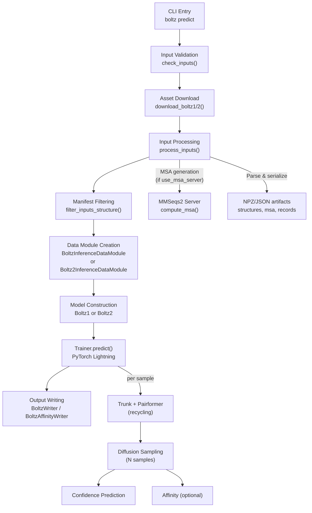
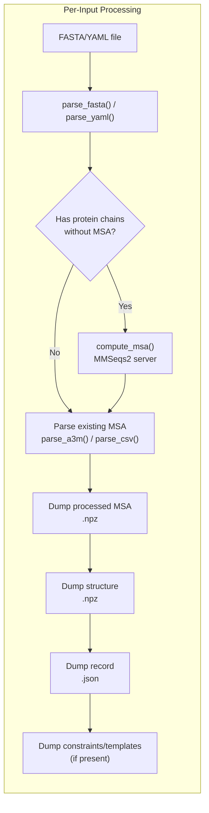
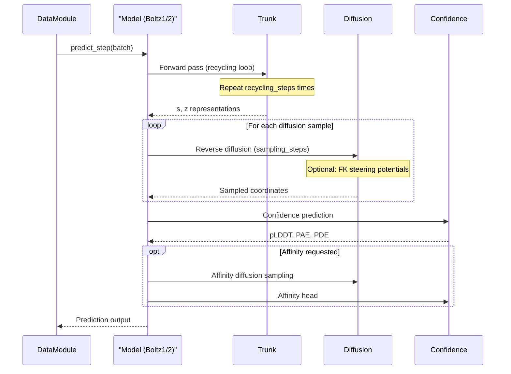

---
slug:16-inference-workflow-and-orchestration
blog_type:normal
---

推理流水线是 Boltz 的运营骨干——这个编排有序的序列将原始输入文件（FASTA、YAML）转化为带有置信度指标和可选亲和力分数的完整 3D 结构预测。与优化模型参数的训练不同，推理是一条确定性的多阶段流水线，其中的数据处理、模型执行和输出写入均经过精心排序，以处理从单蛋白折叠到包含配体的多链复合物等各种任务。本页面将剖析这条流水线：CLI 入口、输入处理流水线、数据模块架构、模型编排循环以及输出写入阶段。

来源: [main.py](src/boltz/main.py#L1-L35), [inference.py](src/boltz/data/module/inference.py#L1-L25), [inferencev2.py](src/boltz/data/module/inferencev2.py#L1-L25)

## 端到端推理架构

推理工作流遵循严格的线性推进，包含五个独立阶段。每个阶段产出的中间结果会被下一阶段消费，且系统被设计为可恢复的——如果处理中断，重新运行时会跳过已处理的输入。下图展示了这一高层流程，该流程适用于 Boltz-1 和 Boltz-2，并在数据模块和模型执行阶段存在特定模型的分支。

来源: [main.py](src/boltz/main.py#L1042-L1195)

## Predict 命令：CLI 入口

整个推理工作流通过单个 Click CLI 命令触发：`boltz predict`。该命令接受广泛的配置选项，控制预测流水线的各个方面，从输入解析、扩散采样到输出格式化。其函数签名非常庞大，反映了系统的高度可配置性。

`predict()` 中的**核心执行流程**如下：(1) 通过 `torch.set_grad_enabled(False)` 禁用梯度计算，(2) 如果提供则设置随机种子，(3) 如果未缓存则下载模型检查点和 CCD 数据，(4) 验证并处理所有输入文件，(5) 构建相应的数据模块和模型，(6) 通过 PyTorch Lightning 调用 `Trainer.predict()`，(7) 写入输出。一个关键的早期决策是 `--model` 标志（`boltz1` 或 `boltz2`），它决定了全程使用的下载函数、数据模块、模型类和检查点。

| 参数 | 默认值 | 描述 |
|---|---|---|
| `--recycling_steps` | 3 | Trunk 循环迭代次数 |
| `--sampling_steps` | 200 | 每个样本的扩散去噪步数 |
| `--diffusion_samples` | 1 | 独立结构样本数量 |
| `--max_parallel_samples` | 5 | 同时预测的最大样本数 |
| `--step_scale` | 视模型而定 | 控制采样温度/多样性 |
| `--model` | `boltz2` | 模型变体（`boltz1` 或 `boltz2`） |
| `--output_format` | `mmcif` | 输出结构格式（`pdb` 或 `mmcif`） |
| `--use_potentials` | `False` | 在采样期间启用引导势 |
| `--write_full_pae` | `False` | 导出预测对齐误差矩阵 |
| `--write_full_pde` | `False` | 导出预测距离误差矩阵 |
| `--write_embeddings` | `False` | 导出 s 和 z 嵌入到 npz |
| `--affinity_mw_correction` | `False` | 对亲和力应用分子量校正 |
| `--sampling_steps_affinity` | 200 | 亲和力预测的扩散步数 |
| `--diffusion_samples_affinity` | 5 | 亲和力预测的扩散样本数 |
| `--max_msa_seqs` | 8192 | 使用的最大 MSA 序列数 |
| `--subsample_msa` | `True` | 是否对 MSA 进行二次采样 |
| `--num_subsampled_msa` | 1024 | 二次采样后的 MSA 序列数 |

<CgxTip>`--step_scale` 参数直接控制扩散采样过程的随机性。较低的值会产生更多样化（更高温度）的样本，而较高的值则产生更确定性的输出。推荐范围为 1.0–2.0，其中 Boltz-1 默认为 1.638，Boltz-2 默认为 1.5。</CgxTip>

来源: [main.py](src/boltz/main.py#L817-L1080)

## 输入处理流水线

在任何模型推理发生之前，原始输入文件必须被解析、验证并序列化为数据模块消费的二进制格式。`process_inputs()` 函数编排了这一转换，它被设计为**幂等的**——通过检查输出目录中的现有记录，重新运行时会跳过已处理的输入。

处理流水线在输出目录下创建了一个定义明确的目录结构：`msa/` 用于原始 MSA 文件，`processed/structures/` 用于序列化的结构 NPZ 文件，`processed/msa/` 用于处理后的 MSA NPZ 文件，`processed/records/` 用于逐目标的 JSON 记录，`processed/constraints/` 用于残基约束，`processed/templates/` 用于模板结构，以及 `processed/mols/` 用于额外的分子 pickle 文件。每个输入文件（FASTA 或 YAML）通过 `process_input()` 独立处理，该过程可通过多进程池使用 `--preprocessing-threads` 进行并行化。

MSA 生成步骤（`compute_msa()`）特别值得注意。当设置了 `--use_msa_server` 时，Boltz 会调用外部 MMSeqs2 API（默认为 ColabFold 的公共端点）来为蛋白质链生成配对和非配对的 MSA。该函数支持三种认证模式：无认证（默认）、通过用户名/密码的基本认证（也可通过 `BOLTZ_MSA_USERNAME` 和 `BOLTZ_MSA_PASSWORD` 环境变量配置），以及通过自定义标头/值的 API 密钥认证。对于多链复合物，首先生成配对 MSA 以捕获共进化信号，然后非配对 MSA 填充剩余位置直到 `max_msa_seqs`。

来源: [main.py](src/boltz/main.py#L525-L809)

## 数据模块架构

推理数据模块在磁盘上已处理的中间结果与准备好供模型消费的批量张量之间起到了桥梁作用。Boltz 提供了两个并行实现：用于 Boltz-1 的 **`BoltzInferenceDataModule`** 和用于 Boltz-2 的 **`Boltz2InferenceDataModule`**，两者均继承自 `pl.LightningDataModule`。每个模块都封装了一个 `PredictionDataset`，实现了完整的逐样本流水线：加载 → 分词 → 特征化 → 拼装。

`PredictionDataset.__getitem__()` 方法封装了逐记录的处理逻辑。对于 **Boltz-1**，流水线为：`load_input()` → `BoltzTokenizer.tokenize()` → `BoltzFeaturizer.process()`（带有 `training=False`、口袋/配体约束以及 `compute_constraint_features=True`）。对于 **Boltz-2**，流水线增加了几个阶段：`load_input()` 支持模板和额外分子，使用了 `Boltz2Tokenizer.tokenize()`，并且 `Boltz2Featurizer.process()` 接受额外参数，包括 `compute_frames=True`、`inference_contact_constraints`、`override_method` 和 `compute_affinity`。Boltz-2 还引入了一个 `AffinityCropper`，当请求亲和力预测时激活，将分词后的结构裁剪至 `max_tokens=256` 和 `max_atoms=2048`。

| 方面 | Boltz-1 数据模块 | Boltz-2 数据模块 |
|---|---|---|
| 分词器 | `BoltzTokenizer` | `Boltz2Tokenizer` |
| 特征化器 | `BoltzFeaturizer` | `Boltz2Featurizer` |
| 结构类型 | `Structure` | `StructureV2` |
| 模板支持 | 否 | 是（通过 `template_dir`） |
| 额外分子 | 否 | 是（通过 `extra_mols_dir`） |
| 亲和力裁剪 | 否 | 是（`AffinityCropper`） |
| 分子加载 | 否 | 是（规范分子 + 按需加载） |
| 方法覆盖 | 否 | 是（通过 `override_method`） |
| 接触约束 | 否 | 是 |

<CgxTip>两个数据模块在其 `predict_dataloader()` 中均使用 `batch_size=1`，这意味着每个结构被单独处理。`max_parallel_samples` 参数控制单个结构的多少个扩散样本在 GPU 上被批量处理——这不是数据加载器的批大小，而是扩散采样循环中模型级别的并行度控制。</CgxTip>

`transfer_batch_to_device()` 方法选择性地将张量移动到 GPU。某些键——`all_coords`、`all_resolved_mask`、`crop_to_all_atom_map`、链/氨基酸/配体的 `symmetries` 以及 `record`——被有意保留在 CPU 上，因为它们包含可变长度列表或不参与 GPU 计算的元数据。Boltz-2 还额外将 `affinity_mw` 排除在设备传输之外。

来源: [inference.py](src/boltz/data/module/inference.py#L121-L311), [inferencev2.py](src/boltz/data/module/inferencev2.py#L157-L434)

## 模型构建与配置

实例化数据模块后，`predict()` 函数会构建模型并为其配置推理环境。模型选择——`Boltz1` 或 `Boltz2`——由 `--model` 标志决定。每个模型接收一组特定的架构超参数作为数据类配置，这些配置与其训练对应项相呼应，但被设为适合推理的默认值。

**PairformerArgs**（Boltz-1）和 **PairformerArgsV2**（Boltz-2）定义了 Trunk 的核心配置。Boltz-1 使用 48 个 Pairformer 块，而 Boltz-2 使用 64 个，两者均具有 16 个注意力头。`activation_checkpointing` 和 `offload_to_cpu` 标志允许在处理大型结构时进行内存与计算的权衡。**扩散参数**也是特定于模型的：Boltz-1 使用 `BoltzDiffusionParams`，Boltz-2 使用 `Boltz2DiffusionParams`，控制噪声调度（`gamma_0`、`gamma_min`、`noise_scale`）、ODE/SDE 求解器参数（`rho`、`step_scale`）以及 sigma 边界（`sigma_min`、`sigma_max`、`sigma_data`）。这些并非随意设定——它们是从训练噪声分布参数（`P_mean`、`P_std`）推导出的经过精细调优的常数。

| 扩散参数 | Boltz-1 | Boltz-2 | 效果 |
|---|---|---|---|
| `gamma_0` | 0.605 | 0.8 | 初始噪声乘数 |
| `gamma_min` | 1.107 | 1.0 | 最小噪声调度边界 |
| `noise_scale` | 0.901 | 1.003 | 输出噪声缩放因子 |
| `rho` | 8 | 7 | 步长调度曲率 |
| `step_scale` | 1.638 | 1.5 | 采样步长幅度 |
| `sigma_min` | 0.0004 | 0.0001 | 最小噪声水平 |
| `sigma_data` | 16.0 | 16.0 | 数据分布标准差 |

**引导参数**（`BoltzSteeringParams`）仅在设置了 `--use_potentials` 时激活。它们配置 Follmer-Karatzas (FK) 随机引导机制：`num_particles` 控制 FK 滤波器中并行粒子的数量，`fk_lambda` 缩放引导强度，`fk_resampling_interval` 决定粒子重采样的频率。`physical_guidance_update` 和 `contact_guidance_update` 标志选择激活哪种类型的势。

来源: [main.py](src/boltz/main.py#L67-L158)

## 推理执行循环

一旦模型、数据模块和 Trainer 配置完毕，PyTorch Lightning 的 `Trainer.predict()` 将驱动推理循环。模型的 `predict_step()` 方法（继承自 `Boltz1`/`Boltz2` Lightning 模块）从数据模块接收一个批次并执行完整的前向传播，该过程由三个主要子阶段组成：**带循环的 Trunk 处理**、**基于扩散的结构采样**以及**置信度/亲和力预测**。

**循环过程** 运行 Trunk（MSA 模块 + Pairformer 块）`recycling_steps` 次迭代，每次将前一次输出的表示作为额外输入反馈回去。这种迭代优化对预测质量至关重要——每次循环允许模型逐步改进其内部的结构表示。在最后一次循环之后，Trunk 输出单一表示 `s` 和配对表示 `z`，它们为后续阶段提供条件。

**扩散采样** 阶段通过运行 `sampling_steps` 步的逆扩散过程，生成 `diffusion_samples` 个独立的 3D 结构。每个样本从纯噪声开始，在 Trunk 的 `s` 和 `z` 表示的条件下逐步去噪。当设置了 `max_parallel_samples` 时，多个样本会在 GPU 上批量处理，以摊销 Trunk 前向传播的成本。如果启用了引导势（通过 `--use_potentials`），FK 引导机制会在每一步修改去噪轨迹。

**置信度预测** 模块获取最终的结构样本，并计算逐残基的置信度指标 (pLDDT)、预测对齐误差 (PAE) 和预测距离误差 (PDE)。当请求亲和力预测时，将使用 `sampling_steps_affinity` 和 `diffusion_samples_affinity` 参数运行单独的扩散采样过程，随后运行亲和力头部。

来源: [main.py](src/boltz/main.py#L1081-L1195)

## 输出写入与产物生成

推理的最后阶段由 `BoltzWriter`（以及用于亲和力预测的 `BoltzAffinityWriter`）处理，它接收模型的预测输出并以指定格式将其写入磁盘。写入器在 `predictions/` 下为每个目标创建一个目录，包含结构文件（根据 `--output_format` 为 PDB 或 mmCIF），以及可选的若干额外产物。

写入器处理从模型内部坐标表示（裁剪、填充、增强）映射回原始原子坐标系的非平凡任务，通过在特征化期间计算的对称性信息来解析链对称性和氨基酸对称性。这种反向映射正是 `chain_symmetries`、`amino_acids_symmetries` 和 `ligand_symmetries` 等键被保留在 CPU 并排除在设备传输之外的原因——它们是写入器消费的元数据，而非模型使用的。

输出产物因配置标志而异：

| 产物 | 标志 | 格式 | 内容 |
|---|---|---|---|
| 结构文件 | (始终) | `.pdb` 或 `.cif` | 预测的 3D 坐标 |
| PAE 矩阵 | `--write_full_pae` | `.npz` | 每对残基的预测对齐误差 |
| PDE 矩阵 | `--write_full_pde` | `.npz` | 每对残基的预测距离误差 |
| 嵌入 | `--write_embeddings` | `.npz` | 单一 (`s`) 和配对 (`z`) 表示 |
| 亲和力 JSON | (自动，如果是亲和力目标) | `.json` | 带有分子量校正的预测结合亲和力 |

来源: [main.py](src/boltz/main.py#L1080-L1135), [writer.py](src/boltz/data/write/writer.py#L1-L10)

## 可恢复性与增量处理

推理流水线经过刻意设计，具备**增量处理**能力——无需重新计算已完成的工作即可恢复或扩展预测。这在两个层面运作：输入处理阶段和预测过滤阶段。

在输入处理层面，`process_inputs()` 会检查 `processed/records/` 目录中是否存在现有的 JSON 记录文件。任何记录已存在的输入都会被跳过，该函数仅处理新输入。这意味着如果你向现有输入目录添加新目标，重新运行时将仅处理新目标。

在预测层面，`filter_inputs_structure()` 和 `filter_inputs_affinity()` 会检查 `predictions/` 输出目录中是否存在现有结果。任何已有预测子目录的目标都会被跳过，除非设置了 `--override`。系统会打印清晰的提示信息，指出发现并跳过了多少现有预测。这种设计使得在大批次上增量运行 Boltz 变得切实可行——如果某次运行中断（例如，由于某个特定目标出现 GPU 内存不足错误），重新运行相同命令将跳过已完成的预测，仅尝试剩余的预测。

来源: [main.py](src/boltz/main.py#L319-L412), [main.py](src/boltz/main.py#L724-L744)

## 模型检查点管理

Boltz 采用带有回退 URL 的分层检查点下载系统。Boltz-1 和 Boltz-2 的检查点均托管在两个独立的 URL 上：主模型网关（`model-gateway.boltz.bio`）和 HuggingFace 镜像（`huggingface.co/boltz-community`）。下载函数遍历 URL 列表，依次尝试直到其中一个成功。如果所有 URL 均失败，则抛出 `RuntimeError` 并附带最后一条错误信息。这种双主机策略提供了针对临时中断的弹性。

Boltz-2 需要两个独立的检查点：用于主置信度/结构模型的 `boltz2_conf.ckpt` 和用于亲和力预测模型的 `boltz2_aff.ckpt`。CCD（化学组件字典）数据也是特定于模型的：Boltz-1 使用单个 `ccd.pkl` pickle 文件，而 Boltz-2 使用一个 `mols.tar` 归档文件，该文件会被下载并解压到包含分子构象信息的 `mols/` 目录中。所有中间产物默认缓存在 `~/.boltz` 下，或由 `--cache` 或 `BOLTZ_CACHE` 环境变量指定的路径下。

来源: [main.py](src/boltz/main.py#L36-L279)

## 后续内容

现在你已经了解了端到端推理的编排方式，你可能希望深入了解特定的子系统：

- 有关 MSA 生成和服务器集成的详细信息，请参阅 [MSA Generation and Integration](17-msa-generation-and-integration)
- 有关可修改扩散轨迹的引导势，请参阅 [Steering Potentials and Guidance](18-steering-potentials-and-guidance)
- 有关 Boltz-2 在推理期间支持的模板和接触条件，请参阅 [Template and Contact Conditioning](19-template-and-contact-conditioning)
- 有关 `predict_step` 期间模型内部发生的完整架构上下文，请参阅 [Trunk and Pairformer Pipeline](8-trunk-and-pairformer-pipeline) 和 [Diffusion-Based Structure Module](9-diffusion-based-structure-module)