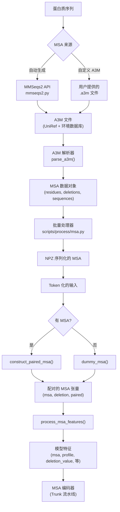

---
slug:17-msa-generation-and-integration
blog_type:normal
---

多序列比对（MSA）捕获了同源蛋白质序列间的进化保守模式，为 Boltz 提供了关键的进化信号，从而大幅提升了结构预测的准确性。本页详细介绍了在 Boltz 流水线中，MSA 是如何生成、解析、跨多聚体界面配对，并最终转换为模型可消费特征的。

## MSA 数据模型

MSA 子系统建立在三个紧密耦合的 NumPy 结构化数组类型之上，这些数组构成了比对的内部表示。**MSA** 对象聚合了三个数组：`residues` 存储每条序列中每个残基的 Token ID；`deletions` 捕获相对于查询序列的插入（在 A3M 格式中编码为小写字符）；`sequences` 通过每条序列的偏移量（`res_start`/`res_end`、`del_start`/`del_end`）以及用于跨链配对的 `seq_idx` 和 `taxonomy` 标识符，对这些扁平化数组进行索引。这种基于偏移量的扁平设计避免了嵌套的可变长度结构，并在特征化过程中实现了高效的向量化访问。

| 类型 | 关键字段 | 作用 |
|---|---|---|
| `MSAResidue` | 每个残基位置的 Token ID | 比对中的残基标识 |
| `MSADeletion` | `res_idx`、`deletion` 计数 | 相对于查询序列的插入 |
| `MSASequence` | `seq_idx`、`taxonomy`、`res_start/end`、`del_start/end` | 每条序列的切片索引 + 用于配对的分类信息 |

来源: [types.py](src/boltz/data/types.py#L1-L200), [featurizer.py](src/boltz/data/feature/featurizer.py#L1-L50)

## 通过 MMSeqs2 生成 MSA

Boltz 将 MSA 的生成委托给 **MMSeqs2** 搜索引擎，该引擎通过仿照 ColabFold 服务的远程 API 进行访问。`mmseqs2.py` 中的 `run_mmseqs2` 函数编排了整个生命周期：**提交**查询序列 → **轮询**作业状态 → **下载**生成的 A3M 文件压缩包。该 API 支持两种互斥的身份验证模式——HTTP 基本认证（`msa_server_username`/`msa_server_password`）和基于请求头的 API 密钥认证（`auth_headers`）。所有请求均通过 `User-Agent: boltz` 标识自身。

生成工作流具有几个重要的配置旋钮。当 `use_env=True` 时，搜索范围将扩展至环境数据库（BFD、MGNify、MetaEuk、SMAG），而不仅限于 UniRef，从而生成第二个 A3M 文件，该文件会在解析时合并。当 `use_pairing=True` 时，端点会切换至 `ticket/pair`，同时 `pairing_strategy` 参数可在 `greedy`（默认）和 `complete` 模式之间进行选择，以控制来自不同链的序列如何被共同比对。`use_filter` 标志用于开启或关闭 MMSeqs2 的内置结果过滤。错误处理机制非常稳健：每个网络操作最多重试 5 次，并采用指数退避策略；作业提交循环会处理 `UNKNOWN`、`RATELIMIT`、`MAINTENANCE` 和 `ERROR` 状态，并附带适当的延迟和重新提交逻辑。

<CgxTip>对于生产环境的部署，请始终将 `host_url` 配置为指向你自己的 MMSeqs2 服务器实例，而不是依赖公共的 ColabFold 端点。公共端点存在速率限制和维护窗口，在大规模使用时会导致间歇性故障。</CgxTip>

来源: [mmseqs2.py](src/boltz/data/msa/mmseqs2.py#L1-L287)

## A3M 解析

MMSeqs2 返回的原始 A3M 文件由 `parse_a3m` 解析为结构化的 `MSA` 对象。解析器逐行迭代，提取头部元数据（特别是当提供了分类数据库时的 UniRef 分类标识符），并逐字符处理序列数据。小写字符代表相对于查询序列的插入，会被计为缺失值，而不是被标记为残基。大写字符和缺口（`-`）通过 `const.prot_letter_to_token` 和 `const.token_ids` 映射到标准的 Boltz Token 词表。重复的序列（在移除缺口后）会被过滤掉，以避免冗余条目。

解析器强制执行 `max_seqs` 截断，限制输出 MSA 中保留的序列数量。这对于训练期间的内存管理至关重要，因为 MSA 可能包含数以万计的序列。该函数还支持 gzip 压缩的 A3M 文件（`.gz` 后缀），这是 MMSeqs2 针对大型环境数据库搜索的典型输出格式。

来源: [a3m.py](src/boltz/data/parse/a3m.py#L1-L135)

## 批量 MSA 处理

`scripts/process/msa.py` 脚本提供了一个命令行工具，用于将 A3M 文件批量转换为 Boltz 训练流水线所消费的压缩 NPZ 格式。它扫描输入目录中的 `*.a3m*` 文件，通过可选的 Redis 支持的分类数据库使用 `parse_a3m` 解析每个文件，并将结果写为 `.npz`。处理过程使用 `p_umap` 在 `--num-processes` 个工作进程（默认为所有 CPU 核心）间并行化。`--max-seqs` 参数（默认为 16384）控制每个 MSA 的序列上限，Redis 连接则通过 `--redis-host` 和 `--redis-port` 参数进行配置。

| 参数 | 默认值 | 用途 |
|---|---|---|
| `--msadir` | (必填) | A3M 文件的输入目录 |
| `--outdir` | `data` | NPZ 文件的输出目录 |
| `--num-processes` | CPU 核心数 | 并行工作进程数 |
| `--redis-host` | `localhost` | Redis 分类主机 |
| `--redis-port` | `7777` | Redis 分类端口 |
| `--max-seqs` | `16384` | 每个 MSA 的最大序列数 |

来源: [msa.py](scripts/process/msa.py#L1-L131)

## 多聚体的 MSA 配对

`construct_paired_msa` 函数是在复合物中跨多条链构建**配对 MSA** 的核心算法。其目标是对比对中的行进行对齐，使得来自不同链但共享相同分类（即来自同一生物体的直系同源物）的序列出现在同一行，从而为模型提供跨链界面的共进化信号。

该算法分四个阶段进行。**阶段 1** 构建一个 `taxonomy_map`，按分类标识符对 `(chain_id, seq_idx)` 对进行分组，过滤掉仅出现在一条链中的分类，并按其跨越的不同链数量对剩余分类进行排序（跨链数量最多的分类排在最前）。**阶段 2** 构建配对行：对于每个分类，它创建比对行，将来自同一生物体的序列放置在一起，缺失的链由未配对序列的 `available` 双端队列填充。**阶段 3** 从剩余序列中追加最多 `max_total`（16384）个未配对行。**阶段 4** 应用降采样——可以是确定性截断或随机子采样——降采样至 `max_seqs`。

对于**没有任何** MSA 数据的链（例如从头设计的蛋白质或非聚合物链），`dummy_msa` 函数会创建一个仅包含查询序列的最小 MSA，该 MSA 无缺失且 `taxonomy` 值为 `-1`，确保配对算法无需对这些链进行特殊处理即可生成有效输出。

<CgxTip>在处理多聚体复合物时，请确保你自定义的 MSA 在 UniRef 头部格式（`>UniRef100_<ID>`）中包含分类注释。如果没有分类信息，配对算法将无法识别跨链的直系同源物，并回退到仅未配对比对，这会降低界面预测的质量。</CgxTip>

来源: [featurizer.py](src/boltz/data/feature/featurizer.py#L118-L320)

## 从配对 MSA 到模型特征

`process_msa_features` 函数将配对后的 MSA 转换为模型的 MSA 编码器所消费的张量特征。在调用 `construct_paired_msa` 之后，它将结果从 `(N_tokens, N_seqs)` 转置为 `(N_seqs, N_tokens)`，并在 `const.num_tokens` 词表上应用独热编码。该过程还会计算几个派生特征：

- **Profile（分布特征）**：独热 MSA 在序列维度上的平均值，得到每个位置的氨基酸分布，捕获保守性统计信息。
- **Deletion value（缺失值）**：原始缺失计数通过 `π/2 · arctan(d/3)` 进行转换，这是一种平滑饱和函数，可防止极端的缺失计数占据主导地位。
- **Deletion mean（缺失均值）**：所有 MSA 序列中每个 Token 的平均缺失值。
- **Has deletion（存在缺失）**：每个（序列，Token）对应的二进制标志，指示是否存在任何插入。
- **MSA mask（MSA 掩码）**：用于追踪填充后有效条目的二进制掩码。

填充在两个维度上进行：MSA 深度维度（`pad_to_max_seqs`）和 Token 维度（`max_tokens`），其中 MSA 位置由缺口 Token 填充，掩码位置由零填充。

| 输出特征 | 形状 | 描述 |
|---|---|---|
| `msa` | `(max_seqs, max_tokens, num_tokens)` | 独热编码的 MSA 残基 |
| `msa_paired` | `(max_seqs, max_tokens)` | 二进制配对/未配对指示器 |
| `deletion_value` | `(max_seqs, max_tokens)` | 缩放后的缺失值 |
| `has_deletion` | `(max_seqs, max_tokens)` | 二进制缺失存在标志 |
| `deletion_mean` | `(max_tokens,)` | 每个位置的平均缺失 |
| `profile` | `(max_tokens, num_tokens)` | 保守性分布 |
| `msa_mask` | `(max_seqs, max_tokens)` | 有效条目掩码 |

来源: [featurizer.py](src/boltz/data/feature/featurizer.py#L897-L975)

## 端到端 MSA 流水线架构

完整的 MSA 流水线——从原始序列输入到模型就绪特征——遵循清晰的分层架构。下图说明了数据流以及负责每个转换阶段的主要模块。

来源: [mmseqs2.py](src/boltz/data/msa/mmseqs2.py#L1-L287), [a3m.py](src/boltz/data/parse/a3m.py#L1-L135), [featurizer.py](src/boltz/data/feature/featurizer.py#L118-L975), [msa.py](scripts/process/msa.py#L1-L131)

## 推理时的自定义 MSA 集成

Boltz 支持在推理时通过 YAML 输入格式使用用户提供的 MSA。当链定义中包含指向 A3M 文件的 `msa` 字段时，解析层会加载并处理该文件，而不是触发 MMSeqs2 生成。相反，在链配置中设置 `msa: false`（如 `prot_no_msa.yaml` 所示）会显式禁用该链的 MSA 生成，导致特征化器回退到 `dummy_msa`。这对于不存在有意义的同源物的蛋白质，或者希望在无需 MSA 生成步骤的情况下进行快速推理的场景非常有用。

关键的行为区别在于，**自定义 MSA 完全绕过了 MMSeqs2 API**，直接从 A3M 文件 → `parse_a3m` → `MSA` 对象 → 特征化。这意味着由用户控制比对的深度和质量。序列较少的浅层 MSA 会产生微弱的进化信号，而过于深层的 MSA 可能会在特征化期间被截断至 `max_seqs`。

来源: [featurizer.py](src/boltz/data/feature/featurizer.py#L91-L117), 示例见 [examples/](examples/)

## Numba 加速的内部循环

MSA 特征组装的内部循环——将 `(chain_id, seq_idx, res_idx)` 三元组映射到 Token 级别的残基类型和缺失值——是作为 Numba JIT 编译函数（`_prepare_msa_arrays_inner`）实现的。该函数遍历所有 `(token, pair)` 组合，使用从 `msa_sequences` 计算出的偏移量从扁平的 `msa_residues` 数组中查找残基类型，并填充 `msa_data`、`del_data` 和 `paired_data` 输出数组。此处的 Numba 编译至关重要：对于每个结构，可能存在数百万个 `(token × sequence)` 条目，纯 Python 循环将慢得令人无法接受。该函数使用显式的 Numba 类型签名进行装饰，以避免运行时类型推断的开销并启用缓存。

来源: [featurizer.py](src/boltz/data/feature/featurizer.py#L357-L430)

## 训练时的 MSA 子采样

在训练期间，`BoltzFeaturizer.process` 方法应用随机 MSA 深度子采样以提高泛化能力。当 `training=True` 时，`max_seqs_batch` 从 `[1, max_seqs]` 中均匀采样，这意味着每个训练步骤只能看到可用 MSA 深度的随机子集。这迫使模型对不同的 MSA 质量和深度保持鲁棒性，这对于某些蛋白质具有深度比对而另一些只有稀疏比对的现实推理场景至关重要。在推理时，`max_seqs_batch` 固定为 `max_seqs`，使用完整的可用比对。

来源: [featurizer.py](src/boltz/data/feature/featurizer.py#L1087-L1095)

---

**下一步**：要了解特征化后的 MSA 张量如何被模型消费，请参阅 [Trunk 和 Pairformer 流水线](8-trunk-and-pairformer-pipeline)。有关解析后的输入如何到达 MSA 子系统的详细信息，请参阅[解析与输入处理](12-parsing-and-input-handling)以及[特征化与特征工程](14-featurization-and-feature-engineering)。有关触发 MSA 生成的完整推理编排，请参阅[推理工作流与编排](16-inference-workflow-and-orchestration)。