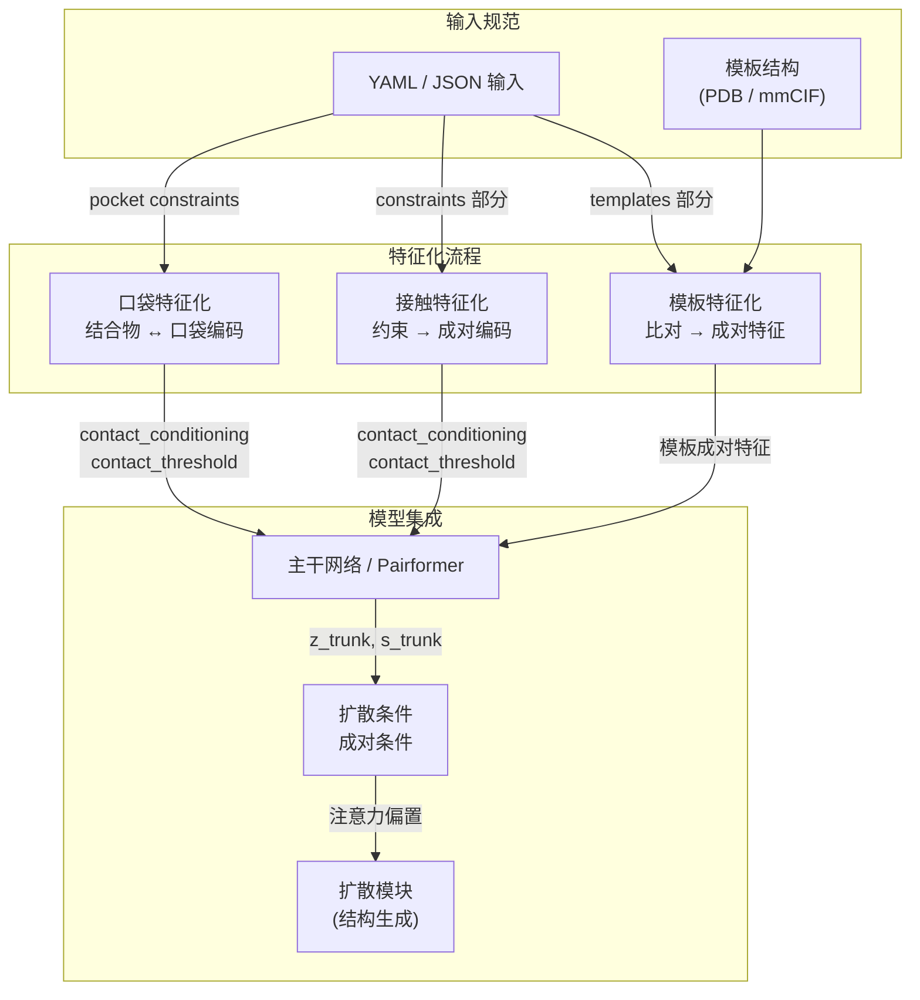

---
slug:19-template-and-contact-conditioning
blog_type:normal
---


Boltz 提供了两种强大的条件机制，允许你将结构先验和空间约束注入结构预测流程。**模板条件**利用已知的结构同源物来引导模型生成经实验验证的折叠结构，而**接触条件**则对残基或原子之间的成对距离施加约束——从而实现感知口袋的预测、链间接触引导以及针对性的结构精修。这两种机制相结合，将 Boltz 从一个纯粹的从头预测器转变为一个灵活的、约束驱动的设计引擎。

## 架构概述

模板条件和接触条件在 Boltz 流程的两个不同阶段运作：**特征化**（将原始约束编码为张量特征）和**扩散条件**（利用成对表示偏置生成过程）。下图展示了外部约束如何从输入规范流向模型的结构模块：



核心洞见在于，这两种条件模式最终都会生成**成对特征**，用于增强 `z_trunk` 的成对表示，随后该表示会通过 Pairformer 主干网络传播，并作为注意力偏置进入扩散模块。这种设计确保了结构约束能在计算的每一层影响模型——从粗粒度的 token 交互一直到原子级别的坐标生成。

来源: [featurizerv2.py](src/boltz/data/feature/featurizerv2.py#L600-L799), [diffusion_conditioning.py](src/boltz/model/modules/diffusion_conditioning.py#L1-L117), [types.py](src/boltz/data/types.py#L500-L699)

## 接触条件

接触条件允许你为输入结构中的 token 指定成对距离约束。Boltz 支持三种语义不同的条件类型，每种类型都编码为成对特征矩阵上的分类标签，并附带一个连续的距离阈值。

### 条件类型与语义

| 条件类型 | 常量键 | 方向性 | 用例 |
|---|---|---|---|
| **结合物 → 口袋** | `BINDER>POCKET` | 非对称（结合物侧） | 感知口袋的配体预测 |
| **口袋 → 结合物** | `POCKET>BINDER` | 非对称（口袋侧） | 面向结合物的口袋残基条件 |
| **接触** | `CONTACT` | 对称 | 通用成对距离约束 |
| **未选择** | `UNSELECTED` | 无 | 默认（无条件） |

口袋条件的非对称编码是有意为之的：它允许模型区分“结合物”角色（结构受约束的链）和“口袋”角色（定义约束的环境残基）。对于结合物链 `B` 和位于 token 索引 `i` 的口袋残基，特征化器会设置 `contact_conditioning[B, i] = BINDER>POCKET` 和 `contact_conditioning[i, B] = POCKET>BINDER`，从而创建一个模型可以利用的有向信号。对于一般的接触约束，两个方向都会接收对称的 `CONTACT` 标签。

来源: [featurizerv2.py](src/boltz/data/feature/featurizerv2.py#L660-L740), [const.py](src/boltz/data/const.py#L1-L200)

### 推理时的接触约束

在推理时，接触约束通过 `InferenceOptions` 数据类指定，该数据类包含两个可选的约束列表：`pocket_constraints` 和 `contact_constraints`。这些列表在解析期间由 YAML 输入的 `constraints` 部分填充。

**口袋约束**被定义为 `(binder_chain_id, contact_list, max_distance, force)` 元组，其中 `contact_list` 包含聚合物链的 `(chain_id, residue_index)` 对，或非聚合物链的 `(chain_id, atom_index)` 对。特征化逻辑会遍历所有 token，通过比较 `asym_id` 和 `res_idx`（针对聚合物）或 `asym_id` 和 `atom_idx`（针对非聚合物），将每个约束条目匹配到对应的 token 索引：

```python
# 口袋约束编码（简化版）
for binder, contacts, max_distance, force in inference_pocket_constraints:
    binder_mask = token_data["asym_id"] == binder
    for idx, token in enumerate(token_data):
        if (token["mol_type"] != NONPOLYMER and (token["asym_id"], token["res_idx"]) in contacts) \
           or (token["mol_type"] == NONPOLYMER and (token["asym_id"], token["atom_idx"]) in contacts):
            contact_conditioning[binder_mask, idx] = BINDER>POCKET
            contact_conditioning[idx, binder_mask] = POCKET>BINDER
            contact_threshold[binder_mask, idx] = max_distance
            contact_threshold[idx, binder_mask] = max_distance
```

**接触约束**遵循类似的模式，但在两个显式指定的 token 之间使用对称的 `CONTACT` 编码：`(token1, token2, max_distance, force)`，其中每个 token 由 `(chain_id, residue_index)` 或 `(chain_id, atom_index)` 标识。

<CgxTip>在指定口袋约束时，`force` 标志决定该约束是否覆盖这些 token 对上任何已有的条件。在训练模式下，约束是随机采样的——每个裁剪块中只有符合条件接触的几何分布子集被激活——因此模型能学会处理部分约束覆盖的情况。在推理时，所有指定的约束都会被确定性地应用。</CgxTip>

来源: [featurizerv2.py](src/boltz/data/feature/featurizerv2.py#L660-L740), [types.py](src/boltz/data/types.py#L524-L537)

### 训练时的接触增强

在训练期间，接触条件作为一种**随机增强**策略应用，由 `binder_pocket_conditioned_prop` 和 `contact_conditioned_prop` 控制。当 `binder_pocket_conditioned_prop > 0` 时，特征化器会随机选择一条结合物链（优先选择配体/非聚合物链，如果 `only_ligand_binder_pocket` 为 `False` 则回退到任意链），从 `[binder_pocket_cutoff_min, binder_pocket_cutoff_max]` 范围内的 1/d 分布中采样一个距离截断值，并将该截断距离内的所有残基标记为口袋接触点。

通过 `sample_d` 实现的 1/d 采样分布偏向于较小的截断距离，确保模型能看到更多紧密口袋的条件样本，而非松散口袋的样本。这一点至关重要，因为具有小截断值的口袋条件能提供更强的结构信号，模型必须学会有效地利用紧密约束。

来源: [featurizerv2.py](src/boltz/data/feature/featurizerv2.py#L740-L799), [featurizerv2.py](src/boltz/data/feature/featurizerv2.py#L76-L100)

### 接触的 YAML 输入格式

接触和口袋约束在 YAML 输入的 `constraints` 部分指定。以下示例演示了口袋约束的语法：

```yaml
# 口袋条件示例
sequences:
  - protein:
      id: A
      sequence: "MADQLTEEQIAEFKEAFSLF"
  - ligand:
      id: B
      smiles: "CC1=CC=CC=C1"
constraints:
  - pocket:
      binder: B
      contacts: [[A, 1], [A, 2], [A, 5]]
      max_distance: 6.0
```

对于任意 token 对之间的一般成对接触约束：

```yaml
constraints:
  - contact:
      token1: [A, 10]
      token2: [A, 45]
      max_distance: 8.0
```

口袋约束中的 `binder` 字段引用结合伴侣的链 ID，而 `contacts` 列出定义口袋的 `(chain_id, residue_index)` 对。`max_distance` 参数设置以埃为单位的距离阈值。

来源: [yaml.py](src/boltz/data/parse/yaml.py#L1-L69), [pocket.yaml](examples/pocket.yaml)

## 模板条件

模板条件允许 Boltz 将来自同源蛋白的已知结构信息纳入其预测中。模板是查询链和模板结构之间的**部分结构比对**，指定了查询的哪些区域与模板的哪些区域相对应。

### TemplateInfo 数据模型

模板规范的核心数据结构是 `TemplateInfo`，定义如下：

| 字段 | 类型 | 描述 |
|---|---|---|
| `name` | `str` | 模板标识符（文件名或 PDB ID） |
| `query_chain` | `str` | 查询序列中的链 ID |
| `query_st` | `int` | 查询比对的起始位置 |
| `query_en` | `int` | 查询比对的结束位置 |
| `template_chain` | `str` | 模板结构中的链 ID |
| `template_st` | `int` | 模板比对的起始位置 |
| `template_en` | `int` | 模板比对的结束位置 |
| `force` | `bool` | 是否无论得分如何都强制使用此模板 |
| `threshold` | `Optional[float]` | 最大比对得分阈值（默认：∞） |

每条 `TemplateInfo` 记录代表查询与模板之间的单个连续比对片段。`force` 标志和 `threshold` 参数控制比对搜索期间的模板选择——当 `force=True` 时，总是包含该模板；当 `threshold` 为有限值时，仅保留得分低于该阈值的比对。

`Target` 数据类将模板结构聚合为 `templates: Optional[dict[str, StructureV2]]`，将模板名称映射到其解析后的 `StructureV2` 对象。这意味着每个模板的完整原子结构都会被加载并可用于特征化。

来源: [types.py](src/boltz/data/types.py#L554-L567), [types.py](src/boltz/data/types.py#L580-L600)

### 模板比对流程

模板记录通过两种比对策略生成：**基于搜索的**和**基于匹配的**。

**基于搜索的比对**（`get_template_records_from_search`）使用 BLASTP 全局比对计算所有查询链和所有模板链之间的完整成对得分矩阵，然后通过**匈牙利算法**（带 `maximize=True` 的 `linear_sum_assignment`）求解最优链分配。这确保了当多个查询链可以匹配多个模板链时，能获得最佳的总体映射。对于每个分配的对，使用避隙成对比对（空位罚分：-1000）提取局部比对，以识别连续的匹配片段。

**基于匹配的比对**（`get_template_records_from_matching`）假设查询链和模板链之间存在预先确定的对应关系（按顺序 1:1 映射），并且仅计算每个匹配对的局部比对。当用户明确指定哪个模板链映射到哪个查询链时，将使用此方法。

这两种策略都会生成包含 `(query_st, query_en, template_st, template_en)` 坐标对的 `Alignment` 记录，用于描绘比对区域：

```python
@dataclass(frozen=True)
class Alignment:
    query_st: int       # 查询序列中的起始位置
    query_en: int       # 查询序列中的结束位置
    template_st: int    # 模板序列中的起始位置
    template_en: int    # 模板序列中的结束位置
```

比对流程使用 BioPython 的 `PairwiseAligner` 与 BLASTP 评分，用于全局（链分配）和局部（片段提取）模式。局部比对极高的空位罚分（开放和扩展均为 -1000）强制执行近乎无空隙的比对，从而产生干净的连续片段。

来源: [schema.py](src/boltz/data/parse/schema.py#L468-L556), [schema.py](src/boltz/data/parse/schema.py#L556-L600), [schema.py](src/boltz/data/parse/schema.py#L438-L468)

### 模板的 YAML 输入格式

模板在 YAML 输入的 `templates` 部分指定。每个模板条目提供结构文件的路径，并可选地限制应应用模板的链：

```yaml
sequences:
  - protein:
      id: A
      sequence: "MADQLTEEQIAEFKEAFSLF"
  - protein:
      id: B
      sequence: "AKLSILPWGHC"
templates:
  - path: /path/to/template.pdb
    ids: [A]       # 可选：仅将模板应用于链 A
```

当省略 `ids` 时，将考虑为所有链应用该模板。解析器加载模板结构（PDB 或 mmCIF），提取链序列，并运行比对流程以生成附加到 `Target` 对象的 `TemplateInfo` 记录。

来源: [yaml.py](src/boltz/data/parse/yaml.py#L1-L69)

### 模板特征集成

一旦模板结构被加载和比对，它们就会在特征化过程中被集成到模型的成对表示中。模板 `StructureV2` 提供了编码同源结构空间布局的原子坐标。对于每个比对片段，特征化器从模板坐标中提取距离和方向特征，并将它们注入成对特征矩阵，从而增强馈入主干网络的成对表示 `z`。

此过程确保了模板信息可用于每一个 Pairformer 层——而不仅仅是初始嵌入——允许模型在整个迭代精修过程中保持与模板的结构一致性。模板特征与相对位置编码及主干网络的成对注意力机制交互，创建了一种软结构先验而非硬性约束。

来源: [types.py](src/boltz/data/types.py#L580-L600), [featurizerv2.py](src/boltz/data/feature/featurizerv2.py#L600-L799)

## 扩散模块中的条件

模板条件和接触条件最终都通过 **DiffusionConditioning** 模块影响结构生成。该模块接收主干网络中的成对表示 `z_trunk` 和单一表示 `s_trunk`，通过 `PairwiseConditioning` 子模块（包含相对位置编码）处理它们，然后为三个下游消费者生成注意力偏置：

| 偏置输出 | 目标模块 | 用途 |
|---|---|---|
| `atom_enc_bias` | 原子编码器层 | 将原子级注意力偏向条件对 |
| `atom_dec_bias` | 原子解码器层 | 使用约束引导原子坐标生成 |
| `token_trans_bias` | Token Transformer 层 | 通过 token 级精修传播条件 |

每种偏置都是通过逐层的 `LayerNorm → Linear` 头投影条件化的成对表示 `z` 生成的，从 `token_z` 维度映射到注意力头的数量。这些偏置是注意力计算中的加性信号，允许模型更强烈地关注携带模板或接触信息的 token 对，而不会破坏无约束区域的已学习注意力模式。

<CgxTip>这三个偏置流服务于不同的空间尺度：`token_trans_bias` 在粗粒度的 token 级别运作（每个残基对一个偏置），而 `atom_enc_bias` 和 `atom_dec_bias` 在细粒度的原子级别运作（从相同的成对表示投影，但在原子级交叉注意力期间应用）。这种多尺度注入确保了约束从残基层级一直传播到单个原子坐标。</CgxTip>

来源: [diffusion_conditioning.py](src/boltz/model/modules/diffusion_conditioning.py#L80-L117), [diffusion_conditioning.py](src/boltz/model/modules/diffusion_conditioning.py#L47-L78)

## 比较总结

下表总结了模板条件和接触条件在整个流程中的关键设计差异：

| 维度 | 模板条件 | 接触条件 |
|---|---|---|
| **信息来源** | 同源 3D 结构 | 用户指定的距离约束 |
| **输入格式** | 包含路径 + 链 ID 的 `templates:` 部分 | 包含口袋/接触规范的 `constraints:` 部分 |
| **比对** | BLASTP + 匈牙利分配 | 直接 token 映射 |
| **空间编码** | 完整原子坐标 → 距离特征 | 成对分类 + 阈值编码 |
| **方向性** | 对称（两条链共享结构信息） | 口袋非对称，接触对称 |
| **训练增强** | 不适用（模板是输入特定的） | 带 1/d 截断采样的随机采样 |
| **推理行为** | 确定性（使用所有比对片段） | 确定性（应用所有指定约束） |
| **模型路径** | 成对特征 → z_trunk → 注意力偏置 | contact_conditioning → z_trunk → 注意力偏置 |

这两种机制汇聚于相同的下游路径——增强流经主干网络并进入扩散模块的成对表示——但它们在条件信号的推导和编码方式上存在根本差异。

来源: [featurizerv2.py](src/boltz/data/feature/featurizerv2.py#L600-L799), [diffusion_conditioning.py](src/boltz/model/modules/diffusion_conditioning.py#L1-L117), [types.py](src/boltz/data/types.py#L524-L600)

## 实践指导

**何时使用模板条件**：当具有已知折叠的同源结构可用时，请使用模板。模板对于 MSA 深度低但具有已知结构同源物的蛋白质影响最大，在这种情况下，模板提供了 MSA 无法提供的折叠级信息。应设置 `threshold` 参数以过滤掉可能引入噪声的弱比对模板。

**何时使用接触条件**：当你拥有实验性或预测的残基间距离信息（例如，来自交联质谱、NMR NOE 约束或共进化接触预测）时，请使用接触约束。口袋条件专为配体结合场景设计，在这些场景中，结合位点残基已知但配体姿态未知。

**结合使用**：模板条件和接触条件可以同时使用。模板提供全局折叠信息，而接触约束提供局部距离限制。模型通过相同的成对表示处理两者，因此它们可以自然组合而不会发生冲突。

要深入了解条件化的成对特征如何流经模型，请参阅[主干网络与 Pairformer 流程](8-trunk-and-pairformer-pipeline)和[基于扩散的结构模块](9-diffusion-based-structure-module)。有关生成这些特征的特征化细节，请参考[特征化与特征工程](14-featurization-and-feature-engineering)。有关通过基于能量的势函数引导扩散过程的互补机制，请参见[引导势与指引](18-steering-potentials-and-guidance)。