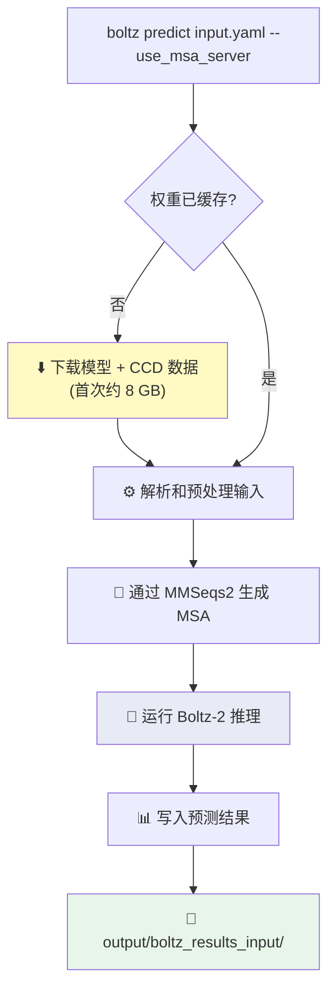

---
slug:2-quick-start
blog_type:normal
---


在几分钟内从零开始完成你的首次生物分子结构预测。本页将引导你安装 Boltz、准备首次输入、运行预测并解读输出——这是你日常使用 Boltz 的核心工作流。


## 前提条件

Boltz 需要 **Python ≥3.10 且 <3.13**、支持 CUDA 的 GPU（强烈推荐），以及约 8 GB 的磁盘空间用于存储模型权重和化学组分数据。纯 CPU 路径虽然可行，但运行速度会显著减慢，因此对于交互式使用而言，访问 GPU 是实际的基线要求。

来源: [pyproject.toml](/pyproject.toml#L8-L9), [README.md](/README.md#L30-L31)

## 安装 Boltz

推荐的安装方式是通过 PyPI 安装到一个**全新的 Python 环境**中。`[cuda]` 扩展项会安装 NVIDIA 的 `cuequivariance` 内核，这些内核能够加速 Boltz Pairformer 核心中的三角注意力操作：

```bash
# 推荐：通过 PyPI 安装并启用 CUDA 加速
pip install boltz[cuda] -U
```

如果你需要绝对最新的更改或想要贡献代码，请直接从源码安装：

```bash
git clone https://github.com/jwohlwend/boltz.git
cd boltz
pip install -e .[cuda]
```

对于纯 CPU 或非 NVIDIA GPU 硬件，只需在任一命令中省略 `[cuda]` 即可。安装完成后，`boltz` 命令行工具即可使用——它被注册为一个指向 [src/boltz/main.py](/src/boltz/main.py#L68) 的控制台脚本：

```bash
boltz --help
```

<CgxTip>在较旧的 NVIDIA GPU 上，`cuequivariance` 内核可能无法编译。如果你遇到相关错误，请使用 `--no_kernels` 标志运行预测以禁用它们，并回退到纯 PyTorch 操作。</CgxTip>

来源: [pyproject.toml](/pyproject.toml#L66-L70), [pyproject.toml](/pyproject.toml#L56-L64), [README.md](/README.md#L29-L37)

## 准备输入

Boltz 接受 **YAML 文件**（首选）或 FASTA 文件（已弃用，功能受限）作为输入。YAML 文件用于描述复合物中的链——蛋白质、DNA、RNA 和配体——以及可选的约束、模板和属性请求（如结合亲和力）。

整体的推理流水线从你的输入文件开始，依次流经预处理、模型推理和输出写入：


以下是最常见的输入模式，直接取自项目的示例文件：

| 用例 | 输入文件 | 关键模式 |
|---|---|---|
| 单一蛋白质 | `prot.yaml` | 一个带有 `id` 和 `sequence` 的 `protein` 条目 |
| 蛋白质 + 配体 (CCD) | `ligand.yaml` | 带有 `ccd` 代码（如 `SAH`）的 `ligand` 条目 |
| 蛋白质 + 配体 (SMILES) | `ligand.yaml` | 带有 `smiles` 字符串的 `ligand` 条目 |
| 蛋白质多聚体 | `multimer.yaml` | 多个 `protein` 条目，每个都有唯一的 `id` |
| 结合亲和力 | `affinity.yaml` | `properties` → `affinity` 并指定 `binder` 链 ID |
| 口袋条件化 | `pocket.yaml` | `constraints` → `pocket` 并指定 `binder` 和 `contacts` |
| 环状蛋白质 | `cyclic_prot.yaml` | 在 `protein` 条目上设置 `cyclic: true` |
| 自定义 MSA | `prot_custom_msa.yaml` | 在 `protein` 条目上设置 `msa: path/to/file.a3m` |
| 无 MSA（单序列） | `prot_no_msa.yaml` | 在 `protein` 条目上设置 `msa: empty` |

### 最简蛋白质示例

最简单的输入——一条单一蛋白质链：

```yaml
# prot.yaml
version: 1
sequences:
  - protein:
      id: A
      sequence: QLEDSEVEAVAKGLEEMYANGVTEDNFKNYVKNNFAQQEISSVEEELNVNISDSCVANKIKDEFFAMISISAIVKAAQKKAWKELAVTVLRFAKANGLKTNAIIVAGQLALWAVQCG
```

来源: [examples/prot.yaml](/examples/prot.yaml#L1-L7), [examples/ligand.yaml](/examples/ligand.yaml#L1-L13), [examples/multimer.yaml](/examples/multimer.yaml#L1-L9), [examples/affinity.yaml](/examples/affinity.yaml#L1-L12), [examples/pocket.yaml](/examples/pocket.yaml#L1-L13), [examples/cyclic_prot.yaml](/examples/cyclic_prot.yaml#L1-L8)

### 带亲和力的蛋白质-配体复合物

一个更贴近实际的场景：预测与蛋白质结合的小分子结构并计算其结合亲和力。此示例结合了蛋白质链、由 SMILES 定义的配体以及亲和力属性声明：

```yaml
# affinity.yaml
version: 1
sequences:
  - protein:
      id: A
      sequence: MVTPEGNVSLVDESLLVGVTDEDRAVRSAHQFYERLIGLWAPAVMEAAHELGVFAALAEAPADSGELARRLDCDARAMRVLLDALYAYDVIDRIHDTNGFRYLLSAEARECLLPGTLFSLVGKFMHDINVAWPAWRNLAEVVRHGARDTSGAESPNGIAQEDYESLVGGINFWAPPIVTTLSRKLRASGRSGDATASVLDVGCGTGLYSQLLLREFPRWTATGLDVERIATLANAQALRLGVEERFATRAGDFWRGGWGTGYDLVLFANIFHLQTPASAVRLMR
  - ligand:
      id: B
      smiles: 'N[C@@H](Cc1ccc(O)cc1)C(=O)O'
properties:
  - affinity:
      binder: B
```

`properties` 部分告诉 Boltz 在结构预测的同时运行亲和力预测头。`binder` 字段标识哪条链是配体——此处为链 `B`。

<CgxTip>对于配体，你可以使用 `smiles`（用于自定义分子）或 `ccd`（用于化学组分字典中的组件，如 `SAH`、`ATP`），但不能同时使用两者。当你有多个相同的副本时，请使用 ID 列表，如 `id: [C, D]`。</CgxTip>

来源: [examples/affinity.yaml](/examples/affinity.yaml#L1-L12), [examples/ligand.yaml](/examples/ligand.yaml#L1-L13), [docs/prediction.md](/docs/prediction.md#L1-L46)

## 运行首次预测

核心命令是 `boltz predict`。至少需要提供输入路径并启用 MSA 自动生成：

```bash
boltz predict examples/prot.yaml --use_msa_server
```

在首次运行时，Boltz 会将模型权重和 CCD 数据下载到 `~/.boltz`（或由 `BOLTZ_CACHE` 环境变量设置的路径）中。后续运行会自动复用这些缓存的产物。



### 核心 CLI 选项

`predict` 命令暴露了许多调节参数，但初期只需关注以下几个：

| 选项 | 默认值 | 用途 |
|---|---|---|
| `--use_msa_server` | `False` | 通过 MMSeqs2 **自动生成 MSA**（推荐大多数用户使用） |
| `--out_dir` | `./` | 输出的根目录；结果将存入 `<out_dir>/boltz_results_<input_stem>/` |
| `--model` | `boltz2` | 选择 `boltz1` 或 `boltz2` 模型 |
| `--devices` | `1` | 使用的 GPU 数量 |
| `--recycling_steps` | `3` | 步数越多 → 精度越高，速度越慢 |
| `--diffusion_samples` | `1` | 生成的结构样本数 |
| `--sampling_steps` | `200` | 每个结构的扩散采样步数 |
| `--step_scale` | `1.5` (Boltz-2) | 控制多样性；数值越低越多样（范围 1–2） |
| `--override` | `False` | 即使输出已存在也重新运行预测 |
| `--output_format` | `mmcif` | 输出结构格式：`mmcif` 或 `pdb` |
| `--use_potentials` | `False` | 应用导向势以提升物理合理性 |

若要获得更高质量的预测（以运行时间为代价），可以仿照 AlphaFold3 风格的设置：

```bash
boltz predict input.yaml --use_msa_server \
  --recycling_steps 10 --diffusion_samples 25
```

对于批处理，可以指向一个包含 YAML 文件的目录，而不是单个文件：

```bash
boltz predict examples/ --use_msa_server
```

来源: [src/boltz/main.py](/src/boltz/main.py#L785-L1002), [docs/prediction.md](/docs/prediction.md#L140-L169), [README.md](/README.md#L39-L44)

## 理解输出

成功运行后，输出目录遵循一个可预测的结构：

```
boltz_results_<input_name>/
├── predictions/
│   └── <input_name>/
│       ├── <input_name>_model_0.cif          # 预测结构（按置信度排名）
│       ├── confidence_<input_name>_model_0.json
│       ├── affinity_<input_name>.json        # （如果请求了亲和力）
│       ├── plddt_<input_name>_model_0.npz
│       ├── pae_<input_name>_model_0.npz      # （如果使用了 --write_full_pae）
│       └── ...
├── processed/                                 # 缓存的预处理数据
└── lightning_logs/                            # 内部日志
```

### 置信度分数

`confidence_*.json` 文件包含关键的质量指标。除 PDE 外（越低 Å 越好），所有分数的值越高（0–1 范围）表示置信度越高：

| 分数 | 含义 |
|---|---|
| `confidence_score` | **整体排名指标**：0.8 × complex_plddt + 0.2 × iptm |
| `ptm` | 整个复合物的预测 TM-score |
| `iptm` | 链界面处的预测 TM-score |
| `complex_plddt` | 整个复合物的平均逐 token 置信度 (pLDDT) |
| `complex_pde` | 以 Å 为单位的平均预测距离误差（越低越好） |

### 亲和力分数

当请求亲和力时，`affinity_*.json` 包含两种用于不同目的的独立预测：

| 字段 | 范围 | 用例 |
|---|---|---|
| `affinity_probability_binary` | 0–1 | **结合物检测** —— 配体结合的概率（用于命中发现） |
| `affinity_pred_value` | ~−3 至 +2 | **亲和力排名** —— 已知结合物之间的相对结合强度（用于先导化合物优化） |

`affinity_pred_value` 近似于 log₁₀(IC50)：值为 −3 对应约 1 nM（强结合物），0 对应约 1 μM（中等），+2 对应约 100 μM（弱结合物）。可使用 `y → (6 − y) × 1.364` 转换为以 kcal/mol 为单位的 pIC50。

来源: [docs/prediction.md](/docs/prediction.md#L200-L265), [src/boltz/data/write/writer.py](/src/boltz/data/write/writer.py#L1-L1)

## 常见工作流一览

下表将实际场景映射到你需要运行的具体命令：

| 目标 | 命令 |
|---|---|
| 单一蛋白质结构 | `boltz predict prot.yaml --use_msa_server` |
| 蛋白质-配体复合物 | `boltz predict ligand.yaml --use_msa_server` |
| 结合亲和力预测 | `boltz predict affinity.yaml --use_msa_server` |
| 蛋白质-蛋白质多聚体 | `boltz predict multimer.yaml --use_msa_server` |
| 环状肽 | `boltz predict cyclic_prot.yaml --use_msa_server` |
| 口袋条件化配体姿态 | `boltz predict pocket.yaml --use_msa_server --use_potentials` |
| 自定义 MSA（不使用服务器） | `boltz predict prot_custom_msa.yaml` |
| 改用 Boltz-1 模型 | `boltz predict prot.yaml --use_msa_server --model boltz1` |
| 批量输入目录 | `boltz predict examples/ --use_msa_server` |

来源: [examples/prot.yaml](/examples/prot.yaml#L1-L7), [examples/ligand.yaml](/examples/ligand.yaml#L1-L13), [examples/affinity.yaml](/examples/affinity.yaml#L1-L12), [examples/multimer.yaml](/examples/multimer.yaml#L1-L9), [examples/pocket.yaml](/examples/pocket.yaml#L1-L13), [examples/cyclic_prot.yaml](/examples/cyclic_prot.yaml#L1-L8), [src/boltz/main.py](/src/boltz/main.py#L970-L972)

## 故障排除快速参考

| 问题 | 解决方案 |
|---|---|
| 在旧 GPU 上出现 `cuequivariance` 内核错误 | 添加 `--no_kernels` 标志 |
| 缺少 MSA 错误 | 添加 `--use_msa_server` 或在 YAML 中提供 `msa:` 路径 |
| "Existing predictions found, skipping" | 添加 `--override` 重新运行 |
| CPU 运行缓慢 | 尽可能切换到 GPU；否则减少 `--recycling_steps` 和 `--sampling_steps` |
| 需要 MMSeqs2 认证 | 设置 `BOLTZ_MSA_USERNAME`/`BOLTZ_MSA_PASSWORD` 环境变量或使用 `--api_key_value` |
| 想要更改缓存位置 | 将 `BOLTZ_CACHE` 环境变量设置为绝对路径，或使用 `--cache` 标志 |

来源: [docs/prediction.md](/docs/prediction.md#L332-L346), [src/boltz/main.py](/src/boltz/main.py#L236-L250), [src/boltz/main.py](/src/boltz/main.py#L1103-L1105)

## 接下来去哪

你现在已安装了 Boltz 并能运行预测。顺理成章的下一步是深入理解输入格式，以便你能够对任何生物分子系统进行建模：

- **[输入格式指南](3-input-format-guide)** —— 完整的 YAML 架构参考，涵盖约束、模板、修饰和亲和力配置
- **[架构概览](7-architecture-overview)** —— 了解 Boltz 如何在内部处理你的输入，从序列化到扩散再到置信度评分
- **[推理工作流与编排](16-inference-workflow-and-orchestration)** —— 深入探讨预测流水线、缓存和多 GPU 编排

