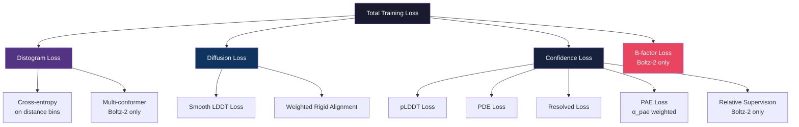
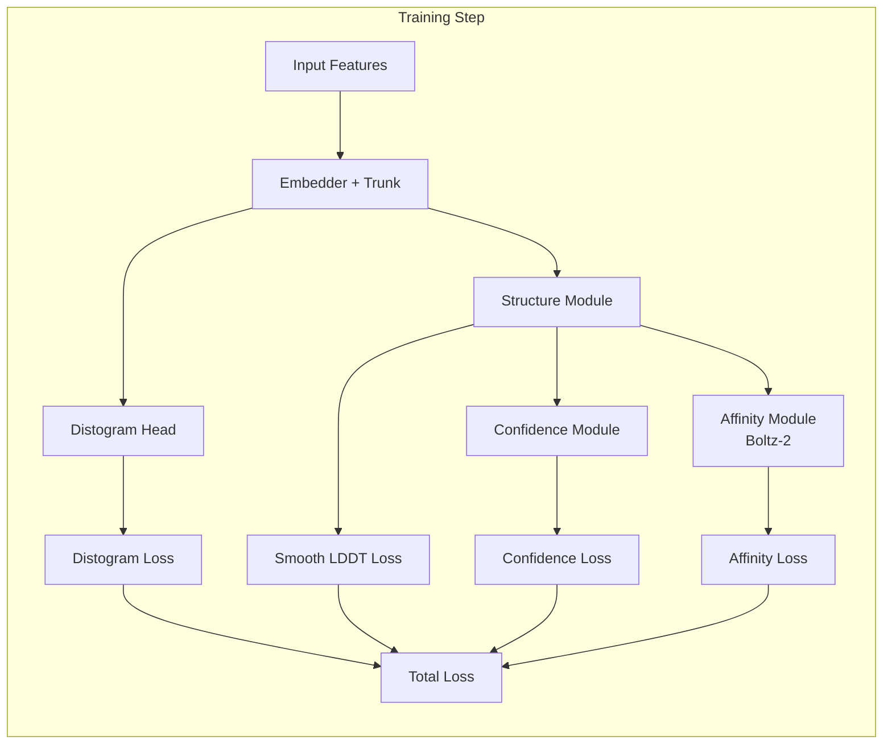

---
slug:20-loss-functions-and-validation
blog_type:normal
---


Boltz 采用多组件损失架构，联合监督结构生成、置信度校准和距离预测。每种损失函数都针对模型输出的不同方面，它们共同构成了一个训练信号，既能生成精确的 3D 坐标，也能输出可靠的自评估质量估计。本页将系统地探讨每个损失函数、评估时使用的验证指标，以及这些系统在 Boltz-1 和 Boltz-2 之间的差异。

## 损失架构概述

Boltz 的训练目标并非单一标量，而是由四个独立的损失家族组合而成，每个家族控制着不同的模型头。**扩散损失**监督结构模块的去噪轨迹。**距离分布损失**训练成对距离预测头。**置信度损失**校准 pLDDT、PDE、PAE 和解析度预测。**B因子损失**（仅限 Boltz-2）监督逐 token 的 B因子预测。这些损失在不同的表示和粒度上运作，但它们共享一个共同的设计理念：尽可能按分子模态（蛋白质、DNA、RNA、配体）对指标进行分解，以确保不同结构类型之间的监督平衡。



置信度损失本身可分解为多个子损失，每个子损失都有独立的目标，该目标通过比较预测结构和真实结构得出。Boltz-1 和 Boltz-2 中的 `confidence_loss` 函数会聚合这些组件，并返回总损失和用于记录的详细分解。

来源: [confidence.py](/src/boltz/model/loss/confidence.py#L1-L62), [boltz1.py](/src/boltz/model/models/boltz1.py#L1-L200)

## 扩散损失：平滑 LDDT 与刚体对齐

结构模块通过扩散过程进行训练，该过程学习对受损的原子坐标进行去噪。监督此过程的损失是**平滑 LDDT 损失**，它衡量预测的原子间距离与真实值的匹配程度。与基于 RMSD 的损失不同，平滑 LDDT 对局部对称性歧义具有鲁棒性，因为它基于成对距离差进行计算，而非绝对的坐标偏移。

### 加权刚体对齐

在计算扩散损失之前，预测坐标会通过**加权刚体对齐**与真实坐标对齐——这是一种 Kabsch 风格的算法，用于寻找最小化加权偏差平方和的最优旋转和平移。该对齐使用从原子掩码派生的逐原子权重，其实现遵循 AlphaFold3 附录的算法 28（注意对原始伪代码中预测/真实值交换的修正）。中心化点云之间的协方差矩阵通过 SVD 分解，并通过在最后一个奇异向量上应用修正因子来强制生成正规旋转矩阵（行列式 = +1）。

```python
# 核心对齐逻辑（简化版）
cov_matrix = einsum(weights * pred_centered, true_centered, "b n i, b n j -> b i j")
U, S, V = torch.linalg.svd(cov_matrix)
rot_matrix = einsum(U, F, V, "b i j, b j k, b l k -> b i l")
aligned_coords = einsum(true_centered, rot_matrix, "b n i, b j i -> b n j") + pred_centroid
```

对齐后的坐标会从计算图中分离——它们仅用于定位损失曲面，而非通过对齐过程本身传播梯度。

来源: [diffusion.py](/src/boltz/model/loss/diffusion.py#L9-L110), [diffusionv2.py](/src/boltz/model/loss/diffusionv2.py#L7-L123)

### 平滑 LDDT 损失

平滑 LDDT 损失计算预测坐标与真实坐标之间的局部距离差异测试。对于距离截断范围内的每对原子，计算其绝对距离差，并将其通过 0.5Å、1.0Å、2.0Å 和 4.0Å 四个 Sigmoid 阈值。这些 Sigmoid 值的平均值产生了离散 LDDT 分数的平滑且可微的近似。该损失定义为 `1 - mean(lddt)`，因此最小化损失即最大化结构一致性。

截断距离**取决于分子模态**：核酸对使用 30Å 截断距离，而其他所有对使用 15Å。这考虑了核酸扩展的构象范围。当扩散多重性 > 1（每个训练样本有多个去噪样本）时，在计算最终损失之前，LDDT 分数会在多重性维度上取平均值。

| 参数 | Boltz-1 | Boltz-2 |
|---|---|---|
| 核酸截断距离 | 30.0Å | 30.0Å |
| 其他截断距离 | 15.0Å | 15.0Å |
| Sigmoid 阈值 | 0.5, 1.0, 2.0, 4.0 | 0.5, 1.0, 2.0, 4.0 |
| 成对距离 | `torch.cdist`（完整矩阵） | `F.pairwise_distance`（稀疏，仅限有效对） |
| 多重性处理 | 重塑 + 在多重性维度上取平均 | 逐样本循环 + 堆叠 |

Boltz-2 通过仅提取有效对（通过掩码的对）并通过 `F.pairwise_distance` 稀疏计算成对距离，而不是构建完整的 N×N 距离矩阵，从而优化了平滑 LDDT 的计算。这减少了大型结构的内存占用。

来源: [diffusion.py](/src/boltz/model/loss/diffusion.py#L113-L172), [diffusionv2.py](/src/boltz/model/loss/diffusionv2.py#L126-L140)

## 距离分布损失

距离分布头预测 token 间距离的离散概率分布。该损失是预测的 log-softmax 分布与按距离区间分箱的目标分布之间的**交叉熵**。目标会被掩码处理以排除填充 token 和自配对（对角线），并且损失通过有效 token 对的数量进行归一化。

### Boltz-1 距离分布

在 Boltz-1 中，距离分布是每个 token 对的单一预测分布。目标是从真实 token 间距离派生出的独热编码箱索引。该损失计算在箱维度上的 `-sum(target * log_softmax(pred))`，然后对有效对和批次样本取平均。

### Boltz-2 多构象距离分布

Boltz-2 扩展了距离分布以支持真实值中的**多种构象**（形状为 `B × L × L × K × bins`，其中 K 为构象数量）。存在两种聚合策略：

- **聚合模式**（`aggregate_distogram=True`）：将 K 个构象分布求和并归一化为单一目标分布。这将多构象信息折叠为边缘分布，并针对单一预测距离分布应用标准交叉熵。
- **逐构象模式**（`aggregate_distogram=False`）：将每个构象的目标与所有 D 个预测距离分布进行比较。每个构象的损失取预测距离分布中的最小值（最佳匹配），然后跨构象取平均。这种匈牙利风格的匹配允许模型将不同的预测头分配给不同的构象。

<CgxTip>当 `aggregate_distogram=False` 时，该损失执行隐式分配：每个真实构象通过 `torch.min(batch_loss, dim=-1)` 与其最接近的预测距离分布进行匹配。这对于在同时存在多种有效构象的结构集成中进行训练至关重要。</CgxTip>

来源: [distogram.py](/src/boltz/model/loss/distogram.py#L1-L49), [distogramv2.py](/src/boltz/model/loss/distogramv2.py#L1-L106)

## 置信度损失

置信度模块产生四种预测——pLDDT、PDE、PAE 和解析状态——每种都有其对应的损失函数。总置信度损失是它们的总和（其中 PAE 由 `alpha_pae` 加权）。Boltz-2 额外引入了**相对置信度监督**，用于比较扩散样本间的置信度估计。

### pLDDT 损失

预测 LDDT（pLDDT）损失训练模型预测逐原子（或在 Boltz-2 中为逐 token）的 LDDT 分数。目标 LDDT 通过比较代表原子及其 R-set 邻域的预测距离与真实距离来计算。连续的 LDDT 目标被离散化为多个箱，该损失是独热箱索引与预测 logits 之间的交叉熵。

目标计算使用了一个精心构建的掩码系统：`R_set_to_rep_atom` 映射扩展了邻域上下文，`cutoff` 变量调整包含核苷酸对的距离阈值（15Å 基础值 + 核苷酸对的 15Å 额外值，即 30Å）。`mask_no_match` 标志用于识别没有有效邻域的原子，这些原子将从损失中被排除。

### PDE 损失

预测距离误差（PDE）损失监督成对距离误差预测。目标是真实和预测的 token 间距离的绝对差值：`|true_d - pred_d|`。此连续目标在 32Å 的最大距离范围内被分入 `num_bins` 个箱中，该损失是针对预测 PDE logits 的交叉熵。对掩码用于排除自配对和未解析的原子。

### PAE 损失

预测对齐误差（PAE）损失是最复杂的置信度子损失。它衡量在局部参考系中表示 token 位置时的误差。对于每个 token，其局部坐标系由三个原子 定义。真实坐标和预测坐标都被投影到各自的坐标系中，PAE 目标是坐标系投影位置之间的欧几里得距离。这需要 `compute_frame_pred` 函数，该函数根据预测坐标调整非聚合物链的坐标系原子索引（因为在对称性下配体原子排序可能不同）。

PAE 损失由 `alpha_pae` 控制——当设置为 0.0（许多配置中的默认值）时，PAE 损失将被完全跳过，从而降低计算成本。启用时，它在总损失中由 `alpha_pae` 加权。

### 解析度损失

解析度预测头是一个二分类器，用于预测每个 token 的代表原子在实验结构中是否被解析。该损失是逐 token 的交叉熵：目标派生自通过 `token_to_rep_atom` 映射到 token 的 `true_coords_resolved_mask`。已解析的 token 目标类别为 0，未解析的目标类别为 1。

### Boltz-2 相对置信度监督

Boltz-2 引入了一种新颖的**相对置信度监督**机制。当 `relative_supervision_weight > 0` 时，模型预测相对置信度 logits（`relative_plddt_logits`、`relative_pde_logits`、`relative_pae_logits`），以捕获扩散样本之间置信度的*差异*。相对 pLDDT 的目标计算为跨多重性维度的目标 LDDT 值的成对差异：

```python
relative_target = target_lddt.view(B//M, M, 1, -1) - target_lddt.view(B//M, 1, M, -1)
```

此相对目标被分入 `2 * num_bins - 1` 个箱中（以适应正负差异），该损失是带有适当掩码的交叉熵。总相对损失由 `relative_supervision_weight` 加权，并添加到置信度目标中。

| 损失组件 | 目标 | 分箱 | Boltz-1 | Boltz-2 |
|---|---|---|---|---|
| pLDDT | 逐原子 LDDT | `floor(lddt * num_bins)` | ✓ | ✓（token 级别选项） |
| PDE | `\|true_d - pred_d\|` | `floor(error * num_bins / max_dist)` | ✓ | ✓ |
| PAE | 坐标系投影距离 | `floor(error * num_bins / max_dist)` | ✓（α 加权） | ✓（α 加权） |
| 解析度 | 二进制解析掩码 | 2 类 softmax | ✓ | ✓（原子或 token 级别） |
| 相对 pLDDT | 样本间 LDDT 差异 | 有符号 `2*num_bins-1` | ✗ | ✓ |
| 相对 PDE | 样本间 PDE 差异 | 有符号分箱 | ✗ | ✓ |
| 相对 PAE | 样本间 PAE 差异 | 有符号分箱 | ✗ | ✓ |

<CgxTip>Boltz-2 置信度损失中的 `mask_loss` 参数支持逐样本损失掩码，允许训练流水线从置信度监督中排除某些结构（例如蒸馏数据），同时仍将它们用于结构训练。这通过从数据模块传递的 `mask_loss` 参数进行控制。</CgxTip>

来源: [confidence.py](/src/boltz/model/loss/confidence.py#L1-L591), [confidencev2.py](/src/boltz/model/loss/confidencev2.py#L1-L622)

## B因子损失 (Boltz-2)

Boltz-2 引入了 B因子预测头，用于估计逐 token 的实验 B因子（热位移因子）。`bfactor_loss_fn` 计算预测的 B因子 logits 与离散化的真实 B因子值之间的交叉熵损失。目标是通过将 token 级别的 B因子（通过 `token_to_rep_atom` 从原子级别聚合）在从 0 到 100 的均匀间隔边界（跨越 `num_bins - 1` 条边界）内分箱来计算的。B因子值接近零（未解析或占位符）的 token 会通过 token 掩码被排除。

```python
boundaries = torch.linspace(0, 100, bins - 1, device=bfactor_token.device)
bfactor_token_bin = (bfactor_token > boundaries).sum(dim=-1).long()
bfactor_target = torch.nn.functional.one_hot(bfactor_token_bin, num_classes=bins)
```

该损失以完整的 float32 精度计算（`torch.autocast("cuda", enabled=False)`），以保持 log-softmax 运算的数值稳定性。

来源: [bfactor.py](/src/boltz/model/loss/bfactor.py#L1-L50)

## 验证指标

在验证期间，Boltz 计算了一组丰富的分解指标，这些指标按分子模态分解性能。这些指标不用于梯度计算——它们用作不同交互类型下模型质量的诊断指示器。

### 分解 LDDT

`factored_lddt_loss` 函数计算细分为**10 种链间和链内模态**的 LDDT：

| 模态 | 描述 |
|---|---|
| `intra_protein` | 同一链内的蛋白质原子 |
| `protein_protein` | 不同链间的蛋白质原子 |
| `ligand_protein` | 配体-蛋白质分子间 |
| `dna_protein` | DNA-蛋白质分子间 |
| `rna_protein` | RNA-蛋白质分子间 |
| `dna_ligand` | DNA-配体分子间 |
| `rna_ligand` | RNA-配体分子间 |
| `intra_ligand` | 同一链内的配体原子 |
| `intra_dna` | DNA 链内 |
| `intra_rna` | RNA 链内 |

每种模态都使用共享的 `lddt_dist` 函数，该函数计算标准的 LDDT 分数：对于低于 0.5Å、1.0Å、2.0Å 和 4.0Å 阈值的距离差异，每个阈值给予 0.25 分，总和最大为 1.0。核苷酸调整后的截断值（15Å 基础值，涉及核苷酸的对为 30Å）统一适用于所有模态。

可选的 `cardinality_weighted` 标志控制归一化：当为 `False`（默认值）时，无论配对数量多少，每种模态的贡献相等（二进制指示器：`total > 0`）；当为 `True` 时，拥有更多配对的模态会按比例获得更大权重。

### Token 级别距离分布 LDDT

`factored_token_lddt_dist_loss` 应用相同的分解方式，但在 **token 级别**使用预测的距离分布距离，而非完整的原子坐标。这提供了来自成对表示的早期质量信号，而无需运行开销巨大的结构模块。

### 置信度 MAE 指标

三项验证指标使用平均绝对误差（MAE）衡量置信度预测的校准质量：

- **`compute_plddt_mae`**：将预测的 pLDDT 与真实的 LDDT 分数进行比较，按 `protein`、`ligand`、`dna` 和 `rna` 原子类型分解。
- **`compute_pde_mae`**：将预测的 PDE 与真实的距离误差进行比较，按与分解 LDDT 相同的 10 种模态对分解。
- **`compute_pae_mae`**：将预测的 PAE 与真实的对齐误差进行比较，按相同的 10 种模态对分解，使用坐标系投影坐标。

对于 PDE 和 PAE，连续目标被离散化以便比较：`floor(error * 64 / 32) * 0.5 + 0.25`，与训练期间使用的箱中心表示相匹配。

### 加权最小 RMSD

`weighted_minimum_rmsd` 函数（在 Boltz-1 中导入）在对称性校正的坐标对齐后计算 RMSD。核苷酸和配体原子被赋予更高的权重（默认 `nucleotide_rmsd_weight=5.0`，`ligand_rmsd_weight=10.0`），以在整体结构质量指标中强调结合位点的准确性。

来源: [validation.py](/src/boltz/model/loss/validation.py#L1-L400), [boltz1.py](/src/boltz/model/models/boltz1.py#L104-L175)

## 训练损失集成

`Boltz1` 和 `Boltz2` 模型类在其 `training_step` 方法中编排损失计算。当启用结构预测训练时，总是会计算距离分布损失和扩散损失。当 `confidence_prediction=True` 时计算置信度损失，这可以与结构训练同时运行，也可以在单独的阶段运行（当 `structure_prediction_training=False` 时，结构模块参数被冻结，仅训练置信度头）。



在 Boltz-2 中，损失每 `log_loss_every_steps` 次迭代（默认为 50）记录一次，每个子损失组件通过 `MeanMetric` 累加器独立跟踪。置信度损失的细分包括 `plddt_loss`、`pde_loss`、`resolved_loss` 和 `pae_loss`，从而能够在训练期间对校准质量进行细粒度监控。

来源: [boltz1.py](/src/boltz/model/models/boltz1.py#L200-L400), [boltz2.py](/src/boltz/model/models/boltz2.py#L1-L200)

## Boltz-1 与 Boltz-2 损失差异

| 方面 | Boltz-1 | Boltz-2 |
|---|---|---|
| 扩散 LDDT | 完整的 `torch.cdist` 矩阵 | 基于有效对的稀疏 `F.pairwise_distance` |
| 距离分布 | 单构象交叉熵 | 带有最小匹配的多构象 |
| 置信度级别 | 原子级 pLDDT | Token 级 pLDDT 选项 |
| 相对监督 | 不支持 | pLDDT、PDE、PAE 相对损失 |
| B因子预测 | 不可用 | 分箱 B因子的交叉熵 |
| 亲和力损失 | 不可用 | 亲和力预测损失 |
| 损失掩码 | 不支持 | 用于逐样本排除的 `mask_loss` |
| 自动混合精度处理 | 默认 | 显式 `torch.autocast("cuda", enabled=False)` 以保证稳定性 |
| 验证 | 内置指标字典 | 每个数据集的模块化 `Validator` 类 |

架构上最显著的差异是 Boltz-2 的**相对置信度监督**，它训练模型不仅要预测绝对质量，还要对其自身的样本进行*排序*。这在推理期间生成多个扩散样本且必须选择最佳样本时尤其有价值——相对置信度头提供了一种有原则的比较机制。

有关超越损失函数的更广泛比较，请参见 [Boltz-1 与 Boltz-2 差异](21-boltz-1-vs-boltz-2-differences)。有关这些损失在训练流水线中如何配置的详细信息，请参见[训练流水线与配置](15-training-pipeline-and-configuration)。有关产生这些损失所监督的预测结果的置信度模块架构，请参见[置信度预测模块](10-confidence-prediction-module)。