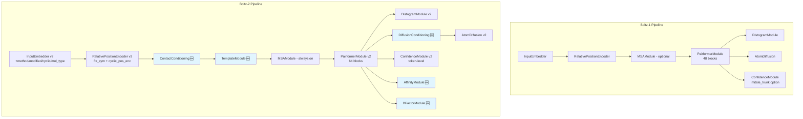
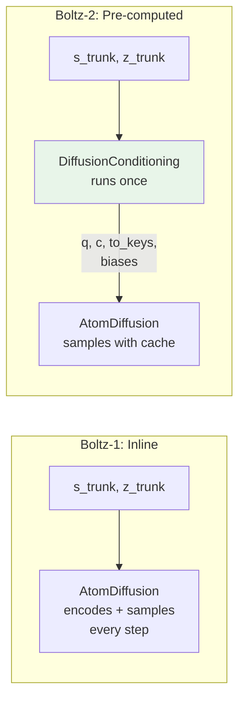

---
slug:21-boltz-1-vs-boltz-2-differences
blog_type:normal
---

本页面对 Boltz 结构预测框架的两代版本——Boltz-1 和 Boltz-2 进行了系统性比较。对于迁移流水线、扩展模型能力或为代码库贡献代码的开发者而言，理解这些差异至关重要。我们将探讨区分这两个版本的架构差异、新增模块、数据处理变更以及训练/推理工作流的改进。

来源: [boltz1.py](src/boltz/model/models/boltz1.py#L1-L200), [boltz2.py](src/boltz/model/models/boltz2.py#L1-L200)

## 架构概述

从 Boltz-1 到 Boltz-2 的过渡并非简单的迭代——它代表了模型能力维度的根本性扩展。Boltz-2 保留了核心的三阶段流水线（trunk → diffusion → confidence），但引入了 **DiffusionConditioning** 预计算阶段，增加了 **template** 和 **contact conditioning** 路径，将 **affinity prediction** 集成为一等模块，并改进了置信度和距离图（distogram）预测头。下图展示了二者之间的架构关系：

<CgxTip>Boltz-2 的 DiffusionConditioning 模块是关键的架构创新——它在采样循环之外预计算原子编码器偏置、解码器偏置和 token transformer 偏置，从而在迭代扩散去噪过程中显著节省内存和计算开销。</CgxTip>

来源: [boltz1.py](src/boltz/model/models/boltz1.py#L200-L400), [boltz2.py](src/boltz/model/models/boltz2.py#L200-L600), [diffusion_conditioning.py](src/boltz/model/modules/diffusion_conditioning.py#L1-L117)

## 模型核心：对比分析

下表总结了对两个模型类之间关键的结构和参数差异：

| 维度 | Boltz-1 | Boltz-2 |
|---|---|---|
| **模型类** | `Boltz1` | `Boltz2` |
| **Pairformer 块数** | 48（默认） | 64（默认） |
| **Pairformer 版本** | v1 (`v2=False`) | v2 (`v2=True`) |
| **MSA 模块** | 可选 (`no_msa` 标志) | 始终存在，可独立编译 (`compile_msa`) |
| **模板条件** | 不支持 | `TemplateModule` 或 `TemplateV2Module` (`use_templates`, `use_templates_v2`) |
| **接触条件** | 不支持 | 具有可配置截断范围的 `ContactConditioning` |
| **扩散条件** | 内联于 AtomDiffusion 中 | 独立的 `DiffusionConditioning` 模块，支持梯度检查点 |
| **置信度模块** | `ConfidenceModule` v1，`imitate_trunk` 选项 | `ConfidenceModule` v2，`token_level_confidence` |
| **亲和力预测** | 不支持 | 带有集成模式的 `AffinityModule` (`affinity_ensemble`) |
| **B-factor 预测** | 不支持 | `BFactorModule` (`predict_bfactor`) |
| **键类型特征** | `token_bonds` (线性 1→token_z) | + `token_bonds_type` (对 bond_types 进行 Embedding) |
| **输入嵌入器初始化** | `s_init(s_input_dim → token_s)`，其中 `s_input_dim = token_s + 2*num_tokens + 1 + len(pocket_contact_info)` | `s_init(token_s → token_s)` — 输入嵌入器在内部吸收了所有特征维度 |
| **相对位置** | 基础 `RelativePositionEncoder` | 带有 `fix_sym_check` 和 `cyclic_pos_enc` 的 v2 版本 |
| **EMA 实现** | 来自 `utils` 的 `ExponentialMovingAverage` | 来自 `optim.ema` 的 `EMA` |
| **对称性工具** | `data.feature.symmetry` | `data.mol`（已整合） |
| **验证** | 单指标集 | 多数据集验证器系统 (`validators`, `num_val_datasets`) |
| **梯度冻结** | 冻结除 `confidence_module` 之外的所有模块 | 冻结除 `confidence_module` 及 `affinity_module` + `out_token_feat_update` 之外的所有模块 |
| **编译目标** | pairformer, structure, confidence | + msa, templates, affinity |

来源: [boltz1.py](src/boltz/model/models/boltz1.py#L1-L400), [boltz2.py](src/boltz/model/models/boltz2.py#L1-L400)

## Boltz-2 的新模块

### DiffusionConditioning

最具影响力的架构变更是将扩散预计算提取为独立的 `DiffusionConditioning` 模块。在 Boltz-1 中，`AtomDiffusion` 模块在每次前向传递时都会在内部执行原子编码、成对条件和偏置投影。Boltz-2 将其分离为一个预计算步骤，在采样前仅运行一次，生成六个缓存张量：`q`（原子查询）、`c`（原子上下文）、`to_keys`、`atom_enc_bias`、`atom_dec_bias` 和 `token_trans_bias`。随后，这些张量作为 `diffusion_conditioning` 字典传入 `AtomDiffusion.sample()`，避免了在各个去噪步骤中的冗余计算。该模块还通过 `checkpoint_diffusion_conditioning` 支持梯度检查点。

来源: [diffusion_conditioning.py](src/boltz/model/modules/diffusion_conditioning.py#L1-L117), [boltz2.py](src/boltz/model/models/boltz2.py#L462-L510)

### 模板模块

Boltz-2 通过 `TemplateModule` 和 `TemplateV2Module` 引入了基于模板的条件机制，二者均位于 [trunkv2.py](src/boltz/model/modules/trunkv2.py)。模板在 MSA 和 pairformer 阶段之前，将结构先验注入成对表示 `z` 中。v2 模板模块可能包含了在分词阶段计算的残基层级帧信息（旋转 + 平移），这是 Boltz-1 中所没有的。模板可通过 `compile_templates` 独立编译。

来源: [boltz2.py](src/boltz/model/models/boltz2.py#L237-L250), [trunkv2.py](src/boltz/model/modules/trunkv2.py#L1-L200)

### 接触条件

Boltz-2 中的 `ContactConditioning` 模块处理来自输入的 `contact_conditioning` 和 `contact_threshold` 特征，对阈值应用傅里叶嵌入，并生成加到 `z_init` 上的成对加性偏置。这取代了 Boltz-1 中较简单的 `pocket_feature` 方法（该方法是拼接在 `s_inputs` 中的）。接触条件针对缺失的接触信息使用了可学习的 `encoding_unspecified` 和 `encoding_unselected` 参数，并且截断范围可通过 `conditioning_cutoff_min` / `conditioning_cutoff_max` 配置。

来源: [trunkv2.py](src/boltz/model/modules/trunkv2.py#L20-L70), [boltz2.py](src/boltz/model/models/boltz2.py#L183-L190)

### AffinityModule

Boltz-2 将结合亲和力预测作为一项原生能力加入。`AffinityModule` 作用于 trunk 的单一表示（`s`）和成对表示（`z`）。它支持**集成模式**（`affinity_ensemble`），在该模式下训练两个具有不同配置的独立亲和力模块（`affinity_module1`，`affinity_module2`），同时还支持**分子量校正**（`affinity_mw_correction`）。这是一个全新的预测头，在 Boltz-1 中没有对应物。

来源: [boltz2.py](src/boltz/model/models/boltz2.py#L296-L330), [affinity.py](src/boltz/model/modules/affinity.py)

### BFactorModule

B-factor 预测是 Boltz-2 中的新输出头，由 `predict_bfactor` 标志控制。`BFactorModule` 接收单一表示 `s`，并在 `num_bins` 上生成每个 token 的 b-factor 分布，类似于距离图，但针对的是热因子。

来源: [boltz2.py](src/boltz/model/models/boltz2.py#L286-L288), [bfactor.py](src/boltz/model/loss/bfactor.py)

## 数据处理流水线差异

### 分词器演进

分词器从 Boltz-1 到 Boltz-2 经历了显著扩展。`TokenData` 结构的字段从 16 个增加到了 22 个：

| 字段 | Boltz-1 | Boltz-2 | 用途 |
|---|:---:|:---:|---|
| `token_idx` | ✅ | ✅ | Token 索引 |
| `atom_idx` | ✅ | ✅ | 起始原子索引 |
| `atom_num` | ✅ | ✅ | 原子数量 |
| `res_idx` | ✅ | ✅ | 残基索引 |
| `res_type` | ✅ | ✅ | 残基类型 |
| `res_name` | ❌ | ✅ | 残基名称字符串（用于模板） |
| `sym_id` | ✅ | ✅ | 对称 ID |
| `asym_id` | ✅ | ✅ | 不对称 ID |
| `entity_id` | ✅ | ✅ | 实体 ID |
| `mol_type` | ✅ | ✅ | 分子类型 |
| `center_idx` | ✅ | ✅ | 中心原子索引 |
| `disto_idx` | ✅ | ✅ | 距离图原子索引 |
| `center_coords` | ✅ | ✅ | 中心坐标 |
| `disto_coords` | ✅ | ✅ | 距离图坐标 |
| `resolved_mask` | ✅ | ✅ | 解析掩码 |
| `disto_mask` | ✅ | ✅ | 距离图掩码 |
| `modified` | ❌ | ✅ | 翻译后修饰标志 |
| `frame_rot` | ❌ | ✅ | 局部帧旋转（3×3 展平） |
| `frame_t` | ❌ | ✅ | 局部帧平移 |
| `frame_mask` | ❌ | ✅ | 帧是否有效 |
| `cyclic_period` | ✅ | ✅ | 环肽周期 |
| `affinity_mask` | ❌ | ✅ | Token 是否属于亲和力预测目标 |

<CgxTip>Boltz-2 中的 `frame_rot`、`frame_t` 和 `frame_mask` 字段是使用 `compute_frame()` 函数从 N-CA-C 骨架原子计算得出的。这些局部坐标系对于基于模板的条件机制至关重要——它们使模型能够推断残基的朝向而不仅仅是位置。非聚合物 token 将获得单位帧。</CgxTip>

Boltz-2 还引入了 `get_unk_token()`，它根据链的 mol_type（DNA/RNA/PROTEIN）选择未知 token 类型，而 Boltz-1 始终使用蛋白质的未知 token。

来源: [boltz.py](src/boltz/data/tokenize/boltz.py#L1-L218), [boltz2.py](src/boltz/data/tokenize/boltz2.py#L1-L200)

### 特征化器变更

v2 特征化器（[featurizerv2.py](src/boltz/data/feature/featurizerv2.py)）的代码量几乎是 v1 的两倍（约 2355 行 vs 约 1226 行），反映了特征工程的大幅扩展。主要新增内容包括模板特征处理、键类型编码、接触条件特征、方法条件、修饰残基标志、环肽标志和分子类型特征。v2 特征化器还从 `data.mol`（整合后的分子工具）而非 `data.feature.symmetry` 导入，并包含了用于亲和力相关分子量计算的基于 RDKit 的描述符。

来源: [featurizer.py](src/boltz/data/feature/featurizer.py#L1-L80), [featurizerv2.py](src/boltz/data/feature/featurizerv2.py#L1-L100)

### 数据模块

Boltz-2 使用独立的推理数据模块（`Boltz2InferenceDataModule` 对比 `BoltzInferenceDataModule`），反映了不同的分词和特征化流水线。训练数据模块同样有 v2 变体（`trainingv2.py`）。

来源: [main.py](src/boltz/main.py#L1-L100)

## 输入嵌入重设计

Boltz-2 对输入嵌入器进行了大幅重设计。在 Boltz-1 中，`InputEmbedder` 将原子注意力编码器输出与 `res_type`、`profile`、`deletion_mean` 和 `pocket_feature` 拼接成一个宽泛的 `s_input_dim` 向量，随后由 `s_init` 进行投影。而 Boltz-2 的 `InputEmbedder` 则**在内部吸收了所有特征投影**——它对残基类型（`res_type_encoding`）、MSA 轮廓（`msa_profile_encoding`）使用独立的可学习嵌入，并将可选的方法条件、修饰残基标志、环状标志和分子类型嵌入作为加性项加入。这意味着 Boltz-2 中的 `s_init` 运行在窄得多的输入维度（仅为 `token_s`）上，从而产生更纯净的信号传播。

| 方面 | Boltz-1 | Boltz-2 |
|---|---|---|
| `s_init` 输入维度 | `token_s + 2*num_tokens + 1 + len(pocket_contact_info)` | `token_s` |
| 残基类型 | 原始拼接 | 可学习线性投影 |
| MSA 轮廓 | 原始拼接 | 可学习线性投影（profile + deletion_mean） |
| 口袋特征 | 拼接 | 被 z 上的 ContactConditioning 取代 |
| 方法条件 | ❌ | 可选 `Embedding(num_method_types, token_s)` |
| 修饰标志 | ❌ | 可选 `Embedding(2, token_s)` |
| 环状标志 | ❌ | 可选 `Linear(1, token_s)` |
| 分子类型 | ❌ | 可选 `Embedding(len(chain_type_ids), token_s)` |

来源: [trunk.py](src/boltz/model/modules/trunk.py#L25-L95), [trunkv2.py](src/boltz/model/modules/trunkv2.py#L80-L200)

## 置信度模块差异

置信度模块经历了重大重设计。Boltz-1 的 `ConfidenceModule` 支持 `imitate_trunk` 模式，在该模式下它会重新运行完整的 trunk（InputEmbedder + MSAModule + PairformerModule）以生成自己的单一/成对表示。它还支持 `use_s_diffusion` 以整合扩散级别的 token 表示。Boltz-2 的 `ConfidenceModule` v2 移除了这两种机制，取而代之的是增加了 `token_level_confidence`（一种新的粒度选项）、`bond_type_feature` 支持、用于 z 输入增强的 `ContactConditioning`，以及在其相对位置编码器中的 `fix_sym_check`/`cyclic_pos_enc`。v2 置信度模块还使用了带有 `v2=True` 的 `PairformerModule`。

来源: [confidence.py](src/boltz/model/modules/confidence.py#L1-L100), [confidencev2.py](src/boltz/model/modules/confidencev2.py#L1-L100)

## 损失函数变更

Boltz-2 引入了全新的损失模块并改进了现有模块：

| 损失 | Boltz-1 | Boltz-2 | 关键变更 |
|---|---|---|---|
| 距离图 | `distogram.py` | `distogramv2.py` | v2 变体 |
| 扩散 | `diffusion.py` | `diffusionv2.py` | v2 变体 |
| 置信度 | `confidence.py` | `confidencev2.py` | v2 变体 |
| B-factor | ❌ | `bfactor.py` | Boltz-2 中新增 |

来源: [loss/](src/boltz/model/loss/)

## 训练和推理工作流

### 训练增强

Boltz-2 引入了几项训练工作流改进：

- **无随机循环**：`no_random_recycling_training` 在训练期间禁用随机循环步数，提供确定性的循环深度。
- **步骤级损失日志**：`log_loss_every_steps` 控制训练损失记录的频率，取代了 Boltz-1 的轮次级方法。
- **扩散条件检查点**：`checkpoint_diffusion_conditioning` 为预计算阶段启用梯度检查点，以计算换取内存。
- **亲和力训练**：`affinity_prediction` 标志启用亲和力头的联合训练，`affinity_ensemble` 支持双头集成。
- **多数据集验证**：Boltz-2 引入了 `validators` 系统，其中不同的验证数据集可以拥有专用的指标跟踪器，通过 `val_group_mapper` 和 `validator_mapper` 进行映射。
- **选择性结构跳过**：`skip_run_structure` 允许在真实坐标而非采样坐标上运行置信度计算，适用于仅训练置信度。
- **梯度冻结细化**：当 `structure_prediction_training=False` 时，Boltz-2 额外保留了 `affinity_module` 和 `out_token_feat_update` 参数的梯度，而 Boltz-1 仅保留 `confidence_module`。

来源: [boltz2.py](src/boltz/model/models/boltz2.py#L1-L400)

### 推理差异

在推理时，由于 DiffusionConditioning 模块的存在，Boltz-2 的前向传递结构有所不同。trunk 首先运行（带有可选的 `run_trunk_and_structure` 门控），然后预计算条件，接着在禁用 `torch.autocast` 的情况下为 float32 扩散模块进行采样。Boltz-1 将 trunk 输出直接传入扩散模块。Boltz-2 还支持在无需结构预测的情况下运行置信度（当 `skip_run_structure=True` 时使用真实坐标或重复坐标），并可将 B-factor 和亲和力分数作为额外输出进行预测。

来源: [boltz1.py](src/boltz/model/models/boltz1.py#L300-L400), [boltz2.py](src/boltz/model/models/boltz2.py#L460-L600)

## 相对位置编码

两个版本都根据残基索引、token 索引、链对称性和实体标识计算相对位置编码，但 Boltz-2 增加了两个重要选项：

- **`fix_sym_check`**：将链距离掩码条件从 `b_same_chain` 更改为 `~b_same_entity`，确保来自同一实体（对称伴侣）的链保留其相对链距离编码，而不是被掩码掉。这对于对称多聚体预测至关重要。
- **`cyclic_pos_enc`**：通过对环状周期取模来包裹残基索引差值，正确处理环肽，为环状拓扑生成正确的相对位置。

来源: [encoders.py](src/boltz/model/modules/encoders.py#L56-L130), [encodersv2.py](src/boltz/model/modules/encodersv2.py#L55-L140)

## 迁移总结

对于从 Boltz-1 迁移到 Boltz-2 的开发者，关键操作如下：

1. **替换分词器**：从 `BoltzTokenizer` 切换到 `Boltz2Tokenizer`，并处理扩展后的 `TokenData` 模式。
2. **替换特征化器**：使用 `featurizerv2`，它生成模板、接触、键类型、方法、修饰和环状特征。
3. **更新数据模块**：使用 `Boltz2InferenceDataModule` / `trainingv2.py` 而不是它们对应的 v1 版本。
4. **更新模型类**：使用 `Boltz2` 代替 `Boltz1`，并配置新参数（`affinity_model_args`、`template_args`、`predict_bfactor` 等）。
5. **调整 pairformer 配置**：将块数增加到 64 并设置 `v2=True`。
6. **处理检查点 URL**：Boltz-2 检查点位于不同的 URL（`boltz2_conf.ckpt`、`boltz2_aff.ckpt`），并使用 `mols.tar` 而不是 `ccd.pkl`。
7. **利用新功能**：根据需要启用模板条件、接触条件、亲和力预测和 B-factor 预测。

来源: [main.py](src/boltz/main.py#L1-L100), [boltz2.py](src/boltz/model/models/boltz2.py#L1-L200)

要深入了解每个子系统，请浏览 [Trunk 和 Pairformer 流水线](8-trunk-and-pairformer-pipeline)、[基于扩散的结构模块](9-diffusion-based-structure-module)、[置信度预测模块](10-confidence-prediction-module)和[结合亲和力预测](11-binding-affinity-prediction)。关于数据端，请参阅[分词系统](13-tokenization-system)和[特征化与特征工程](14-featurization-and-feature-engineering)。