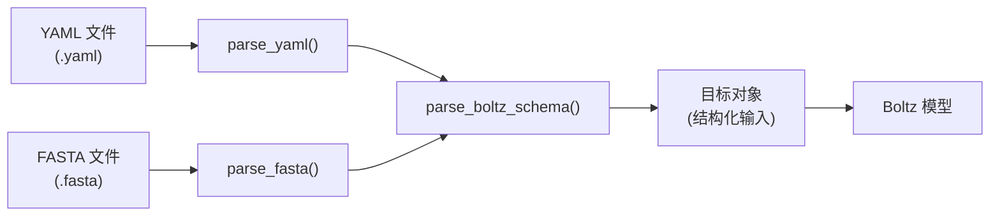

---
slug:3-input-format-guide
blog_type:normal
---


Boltz 接受通过两种输入格式——**YAML** 和 **FASTA**——提交的分子结构预测，这两种格式分别旨在描述定义你预测目标的序列、配体、约束条件和可选属性。本指南将带你了解每一个字段、选项和变体，让你能够自信地构建有效输入，无论你是在预测单个单体，还是预测具有结合亲和力的复杂多链组装体。

## 输入格式概述

所有 Boltz 预测都始于对你想要建模的分子实体的描述。系统支持两种互补的格式，它们在内部会被转换为相同的模式：**YAML 格式**提供对输入各个方面的丰富结构化控制；**FASTA 格式**则为较简单的情况提供了一种轻量级的、面向行的替代方案。这两种格式最终都会输入到相同的 [`parse_boltz_schema`](src/boltz/data/parse/schema.py) 管道中，因此在模型接收到的内容方面，它们在功能上是等效的——但 YAML 提供了对 FASTA 无法表达的约束、模板和亲和力预测等高级功能的访问。



上图说明了这两种格式如何在模式解析器处汇聚。FASTA 解析器在调用相同的模式函数之前，会将其记录转换为类似 YAML 的中间字典，这意味着任何可以在 FASTA 中表达的输入也都可以在 YAML 中表达——但反之则不然。

来源: [yaml.py](src/boltz/data/parse/yaml.py#L1-L69), [fasta.py](src/boltz/data/parse/fasta.py#L1-L139), [schema.py](src/boltz/data/parse/schema.py#L1-L50)

## YAML 输入格式

YAML 格式是 Boltz **最主要且功能最强大**的输入格式。它支持所有实体类型、约束条件、模板和属性预测。一个 Boltz YAML 文件包含四个顶级部分：`version`、`sequences`、`constraints` 和 `properties`。其中只有 `sequences` 是必需的。

### 最简结构

每个 YAML 输入必须至少包含一个 `sequences` 列表。`version` 字段是可选的，默认值为 `1`：

```yaml
version: 1  # 可选，默认为 1
sequences:
  - protein:
      id: A
      sequence: QLEDSEVEAVAKGLEEMYANGVTEDNFKNYVKNNFAQQEISSVEEELNVNISDSCVANKIKDEFFAMISISAIVKAAQKKAWKELAVTVLRFAKANGLKTNAIIVAGQLALWAVQCG
```

这个最简示例直接取自项目的 [`prot.yaml`](examples/prot.yaml#L1-L7)，它定义了一个标识符为 `A` 的蛋白质链及其氨基酸序列。除非你另行指定，否则 Boltz 将在预测时自动为该蛋白质生成 MSA。

### 实体类型

`sequences` 列表中的每一项都是一个字典，该字典仅包含一个指示实体类型的顶级键。Boltz 识别**五种实体类型**，每种类型都有其自己的一组必需和可选字段：

| 实体类型 | 键 | 必需字段 | 可选字段 | 描述 |
|---|---|---|---|---|
| **蛋白质** | `protein` | `id`, `sequence` | `msa`, `cyclic`, `modifications` | 多肽链（氨基酸序列） |
| **RNA** | `rna` | `id`, `sequence` | `modifications` | 核糖核酸链 |
| **DNA** | `dna` | `id`, `sequence` | `modifications` | 脱氧核糖核酸链 |
| **配体 (CCD)** | `ligand` | `id`, `ccd` | — | 来自化学组件字典的小分子 |
| **配体 (SMILES)** | `ligand` | `id`, `smiles` | — | 由 SMILES 字符串定义的小分子 |

<CgxTip>定义配体时，你必须提供 `ccd` **或** `smiles` 中的**任意一种**——绝不能同时提供两者。CCD 选项引用自蛋白质数据库化学组件字典的标准化标识符（例如，`SAH` 代表 S-腺苷-L-同型半胱氨酸），而 SMILES 则允许你使用 SMILES 表示法指定任意分子。</CgxTip>

### 链标识符与对称性

`id` 字段为每个实体分配一个链标识符。**可以使用列表为单个序列条目分配多个链 ID**，这会告诉 Boltz 这些链是同一分子的对称拷贝。这对于正确建模同源寡聚体界面至关重要：

```yaml
sequences:
  - protein:
      id: [A, B]  # 两条相同的蛋白质链
      sequence: MVTPEGNVSLVDESLLVGVTDEDRAVRSAHQFYERLIG...
  - ligand:
      id: [C, D]  # 两个相同的 CCD 配体
      ccd: SAH
  - ligand:
      id: [E, F]  # 两个相同的 SMILES 配体
      smiles: 'N[C@@H](Cc1ccc(O)cc1)C(=O)O'
```

在这个来自 [`ligand.yaml`](examples/ligand.yaml#L1-L13) 的示例中，链 A 和 B 共享一条蛋白质序列，链 C 和 D 共享一个 CCD 配体，链 E 和 F 共享一个 SMILES 配体。对称链会被分配相同的内部表示，这减少了计算量并正确约束了预测。

来源: [ligand.yaml](examples/ligand.yaml#L1-L13), [schema.py](src/boltz/data/parse/schema.py#L500-L550)

### 蛋白质序列与 MSA 选项

蛋白质是最常见的实体类型，并且具有多序列比对 (MSA) 的独特选项，MSA 提供的进化信息可显著提高预测准确性。`msa` 字段接受三种形式：

| `msa` 值 | 行为 | 用例 |
|---|---|---|
| *省略* | Boltz 通过 MMseqs2 自动生成 MSA | 默认值；适用于大多数预测 |
| 路径字符串（例如，`./examples/msa/seq2.a3m`） | 使用提供的 `.a3m` 文件 | 自定义或预先计算的 MSA |
| `empty` | 完全不使用 MSA | 设计蛋白质、从头序列 |

```yaml
# 自动生成 MSA（默认行为）
sequences:
  - protein:
      id: A
      sequence: QLEDSEVEAVAKGLEEM...

# 从文件自定义 MSA
sequences:
  - protein:
      id: A
      sequence: QLEDSEVEAVAKGLEEM...
      msa: ./examples/msa/seq2.a3m

# 完全不使用 MSA
sequences:
  - protein:
      id: A
      sequence: QLEDSEVEAVAKGLEEM...
      msa: empty
```

上面的三个示例分别对应 [`prot.yaml`](examples/prot.yaml#L1-L7)、[`prot_custom_msa.yaml`](examples/prot_custom_msa.yaml#L1-L8) 和 [`prot_no_msa.yaml`](examples/prot_no_msa.yaml#L1-L7)。自定义 MSA 路径可以是相对路径或绝对路径。当使用 `empty` 时，Boltz 会完全跳过 MSA 生成——这适用于不存在同源物的合成或从头设计的蛋白质。

来源: [prot.yaml](examples/prot.yaml#L1-L7), [prot_custom_msa.yaml](examples/prot_custom_msa.yaml#L1-L8), [prot_no_msa.yaml](examples/prot_no_msa.yaml#L1-L7)

### 环状蛋白质

Boltz 通过设置 `cyclic: true` 支持蛋白质的**环状拓扑**。这会告知模型蛋白质的 N 端和 C 端是相连的，从而形成环状骨架：

```yaml
sequences:
  - protein:
      id: A
      sequence: QLEDSEVEAVAKG
      cyclic: true
```

这个来自 [`cyclic_prot.yaml`](examples/cyclic_prot.yaml#L1-L8) 的示例演示了该功能。当 `cyclic` 设置为 `true` 时，模型会将第一个和最后一个残基视为键合的，这改变了基于扩散的结构生成期间的几何约束。

来源: [cyclic_prot.yaml](examples/cyclic_prot.yaml#L1-L8)

### 多聚体复合物

要预测具有多个不同蛋白质链的结构（异源多聚体复合物），只需将多个蛋白质条目添加到 `sequences` 列表中，每个条目具有唯一的链 ID：

```yaml
sequences:
  - protein:
      id: A
      sequence: MAHHHHHHVAVDAVSFTLLQDQLQSVLDTLSEREAGVVRLRFGLTDGQPRTLDEIGQVYGVTRERIRQIESKTMSKLRHPSRSQVLRDYLDGSSGSGTPEERLLRAIFGEKA
  - protein:
      id: B
      sequence: MRYAFAAEATTCNAFWRNVDMTVTALYEVPLGVCTQDPDRWTTTPDDEAKTLCRACPRRWLCARDAVESAGAEGLWAGVVIPESGRARAFALGQLRSLAERNGYPVRDHRVSAQSA
```

来自 [`multimer.yaml`](examples/multimer.yaml#L1-L9) 的这段内容定义了一个双链复合物，其中链 A 和链 B 具有不同的序列。你可以在同一个 `sequences` 列表中混合任何实体类型——蛋白质、RNA、DNA 和配体——以对任意复杂的组装体进行建模。

来源: [multimer.yaml](examples/multimer.yaml#L1-L9)

### 约束条件

约束条件为模型提供了结构指导，将预测空间缩小到生物学相关的构象。Boltz 支持两种约束类型，均在顶级 `constraints` 键下指定：

**口袋约束**告诉模型哪些残基形成了特定配体的结合口袋，从而将预测聚焦于正确的结合位点：

```yaml
constraints:
  - pocket:
      binder: B1
      contacts: [ [ A1, 829 ], [ A1, 138 ] ]
```

`contacts` 中的每个条目都是一个 `[chain_id, residue_index]` 对，用于识别受体中应与结合物接触的残基。`binder` 字段指定哪个链是结合搭档。

**键约束**指定了跨链特定原子之间的共价键：

```yaml
constraints:
  - bond:
      atom1: [A, 1, CA]
      atom2: [A, 2, N]
```

每个原子引用使用 `[chain_id, residue_index, atom_name]` 格式。

来源: [pocket.yaml](examples/pocket.yaml#L1-L13), [yaml.py](src/boltz/data/parse/yaml.py#L34-L41)

### 属性：结合亲和力

Boltz 可以在预测结构的同时预测**结合亲和力**。这是通过 `properties` 顶级键激活的，该键接受一个属性条目列表。目前，唯一支持的属性是 `affinity`：

```yaml
sequences:
  - protein:
      id: A
      sequence: MVTPEGNVSLVDESLLVGVTDEDRAVRSAHQFYER...
  - ligand:
      id: B
      smiles: 'N[C@@H](Cc1ccc(O)cc1)C(=O)O'
properties:
  - affinity:
      binder: B
```

来自 [`affinity.yaml`](examples/affinity.yaml#L1-L12) 的这段内容中，`binder` 字段标识了哪个链是结合搭档（通常是较小的分子或配体）。然后，Boltz 将预测结合搭档与复合物其余部分之间相互作用的结合亲和力 (pKd)。结合物必须是 `sequences` 部分中定义的链 ID 之一。

来源: [affinity.yaml](examples/affinity.yaml#L1-L12), [schema.py](src/boltz/data/parse/schema.py#L1-L50)

### 模板

模板提供结构参考信息以指导预测。它们在顶级 `templates` 键下指定：

```yaml
templates:
  - path: /path/to/template.pdb
    ids: [A]  # 可选，指定要对哪些链应用模板
```

每个模板条目都有一个指向 PDB 或 mmCIF 文件的 `path`，以及一个可选的 `ids` 列表，用于指定应根据该模板进行模板化的查询链。当省略 `ids` 时，Boltz 会尝试使用序列比对自动将查询链与模板链匹配。有关模板如何处理和对齐的详细信息，请参阅[模板与接触条件](19-template-and-contact-conditioning)。

来源: [yaml.py](src/boltz/data/parse/yaml.py#L34-L44), [schema.py](src/boltz/data/parse/schema.py#L410-L470)

## FASTA 输入格式

FASTA 格式提供了一种**更简单的、面向行的替代方案**，适用于你不需要约束条件、模板或亲和力预测的情况。它使用标准的 FASTA 约定及扩展的头部格式，Boltz 会解释该头部格式以识别实体类型和 MSA 来源。

### 头部格式

每个 FASTA 记录遵循以下头部模式：

```
>CHAIN_ID|ENTITY_TYPE|MSA_ID
SEQUENCE
```

三个由竖线分隔的字段分别是：

| 字段 | 必需 | 描述 | 有效值 |
|---|---|---|---|
| `CHAIN_ID` | 是 | 唯一的链标识符 | 任何非空字符串 |
| `ENTITY_TYPE` | 是 | 分子实体类型 | `protein`, `rna`, `dna`, `ccd`, `smiles` |
| `MSA_ID` | 否 | MSA 文件的路径（仅限蛋白质） | 文件路径或省略 |

<CgxTip>MSA_ID 字段**仅对蛋白质有效**。如果你将其包含于任何其他实体类型，解析器将抛出错误。对蛋白质省略该字段时，Boltz 将自动生成 MSA。</CgxTip>

### FASTA 示例

带有自定义 MSA 的简单单蛋白质输入：

```
>A|protein|./examples/msa/seq2.a3m
QLEDSEVEAVAKGLEEMYANGVTEDNFKNYVKNNFAQQEISSVEEELNVNISDSCVANKIKDEFFAMISISAIVKAAQKKAWKELAVTVLRFAKANGLKTNAIIVAGQLALWAVQCG
```

结合蛋白质、CCD 配体和 SMILES 配体的多实体复合物：

```
>A|protein|./examples/msa/seq1.a3m
MVTPEGNVSLVDESLLVGVTDEDRAVRSAHQFYERLIGLWAPAVMEAAHEL...
>B|protein|./examples/msa/seq1.a3m
MVTPEGNVSLVDESLLVGVTDEDRAVRSAHQFYERLIGLWAPAVMEAAHEL...
>C|ccd
SAH
>D|ccd
SAH
>E|smiles
N[C@@H](Cc1ccc(O)cc1)C(=O)O
>F|smiles
N[C@@H](Cc1ccc(O)cc1)C(=O)O
```

第二个来自 [`ligand.fasta`](examples/ligand.fasta#L1-L12) 的示例展示了 FASTA 如何编码与 YAML [`ligand.yaml`](examples/ligand.yaml#L1-L13) 相同的多链、多实体复合物。请注意，CCD 和 SMILES 条目分别使用序列字段来表示 CCD 代码或 SMILES 字符串，头部中的实体类型则将它们区分开来。

来源: [fasta.py](src/boltz/data/parse/fasta.py#L1-L139), [prot.fasta](examples/prot.fasta#L1-L2), [ligand.fasta](examples/ligand.fasta#L1-L12)

## MSA 文件格式 (A3M)

当你通过 YAML 中的 `msa` 字段或 FASTA 中的 `MSA_ID` 字段提供自定义 MSA 时，文件必须为 **A3M 格式**。这是 FASTA 的一种变体，其中小写字母代表插入列（相对于查询序列），连字符 (`-`) 代表缺失。文件中的第一条序列必须是查询序列本身。

```
>101
MVTPEGNVSLVDESLLVGVTDEDRAVRSAHQFYERLIGLWAPAVMEAAHELGVFAALAEAPADSGELARRLDCDARAMRVLLDALYAYDVIDRIHDTNGFRYLLSAEARECLLPGTLFSLVGKFMHDINVAWPAWRNLAEVVRHGARDTSGAESPNGIAQEDYESLVGGINFWAPPIVTTLSRKLRASGRSGDATASVLDVGCGTGLYSQLLLREFPRWTATGLDVERIATLANAQALRLGVEERFATRAGDFWRGGWGTGYDLVLFANIFHLQTPASAVRLMRHAAACLAPDGLVAVVD
>UniRef100_A0A0D4WTP2	338	1.00	7.965E-99	2	375	384	1	374	375
--TPEGNVSLVDESLLVGVTDEDRAVRSAHQFYERLIGLWAPAVMEAAHELGVFAALAEAPADSGELARRLDCDARAMRVLLDALYAYDVIDRIHDTNGFRYLLSAEARECLLPGTLFSLVGKFMHDINVAWPAWRNLAEVVRHGARDTSGAESPNGIAQEDYESLVGGINFWAPPIVTTLSRKLRASGRSGDATASVLDVGCGTGLYSQLLLREFPRWTATGLDVERIATLANAQALRLGVEERFATRAGDFWRGGWGTGYDLVLFANIFHLQTPASAVRLMRHAAACLAPDGLVAVVD
```

查询序列的头部通常只是 `>101`。后续头部可能包含制表符分隔的元数据（例如，UniRef 簇 ID、比对分数、E 值）。Boltz 使用其专用的 [`a3m.py`](src/boltz/data/parse/a3m.py) 解析器解析这些 A3M 文件，该解析器会剥离小写插入字符并将比对转换为内部表示。

来源: [seq1.a3m](examples/msa/seq1.a3m#L1-L5), [seq2.a3m](examples/msa/seq2.a3m#L1-L5)

## 完整 YAML 模式参考

下表总结了 YAML 格式中可用的每个字段，可作为你构建输入时的快速参考：

| 部分 | 字段 | 类型 | 必需 | 描述 |
|---|---|---|---|---|
| *(顶级)* | `version` | int | 否 | 模式版本，默认为 `1` |
| *(顶级)* | `sequences` | list | **是** | 分子实体列表 |
| *(顶级)* | `constraints` | list | 否 | 结构约束（口袋、键） |
| *(顶级)* | `properties` | list | 否 | 预测属性（亲和力） |
| *(顶级)* | `templates` | list | 否 | 用于指导的模板结构 |
| `protein` | `id` | str or list[str] | **是** | 链标识符 |
| `protein` | `sequence` | str | **是** | 氨基酸序列 |
| `protein` | `msa` | str | 否 | `.a3m` 文件路径，或 `empty` |
| `protein` | `cyclic` | bool | 否 | 对环状拓扑设为 `true` |
| `protein` | `modifications` | list | 否 | 翻译后修饰 |
| `rna` | `id` | str or list[str] | **是** | 链标识符 |
| `rna` | `sequence` | str | **是** | 核苷酸序列 |
| `rna` | `modifications` | list | 否 | 核苷酸修饰 |
| `dna` | `id` | str or list[str] | **是** | 链标识符 |
| `dna` | `sequence` | str | **是** | 核苷酸序列 |
| `dna` | `modifications` | list | 否 | 核苷酸修饰 |
| `ligand` | `id` | str or list[str] | **是** | 链标识符 |
| `ligand` | `ccd` | str | 条件* | PDB 字典中的 CCD 代码 |
| `ligand` | `smiles` | str | 条件* | SMILES 字符串（需加引号） |
| `pocket` | `binder` | str | **是** | 结合搭档的链 ID |
| `pocket` | `contacts` | list[list] | **是** | 残基接触 `[[chain, idx], ...]` |
| `bond` | `atom1` | list | **是** | 第一个原子 `[chain, res_idx, name]` |
| `bond` | `atom2` | list | **是** | 第二个原子 `[chain, res_idx, name]` |
| `affinity` | `binder` | str | **是** | 结合搭档的链 ID |
| template | `path` | str | **是** | PDB/mmCIF 模板文件的路径 |
| template | `ids` | list[str] | 否 | 要应用模板的查询链 |

*\*配体必须提供 `ccd` 或 `smiles` 中的确切一种。*

来源: [yaml.py](src/boltz/data/parse/yaml.py#L34-L55), [schema.py](src/boltz/data/parse/schema.py#L1-L50)

## 格式选择指南

在 YAML 和 FASTA 之间做出选择取决于你预测任务的复杂性：

| 功能 | YAML | FASTA |
|---|---|---|
| 蛋白质序列 | ✅ | ✅ |
| RNA / DNA 序列 | ✅ | ✅ |
| 配体 (CCD / SMILES) | ✅ | ✅ |
| 多链 ID（对称性） | ✅ | ❌ |
| 自定义 MSA 路径 | ✅ | ✅ |
| 空 MSA 标志 | ✅ | ❌ |
| 环状蛋白质 | ✅ | ❌ |
| 口袋约束 | ✅ | ❌ |
| 键约束 | ✅ | ❌ |
| 结合亲和力预测 | ✅ | ❌ |
| 模板结构 | ✅ | ❌ |
| 修饰 | ✅ | ❌ |

当你需要为简单的蛋白质或蛋白质-配体预测提供快速、可编写脚本的输入时，**使用 FASTA**。当涉及对称性、约束、亲和力、模板或环状拓扑时，**使用 YAML**。这两种格式可以在同一次预测运行中混合使用——Boltz 会根据文件扩展名（`.yaml`/`.yml` 与 `.fasta`/`.fa`）来确定格式。

来源: [yaml.py](src/boltz/data/parse/yaml.py#L1-L69), [fasta.py](src/boltz/data/parse/fasta.py#L1-L139)

## 常见模式与示例

下面的逐步流程图说明了构建 Boltz 输入文件的决策过程：

```mermaid
flowchart TD
    Start["开始：定义你的<br/>预测目标"] --> Q1{"多种<br/>实体类型？"}
    Q1 -->|是| Q2{"需要约束、<br/>亲和力或模板？"}
    Q1 -->|否| Q3{"带有自动 MSA 的<br/>单一蛋白质？"}
    Q3 -->|是| FASTA1["FASTA:<br/>>A&#124;protein<br/>SEQUENCE"]
    Q3 -->|否| YAML1["YAML:<br/>>A&#124;protein<br/>SEQUENCE"]
    Q2 -->|是| YAML2["带有<br/>约束/属性的 YAML"]
    Q2 -->|否| Q4{"对称<br/>链？"}
    Q4 -->|是| YAML3["带有<br/>id: [A, B] 列表的 YAML"]
    Q4 -->|否| FASTA2["带有<br/>多条记录的 FASTA"]
    FASTA1 --> Done["运行预测"]
    YAML1 --> Done
    YAML2 --> Done
    YAML3 --> Done
    FASTA2 --> Done
```



以下是最常见用例的具体模式，每个模式都引用了仓库中相应的示例文件：

**单一蛋白质（自动 MSA）** — 最简单的输入：
```yaml
# 来自 examples/prot.yaml
version: 1
sequences:
  - protein:
      id: A
      sequence: QLEDSEVEAVAKGLEEMYANGVTEDNFKNYVKNNFAQQEISSVEEELNVNISDSCVANKIKDEFFAMISISAIVKAAQKKAWKELAVTVLRFAKANGLKTNAIIVAGQLALWAVQCG
```

**带有结合亲和力的蛋白质-配体复合物**：
```yaml
# 来自 examples/affinity.yaml
version: 1
sequences:
  - protein:
      id: A
      sequence: MVTPEGNVSLVDESLLVGVTDEDRAVRSAHQFYER...
  - ligand:
      id: B
      smiles: 'N[C@@H](Cc1ccc(O)cc1)C(=O)O'
properties:
  - affinity:
      binder: B
```

**带有接触残基提示的口袋条件预测**：
```yaml
# 来自 examples/pocket.yaml
sequences:
  - protein:
      id: [A1]
      sequence: MYNMRRLSLSPTFSMGFHLLVTVSLLFSHVDHVIAETEM...
  - ligand:
      ccd: EKY
      id: [B1]
constraints:
  - pocket:
      binder: B1
      contacts: [ [ A1, 829 ], [ A1, 138 ] ]
```

来源: [prot.yaml](examples/prot.yaml#L1-L7), [affinity.yaml](examples/affinity.yaml#L1-L12), [pocket.yaml](examples/pocket.yaml#L1-L13)

## 下一步

现在你已经了解了如何格式化 Boltz 的输入，可以开始运行预测并探索更深层的架构了。以下是推荐的阅读路径：

1. **[快速开始](2-quick-start)** — 通过实用的命令行示例将这些格式付诸实践
2. **[解析与输入处理](12-parsing-and-input-handling)** — 了解解析器如何将你的 YAML/FASTA 转换为内部 `Target` 数据结构
3. **[分词系统](13-tokenization-system)** — 了解序列和配体是如何为模型进行分词的
4. **[MSA 生成与集成](17-msa-generation-and-integration)** — 深入了解当你不提供自定义 MSA 时，Boltz 是如何生成和处理 MSA 的
5. **[结合亲和力预测](11-binding-affinity-prediction)** — 探索由 `properties` 字段激活的亲和力预测模块