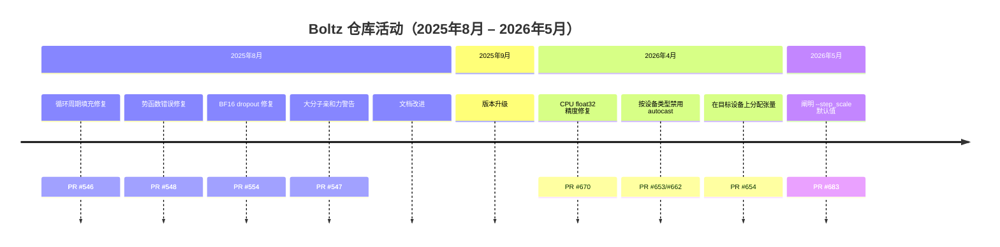

---
slug:4-latest-updates
blog_type:buzz
---

## Boltz-2：从结构预测到结合亲和力

过去一年中，Boltz 生态系统最大的新闻是 **Boltz-2** 的发布（2025 年 6 月 9 日宣布）。虽然 Boltz-1（2024 年 11 月）作为首个达到 AlphaFold3 准确度的完全开源模型确立了自身地位，但 Boltz-2 更向前迈出了决定性的一步：**它联合预测生物分子复合物结构和结合亲和力**——此前没有任何开源模型能在规模化应用中展示出这一能力。

正如 [Boltz-2 预印本](https://doi.org/10.1101/2025.06.14.659707)（Passaro, Corso, Wohlwend 等，2025）所记录，Boltz-2 是首个在准确度上接近基于物理的自由能微扰（FEP）方法的深度学习模型，且运行速度**快约 1,000 倍**。在单块 GPU 上，典型的蛋白质-配体亲和力预测大约需要 15-30 秒，而经典 FEP 则需要数小时。在 [CASP16](https://predictioncenter.org/casp16/results.cgi) 亲和力挑战赛中，Boltz-2 在 140 个复合物上超越了所有提交的方法。

[MIT Jameel Clinic 的公告](https://jclinic.mit.edu/boltz-2-towards-accurate-and-efficient-binding-affinity-prediction)强调，Boltz-1 已被超过 200 家生物技术公司和排名前 20 的所有大型制药公司的团队采用。Boltz-2 是与 [Recursion](https://www.rxrx.ai/boltz-2) 合作开发的，后者针对内部药物发现数据验证了该模型，并在其 NVIDIA 超级计算机上提供了 GPU 算力支持。

### 架构上的变化

Boltz-2 并非一次微不足道的渐进式更新。[Neurosnap 的技术解析](https://neurosnap.ai/blog/post/boltz-2-fast-controllable-physically-grounded-binding-affinity-prediction-and-how-it-leaps-past-boltz-1/68501df28b35985103e377f2)总结了关键的架构差异：

| 组件 | Boltz-1 | Boltz-2 |
|---|---|---|
| 主干网络（PairFormer 层） | 48 | **64** |
| 精度 | float32 | **bfloat16**（混合） |
| 三角注意力 | 标准 | **trifast** 内核 |
| 亲和力预测 | 无 | **双头**（二分类 + 回归） |
| 引导势 | 后置附加组件（Boltz-1x） | **集成**（Boltz-2x） |
| 模板/条件约束 | 无 | **方法、模板、接触/口袋** |

双亲和力头是核心设计：一个分支预测结合物与非结合物的概率（`affinity_probability_binary`），另一个分支回归以 µM 为单位的 `log10(IC50)` 连续亲和力值（`affinity_pred_value`）。它们在截然不同的数据集上训练，应用于不同的场景——二分类用于命中发现，回归用于先导化合物优化。

### 训练数据的扩展

Boltz-2 的训练语料库远远超出了 PDB 的范围。团队纳入了分子动力学模拟（MISATO、mdCATH、ATLAS）、实验性结合亲和力数据库（PubChem、ChEMBL），以及大约 500 万条结合亲和力测定测量值。正如 Jeremy Wohlwend 在 [Cancer Grand Challenges 专题](https://www.cancergrandchallenges.org/news/boltz-2-democratising-the-future-of-drug-design)中所述：“我们的大量精力实际上投入到了为结合亲和力训练整理这些数据上。”

---

## 近期提交：稳定性、精度与设备处理

自 Boltz-2 发布以来，该仓库持续收到解决实际部署问题的补丁。以下是近期最重要合并的时间线：

### CPU 精度修复

近期影响最大的补丁之一是 [修复：强制在 CPU 上使用 float32 精度以防止结构扭曲](https://github.com/jwohlwend/boltz/commit/63000a7c4499ca9014ffdbc732a28f7c8a3e8b8b)，该补丁于 2026 年 5 月合并。它直接解决了 [CPU 运行产生具有过长化学键和原子碰撞的扭曲结构](https://github.com/jwohlwend/boltz/issues/653)的问题，即在 CPU 上运行 Boltz 会导致物理上不合理的预测（化学键拉长、原子碰撞），而相同的输入在 GPU 上却能产生正确的结果。根本原因在于 CPU 应用了 autocast/bf16，而 float16 的精度对于扩散模块的坐标细化来说是不够的。Joshua Steier 的配套提交 [使用活动设备类型禁用 autocast](https://github.com/jwohlwend/boltz/commit/83bb04c4c815b2ef7826bc40719ef2c5a6b81ce3) 确保了混合精度仅在真正支持它的设备上启用。

### 直接设备分配

Geoffrey Martin-Noble 的 [在目标设备上直接分配张量](https://github.com/jwohlwend/boltz/commit/98bd07f9310e38513d0ba359e22f52e117cd43d3) 修复了 ROCm 上的 DDP 崩溃问题，同时也是一项微小的性能优化。代码现在不再先在 CPU 上分配张量然后再转移，而是直接在目标设备上分配——既干净又快速。

### Step Scale 参数说明

Gabriele Corso 的 [阐明 `--step_scale` 参数的默认值](https://github.com/jwohlwend/boltz/commit/296ec7e93f3e098b0a120f0f2b966f6053bf3135) 解决了一个微妙但重要的问题：Boltz-1 和 Boltz-2 的默认 `step_scale` 值不同，而之前的文档并没有说明这一点。对于同时运行这两个模型的用户来说，这是导致结果不一致的隐蔽因素。

### BF16 Dropout 与循环周期填充

2025 年 8 月的两个修复值得一提。tlitfin 的 [BF16 dropout 修复](https://github.com/jwohlwend/boltz/commit/63dc4a19357d66da6d13899dc8ce09c89a0480ca) 纠正了混合精度下意外的 MSA dropout——这是一个微妙的错误，`torch.rand` 的区间在 bf16 下未被正确处理，导致模型丢弃了比预期更多的 MSA 行。Adam27X 的 [循环周期填充修复](https://github.com/jwohlwend/boltz/commit/0842cbbb31e8ee4f3af7d2437c116a153d6cfd22) 确保了 `cyclic_period` 张量被填充以维持前向传播的静态大小，防止了批量推理期间的形状不匹配。

---

## NVIDIA NIM：企业级 Boltz-2 部署

一项重大的基础设施进展是将 Boltz-2 打包为 [NVIDIA NIM 微服务](https://docs.nvidia.com/nim/bionemo/boltz2/latest/overview.html)。这不仅仅是一个包装器——它是一个经过深度优化的部署流水线，集成了自定义内核和 TensorRT。

[NIM 发布说明](https://docs.nvidia.com/nim/bionemo/boltz2/latest/release-notes.html)讲述了快速迭代的故事：

| 版本 | 核心特性 |
|---|---|
| 1.1.0 | 结合亲和力预测，Boltz-2 v2.2.0 |
| 1.3.0 | GB200 ARM 支持，PyTorch 后端支持高达 4096 个残基 |
| 1.5.0 | GB10 DGX Spark，PAE 矩阵输出，模板支持 |
| 1.6.0 | H200、GH200、Slurm 支持 |
| 1.7.0 | B300 Blackwell Ultra |
| 1.8.0 | 统一优化后端，**H100 上提速 1.7 倍**，序列限制提升至 2560+ 个残基 |

1.8.0 版本尤为引人注目：它用统一引擎取代了分离的 TensorRT 和 PyTorch 后端，该引擎会自动选择最佳执行路径。在 H100 上，性能最高提升了 **1.7 倍**，各 GPU 系列支持的最大序列长度增加了 25-50%。它还引入了 **384 维亲和力嵌入**作为输出——这一特性使下游 ML 流水线能够直接使用 Boltz-2 学习到的表征，而不仅仅是标量预测。

### cuEquivariance：内核革命

支撑这种加速的核心是 NVIDIA 的 [cuEquivariance](https://developer.nvidia.com/blog/accelerated-molecular-modeling-with-nvidia-cuequivariance-and-nvidia-nim-microservices/) 库。从 v0.5 版本开始，它增加了加速的 **三角注意力** 和 **三角乘法** 内核——这是 AlphaFold3 类模型中计算量最大的两个操作。结果令人惊叹：

- 三角注意力（BF16）比原生 PyTorch 实现**内核级提速高达 5 倍**
- **内存占用从 O(N³) 降至 O(N²)**——这对大型复合物至关重要
- Boltz-1x 实现了**端到端推理提速最高达 1.75 倍**，从 PyTorch FP32 切换到 cuEquivariance BF16 则**提速 2.5 倍**
- **训练提速 1.35 倍**

正如 Gabriele Corso 所指出的：“这些内核是大家期待已久的，将成为 Boltz 模型家族不可或缺的一部分，有助于解决速度和内存消耗的瓶颈。”Recursion 的 CTO Ben Mabey 补充道：“通过解决关键的计算瓶颈，这将使制药行业在部署这些强大模型时实现更快的研发周期。”

---

## TT-Boltz：在非 NVIDIA 硬件上运行

在一项可能重塑计算生物学硬件格局的进展中，Moritz Thüning 的 [TT-Boltz](https://github.com/moritztng/tt-boltz) 项目已将 Boltz 移植到 Tenstorrent 的 Wormhole 和 Blackhole 处理器上。该项目在 [FOSDEM 2026](https://fosdem.org/2026/schedule/event/AJLNVH-tt-boltz) 上展示，并取得了显著进展：

- **2025 年 2 月**：首次在 Tenstorrent Wormhole 上运行——预测一个 686 残基的蛋白质耗时 1 分 25 秒
- **2025 年 6 月**：FlashAttention 集成将运行时间缩短至 4 分 45 秒
- **2025 年 7 月**：Blackhole 支持将运行时间降至 **2 分 30 秒**，且仅使用了 140 个 Tensix 核心中的 64 个
- **近期**：多机集群——通过标准网络连接多个 Tenstorrent 机箱以扩展吞吐量，据报道其吞吐量高于 NVIDIA B200，而成本不到其一半

这一进展意义重大，因为它代表了首次出现可行的非 GPU 替代方案，能够以具有竞争力的速度运行 AlphaFold3 类模型。正如 Thüning 所言：“这是否是第一次人们可以购买 GPU 以外的硬件来快速预测蛋白质结构？”

---

## Boltz 2.1 转向：开源遭遇闭源 API

故事在这里迎来了更复杂的转折。正如 [Rowan 的文档](https://rowansci.com/tools/boltz-2)所指出的：**“截至 2026 年 6 月，最新的 Boltz-2 模型‘Boltz 2.1’是闭源的，只能通过 Boltz 托管的 API 运行。”**

对于一个完全建立在开放科学身份之上的项目来说，这是一个惊人的转变。Boltz-1 的诞生明确是为了回应 AlphaFold3 的闭源发布——如今，曾大力倡导开放获取的同一社区正面临着局部的倒退。想要获得最新模型改进的用户必须通过 Boltz 的服务器路由其数据，并受其服务条款的约束。

需要明确的是：开源的 Boltz-2 权重和代码仍在 MIT 许可下可用。但最新、性能最好的模型版本不再支持自行托管。这创造了一个双轨体系——面向需要完全控制权的用户的开源模型，以及面向追求最先进准确度的用户的专有 API。我们在 ML 领域曾见过这种模式，但当项目的起源故事本身就是关于大众化时，这种感受截然不同。

---

## 数据泄漏隐患：同行评审

Boltz-2 的预印本已经历了社区同行评审，这些反馈值得关注。来自 2025 构象系综研讨会的 [Karson Chrispens、James Fraser 和 Stephanie Wankowicz 的评审](https://prereview.org/en-us/reviews/15707440) 提出了实质性的担忧：

> “总体而言，我们担心训练和测试之间存在**数据泄漏**。我们很好奇作者为什么使用他们那种划分方式。”

指出的具体问题包括：

1. **骨架划分 vs. Tanimoto 划分**：Tanimoto 相似度可能很低，但仍然共享驱动亲和力的子结构——对于配体而言，骨架划分会更严格。
2. **序列相似性截断值过高**：该领域已表明，蛋白质应基于折叠而非序列相似性进行划分。
3. **FEP 基准泄漏**：大多数 FEP 基准使用的蛋白质，其结构是在 2023 年之前沉积的，这很可能已包含在训练数据中。
4. **划分边界不明确**：“贯穿整篇论文，不清楚何时使用了 30% 与 90% 的序列相似性作为截断值。”

评审者还指出，**训练数据和数据处理流水线尚未发布**，使得独立验证无法进行。Boltz-2 的训练代码在仓库 README 中仍标为“即将推出”，更是加剧了这一问题。

Rowan 的文档则更为直白：“有人担心 Boltz-2 报告的性能在很大程度上可归因于训练-测试泄漏，这意味着在与训练集不相似的目标上，性能会差得多。”

这并非致命的批评——评审者自己也将 Boltz-2 称为“一项重大的工程成就”——但这是一个严重的透明度缺陷，社区将会继续施压追问。

---

## 仍在“即将推出”的内容

截至 2026 年年中，两个关键部分仍然不可用：

1. **Boltz-2 训练代码**：README 依然写着“⚠️ 即将推出：Boltz-2 的更新训练代码！”正如[请求训练代码的 issue](https://github.com/jwohlwend/boltz/issues/687) 所反映的，社区非常渴望。一位用户写道：“文档提到 Boltz-2 的训练代码‘即将推出’。Boltz-2 的训练代码和完整训练数据什么时候发布？”

2. **Boltz-2 评估代码**：同样标记为“即将推出”，并承诺提供 Boltz-2、Boltz-1、Chai-1 和 AlphaFold3 在测试基准数据集上的评估脚本和预测，以及在 FEP+、CASP16 和 MF-PCBA 上的亲和力预测。

训练代码和评估基准的缺失使得社区难以独立复现论文的主张——这是同行评审者明确指出的一点。对于一个建立在开放科学前提下的项目，这些缺口举足轻重。

---

## 展望未来

Boltz 项目正在多个战线齐头并进：模型能力（结合亲和力）、硬件支持（NVIDIA NIM、Tenstorrent）和部署模式（开源 + 闭源 API）。其发展轨迹很明确——团队正朝着蛋白质-蛋白质相互作用亲和力预测（对 [MATCHMAKERS 癌症大挑战](https://www.cancergrandchallenges.org/news/boltz-2-democratising-the-future-of-drug-design) 和 TCR-pMHC 预测至关重要）迈进，而与 NVIDIA 和 Recursion 的基础设施合作表明了向生产级药物发现流水线发展的轨迹。

但开源理想与商业模型把关之间的张力是真实存在的。Boltz 2.1 的闭源转向和尚未解决的数据泄漏担忧意味着，社区的信任——正是这一资产使 Boltz-1 成为行业标准——并不会自动转移。下一个重要的里程碑不是基准测试的数值，而是训练代码和评估套件的发布。在那之前，Boltz-2 的大众化愿景仍只实现了部分。