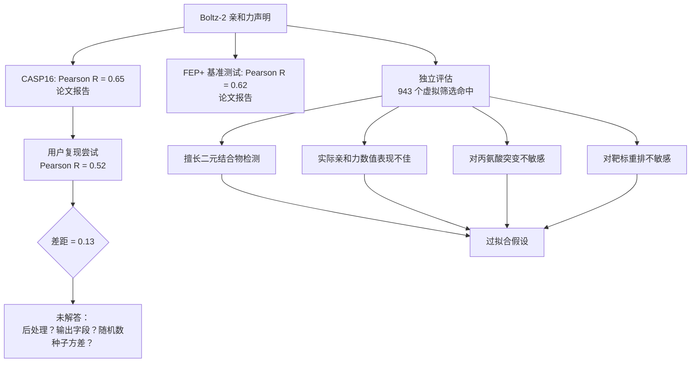
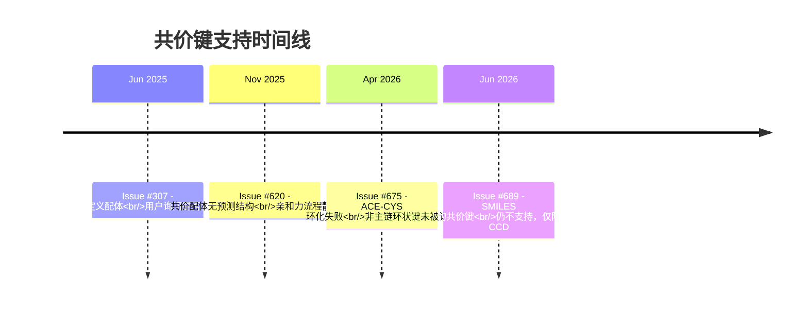

---
slug:5-issues-and-feedbacks
blog_type:buzz
---


Boltz 已成为结构生物学中最具重要性的开源贡献之一。该项目拥有超过 4,100 个 GitHub Star，且被前 20 强制药公司广泛采用，其分量可见一斑。然而，开源的影响力也意味着真实的用户与真实的边缘场景——而在基准测试的辉煌战绩与生产环境的可靠性之间的鸿沟，恰恰孕育了最具启发性的反馈。本页汇总了在 [Boltz issue 追踪器](https://github.com/jwohlwend/boltz/issues)、社区讨论以及独立评估中不断积累的痛点、未解决的 Bug 以及更广泛的科学批评。

---

## 亲和力预测之争：炒作与物理学

Boltz-2 的核心特性——据称达到 FEP 级别精度且速度快 1,000 倍的结合亲和力预测——既引发了兴奋，也招致了严厉的审视。当资深药物化学家、《科学》杂志 [In the Pipeline](https://www.science.org/content/blog-post/ai-predicting-compound-affinity-we-aren-t-there-yet) 博客的作者 Derek Lowe 剖析了一篇对 Boltz-2 亲和力预测进行压力测试的独立评估论文时，这场争议获得了最广泛的关注。他的结论一针见血：

> “即使将靶标蛋白完全打乱重排，并为配体随机分配靶标（预期它们之间根本不会有任何结合），也只能消除大约一半的真阳性推荐。对于其余部分，亲和力预测似乎*几乎与它们选择的靶标无关*。这不是你想要的结果。事实上，这与你的期望截然相反。”

Lowe 引用的论文进行了一系列越来越严格的健全性检查：结合位点的丙氨酸扫描突变（最多同时替换六个）、靶标完全重排以及配体-靶标随机化。Boltz-2 的预测对那些本应是灾难性的变化表现出令人头疼的迟钝——这正是之前在 [AlphaFold 3 对接预测](https://www.science.org/content/blog-post/ai-predicting-compound-affinity-we-aren-t-there-yet) 中观察到的模式。因此，作者“建议对亲和力预测保持高度怀疑”。

这种外界的质疑直接呼应了在 [CASP16 亲和力评估可重复性：论文报告 Pearson R(target avg.)=0.65，复现结果约为 0.52](https://github.com/jwohlwend/boltz/issues/636) 中记录的内部可重复性挑战。在那个公开的 issue 中，一位用户遵循了论文报告的协议——recycling_steps=10, sampling_steps=200, diffusion_samples=5——但始终只能达到 0.52 的目标平均 Pearson r 值，而论文声称的数值为 0.65。他们问道：

1. 应该使用哪个预测输出（`affinity_pred_value` 集成还是其他字段）？是否有应用任何后处理？
2. 造成这种差距的其他原因可能是什么？

该 issue 自 2026 年 1 月开放以来，一直没有官方解决方案。**这种沉默本身就是一种信号**：如果经验丰富的计算化学家无法使用公开的代码和参数复现论文中的核心数据，那么社区需要的是澄清，而不仅仅是营销说辞。



这并非要全盘否定 Boltz-2 的成就。King 等人在 [arXiv 预印本](https://arxiv.org/abs/2512.06592) 中关于微调 Boltz-2 以进行蛋白质-蛋白质亲和力预测的研究发现，Boltz-2-PPI 的结构嵌入在与基于序列的模型结合时，能产生互补的改进——这表明即使原始的亲和力输出不可靠，模型依然学习了*某些*有用的表征。集成 Boltz-2 的商业平台 Rowan [明确标记了](https://rowansci.com/tools/boltz-2) 其性能声明以及训练-测试数据泄露的担忧，并自动应用 PoseBuster 检查和立体化学验证来过滤不符合物理规律的结果。

**底线**：Boltz-2 的二元结合物检测对于命中发现似乎确实有用；但其定量的亲和力预测应被视为含噪先验，而非 FEP 或实验验证的替代品。CASP16 竞赛表现与现实对抗性评估之间的差距提醒我们，竞赛基准测试与生产环境的药物发现运行在不同的体系中。

---

## MSA 基础设施：单点故障

如果说亲和力精度是一场科学争论，那么 MSA 服务器问题就是一场运营危机。Boltz 默认的 `--use_msa_server` 标志会将所有 MSA 生成路由到公共的 [ColabFold API](https://api.colabfold.com)，而这种依赖关系一直是导致流程故障的 recurring 问题。

这种模式在多个 issue 中一致出现：

| Issue | 日期 | 症状 | 状态 |
|-------|------|---------|--------|
| [MSA 生成请求的失败尝试过多](https://github.com/jwohlwend/boltz/issues/629) | 2025 年 12 月 | 连接 `api.colabfold.com` 超时 (`ConnectTimeout`) | 已关闭（“未计划”） |
| [高通量筛选期间从 api.colabfold.com 获取数据时发生 ConnectTimeoutError](https://github.com/jwohlwend/boltz/issues/693) | 2026 年 6 月 | 同样的超时，但发生在批量筛选场景下 | 开放中 |

Issue #629 于 2026 年 6 月被以“未计划”关闭——这实际上意味着团队承认 ColabFold 公共 API 的可靠性超出了他们的控制范围。但对于运行高通量筛选的用户来说，这个问题尤为棘手：正如 [#693](https://github.com/jwohlwend/boltz/issues/693) 的报告者所指出的，“服务器试图为循环中的每个配体单独请求新的 MSA（即使靶标蛋白保持完全相同）。”这意味着单次速率限制或网络波动就会导致整个自动化流程崩溃。

社区已经找到了变通方法，但这些方法需要耗费大量精力：

- **自托管 MSA 服务器**：可以在本地部署 [ColabFold 的 MsaServer](https://github.com/sokrypton/ColabFold/tree/main/MsaServer)，但需要庞大的基础设施（序列数据库约需 1TB）。
- **本地 MSA 缓存**：目前没有官方支持的工作流。用户必须手动下载 `.a3m` 文件并在不同运行之间进行管理。
- **备用服务器 URL**：Boltz 支持通过 `--msa_server_url` 指定自定义端点，但相关的设置文档寥寥无几。

[nf-core proteinfold 流程](https://nf-co.re/proteinfold/dev/docs/usage/boltz) 明确警告：“如果你打算进行大量预测，请使用本地 mmseqs 搜索模块，或者搭建并使用你自己的自定义 MMSeqs2 API 服务器。”这是一条实用的建议，但对于 Boltz 试图触达的精确受众——即没有专门生物信息学基础设施的实验室来说，这极大地提高了准入门槛。

**缺失的环节**：一个内置的 MSA 缓存层，只需下载一次蛋白质 MSA，即可在针对同一靶标的多个配体预测中重复使用。这将消除流程故障最常见的原因，并显著减轻公共 ColabFold API 的负载。

---

## 共价键与环化：仍在建设中

共价配体建模一直是个棘手的痛点，issue 追踪器讲述了一个支持逐步增加却不完整的故事：



当前的状况是碎片化的。共价键*可以*通过 `constraints.bond` YAML 字段指定，但前提是配体必须以 CCD（化学组分字典）格式提供。Issue [#689](https://github.com/jwohlwend/boltz/issues/689) 明确指出了这一点：尝试使用 SMILES 格式的配体指定共价键会产生 `KeyError: ('B', 0, 'C16')`，因为原子名称解析系统只适用于 CCD 条目。

与此同时，[#675](https://github.com/jwohlwend/boltz/issues/675) 揭示即使是基于 CCD 的环化也不可靠。一位用户试图通过乙酰基（ACE）到修饰半胱氨酸（CY3）的键创建环肽，却发现 `constraints.bond` 规范被直接忽略了——模型要么通过主链连接，要么根本不产生连接。该用户沮丧的观察一语中的：“键参数（在 constraints 下）中指定的原子似乎未被识别/生效。”

[#620](https://github.com/jwohlwend/boltz/issues/620) 的案例特别具有启发意义：共价配体预测运行完成，但由于当 `pre_affinity_*.npz` 缺失时亲和力流程静默崩溃，产生了*空输出目录*。这个问题最终在 [boltz-community](https://github.com/jwohlwend/boltz/issues/620)（一个社区维护的分支）中被修复，而不是在上游代码库中——这种模式我们还会再次看到。

**差距所在**：共价药物设计是制药研发中增长最快的模式之一。无法使用 SMILES 配体建模共价键，以及即使基于 CCD 的环状约束也不可靠，这对真实的药物发现工作流构成了重大功能限制。

---

## 训练代码：“即将推出”仍是现状

Boltz README 上数月来一直挂着同样的警告：

> **Training**：即将推出：Boltz-2 的更新训练代码！

这引发了日益强烈的不满。[Issue #687](https://github.com/jwohlwend/boltz/issues/687) 直截了当地问：“Boltz-2 的训练代码和完整训练数据什么时候发布？我一直密切关注这个项目，迫不及待想开始在自已的数据集上进行训练实验。”

更关键的是，[Issue #686](https://github.com/jwohlwend/boltz/issues/686) 揭示即使是*现有的* Boltz-1 训练预处理流程也在多处存在问题：

1. **`cluster.py` 的输出与 `rcsb.py` 不兼容**：聚类脚本输出的键为 `sha256(sequence)` 哈希值，但 `rcsb.py` 期望的键是 `pdb_id_entity_id`。结果呢？所有链都得到了 `cluster_id: -1`，导致 `ClusterSampler` 崩溃。
2. **`rcsb.py` 从未填充 `msa_id`**：每个 `ChainInfo` 创建时 `msa_id=""`，这意味着训练流程从未将处理后的 MSA 文件与记录连接起来——除非用户手动对输出进行后处理。

这些不是微小的文档空白；它们是训练预处理流程中的结构性 Bug，使得如果不进行大量的逆向工程，就无法从头复现或扩展 Boltz-1 的训练。该用户的总结可谓一针见血：“似乎训练预处理流程从未填充 `msa_id`，除非用户手动对生成的记录进行后处理。”

对于一个以开放科学为身份认同的项目——正如 [Regina Barzilay 所强调的](https://www.cancergrandchallenges.org/news/boltz-2-democratising-the-future-of-drug-design)，“训练代码的发布允许药物开发人员针对特定模式对模型进行微调”——长期缺乏可用的训练基础设施是一个信誉鸿沟。

---

## 硬件与精度陷阱

### CPU 精度 Bug（已修复）

2026 年影响最大的 Bug 之一是 [CPU 运行产生扭曲的结构](https://github.com/jwohlwend/boltz/issues/653)。在 CPU 上运行 Boltz 产生了“键过长和原子碰撞”的结构，而相同的输入在 GPU 上却产生了正确的结果。根本原因是不同设备类型之间的 autocast 行为存在差异。

修复分两阶段进行：首先是 Joshua Steier 提交的 [使用活动设备类型禁用 autocast](https://github.com/jwohlwend/boltz/commit/83bb04c4c815b2ef7826bc40719ef2c5a6b81ce3)，然后是 [在 CPU 上强制使用 float32 精度](https://github.com/jwohlwend/boltz/commit/63000a7c4499ca9014ffdbc732a28f7c8a3e8b8b) 以防止结构扭曲。这是一个典型的静默精度 Bug：模型没有崩溃，而是产出了*看似合理的垃圾结果*——这是结构生物学中最糟糕的失败类型。

### ROCm/DDP 崩溃（已修复）

Geoffrey Martin-Noble 的 [PR #654](https://github.com/jwohlwend/boltz/commit/98bd07f9310e38513d0ba359e22f52e117cd43d3) 修复了在 AMD ROCm 硬件上使用 DDP 运行 Boltz-1 时的崩溃问题，方法是将张量直接分配在目标设备上，而不是在 CPU 上创建后再转移。正如 Martin-Noble 所指出的，这“也更简洁，且是一项微小的性能优化。”

### BF16 Dropout Bug（已修复）

[Issue #554](https://github.com/jwohlwend/boltz/issues/554)（由 tlitfin 贡献）修复了混合精度下意外的 MSA dropout。dropout 操作使用了生成 `[0, 1)` 范围值的 `torch.rand`，但比较逻辑假设值在 `(0, 1]` 范围内，导致了 bf16 训练中的细微数据丢失。

### `steering_args` NoneType Bug（开放中）

[Issue #680](https://github.com/jwohlwend/boltz/issues/680) 暴露了一个代码路径问题：直接从检查点实例化 Boltz-2（绕过 Hydra）会使 `steering_args` 保持为 `None`，导致在 `diffusionv2.py:323` 的第一次前向传递时立即引发 `TypeError`。该用户贴心地提供了一个完整的默认字典：

```python
hparams['steering_args'] = {
    'fk_steering': False,
    'num_particles': 1,
    'fk_lambda': 0.0,
    'fk_resampling_interval': 1,
    'physical_guidance_update': False,
    'contact_guidance_update': False,  # 未记录的键！
    'num_gd_steps': 1,
}
```

`contact_guidance_update` 键存在于代码中，但在官方 Hydra YAML 中却没有——这是一个可能静默改变行为的未记录参数。这是一个可维护性的危险信号：当 YAML 配置与代码的实际默认值发生分歧时，偏离标准入口点的用户就会受到惩罚。

---

## 模板解析与大型结构

### 模板相关的 IndexError

[Issue #669](https://github.com/jwohlwend/boltz/issues/669) 报告了在向 YAML 输入添加模板时出现的 `IndexError: list index out of range`。崩溃发生在 `parse_polymer` 中的 `res_name = sequence[j]` 处，表明解析的序列与模板的实体映射之间存在不匹配。该 issue 仍然开放且未修复——这意味着对于某些输入，带有模板指导的多链蛋白靶标本效上是失效的。

### 大型结构 OOM

来自伦敦帝国理工学院的 Suhail Islam 博士在 [Issue #575](https://github.com/jwohlwend/boltz/issues/575) 中报告，即使在使用配备 1TB 内存的 A100 (80GB GPU) 的情况下，超过约 2,000 个残基的结构也会触发 `WARNING: ran out of memory, skipping batch`。目前没有关于聚合物大小与 GPU/内存需求关系的文档，也没有针对大型单体进行分块或内存高效推理的指导。

---

## 更宏观的图景：社区分支与依赖摩擦

有两个元问题值得提及，因为它们揭示了项目维护的动态：

**依赖版本锁定**（[Issue #626](https://github.com/jwohlwend/boltz/issues/626)）：`pyproject.toml` 锁定了精确的依赖版本，导致 Boltz 难以安装到现有环境中。这是可重复性与可组合性之间的常见权衡，但社区的反馈很明确：这增加了工具的采用难度。该 issue 在未作任何更改的情况下被关闭。

**boltz-community 分支**：多项修复——包括亲和力崩溃修复、更广泛的硬件兼容性（MPS、ROCm）、扩展的测试覆盖以及 CI——都被合并到了一个[社区维护的分支](https://github.com/jwohlwend/boltz/issues/620)中，而未被上游合并。这是核心团队精力有限的必然结果，但它造成了一个分裂的生态系统，用户必须在官方版本和社区补丁之间做出选择。

---

## 总结：反复出现的主题

| 类别 | 关键 Issue | 解决状态 |
|----------|-----------|-------------------|
| 亲和力可靠性 | [#636](https://github.com/jwohlwend/boltz/issues/636)，外部评估 | 开放中 / 未解决 |
| MSA 基础设施 | [#629](https://github.com/jwohlwend/boltz/issues/629)，[#693](https://github.com/jwohlwend/boltz/issues/693) | 存在变通方案；无内置缓存 |
| 共价键 | [#307](https://github.com/jwohlwend/boltz/issues/307)，[#620](https://github.com/jwohlwend/boltz/issues/620)，[#675](https://github.com/jwohlwend/boltz/issues/675)，[#689](https://github.com/jwohlwend/boltz/issues/689) | 部分支持（仅限 CCD）；不支持 SMILES |
| 训练代码 | [#686](https://github.com/jwohlwend/boltz/issues/686)，[#687](https://github.com/jwohlwend/boltz/issues/687) | “即将推出” |
| CPU/精度 Bug | [#653](https://github.com/jwohlwend/boltz/issues/653)，[#670](https://github.com/jwohlwend/boltz/commit/63000a7c4499ca9014ffdbc732a28f7c8a3e8b8b) | 已修复 |
| steering_args Bug | [#680](https://github.com/jwohlwend/boltz/issues/680) | 开放中；已记录变通方案 |
| 模板解析 | [#669](https://github.com/jwohlwend/boltz/issues/669) | 开放中；未修复 |
| 大型结构 | [#575](https://github.com/jwohlwend/boltz/issues/575) | 已关闭；无扩展指导 |
| 依赖版本锁定 | [#626](https://github.com/jwohlwend/boltz/issues/626) | 已关闭；无更改 |

这种模式在许多高知名度的开源项目中都很常见：核心模型在广告宣传的用例中表现良好，但在边缘场景——共价化学、训练可重复性、基础设施可靠性、非标准硬件——却暴露出对最需要该工具的用户影响深远的鸿沟。Boltz 团队对某些 Bug 做出了积极响应（CPU 精度修复既迅速又彻底），但结构性问题——MSA 缓存、训练代码、共价键支持——需要的是架构层面的投入，而不仅仅是打补丁。

对于一个以普惠为身份认同的项目而言，团队目前最能体现普惠的做法，就是弥合论文与实践之间的鸿沟。