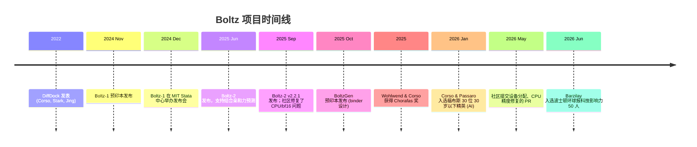
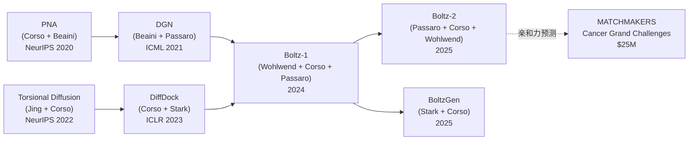

---
slug:6-about-contributors
blog_type:buzz
---

在每一个重新划定结构生物学计算可能性的边界模型背后，都有人的身影——Boltz 的故事正是一个关于人的故事。这个最初只是 MIT CSAIL 的一个博士项目，如今已发展成为计算生物学领域最具影响力的开源项目之一，下载量超过 100 万次，被全球数千家组织采用。本页面将介绍促成这一切的关键人物：他们的背景、动机，以及将他们工作紧密相连的学术传承。

## 起源：MIT Jameel 诊所与 CSAIL

Boltz 诞生于 [MIT Jameel 机器学习健康诊所](https://jclinic.mit.edu/)，该研究中心由 MIT 和 Community Jameel 于 2018 年联合创立，唯一专注于面向临床和药物发现应用的转化型 AI。该诊所的 AI 教职负责人是 [Regina Barzilay](https://www.regina.csail.mit.edu/)，这里融合了机器学习、化学和肿瘤学的学术环境，为 Boltz 的成长提供了肥沃的土壤。

该项目的机构背景至关重要，因为它解释了 Boltz 独特的理念：**完全开源、MIT 许可证、可商用**。在 DeepMind 发布 AlphaFold3 且不提供训练代码并限制商业使用的领域中，Jameel 诊所团队做出了深思熟虑的哲学抉择。正如 Gabriele Corso 在 2024 年 12 月于 MIT Stata 中心举行的 Boltz-1 发布会上所言：“我们将其命名为 Boltz-1 而非 Boltz 是有原因的。这不是终点。我们希望尽可能多地获得社区的贡献。”

## 三位联合创始人

Boltz-1 和 Boltz-2 的三位共同负责人是 Jeremy Wohlwend、Gabriele Corso 和 Saro Passaro。2026 年 1 月，三人因在 Boltz 上的贡献入选了 [福布斯 30 位 30 岁以下精英（AI 领域）榜单](https://jclinic.mit.edu/meet-the-newest-forbes-30-under-30)。他们还共同创立了 **Boltz** 公司，旨在将模型商业化并拓展其在治疗设计中的应用。

### Jeremy Wohlwend

| | |
|---|---|
| **角色** | Boltz 联合创始人兼 CTO；代码仓库所有者 |
| **所属机构** | MIT CSAIL & Jameel 诊所（博士） |
| **GitHub** | [jwohlwend](https://github.com/jwohlwend) |

Jeremy Wohlwend 是 [jwohlwend/boltz](https://github.com/jwohlwend/boltz) 代码仓库的所有者，也是提交次数最多的贡献者。他出生于瑞士日内瓦，16 岁时移居美国，在加入 MIT 之前就读于波士顿国际学校。他在 Regina Barzilay 的指导下完成了 MIT 的博士学位，研究重点是**折叠与对接算法的计算效率**，包括它们在免疫学中的应用。

Jeremy 对 Boltz 的贡献既是架构上的，也是运营上的。正如 [Barzilay 所言](https://www.eecs.mit.edu/mit-researchers-introduce-boltz-1-a-fully-open-source-model-for-predicting-biomolecular-structures)：“这个项目倾注了无数个日夜的努力，伴随着坚定不移的决心。”Jeremy 本人这样描述数据处理的挑战：“我熬了许多个夜晚与这些数据搏斗。其中很大一部分是纯粹的领域知识，必须亲自去掌握。没有任何捷径可言。”

他在代码仓库的提交记录显示，作为维护者，他不断地合并社区的 PR、升级版本、修复边缘情况——这些虽然不起眼，但却是让开源项目保持活力的关键工作。2025 年，Jeremy 与 Gabriele Corso 凭借他们的博士论文获得了 [Dimitris N. Chorafas 奖](https://www.linkedin.com/posts/reginabarzilay_my-spectacular-phd-graduates-gabriele-corso-activity-7373322591970967552-t0cx)。

### Gabriele Corso

| | |
|---|---|
| **角色** | Boltz 联合创始人；核心维护者兼架构师 |
| **所属机构** | MIT CSAIL & Jameel 诊所（博士） |
| **网站** | [gcorso.github.io](https://gcorso.github.io) |
| **GitHub** | [gcorso](https://github.com/gcorso) |

Gabriele Corso 是分子机器学习领域数篇高引用工作背后的智力引擎。在 Boltz 之前，他撰写了 **DiffDock**（ICLR 2023，NeurIPS 2022 基于分数建模研讨会最佳学生论文）、**Torsional Diffusion**（NeurIPS 2022 Oral）以及 **Principal Neighbourhood Aggregation for Graph Nets**（NeurIPS 2020）——这篇论文从根本上重塑了 GNN 聚合邻域信息的方式。

Corso 在 Pietro Lio 和 Jure Leskovec 的指导下于剑桥大学完成本科学业，并曾在 Twitter Research、D.E. Shaw 和 Alchera Technologies 实习。他在 MIT 的博士学位由 Tommi Jaakkola 和 Regina Barzilay 共同指导，专注于为结构生物学和药物发现开发新型机器学习框架。

在 Boltz 代码仓库中，Gabriele 担任核心维护者和架构师。他最近的提交记录很能说明问题：[澄清 `--step_scale` 参数的默认值](https://github.com/jwohlwend/boltz/commit/296ec7e93f3e098b0a120f0f2b966f6053bf3135)、[更新 prediction.md 中的覆盖和亲和力细节](https://github.com/jwohlwend/boltz/commit/0c228c1a3cded9c09a9cdd5af386e4f01f82d41f)、[为计算亲和力时分子过大抛出错误和警告](https://github.com/jwohlwend/boltz/commit/e0121fc0aa12f07b7a51225c0a0fe779b2d5ea86)——一位既负责模型架构设计又亲自编写文档的维护者，这在学术软件中实属罕见。

除了研究之外，Gabriele 还是 [LeadTheFuture](https://leadthefuture.org) 的核心团队成员和导师，这是一个帮助优秀意大利学生的非营利组织，他还曾担任 [NeurIPS MLSB 研讨会](https://mlsb.io/) 的项目主席以及 [MIT MoML 会议](https://moml.mit.edu/) 的组织者。

### Saro Passaro

| | |
|---|---|
| **角色** | Boltz 联合创始人；Boltz-2 第一作者 |
| **所属机构** | MIT CSAIL & Jameel 诊所；前 Meta 员工 |
| **GitHub** | [saropassaro](https://github.com/saropassaro) |

Saro Passaro 是 [Boltz-2 论文](https://doi.org/10.1101/2025.06.14.659707) 的第一作者，也是 MIT 的研究科学家，此前曾在 Meta 工作。他早期的贡献包括与 Dominique Beaini 合著 **Directional Graph Networks**（ICML 2021 Oral），以及对 Boltz 代码库的基础性工程工作。

Saro 担任 Boltz-2 的第一作者，而 Jeremy 和 Gabriele 则是 Boltz-1 的第一作者，这反映了一种刻意的学术领导力轮换机制。Boltz-2 的标志性成就——在运行速度快 1000 倍的同时，达到 FEP 级别的结合亲和力预测精度——带有 Saro 的方法论印记。正如 [Regina Barzilay 所强调的](https://www.cancergrandchallenges.org/news/boltz-2-democratising-the-future-of-drug-design)：“亲和力是任何药物设计问题的核心。这几十年来一直是一个开放性问题，确实需要新颖的机器学习方法来解决。”

## 教职导师

### Regina Barzilay

| | |
|---|---|
| **角色** | MIT Jameel 诊所教职负责人；首席研究员 (PI) |
| **所属机构** | MIT 工程学院 AI 与健康杰出教授 |
| **网站** | [regina.csail.mit.edu](https://www.regina.csail.mit.edu/) |

Regina Barzilay 是 Boltz 项目的引力中心。她出生于摩尔多瓦基希讷乌，20 岁时移民至以色列，并于 2003 年在 Kathleen McKeown 的指导下获得哥伦比亚大学博士学位。她的职业轨迹令人瞩目：最初是一名自然语言处理研究员，2014 年被诊断出患有乳腺癌，这使她的研究方向转向肿瘤学，并最终涉足药物发现。

她获得的荣誉无数：**麦克阿瑟奖学金**（2017）、**AAAI Squirrel AI 造福人类奖**（100 万美元，2020）、**美国国家工程院院士**（2023）、**美国国家医学院院士**（2023）、**IEEE Frances E. Allen 奖章**（2025）以及 **TIME100 AI 榜单**（2025）。2026 年，她还入选了 [波士顿环球报科技影响力 50 人](https://jclinic.mit.edu/regina-barzilay-boston-globe-tech-power-players-50) 榜单。

Regina 在 Boltz 中扮演的是研究总监的角色，负责设定学术方向并提供机构基础设施。她的实验室早期在 Halicin（2020 年通过深度学习发现的 30 年来首个新型抗生素化合物）上的工作，为 Boltz 目前所拓展的 ML 驱动药物发现模式奠定了基础。

### Tommi Jaakkola

| | |
|---|---|
| **角色** | 联合首席研究员 (Co-PI)，MIT CSAIL |
| **所属机构** | MIT 电气工程与计算机科学教授 |

Tommi Jaakkola 是 Boltz 背后的另一位教职支柱。他的研究涵盖生成式建模、结构化预测和近似推断——这些都是支撑 Boltz 结构模块的基于扩散架构的基础。Jaakkola 共同指导了 Wohlwend 和 Corso，他的团队培养了一脉相承的杰出分子机器学习研究成果，包括 DiffDock、Torsional Diffusion 和 Dirichlet Flow Matching。

正如 Jaakkola 在 Boltz-1 发布会上所言：“Jeremy、Gabriele 和 Saro 所取得的成就堪称非凡。他们在该项目上的努力与坚持，使得生物分子结构预测更广泛地惠及整个社区。”

## 扩展研究团队

Boltz-1 和 Boltz-2 论文列出了一大批来自 MIT、工业界和国际合作者的贡献者。以下是关键人物的概览：

| 贡献者 | 角色 | 所属机构 | 知名前期工作 |
|---|---|---|---|
| **Mateo Reveiz** | 作者（Boltz-1 & 2） | MIT CSAIL / Jameel 诊所 | 数据管理与基础设施 |
| **Noah Getz** | 作者；活跃提交者 | MIT CSAIL / Jameel 诊所 | 合并了[势能 Bug 修复](https://github.com/jwohlwend/boltz/commit/9316cad8638ba4d7ae499045ff5e60269f2cb044) |
| **Tally Portnoi** | 作者 | MIT CSAIL / Jameel 诊所 | TCR-pMHC 相互作用 |
| **Stephan Thaler** | 作者（Boltz-2） | Recursion Pharmaceuticals | 工业界合作 |
| **Vignesh Ram Somnath** | 作者（Boltz-2） | Recursion Pharmaceuticals | 工业界合作 |
| **Hannes Stark** | 作者（Boltz-2） | MIT CSAIL | BoltzGen, Dirichlet Flow Matching |
| **Dominique Beaini** | 作者（Boltz-2） | Valence Discovery / 蒙特利尔大学 | PNA, Directional Graph Networks, GPS |
| **Ken Leidal** | 作者（Boltz-1） | Genesis Therapeutics | ML 工程，基础设施 |
| **Wojtek Swiderski** | 作者（Boltz-1） | Genesis Therapeutics | ML 工程，基础设施 |
| **Liam Atkinson** | 作者（Boltz-1） | CHARM Therapeutics | 工业界合作 |
| **Itamar Chinn** | 作者（Boltz-1） | MIT CSAIL / Jameel 诊所 | 数据处理 |
| **Jacob Silterra** | 作者（Boltz-1） | MIT CSAIL / Jameel 诊所 | 工程开发 |
| **Julien Roy** | 作者（Boltz-2） | Valence Discovery | 工业界合作 |
| **David Kwabi-Addo** | 作者（Boltz-2） | - | 亲和力预测 |

Boltz-1 与 **Genesis Therapeutics**（现为 Genesis Research）的合作，以及 Boltz-2 与 **Recursion Pharmaceuticals** 的合作，反映了一种刻意的模式：学术创新与工业级工程和算力相结合。[Boltz-1 致谢页面](https://jclinic.mit.edu/boltz-1) 特别感谢了 Genesis Therapeutics 提供的“机器学习工程、基础设施和计算支持”。

## 社区贡献者

让 Boltz 成为真正开源的不仅仅是许可证——还有持续被合并到代码库中的社区贡献。最近的提交记录展现了外部开发者修复实际问题的健康生态：

| 贡献者 | 贡献 | 提交 |
|---|---|---|
| **Geoffrey Martin-Noble** (Google) | 在目标设备上直接分配张量——修复了 ROCm 上的 DDP 崩溃问题 | [b1ebfc4](https://github.com/jwohlwend/boltz/commit/b1ebfc46ecf57f5414e0d1a6f9027bbb122c53bc) |
| **Joshua Steier** | 在 CPU 上强制使用 float32 精度，防止结构变形 | [63000a7](https://github.com/jwohlwend/boltz/commit/63000a7c4499ca9014ffdbc732a28f7c8a3e8b8b) |
| **Tim Holy** | 微调文档 | [fd69c81](https://github.com/jwohlwend/boltz/commit/fd69c81bf104eb5ed0841a0c1d164a17c56878bf) |
| **tlitfin** (UNSW) | 修复 bf16 dropout——减少了混合精度下非预期的 MSA dropout | [32d9b60](https://github.com/jwohlwend/boltz/commit/32d9b6037f359709b785cf4fee2c27ddc00b1127) |
| **Joshua Meyers** | 修复势能的轻微 Bug——`prod` 变量被重复计算 | [e540548](https://github.com/jwohlwend/boltz/commit/e540548a16d825ab9c5c50b3f44ec29540a5b104) |
| **Adam27X** | 为静态张量尺寸填充 cyclic_period | [0842cbb](https://github.com/jwohlwend/boltz/commit/0842cbbb31e8ee4f3af7d2437c116a153d6cfd22) |

其中一些贡献值得深入点评。**Geoffrey Martin-Noble** 对[在目标设备上直接分配张量](https://github.com/jwohlwend/boltz/commit/98bd07f9310e38513d0ba359e22f52e117cd43d3)的修复，源于他在 AMD ROCm 硬件上使用 DDP 运行 Boltz-1 时遇到了崩溃——这是核心团队未曾测试过的用例。他的修复方案不仅更简洁，还带来了一定的性能优化。**Tim Holy** 是 Julia 语言的维护者，也是 MIT 多产的开源贡献者，他提交了文档修复——这提醒我们，即便是最资深的研究人员有时也会参与文档的完善。来自 UNSW 的 **tlitfin** 发现了一个微妙但影响深远的 Bug：在混合精度（bf16）训练中，dropout 错误地丢弃了 MSA 标记，悄无声息地降低了预测质量。这些恰恰是那种只有当多元化的社区以原作者未曾预料的方式使用软件时，才会暴露出来的问题。

## 从博士项目到商业公司

当 Wohlwend、Corso 和 Passaro 共同创立 **Boltz**（公司）时，Boltz 的故事迎来了商业化的转折。正如 [福布斯所报道的](https://jclinic.mit.edu/meet-the-newest-forbes-30-under-30)，这些被全球数千家组织使用、下载量超过 100 万次的模型，成为了一家旨在“利用 AI 改进治疗设计”的公司的基础。该公司是 [Cancer Grand Challenges MATCHMAKERS 团队](https://www.cancergrandchallenges.org/news/boltz-2-democratising-the-future-of-drug-design) 的一员，该团队汇聚了 Barzilay 和诺贝尔奖得主 David Baker 等机器学习领军人物，以及结构生物学家和免疫学家，并获得了 2500 万美元的资金支持。

这种从学术到商业的发展轨迹，为开源项目提出了一个有趣的结构性问题：建立在 MIT 许可证代码之上的公司，能否在开发专有扩展的同时维持社区的信任？到目前为止，Boltz 团队一直谨慎地把握着这条界限——所有模型权重和推理代码仍保持 MIT 许可证，社区的贡献也在持续被合并。

## 学术传承

Boltz 贡献者网络中最引人注目的方面之一是其**前期合作的密度**。Corso 和 Beaini 合著了 PNA（NeurIPS 2020）和 Directional Graph Networks（ICML 2021）——这些工作直接影响了 Boltz 的架构。Corso 和 Stark 合著了 DiffDock，而 Stark 后来又合著了 BoltzGen。Passaro 和 Beaini 合作开发了 DGN。Boltz 的论文并不代表一个为了单一项目而仓促组建的新团队；它们代表了多年来在分子机器学习领域的积累与合作，最终汇聚成了一个完整的系统。

## 驱动这些贡献者的动力

如果说 Boltz 的贡献者们有一个共同的信念，那就是**可及性本身就是一种科学进步**。将所有内容——模型权重、训练代码、推理代码、数据——以 MIT 许可证发布的选择并非事后补充，而是该项目的核心设计约束。正如 Wohlwend 所说：“我们认为，改进这些模型仍然需要许多许多年的努力。我们非常渴望与他人合作，看看社区能用这个工具做出什么。”

社区对此做出了积极响应。从 Geoffrey Martin-Noble 修复 ROCm 兼容性，到 tlitfin 调试 bf16 dropout，再到 Joshua Steier 修补 CPU 精度问题，贡献者图谱表明 Boltz 不再仅仅是一个 MIT 项目。它属于每一位使用它、提交 Issue 或提交 PR 的人。这正是创始人所期望的——哪怕他们并未预料到这一切会发生得如此之快。

> “考虑到各种 Boltz 模型的成熟度及其被广泛使用的程度，我认为该领域很多人并未意识到，它们‘仅仅’是博士项目。”
> -- Nils Weskamp，[关于 Chorafas 奖公布的 LinkedIn 评论](https://www.linkedin.com/posts/reginabarzilay_my-spectacular-phd-graduates-gabriele-corso-activity-7373322591970967552-t0cx)

这种评价或许是一个开源项目所能获得的最高赞誉。