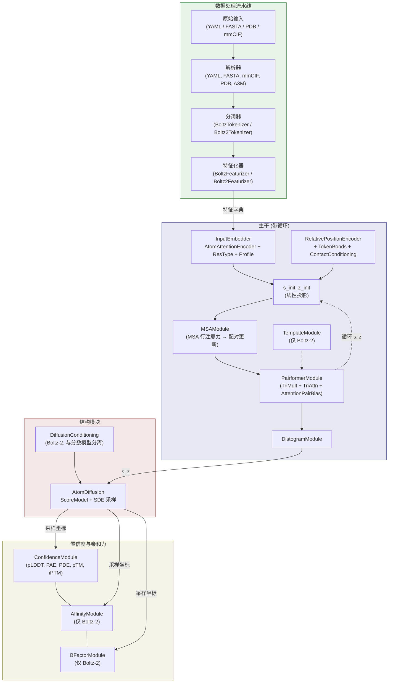

---
slug:7-architecture-overview
blog_type:normal
---


Boltz 是一个用于生物分子结构预测的深度学习框架，它建立在模块化架构之上，将数据处理与模型计算分离，同时通过定义良好的张量契约保持紧密集成。该系统实现了两代模型——**Boltz-1** 和 **Boltz-2**——它们共享基础流水线，但在条件设置、模板处理和输出能力上有所不同。本页面绘制了完整的端到端架构：从原始输入文件到 3D 坐标和置信度估计，为后续每个深入解析页面建立所需的结构化词汇。


来源: [boltz1.py](src/boltz/model/models/boltz1.py#L1-L200), [boltz2.py](src/boltz/model/models/boltz2.py#L1-L200)

## 可视化项目结构

代码库围绕数据处理 (`src/boltz/data/`) 和模型计算 (`src/boltz/model/`) 之间的清晰分离进行组织，由 CLI 入口点 (`src/boltz/main.py`) 编排整个工作流：

```
src/boltz/
├── main.py                          # CLI 入口，模型加载，推理编排
├── data/
│   ├── const.py                     # 常量：链类型，token 词表，权重
│   ├── types.py                     # 结构化数据类型 (Atom, Residue, Chain, Structure, MSA...)
│   ├── mol.py                       # 分子工具，对称性处理，规范加载
│   ├── parse/                       # 输入解析器：YAML, FASTA, mmCIF, PDB, A3M, CSV
│   ├── tokenize/                    # 分词：BoltzTokenizer, Boltz2Tokenizer
│   ├── feature/                     # 特征化：BoltzFeaturizer, Boltz2Featurizer
│   ├── msa/                         # 通过 MMseqs2 生成 MSA
│   ├── crop/                        # 训练裁剪策略（空间，亲和力）
│   ├── filter/                      # 数据过滤（静态/动态：分辨率，大小，日期）
│   ├── sample/                      # 训练采样（聚类，随机，蒸馏）
│   ├── pad.py                       # 填充工具
│   ├── module/                      # Lightning DataModules（训练，推理，v1/v2）
│   └── write/                       # 输出写入器 (PDB, mmCIF, 亲和力)
└── model/
    ├── models/                      # 顶层模型类：Boltz1, Boltz2
    ├── modules/                     # 核心计算模块
    │   ├── trunk.py / trunkv2.py   # InputEmbedder, MSAModule, PairformerModule, DistogramModule
    │   ├── diffusion.py / diffusionv2.py  # AtomDiffusion (分数模型 + 采样)
    │   ├── diffusion_conditioning.py      # Boltz-2 专用条件模块
    │   ├── confidence.py / confidencev2.py # ConfidenceModule (pLDDT, PAE, PDE, pTM)
    │   ├── affinity.py              # AffinityModule (仅 Boltz-2)
    │   ├── encoders.py / encodersv2.py    # AtomAttentionEncoder, RelativePositionEncoder
    │   └── transformers.py / transformersv2.py # DiffusionTransformer, ConditionedTransition
    ├── layers/                      # 可复用的神经网络层
    │   ├── attention.py / attentionv2.py
    │   ├── pairformer.py            # PairformerLayer, PairformerNoSeqModule
    │   ├── triangular_attention/    # TriangleAttention (起始/终止节点)
    │   ├── triangular_mult.py       # TriangleMultiplication (传入/传出)
    │   ├── outer_product_mean.py
    │   ├── transition.py
    │   └── pair_averaging.py
    ├── loss/                        # 损失函数：扩散，距离图，置信度，b因子，验证
    ├── potentials/                  # 引导势 (FK 引导，接触/物理引导)
    └── optim/                       # EMA, AlphaFoldLRScheduler
```

来源: [main.py](src/boltz/main.py#L1-L100), [types.py](src/boltz/data/types.py#L1-L200), [const.py](src/boltz/data/const.py#L1-L100)

## 端到端架构图

下图展示了从输入到输出的完整数据流，说明了四个主要阶段——数据处理、主干、结构和置信度/亲和力——如何组合成完整的预测流水线。**循环**（虚线环）多次迭代主干阶段，将精化后的单一和配对表示反馈回 MSA 和 Pairformer 模块。



来源: [boltz1.py](src/boltz/model/models/boltz1.py#L260-L399), [boltz2.py](src/boltz/model/models/boltz2.py#L200-L350)

## 核心表示系统

整个模型在四种基础张量表示上运行，这些表示流经每个模块并被其精化。理解这些表示是理解 Boltz 架构的关键。

| 表示 | 符号 | 形状 | 描述 |
|---|---|---|---|
| **Token 单一** | `s` | `(B, N_token, token_s)` | 捕获残基级语义（标识、MSA 概况、原子特征）的每 token 嵌入 |
| **Token 配对** | `z` | `(B, N_token, N_token, token_z)` | 编码所有 token 对之间几何和进化关系的 token 配对嵌入 |
| **原子单一** | `a` | `(B, N_atom, atom_s)` | 在结构模块内的原子注意力编码器/解码器中使用的每原子嵌入 |
| **原子配对** | `p` | `(B, N_atom, N_atom, atom_z)` | 捕获用于原子级注意力的局部几何上下文的原子配对嵌入 |

**token** 是主干中的基本计算单元。标准氨基酸和核苷酸残基各形成一个 token，而非聚合物（配体）残基也按每个残基进行分词。分词系统将每个残基映射到一个 token，该 token 携带其原子索引、中心/距离原子参考、对称标识符和链元数据。然后，特征化器将这些 token 扩展为模型使用的丰富特征字典。

<CgxTip>`token_s` 和 `token_z` 维度是架构的骨干——每个模块要么生成、消耗，要么转换这些表示。Boltz-1 默认 pairformer 块为 48；Boltz-2 增加到 64，反映了更深的配对精化。</CgxTip>

来源: [boltz.py](src/boltz/data/tokenize/boltz.py#L1-L100), [featurizer.py](src/boltz/data/feature/featurizer.py#L1-L100), [boltz1.py](src/boltz/model/models/boltz1.py#L70-L100)

## 模型流水线阶段

### 阶段 1：数据处理流水线

数据流水线将异构的输入格式转换为统一的特征字典。它按顺序执行四个步骤：

1. **解析**：原始文件（YAML 清单、FASTA 序列、PDB/mmCIF 结构、A3M 多序列比对）被解析为包含 `Structure`、`MSA` 和 `Record` 数据的结构化 `Input` 对象。每个解析器针对特定格式，但生成相同的规范类型。

2. **分词**：`BoltzTokenizer` (v1) 或 `Boltz2Tokenizer` 将 `Structure` 转换为 `Tokenized` 表示——将每个残基映射到一个 token，并引用其组成原子、用于帧计算的中心/距离原子以及链/对称性元数据。

3. **特征化**：特征化器将分词后的表示扩展为模型使用的完整特征字典。这包括独热残基类型、MSA 概况、缺失均值、相对位置、token 键、原子级特征、填充掩码和对称感知帧定义。

4. **数据模块**：PyTorch Lightning `DataModule` 实现（`BoltzInferenceDataModule`、`Boltz2InferenceDataModule` 及其训练对应项）处理数据集构建、整理和 DataLoader 配置。训练模块还集成了裁剪策略、过滤和采样。

来源: [inference.py](src/boltz/data/module/inference.py#L1-L100), [tokenizer.py](src/boltz/data/tokenize/tokenizer.py#L1-L25), [boltz.py](src/boltz/data/tokenize/boltz.py#L55-L100)

### 阶段 2：主干 — 嵌入与配对精化

主干是核心的迭代引擎。它接收特征字典，并通过嵌入阶段和随后的重复循环迭代，生成精化的单一 (`s`) 和配对 (`z`) 表示。

**嵌入阶段**：`InputEmbedder` 对原子级特征运行 `AtomAttentionEncoder`，生成每 token 的嵌入，这些嵌入与残基类型独热编码、MSA 概况、缺失均值和口袋特征拼接。这通过 `s_init`（线性）投影形成初始单一表示，并通过 `z_init_1`/`z_init_2`（外和）加上 `RelativePositionEncoder` 和 `TokenBonds` 形成初始配对表示。

**循环迭代**：对于每次循环迭代（推理时通常为 3–10 次），主干应用：
- **循环投影**：`s = s_init + s_recycle(LayerNorm(s))` 和 `z = z_init + z_recycle(LayerNorm(z))`，其中 `s_recycle`/`z_recycle` 使用门控初始化以实现稳定的梯度流
- **MSA 模块**（在 Boltz-1 中可选，在 Boltz-2 中始终存在）：通过配对注意力处理多序列比对行，用进化信息更新配对表示 `z`
- **模板模块**（仅 Boltz-2）：将结构模板信息纳入配对表示
- **Pairformer 模块**：核心驱动力——堆叠的 `PairformerLayer` 块应用三角乘法、三角注意力、配对加权平均和转换操作，联合更新 `s` 和 `z`

主干的输出包括**距离图**（来自 `z` 的成对距离分布预测）、精化的 `s` 和 `z` 张量，以及输入嵌入 `s_inputs`。

来源: [trunk.py](src/boltz/model/modules/trunk.py#L1-L200), [trunkv2.py](src/boltz/model/modules/trunkv2.py#L1-L200), [boltz1.py](src/boltz/model/models/boltz1.py#L260-L350)

### 阶段 3：基于扩散的结构模块

结构模块通过去噪扩散过程生成 3D 原子坐标。噪声条件分数模型迭代地将带噪坐标精化为预测结构。

**分数模型架构**：`DiffusionModule`（在 `AtomDiffusion` 内部使用）处理：
1. **单一条件**：傅里叶时间嵌入 + 主干单一表示 → 条件化的 `s`
2. **配对条件**：主干配对表示 + 相对位置 → 条件化的 `z`
3. **原子注意力编码器**：通过原子级注意力编码带噪原子坐标，并聚合到 token 级别
4. **Token Transformer**：在 token 上进行完全自注意力 (DiffusionTransformer)，以 `s` 和 `z` 为条件
5. **原子注意力解码器**：通过序列局部注意力将 token 激活广播回原子级别 → 坐标更新 `r_update`

**Boltz-2 精化**：Boltz-2 将 `DiffusionConditioning` 提取为独立模块，在条件边界启用激活检查点，并在条件计算与分数模型的前向传播之间实现更清晰的分离。推理路径可以跨扩散步骤缓存条件输出，从而显著节省内存。

**采样**：`AtomDiffusion.sample()` 方法使用预定的噪声序列（由 `sigma_min`、`sigma_max`、`rho`、`step_scale` 决定）运行逆向 SDE，可选择在每个去噪步骤应用**引导势**（Fisher-Kac 粒子过滤、接触引导、物理引导）。

来源: [diffusion.py](src/boltz/model/modules/diffusion.py#L1-L300), [diffusion_conditioning.py](src/boltz/model/modules/diffusion_conditioning.py#L1-L50), [boltz2.py](src/boltz/model/models/boltz2.py#L230-L270)

### 阶段 4：置信度与亲和力预测

结构生成后，可选的事后模块预测质量指标和结合属性：

**ConfidenceModule**：接收主干输出（`s`、`z`、`s_inputs`）和采样坐标，预测每 token 的 pLDDT（预测 LDDT）、PDE（预测距离误差）、PAE（预测对齐误差）和 pTM/iPTM（预测 TM 分数）。Boltz-2 的置信度模块增加了 token 级置信度、键类型特征和接触条件。它可以选择运行自己的 Pairformer 堆栈或模拟完整主干。

**AffinityModule**（仅 Boltz-2）：从配对表示、采样坐标和链级距离特征预测结合亲和力。使用 `PairformerNoSeqModule`（仅配对更新，无单一表示），后跟 `AffinityHeadsTransformer`。支持具有两个独立亲和力模块的**集成模式**以减少方差。

**BFactorModule**（仅 Boltz-2）：从单一表示预测每 token 的 B 因子值，并将其分箱为离散类别。

来源: [confidence.py](src/boltz/model/modules/confidence.py#L1-L100), [affinity.py](src/boltz/model/modules/affinity.py#L1-L100), [boltz2.py](src/boltz/model/models/boltz2.py#L270-L320)

## Boltz-1 与 Boltz-2：架构对比

| 方面 | Boltz-1 | Boltz-2 |
|---|---|---|
| **模型类** | `Boltz1` | `Boltz2` |
| **Pairformer 块** | 48 | 64 |
| **MSA 模块** | 可选 (`no_msa` 标志) | 始终存在，可编译 (`compile_msa`) |
| **模板支持** | 无 | `TemplateModule` / `TemplateV2Module` |
| **接触条件** | 无 | 带傅里叶阈值嵌入的 `ContactConditioning` |
| **扩散条件** | 内联在分数模型中 | 提取的 `DiffusionConditioning`（可检查点，可缓存） |
| **亲和力预测** | 无 | 带可选集成的 `AffinityModule` |
| **B 因子预测** | 无 | `BFactorModule` |
| **键类型特征** | 单一线性投影 | 键类型上可选的 `nn.Embedding` |
| **循环位置编码** | 不支持 | `cyclic_pos_enc` 标志 |
| **方法条件** | 不支持 | 实验方法类型嵌入 |
| **验证器架构** | 内联指标字典 | 带有 `val_group_mapper` 的外部 `Validator` 类 |
| **置信度模块** | 可选，支持 `imitate_trunk` 模式 | 始终存在，token 级置信度 |
| **EMA 实现** | `ExponentialMovingAverage` (内部) | 来自 `model.optim.ema` 的 `EMA` 类 |

<CgxTip>Boltz-2 提取 `DiffusionConditioning` 不仅仅是重构——它还在条件边界启用了激活检查点（`checkpoint_diffusion_conditioning` 标志），以及在推理时跨所有去噪步骤缓存条件输出，这大大减少了长序列的内存占用。</CgxTip>

来源: [boltz1.py](src/boltz/model/models/boltz1.py#L1-L200), [boltz2.py](src/boltz/model/models/boltz2.py#L1-L320)

## 层构建块

上述模块由 `src/boltz/model/layers/` 中的可复用层组合而成。这些是赋予 Boltz 强大表达能力的原子操作：

| 层 | 用途 | 使用位置 |
|---|---|---|
| **AttentionPairBias** | 带配对偏置调制的单一注意力 | PairformerLayer, MSA Layer |
| **TriangleAttention** (起始/终止) | 对配对表示的轴向注意力 | PairformerLayer |
| **TriangleMultiplication** (传入/传出) | 通过三角分解更新配对表示 | PairformerLayer |
| **OuterProductMean** | MSA → 配对表示更新 | MSA Layer |
| **PairWeightedAveraging** | 由配对特征加权的注意力聚合 | PairformerLayer |
| **Transition** | 带门控的前馈扩展 | Pairformer, MSA, 条件设置 |
| **Dropout** | 带行/列掩码的结构化 dropout | 所有模块 |

来源: [pairformer.py](src/boltz/model/layers/pairformer.py#L1-L50), [attention.py](src/boltz/model/layers/attention.py#L1-L50), [triangular_mult.py](src/boltz/model/layers/triangular_mult.py#L1-L50)

## 训练与推理编排

`Boltz1` 和 `Boltz2` 都是 PyTorch Lightning `LightningModule` 的子类，这意味着训练和推理是通过标准的 Lightning 生命周期（`training_step`、`validation_step`、`predict_step`）编排的。入口点 `main.py` 提供了一个基于 Click 的 CLI，负责处理：

1. **模型下载**：从 HuggingFace 或 Boltz 模型网关获取预训练检查点，并带有备用 URL
2. **输入处理**：解析输入文件，通过 MMseqs2 生成 MSA，并准备 `BoltzProcessedInput`
3. **数据模块构建**：实例化适当的推理数据模块（v1 或 v2）
4. **Trainer 配置**：设置带有 DDP 策略的 Lightning `Trainer` 用于多 GPU 推理
5. **输出写入**：收集预测并写入 PDB/mmCIF 文件，带有可选的亲和力和置信度注释

两个模型中的 `predict_step` 遵循相同的逻辑流程：带循环运行主干 → 扩散采样 → 可选运行置信度 → 可选运行亲和力。关键区别在于 Boltz-2 的 `predict_step` 将模板特征、接触条件和亲和力输出作为附加的特征输入和输出通道处理。

来源: [main.py](src/boltz/main.py#L1-L200), [boltz1.py](src/boltz/model/models/boltz1.py#L260-L399), [boltz2.py](src/boltz/model/models/boltz2.py#L350-L500)

## 建议阅读路径

现在你已经有了架构图，请按照深入解析页面的逻辑顺序继续阅读：

1. **[主干与 Pairformer 流水线](8-trunk-and-pairformer-pipeline)** — 理解精化单一和配对表示的核心迭代引擎
2. **[基于扩散的结构模块](9-diffusion-based-structure-module)** — 深入了解生成 3D 坐标的分数模型和去噪过程
3. **[置信度预测模块](10-confidence-prediction-module)** — 了解如何从主干输出预测 pLDDT、PAE 和 pTM
4. **[解析与输入处理](12-parsing-and-input-handling)** → **[分词系统](13-tokenization-system)** → **[特征化与特征工程](14-featurization-and-feature-engineering)** — 数据处理三部曲
5. **[Boltz-1 与 Boltz-2 差异](21-boltz-1-vs-boltz-2-differences)** — 超越上述概览表的详细比较