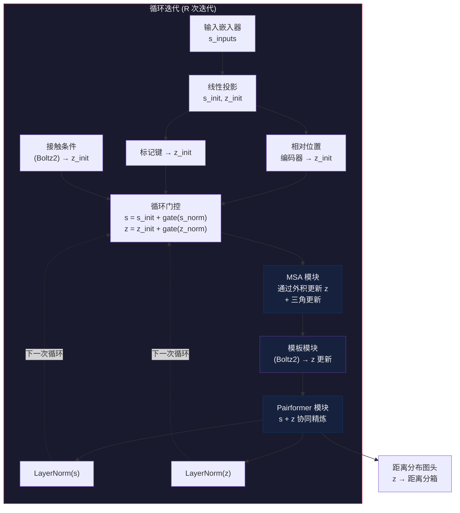
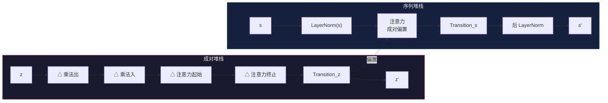

---
slug:8-trunk-and-pairformer-pipeline
blog_type:normal
---


主干与 Pairformer 流水线是 Boltz 的核心推理引擎——这一迭代精炼核心将原始输入嵌入转换为丰富的单标记表征（`s`）和成对标记表征（`z`）。这些表征编码了下游模块所需的全部信息：结构先验存在于 `z` 中，逐残基特征存在于 `s` 中，两者共同驱动基于扩散的结构生成、置信度估计和亲和力预测。该流水线遵循**循环架构**，整个主干会执行多次，每一轮将归一化后的前一轮输出作为额外输入反馈回去，逐步锐化模型对目标结构的内部表征。

## 架构概述

主干运行在两个互补的数据结构上，这两个结构映射了分子系统的两个基本视角：**序列堆栈** `s ∈ ℝ^{B×N×d_s}` 捕获单标记信息（残基类别、MSA 频谱、原子级特征），而**成对堆栈** `z ∈ ℝ^{B×N×N×d_z}` 编码每对标记之间的关联信息（相对位置、键连接、共进化信号）。主干中的每个子模块都被设计为要么单独精炼一个堆栈，要么调解两者之间的信息流动。



每次循环迭代中流水线的执行顺序严格为：**嵌入 → 初始化 → 循环 → MSA → 模板 (Boltz2) → pairformer → 归一化**。训练时梯度仅通过最后一次循环步骤反向传播，这是一个关键的设计选择，它在减少内存消耗的同时，保留了推理时迭代精炼的收益。

来源: [boltz1.py](src/boltz/model/models/boltz1.py#L200-L399), [boltz2.py](src/boltz/model/models/boltz2.py#L200-L400)

## 输入嵌入器

**InputEmbedder** 是入口点，负责将原始特征字典转换为统一的标记级嵌入 `s_inputs`。其架构在 Boltz-1 和 Boltz-2 之间存在显著差异，反映了 Boltz-2 更丰富的条件化需求。

### Boltz-1 输入嵌入器

在 Boltz-1 中，嵌入器首先将输入传递给 **AtomAttentionEncoder**——一种窗口注意力机制，用于将原子级特征聚合为标记级表征。生成的嵌入 `a` 随后与离散特征进行拼接：`res_type`（独热编码的残基类型）、`profile`（MSA 频率谱）、`deletion_mean`（平均 MSA 缺失比例）和 `pocket_feature`（口袋标注）。拼接后形成维度为 `d_s + 2·|vocab| + 1 + |pocket_info|` 的 `s_inputs`，随后该向量被 `s_init`、`z_init_1` 和 `z_init_2` 投影。

当 `no_atom_encoder=True` 时，原子注意力输出会被替换为零张量——这是一种完全禁用原子级编码的降级模式，适用于消融实验或内存受限的场景。

### Boltz-2 输入嵌入器

Boltz-2 将原子编码器解耦为两个阶段：首先是 **AtomEncoder**，它生成逐原子查询、上下文向量、成对偏置和键投影；接着是 **AtomAttentionEncoder**，它直接消费这些预计算的中间结果，而非重新推导。原子级成对表征 `p` 通过 `LayerNorm → Linear` 路径（`atom_enc_proj_z`）进行投影，以生成注意力偏置。最终的单表征是一个加法组合：`s = a + res_type_encoding + msa_profile_encoding`，其中每一项都被独立投影到 `token_s` 维度。

Boltz-2 还额外支持**方法条件化**（实验方法类型）、**修饰残基标志**、**环化周期编码**和**分子类型特征**——每一项均被实现为初始化为零的学习嵌入，确保它们初始时作为恒等增强，并在训练过程中逐渐学习其贡献。

来源: [trunk.py](src/boltz/model/modules/trunk.py#L12-L97), [trunkv2.py](src/boltz/model/modules/trunkv2.py#L70-L198)

## 初始化与循环

### 成对初始化

成对表征 `z` 初始化为三个信息源的总和，遵循因子化外积设计：

```
z_init = z_init_1(s_inputs)[:, :, None] + z_init_2(s_inputs)[:, None, :] 
       + relative_position_encoding + token_bonds + contact_conditioning
```

两个线性投影 `z_init_1` 和 `z_init_2` 作用于相同的输入嵌入，但沿着不同的轴——`z_init_1` 沿列维度广播，`z_init_2` 沿行维度广播。这种因子化确保了在建模任何交互之前，`z_init[i,j]` 能够同时捕获标记 `i` 和标记 `j` 的独立上下文。**RelativePositionEncoder** 注入了距离感知的归纳偏置，而 **token_bonds** 添加了共价连接信息。在 Boltz-2 中，**ContactConditioning** 进一步用用户指定的接触约束来增强 `z_init`。

### 循环机制

在跨循环迭代中，前一轮的输出 `s` 和 `z` 会被**门控**并反馈到当前迭代：

```python
s = s_init + s_recycle(s_norm(s))    # 门控初始化接近零
z = z_init + z_recycle(z_norm(z))    # 门控初始化接近零
```

循环投影使用了**门控初始化**——权重被初始化为接近零的值，因此在第一次前向传播中，门控输出微乎其微，模型表现得就像没有先验信息一样。这是一个关键的设计选择：它确保了从随机初始化开始训练的稳定性，同时允许门控在模型学会利用循环表征时逐渐开启。训练时，除了最后一步外，所有循环步骤均禁用梯度计算（`torch.set_grad_enabled(self.training and (i == recycling_steps))`），这阻止了反向传播在多次迭代中展开，从而大幅减少了内存消耗。

来源: [boltz1.py](src/boltz/model/models/boltz1.py#L268-L340), [boltz2.py](src/boltz/model/models/boltz2.py#L213-L237)

## MSA 模块

**MSAModule** 将进化信息与成对堆栈桥接起来。它通过一叠 `MSALayer` 块处理多序列比对数据——这是结构预测中最丰富的信号之一，在 MSA 表征 `m ∈ ℝ^{B×S×N×d_m}` 和成对表征 `z` 之间进行双向通信。

### MSA 输入处理

原始 MSA 特征通过拼接以下内容进行组装：独热标记索引（`msa`）、缺失指示符（`has_deletion`）、缺失值（`deletion_value`），以及可选的配对 MSA 指示符（`msa_paired`）。拼接后的特征向量通过 `msa_proj` 投影到 `msa_s` 维度，然后加上单表征的广播：`m = msa_proj(msa_feats) + s_proj(emb).unsqueeze(1)`。在 MSA 序列维度上的 unsqueeze 确保了标记级上下文在所有 MSA 行中共享。

当 `subsample_msa=True` 时，每次前向传播都会随机选择一个 MSA 序列子集（由 `num_subsampled_msa` 控制，默认为 1024），提供随机正则化以防止过拟合于特定的 MSA 组成。

### MSALayer 内部机制

每个 `MSALayer` 执行两个方向的更新：

**成对 → MSA 通信**：**PairWeightedAveraging** 模块计算 MSA 行的注意力加权平均，其中注意力权重源自成对表征 `z`。这使得每个 MSA 行能够选择性地关注成对的结构先验。结果在应用 dropout 后加到 `m` 上，接着是一个两层 `Transition`（带 4× 扩展因子）。

**MSA → 成对通信**：**OuterProductMean** 计算 MSA 行嵌入的外积（带有逐行掩码），将结果投影以更新 `z`。这是将共进化耦合信号从 MSA 提取到成对特征中的关键操作。注入之后，成对堆栈经历完整的三角更新序列（乘法出 → 乘法入 → 三角注意力起始 → 三角注意力终止 → transition），在结构上与 PairformerLayer 的成对路径相同。

<CgxTip>对于较大的 MSA 深度，MSA 模块的外积均值是计算瓶颈。`chunk_size_outer_product` 参数（在推理时针对大输入设为 4）通过以较小的批次处理外积来控制内存与速度的权衡。如果你在 MSA 处理期间观察到 OOM，通过 `subsample_msa` 减少 MSA 深度比减少块大小更有效。</CgxTip>

### Boltz-2 MSA 差异

Boltz-2 的 `MSALayer` 用单次 `PairformerNoSeqLayer` 调用替代了内联的三角更新序列——这是一个重构的、自包含的模块，封装了相同的三角操作，但没有单表征更新。这种架构重构提高了代码复用性，并允许对成对路径进行独立优化。此外，Boltz-2 在投影前对原始 MSA 索引应用独热编码（`torch.nn.functional.one_hot`），而 Boltz-1 期望的是预编码的特征。Boltz-2 中的激活检查点直接使用 `torch.utils.checkpoint.checkpoint`，而不是 FairScale 的 `checkpoint_wrapper`。

来源: [trunk.py](src/boltz/model/modules/trunk.py#L99-L398), [trunkv2.py](src/boltz/model/modules/trunkv2.py#L445-L697)

## 模板模块 (Boltz-2)

**TemplateModule** 是 Boltz-2 独有的模块，它将已知的结构模板纳入成对表征中。对于每个模板，它计算一个丰富的特征向量 `a_tij`，包含：

| 特征 | 描述 | 维度 |
|---------|-------------|------------|
| 距离分布图 | 分箱的 Cβ–Cβ 距离直方图 | `num_bins` (默认 38) |
| Cβ 掩码 | 成对 Cβ 坐标的有效性 | 1 |
| 单位向量 | 局部坐标系中的 Cα 位置 | 3 |
| 坐标系掩码 | 成对坐标系的有效性 | 1 |
| 残基类型 | 两个位置的标记类别 | `2 × num_tokens` |

模板特征通过不对称掩码（Boltz-1 中的 `asym_id` 相等性检查；Boltz-2 的 `TemplateV2Module` 中的 `visibility_ids`）被限制为**链内交互**，防止在没有结构先例的情况下跨链模板信号泄漏。组合特征被投影到 `template_dim`，并由 `PairformerNoSeqModule` 处理——这是一个纯粹的成对堆栈，在不触及单表征的情况下精炼模板表征。模板通过掩码平均进行聚合（按模板有效性加权，按模板数量归一化），然后通过 ReLU + 线性路径投影回 `token_z` 维度并加到 `z` 上。

来源: [trunkv2.py](src/boltz/model/modules/trunkv2.py#L210-L447)

## 接触条件化 (Boltz-2)

**ContactConditioning** 允许用户将成对距离约束注入模型。它通过 **Fourier 嵌入**编码连续的距离阈值（提供一种跨距离尺度泛化的平滑周期性表征），将其与分类接触条件化特征拼接，并通过一个线性层进行投影。两个特殊的学习向量——`encoding_unspecified` 和 `encoding_unselected`——分别处理未提供约束或明确未选择某个位置的情况，确保条件化信号在各处都有明确定义。

来源: [trunkv2.py](src/boltz/model/modules/trunkv2.py#L15-L68)

## Pairformer 模块

**PairformerModule** 是主干的核心——通过堆叠的 `PairformerLayer` 块联合处理单表征和成对表征的迭代精炼器。它是唯一以紧密耦合方式同时直接更新 `s` 和 `z` 的子模块。

### PairformerLayer 数据流

每个 `PairformerLayer` 通过两个顺序阶段处理其输入：

**阶段 1 — 成对堆栈更新**：成对表征 `z` 经历四次三角操作，每次操作后接 dropout 和残差连接：

1. **TriangleMultiplicationOutgoing** — 沿行聚合信息，生成出边更新
2. **TriangleMultiplicationIncoming** — 沿列聚合信息，生成入边更新
3. **TriangleAttentionStartingNode** — 每条边关注共享相同起始节点的所有边的注意力
4. **TriangleAttentionEndingNode** — 每条边关注共享相同终止节点的所有边的注意力

随后对 `z` 逐点应用一个 **Transition** 层（带 4× 扩展的两层 MLP）。

**阶段 2 — 序列堆栈更新**：单表征 `s` 通过 **AttentionPairBias** 进行更新，其中成对表征 `z` 为注意力对数提供偏置项。这是关键的耦合机制：编码在 `z` 中的结构先验直接调制标记彼此关注的方式。注意力之后，对 `s` 应用 `Transition` MLP。



<CgxTip>PairformerLayer 的序列堆栈在运行时使用了 `torch.autocast("cuda", enabled=False)`——强制注意力计算使用 float32 精度。这是一个刻意的选择，旨在防止在成对偏置注意力 softmax 中出现数值不稳定，因为当 `z` 偏置较大时，softmax 可能会产生极其尖锐的分布。如果你在训练期间观察到 NaN 损失，请检查是否在 pairformer 周围无意间启用了混合精度。</CgxTip>

### Boltz-1 与 Boltz-2 Pairformer 差异

| 方面 | Boltz-1 PairformerLayer | Boltz-2 PairformerLayer |
|--------|------------------------|------------------------|
| 注意力实现 | `AttentionPairBias` (v1) | `AttentionPairBiasV2` |
| 后层归一化 | 不支持 | 可选的 `s_post_norm` |
| `no_update_s` / `no_update_z` | 条件性创建子模块 | 始终创建所有子模块 |
| 块大小控制 | 每次调用的外部参数 | 从 `z.shape` 内部计算 |
| 自动混合精度处理 | 未显式指定 | 序列堆栈周围的 `torch.autocast("cuda", enabled=False)` |
| 内核支持 | 每次操作的 `use_kernels` | `use_cuequiv_mul` / `use_cuequiv_attn` 标志 |

在 Boltz-1 中，`PairformerModule` 支持 `no_update_s` 和 `no_update_z` 标志——当 `no_update_z=True` 时，仅抑制最后一层的 `z` 更新（中间层始终更新 `z`）。这被置信度模块的模仿主干所使用。Boltz-2 的 `PairformerModule` 移除了这些标志，始终执行完整更新，并根据序列长度是否超过 `const.chunk_size_threshold` 在内部计算三角注意力的块大小。

### 推理分块策略

在推理期间，pairformer 根据输入大小动态调整内存与速度的权衡：

| 序列大小 | `chunk_size_tri_attn` | 行为 |
|---------------|----------------------|----------|
| > `chunk_size_threshold` | 128 | 激进分块；减少内存 |
| ≤ `chunk_size_threshold` | 512 | 轻度分块；执行更快 |
| 训练 | `None` | 无分块；完全物化 |

这种自适应策略确保了大型复合物（可能具有 `N > 2000` 个标记）在消费级 GPU 上仍然可行，而无需诉诸 CPU 卸载。

来源: [pairformer.py](src/boltz/model/layers/pairformer.py#L1-L200), [trunk.py](src/boltz/model/modules/trunk.py#L399-L689)

## 三角更新原语

三角操作构成了成对推理的数学骨干。它们利用成对张量 `z ∈ ℝ^{N×N×d_z}` 的几何结构，沿着定义每条边的两个轴传播信息。

### 三角乘法

**出边** (`TriangleMultiplicationOutgoing`)：对于边 `(i,j)`，沿 `i` 行聚合所有中间节点 `k` 的特征：`z[i,j]` 的更新依赖于所有 `k` 的 `z[i,k]`。这捕获了传递性属性：“如果 i 接近 k，且 k 接近 j，那么 i 可能接近 j。”

**入边** (`TriangleMultiplicationIncoming`)：对于边 `(i,j)`，沿 `j` 列聚合所有中间节点 `k` 的特征：`z[i,j]` 的更新依赖于所有 `k` 的 `z[k,j]`。

这两种操作都通过线性投影将输入因子化为左右分量，在中间维度上计算逐元素乘积，然后投影回去。层归一化和门控机制确保了训练的稳定性。

### 三角注意力

**起始节点** (`TriangleAttentionStartingNode`)：对于边 `(i,j)`，在共享相同起始节点 `i` 的所有边上执行注意力——即来自 `z[i,j]` 的查询关注所有 `k` 中来自 `z[i,k]` 的键。注意力掩码确保只有有效的标记对参与计算。

**终止节点** (`TriangleAttentionEndingNode`)：对于边 `(i,j)`，在共享相同终止节点 `j` 的所有边上执行注意力——即来自 `z[i,j]` 的查询关注所有 `k` 中来自 `z[k,j]` 的键。这是按列计算的，从而实现了高效的分块实现。

来源: [trunk.py](src/boltz/model/modules/trunk.py#L598-L689), [pairformer.py](src/boltz/model/layers/pairformer.py#L100-L165)

## 距离分布图头

在最后一次循环迭代之后，成对表征 `z` 被传递给 **DistogramModule**，该模块预测分箱上的离散距离分布：

```python
# Boltz-1: 单一距离分布图
z = z + z.transpose(1, 2)   # 强制对称性
logits = linear(z)           # → ℝ^{B×N×N×num_bins}

# Boltz-2: 支持多个距离分布图
logits = linear(z).reshape(B, N, N, num_distograms, num_bins)
```

对称加法 `z + z.transpose(1,2)` 确保了预测的距离分布图在构造上是对称的——从标记 `i` 到标记 `j` 的距离等于从 `j` 到 `i` 的距离。Boltz-2 通过 `num_distograms` 将此扩展为支持多个独立的距离分布图头，从而能够从相同的成对表征同时预测不同的距离度量（例如，Cβ–Cβ 和 Cα–Cα 距离）。

来源: [trunk.py](src/boltz/model/modules/trunk.py#L668-L689), [trunkv2.py](src/boltz/model/modules/trunkv2.py#L797-L829)

## 编译与优化

Boltz-1 和 Boltz-2 均支持对 pairformer、MSA、模板、置信度和亲和力模块进行选择性 `torch.compile` 包装。Pairformer 是计算最密集的组件，最能从编译中受益。编译后，原始模块可通过 `_orig_mod` 访问，用于验证期间的降级处理（此时动态形状可能会触发重新编译）。Dynamo 缓存限制被提升至 512（`cache_size_limit` 和 `accumulated_cache_size_limit`），以适应训练期间遇到的各种输入形状。

Pairformer 还支持**激活检查点**——通过在后向传播期间重新计算中间激活来用计算换取内存。在 Boltz-1 中，这使用了 FairScale 带可选 CPU 卸载的 `checkpoint_wrapper`；在 Boltz-2 中，它使用了 PyTorch 原生的 `torch.utils.checkpoint.checkpoint`。编译和检查点之间的选择并不互斥，但对于大多数 GPU 配置而言，两者叠加带来的内存节省通常是不必要的。

来源: [boltz1.py](src/boltz/model/models/boltz1.py#L213-L225), [boltz2.py](src/boltz/model/models/boltz2.py#L256-L282)

## 后续内容

主干的输出表征 `s` 和 `z` 由三个下游模块消费：[基于扩散的结构模块](9-diffusion-based-structure-module)使用它们来调节 3D 坐标生成的去噪过程；[置信度预测模块](10-confidence-prediction-module)利用它们（连同预测的结构）来估计 pLDDT、PAE 和 PDE；[结合亲和力预测](11-binding-affinity-prediction)模块使用它们来预测结合强度。理解主干的信息流对于使用这些下游系统中的任何一个都至关重要。