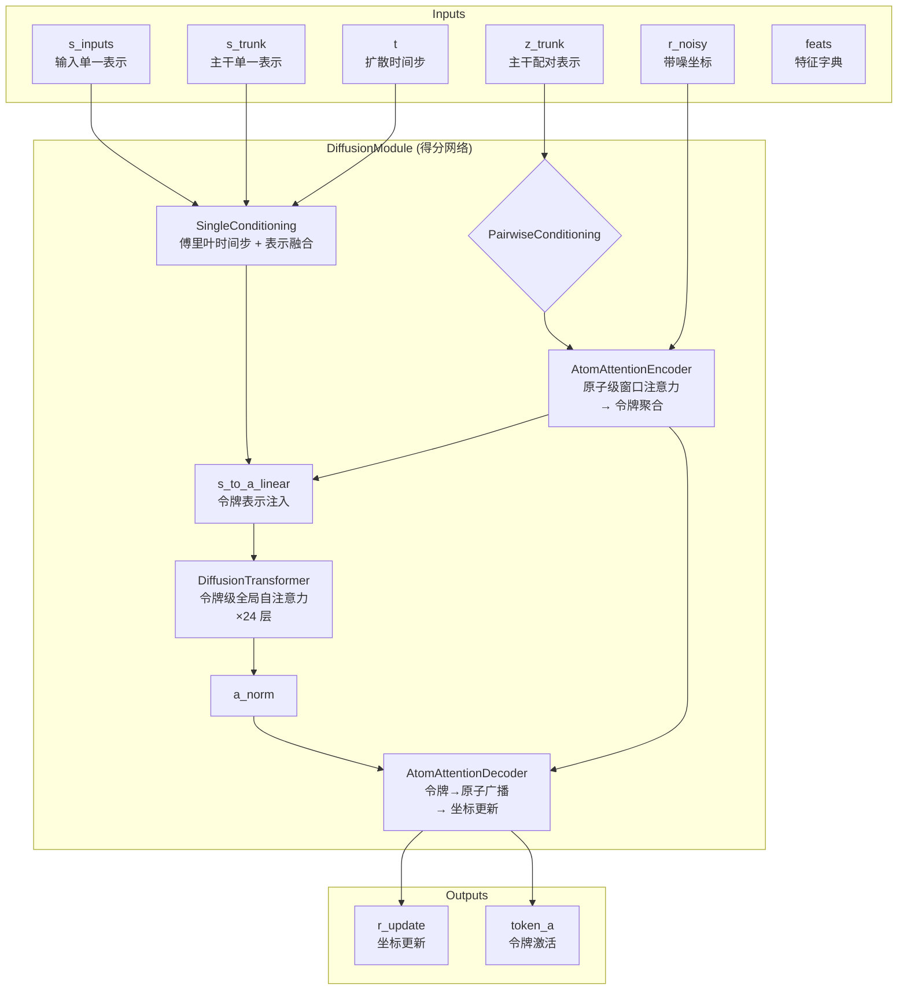

---
slug:9-diffusion-based-structure-module
blog_type:normal
---


基于扩散的结构模块是 Boltz 的坐标生成引擎——这是一个去噪扩散概率模型，它将纯高斯噪声迭代优化为物理上合理的 3D 原子坐标。该模块根植于 Karras 等人提出的预条件扩散框架，并在架构上借鉴了 AlphaFold3 的结构模块，作为**三阶段注意力流水线**运行：原子级编码 → 令牌级全局自注意力 → 原子级解码。该模块接收来自 [主干与 Pairformer 流水线](8-trunk-and-pairformer-pipeline) 的单一和配对表示，并在训练期间生成去噪后的原子位置，在推理期间生成采样结构，同时支持用于引导生成的可选导向势。

## 架构概述

扩散模块被组织为两个协同工作的主要类：`DiffusionModule`（得分网络）和 `AtomDiffusion`（扩散过程协调器）。在 Boltz-2 中，第三个组件——`DiffusionConditioning`——提取并缓存各去噪步骤间的共享计算，通过避免成对偏置和原子编码的冗余重新计算，显著提升了推理速度。



来源: [diffusion.py](src/boltz/model/modules/diffusion.py#L1-L199), [diffusionv2.py](src/boltz/model/modules/diffusionv2.py#L1-L199)

## 得分网络：DiffusionModule

`DiffusionModule` 是一个神经网络，它将带噪原子坐标和扩散时间步映射为坐标更新预测。它实现的是**去噪器架构**——而非直接的得分估计器——并被预条件函数封装，将其输出转换为去噪坐标。

### SingleConditioning：时间步感知的表示融合

`SingleConditioning` 模块将主干的单一表示（`s_trunk`）与输入表示（`s_inputs`）融合，并通过**随机傅里叶嵌入**注入扩散时间步信息。时间步通过一个固定（不可学习）的线性层进行投影，然后经过余弦激活函数生成 256 维的傅里叶编码。该编码经过归一化和线性投影后，被加到融合后的单一表示中，随后通过两个残差跃迁层进行优化。最终得到的条件化单一表示 `s` 的维度为 `2 * token_s`，并通过自适应层归一化调制后续的每一个注意力层。

在 Boltz-2 的 `SingleConditioning` 中，输入维度被简化为 `2 * token_s`（移除了 v1 中额外的令牌类型和口袋接触特征），并且 `disable_times` 标志允许对时间步信号进行消融。傅里叶嵌入遵循 AlphaFold3 补充材料的算法 22：一个从 N(0,1) 初始化并在初始化时冻结的随机投影矩阵，随后执行 `cos(2π · Wx + b)`。

来源: [encoders.py](src/boltz/model/modules/encoders.py#L86-L167), [encodersv2.py](src/boltz/model/modules/encodersv2.py#L96-L178)

### PairwiseConditioning：配对表示优化

`PairwiseConditioning` 模块将主干的配对表示 `z_trunk` 与相对位置编码拼接，将拼接结果投影回 `token_z` 维度，并通过两个残差跃迁层进行优化。这种条件化的配对表示为原子级和令牌级注意力机制提供了**成对偏置**。

在 Boltz-2 中，该模块被移入 `DiffusionConditioning` 预计算块，这意味着配对表示在去噪循环开始前只进行**一次**条件化，而不是在每个去噪步骤中重新计算——这是一项关键的推理优化。

来源: [encoders.py](src/boltz/model/modules/encoders.py#L169-L210), [diffusion_conditioning.py](src/boltz/model/modules/diffusion_conditioning.py#L1-L117)

### AtomAttentionEncoder：原子到令牌的抽象

`AtomAttentionEncoder` 是第一个注意力阶段，在滑动窗口内执行**序列局部原子注意力**，然后将原子级表示聚合为令牌级表示。它是扩散模块中计算最复杂的组件。

该编码器处理四类信息：

| 输入 | 编码 | 用途 |
|-------|----------|---------|
| 原子特征（ref_pos, charge, element, name chars） | `embed_atom_features` → `atom_s` | 每个原子的化学标识 |
| 原子对特征（相对参考位置，距离，掩码） | `embed_atompair_ref_pos/dist/mask` → `atom_z` | 局部几何上下文 |
| 令牌单一表示（`s_trunk`） | `s_to_c_trans` → 广播至原子 | 令牌级条件化 |
| 令牌配对表示（`z`） | `z_to_p_trans` → 收集至原子对 | 配对级条件化 |
| 带噪坐标（`r`） | `r_to_q_trans`（10D → `atom_s`） | 依赖结构的查询 |

窗口注意力机制使用 `atoms_per_window_queries=32` 和 `atoms_per_window_keys=128`，这意味着每个包含 32 个原子的查询窗口会关注包含 128 个原子的键窗口。预计算的**索引矩阵**高效地将原子映射到其键窗口。原子配对表示 `p` 由三个来源构建：(1) 从每个窗口内参考位置派生的几何特征，(2) 通过 `atom_to_token` 映射投影并收集的令牌配对信息，(3) 通过查询/键路径投影并通过 MLP 组合的原子单一表示。

在原子 Transformer（3 层，4 个注意力头）处理这些输入后，原子级输出通过使用 `atom_to_token` 映射对每个令牌的组成原子进行平均池化，**聚合至令牌**，生成维度为 `2 * token_s` 的令牌级激活 `a`。

<CgxTip>在 Boltz-2 中，编码器的配对表示 `p` 和投影偏置在 `DiffusionConditioning` 中预计算，并跨去噪步骤缓存。只有依赖坐标的查询（`r_to_q_trans`）会在每步重新计算，这大大降低了长序列每步的计算成本。</CgxTip>

来源: [encoders.py](src/boltz/model/modules/encoders.py#L256-L598), [encodersv2.py](src/boltz/model/modules/encodersv2.py#L210-L566)

### 令牌级 DiffusionTransformer

`DiffusionTransformer` 在令牌级激活 `a`（维度为 `2 * token_s`）上运行，并在所有令牌之间执行全局自注意力。这是最深的组件，拥有**24 层和 8 个注意力头**，也是扩散模块容量主要所在之处。

每个 `DiffusionTransformerLayer` 遵循**自适应层归一化（AdaLN）**模式：条件化的单一表示 `s` 调制注意力和跃迁操作。具体来说：

1. **AttentionPairBias**：带有来自 `z` 的配对偏置的令牌级注意力，由 AdaLN 调制的单一条件进行门控
2. **ConditionedTransitionBlock**：带有 AdaLN 条件化和初始化至近零（bias=-2.0 → σ(-2) ≈ 0.12）的输出门的 SwiGLU 门控 MLP，使得具有逐渐开启的残差路径的训练能够保持稳定

近零输出门初始化是一个关键的设计选择——它确保在训练开始时，扩散 Transformer 充当近似恒等函数，防止在早期优化中出现破坏稳定性的大幅更新。

在 Boltz-2 中，配对偏置在 `DiffusionConditioning` 中预投影，并作为 `token_trans_bias` 传入，避免了在每个去噪步骤中对 `z` 进行重复的线性投影。`DiffusionTransformer` 也移除了显式的 `dim_pairwise` 参数，因为偏置现在已经预计算好了。

来源: [transformers.py](src/boltz/model/modules/transformers.py#L1-L324), [diffusionv2.py](src/boltz/model/modules/diffusionv2.py#L69-L131)

### AtomAttentionDecoder：令牌到原子的广播

`AtomAttentionDecoder` 反转了编码器的逻辑：它**将令牌级激活广播回原子粒度**，并生成最终的坐标更新 `r_update`。令牌激活 `a` 通过 `a_to_q_trans` 投影为原子查询，与来自编码器的缓存跳跃连接（`q_skip`、`c_skip`，以及 v1 中的 `p_skip`）组合，并通过一个 3 层 4 头的原子 Transformer 进行处理。输出通过 `atom_feat_to_atom_pos_update`（LayerNorm → Linear）映射为 3D 坐标更新。

来源: [encoders.py](src/boltz/model/modules/encoders.py#L553-L640), [diffusion.py](src/boltz/model/modules/diffusion.py#L176-L199)

## 扩散过程：AtomDiffusion

`AtomDiffusion` 类协调完整的扩散过程——包括用于训练的前向（加噪）传递和用于推理的反向（去噪）传递。它用 **Karras 预条件**封装了 `DiffusionModule`，并实现了带有可选引导机制的随机采样器。

### Karras 预条件

遵循 Karras 等人（2022）的方法，网络输出经过预条件处理以提高训练稳定性和收敛性。四个标量函数转换原始网络输入/输出：

| 函数 | 公式 | 作用 |
|----------|---------|------|
| `c_skip(σ)` | σ_data² / (σ² + σ_data²) | 跳跃连接权重（在高噪声时占主导） |
| `c_out(σ)` | σ · σ_data / √(σ² + σ_data²) | 输出缩放（在高噪声时趋近于零） |
| `c_in(σ)` | 1 / √(σ² + σ_data²) | 输入归一化 |
| `c_noise(σ)` | 0.25 · ln(σ / σ_data) | 时间步编码输入 |

去噪预测为：`x̂ = c_skip · x_noisy + c_out · network(c_in · x_noisy, c_noise)`。在高噪声水平（σ ≫ σ_data）下，`c_skip ≈ 1` 且 `c_out ≈ 0`，因此输出默认为带噪输入。在低噪声水平（σ ≪ σ_data）下，`c_skip ≈ 0` 且 `c_out ≈ σ`，从而实现精确的优化。

来源: [diffusion.py](src/boltz/model/modules/diffusion.py#L347-L395), [diffusionv2.py](src/boltz/model/modules/diffusionv2.py#L213-L242)

### 噪声调度与采样

采样调度使用 `sigma_min` 和 `sigma_max` 之间的 **ρ 参数化几何级数**，并由 `sigma_data` 进行缩放：

```
σ(i) = [σ_max^(1/ρ) + i/(N-1) · (σ_min^(1/ρ) - σ_max^(1/ρ))]^ρ · σ_data
```

在默认设置 `rho=7`、`sigma_min=0.0004`、`sigma_max=160.0` 和 `sigma_data=16.0` 下，该调度在低噪声水平（精度至关重要的地方）分配更多步骤，而在高噪声水平分配较少步骤。最后一步的 σ=0，得出干净的预测。

在每个步骤中，**随机 gamma 噪声注入**会添加受控噪声：`t̂ = σ_tm · (1 + γ)`，其中当 `σ > γ_min = 1.0` 时，`γ = γ_0 = 0.8`。添加的噪声方差为 `noise_scale² · (t̂² - σ_tm²)`，其中 `noise_scale=1.003`。这种随机性防止采样器坍缩为模式平均预测，并使引导机制能够发挥作用。

去噪步骤遵循 Euler-Maruyama 风格的更新：

```
x_{t+1} = x_noisy + step_scale · (σ_{t+1} - t̂) · (x_noisy - x̂) / t̂
```

其中 `step_scale=1.5` 控制更新幅度。在 Boltz-2 中，`step_scale_random` 允许在训练期间随机化此参数，以提高鲁棒性。

来源: [diffusion.py](src/boltz/model/modules/diffusion.py#L396-L460), [diffusionv2.py](src/boltz/model/modules/diffusionv2.py#L243-L345)

### 随机增强与对齐

在每个去噪步骤中，当前坐标都会经历**随机刚体增强**：居中（减去平均位置），随后进行随机旋转和平移。这确保了扩散模型保持等变性——它从不依赖绝对位置或方向。相同的增强应用于去噪预测和任何累积的引导更新。

当 `alignment_reverse_diff=True`（可选模式）时，带噪坐标在计算去噪步骤之前，使用 `weighted_rigid_align` 函数与去噪预测进行**刚体对齐**。这可以提高结构一致性，但会增加计算成本。

来源: [diffusion.py](src/boltz/model/modules/diffusion.py#L461-L505), [diffusionv2.py](src/boltz/model/modules/diffusionv2.py#L346-L398)

### 引导与导向

采样器支持两种互补的引导机制，详情请参阅 [导向势与引导](18-steering-potentials-and-guidance)：

**Feynman-Kac (FK) 引导**维持一个粒子群（每个样本 `num_particles` 个粒子），并定期基于能量加权的 log-G 值重采样粒子。重采样权重为：`softmax(ll_difference + fk_lambda · log_G)`，其中 `log_G` 跟踪累积能量变化，`ll_difference` 解释了物理引导带来的对数似然偏移。

**物理/接触引导**计算基于梯度的去噪预测更新。在 `num_gd_steps` 次迭代中，来自所有活动势能的能量梯度被累积并从 `atom_coords_denoised` 中减去。由此产生的引导更新按 `step_scale · (σ_{t+1} - t̂) / t̂` 缩放，以匹配去噪步骤的幅度，确保与扩散过程的平滑整合。

来源: [diffusion.py](src/boltz/model/modules/diffusion.py#L506-L590), [diffusionv2.py](src/boltz/model/modules/diffusionv2.py#L399-L520)

## DiffusionConditioning：跨步骤缓存（Boltz-2）

Boltz-2 引入了 `DiffusionConditioning` 模块，它从去噪循环中提取所有**仅依赖静态输入**（而不依赖不断变化的带噪坐标）的计算。这是一项关键的性能优化：如果没有它，配对表示条件化、原子编码和注意力偏置投影将在每个去噪步骤中被冗余地重新计算。

该模块预计算并返回六个张量：

| 输出 | 来源 | 消费者 |
|--------|--------|-----------|
| `q` | AtomEncoder 原子查询 | AtomAttentionEncoder, AtomAttentionDecoder |
| `c` | AtomEncoder 原子条件化 | AtomAttentionEncoder, AtomAttentionDecoder |
| `to_keys` | 索引函数 | AtomAttentionEncoder, AtomAttentionDecoder |
| `atom_enc_bias` | `atom_enc_proj_z` × 原子对表示 `p` | AtomAttentionEncoder 注意力层 |
| `atom_dec_bias` | `atom_dec_proj_z` × 原子对表示 `p` | AtomAttentionDecoder 注意力层 |
| `token_trans_bias` | `token_trans_proj_z` × 条件化的 `z` | DiffusionTransformer 注意力层 |

每个偏置投影由一个 LayerNorm → Linear(heads) 对组成，按 Transformer 层堆叠并沿头部维度拼接。这意味着每一层的注意力偏置只预计算一次，只有依赖坐标的查询注入（`r_to_q_trans`）在每个去噪步骤中运行。

<CgxTip>`DiffusionConditioning` 缓存是 Boltz-2 在同等模型大小下实现比 Boltz-1 更快推理的主要原因。通过将所有静态投影提升到 N 步去噪循环之外，每步的成本降低到仅包含动态（依赖坐标的）计算——大致是带噪坐标查询注入和三次 Transformer 前向传递。</CgxTip>

来源: [diffusion_conditioning.py](src/boltz/model/modules/diffusion_conditioning.py#L1-L117), [diffusionv2.py](src/boltz/model/modules/diffusionv2.py#L47-L131)

## 训练：前向扩散与损失

### 前向过程

在训练期间，前向传递从**对数正态分布**中采样噪声水平：`σ = σ_data · exp(P_mean + P_std · ε)`，其中 `ε ~ N(0,1)`，默认值为 `P_mean=-1.2` 和 `P_std=1.5`。该分布侧重于中等噪声水平，同时覆盖整个范围。当 `synchronize_sigmas=True` 时，相同的 σ 在多重度维度上共享（样本的所有增强视图），这可以稳定多样本批次的训练。

真实坐标首先**通过随机增强居中**（随机旋转 + 平移），然后加噪：`x_noisy = x + σ · ε`。预条件的网络前向传递生成去噪预测，并针对对齐后的真实值计算损失。

来源: [diffusion.py](src/boltz/model/modules/diffusion.py#L730-L796), [diffusionv2.py](src/boltz/model/modules/diffusionv2.py#L578-L630)

### 损失函数

训练损失结合了两个项：

**1. 加权 MSE 损失**：在真实值与预测值进行**加权刚体对齐**（使用基于 SVD 的最优旋转）后，使用依赖于类别的对齐权重计算每个原子的 MSE：

| 分子类型 | 权重乘数 | 原理 |
|---------------|-------------------|-----------|
| 蛋白质 | 1.0 | 基线 |
| DNA/RNA | 5.0（`nucleotide_loss_weight`） | 核酸更难预测 |
| 配体（NONPOLYMER） | 10.0（`ligand_loss_weight`） | 小分子需要额外监督 |

每个样本的 MSE 进一步由 **Karras 损失权重**加权：`w(σ) = (σ² + σ_data²) / (σ · σ_data)²`，该权重在不同噪声水平下对损失进行归一化，使得没有单一噪声尺度占据主导。

**2. 平滑 LDDT 损失**：一种辅助损失，用于衡量局部距离差异，为 LDDT 指标提供可微分的代理。对于距离截断范围内的每对原子（核酸对为 30Å，其他为 15Å），它在 0.5Å、1.0Å、2.0Å 和 4.0Å 距离差异处计算基于 sigmoid 的软阈值，并取平均值以产生平滑的相似度得分。损失为 `1 - mean(LDDT)`，旨在鼓励局部结构的一致性。

来源: [diffusion.py](src/boltz/model/modules/diffusion.py#L798-L868), [diffusionv2.py](src/boltz/model/modules/diffusionv2.py#L598-L694), [loss/diffusionv2.py](src/boltz/model/loss/diffusionv2.py#L1-L140)

## Boltz-1 与 Boltz-2：扩散模块差异

| 方面 | Boltz-1 | Boltz-2 |
|--------|---------|---------|
| 配对条件化 | 循环内（每次去噪步骤） | 通过 `DiffusionConditioning` 预计算 |
| 注意力偏置 | 在每个 Transformer 层内计算 | 预投影，作为缓存张量传递 |
| 原子编码器配对表示 | 每步重新计算 | 在 `DiffusionConditioning` 中缓存 |
| `token_z` 参数 | 存在于 `DiffusionModule` 中 | 已移除（偏置预投影至头维度） |
| `step_scale` | 固定为 1.5 | 支持 `step_scale_random` 以增强训练鲁棒性 |
| 坐标增强 | 仅训练时 | 独立的 `coordinate_augmentation_inference` 标志 |
| 接触引导 | 不支持 | 在物理引导旁增加了 `contact_guidance_update` |
| 激活检查点 | 通过 Fairscale 包装器 | 通过 `torch.utils.checkpoint` |
| 解码器中的 `p_skip` | 显式传递 | 已移除；偏置已预缓存 |
| `filter_by_plddt` | 不可用 | 可选的基于 pLDDT 的损失掩码 |
| 令牌表示累积 | `OutTokenFeatUpdate` 模块 | 已移除（已简化） |

来源: [diffusion.py](src/boltz/model/modules/diffusion.py#L1-L868), [diffusionv2.py](src/boltz/model/modules/diffusionv2.py#L1-L694)

## 推理缓存与内存优化

Boltz-1 支持**推理模型缓存**（`use_inference_model_cache=True`），该缓存在去噪步骤之间将中间激活（原子编码器输出、成对条件化）存储在 `model_cache` 字典中。在第一步中，所有静态计算被执行并存储；在后续步骤中，检索缓存值，仅重新执行依赖坐标的路径。

Boltz-2 通过 `DiffusionConditioning` 正式确立了这种模式，在架构层面干净地分离了静态和动态计算，而不是依赖于临时的缓存。`max_parallel_samples` 参数通过分块多重度维度来控制采样期间的内存使用——样本以更小的块处理，以避免 GPU 内存溢出错误。

两个版本都支持**激活检查点**（训练期间的梯度检查点）以用计算换内存，并且 Boltz-1 还额外支持通过 Fairscale 将检查点激活**卸载到 CPU**。

来源: [diffusion.py](src/boltz/model/modules/diffusion.py#L280-L340), [diffusionv2.py](src/boltz/model/modules/diffusionv2.py#L180-L212)

## 下一步

扩散模块的输出直接输入到[置信度预测模块](10-confidence-prediction-module)中，该模块评估预测结构的质量。要了解调节扩散模块的主干表示是如何生成的，请参阅[主干与 Pairformer 流水线](8-trunk-and-pairformer-pipeline)。有关此处提及的引导机制的详细信息，请参阅[导向势与引导](18-steering-potentials-and-guidance)。有关更广泛训练背景下的损失函数，请参阅[损失函数与验证](20-loss-functions-and-validation)。有关两个模型版本的全面比较，请参阅 [Boltz-1 与 Boltz-2 差异](21-boltz-1-vs-boltz-2-differences)。