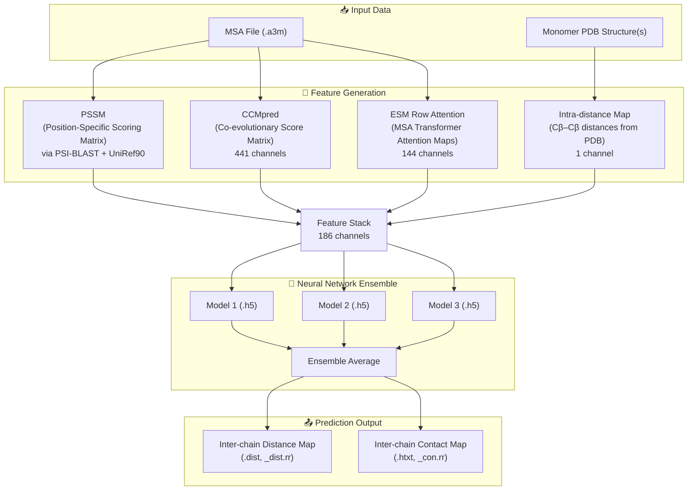

---
slug:1-overview
blog_type:normal
---


**CDPred** 是一款深度学习工具，用于预测两条相互作用蛋白质链之间的**链间残基-残基距离**——这是理解蛋白质如何组装成复合物所需的关键空间信息。CDPred 发表于 *Nature Communications* (2022)，它利用基于二维注意力的深度神经网络，将序列共进化信号和结构先验转化为精确的链间距离图和接触图，同时支持**同源二聚体**（两条相同链）和**异源二聚体**（两条不同链）的预测。


来源: [README.md](/README.md#L1-L6)

## CDPred 的功能

蛋白质复合物驱动着几乎所有的生物过程——从信号转导到免疫识别。确定两条链如何进行空间相互作用是理解复合物功能的前提，然而通过实验确定链间距离依然成本高昂且通量较低。CDPred 通过计算预测两条相互作用链中每对残基之间的**欧几里得重原子距离**来解决这一问题，生成连续的距离图和二值接触图（残基对距离在 8Å 以内）。

该工具接受两个核心输入：(1) 每条链的**预测单体三级结构**（PDB 格式），以及 (2) 捕获链间共进化信号的**多序列比对**（MSA，`.a3m` 格式）。基于这些输入，CDPred 提取四个特征通道，将其输入到由三个训练好的神经网络组成的集成模型中，并输出链间距离预测及相关的接触概率。

来源: [README.md](/README.md#L4-L6), [lib/Model_predict.py](/lib/Model_predict.py#L121-L131)

## 预测模式

CDPred 在两种不同的预测模式下运行，每种模式由在相应二聚体类型上训练的独立模型集成作为支撑：

| 模式 | 标志 | 输入结构 | 模型目录 | 适用场景 |
|------|------|-----------------|-----------------|----------|
| **同源二聚体** | `-m homodimer` | 1 个 PDB 文件（单链） | `model/homo/` | 两条相同链的相互作用 |
| **异源二聚体** | `-m heterodimer` | 2 个 PDB 文件（双链） | `model/hetero/` | 两条不同链的相互作用 |

对于**同源二聚体**，由于两条链完全相同，因此单链的结构和 MSA 即可满足需求。对于**异源二聚体**，则需要提供两条链的单体结构，并且它们的链内距离图会在特征提取前组合成一个块对角复合矩阵。

来源: [README.md](/README.md#L69-L77), [lib/Model_predict.py](/lib/Model_predict.py#L146-L206)

## 架构概览

CDPred 的预测流水线遵循三阶段架构——**特征生成 → 神经网络集成 → 输出后处理**——如下所示：



四个特征通道被拼接成一个**186 通道的二维特征张量**（144 通道的 ESM 与 441 通道的 CCMpred 经过降维，根据模型输入配置，有效堆叠通道数总计为 186），随后由集成模型中的三个神经网络分别进行批量预测。最终预测结果是所有三个模型的**逐元素平均值**，此举降低了方差并提升了鲁棒性。

来源: [lib/Model_predict.py](/lib/Model_predict.py#L208-L218), [model/homo/feature.txt](/model/homo/feature.txt#L1-L4), [lib/generate_feature.py](/lib/generate_feature.py#L75-L111)

## 特征工程摘要

每个特征通道捕获关于链间关系的不同信号：

| 特征 | 来源 | 描述 | 每对残基的形状 |
|---------|--------|-------------|----------------------|
| **`rowatt`** | ESM MSA Transformer (esm_msa1_t12_100M_UR50S) | 来自预训练 MSA Transformer 的行注意力图，捕获比对序列间的共进化注意力模式 | L × L × 144 |
| **`ccmpred`** | CCMpred (伪似然最大化) | 来自 MSA 直接耦合分析的共进化耦合分数 | L × L × 441 |
| **`pssm`** | 对 UniRef90 运行 PSI-BLAST | 编码进化保守性谱的位置特异性打分矩阵 | L × L × 44 |
| **`intradist_cb`** | 从 PDB 提取 Cβ 距离 | 链内 Cβ–Cβ（或回退至 Cα）距离图，提供来自单体预测的结构先验 | L × L × 1 |

对于超过 1024 个残基的序列（MSA Transformer 的最大长度限制），CDPred 采用了**滑动窗口裁剪策略**，将 MSA 划分为长度为 1000 个残基的重叠窗口，分别独立处理，最后将生成的注意力图拼接回去。

来源: [lib/generate_feature.py](/lib/generate_feature.py#L136-L200), [model/homo/feature.txt](/model/homo/feature.txt#L1-L4), [lib/generate_feature.py](/lib/generate_feature.py#L159-L173)

## 模型集成设计

CDPred 为每种预测模式均采用了**3 模型集成**。这三个模型共享相同的架构（在 `.json` 配置文件中定义），但学习到的权重不同（存储为 `.h5` 文件）。此设计通过取平均值提升了预测的稳定性：

- **同源二聚体集成**：`HomoPred1.h5`、`HomoPred2.h5`、`HomoPred3.h5`——架构定义在 [`model-train-HomoPred_Net.json`](/model/homo/model-train-HomoPred_Net.json) 中
- **异源二聚体集成**：`HeteroPred1.h5`、`HeteroPred2.h5`、`HeteroPred3.h5`——架构定义在 [`model-train-HeteroPred_Net.json`](/model/hetero/model-train-HeteroPred_Net.json) 中

网络架构结合了**自定义归一化层**——`InstanceNormalization`、`RowNormalization` 和 `ColumNormalization`——它们对加载预训练模型至关重要。这些层沿二维特征图的不同轴进行归一化，提供空间自适应归一化，对于蛋白质距离图这类可变长度的二维输入，其表现优于标准的批归一化。

<CgxTip>加载 CDPred 模型时，必须通过 Keras 的 `CustomObjectScope` 注册这三个自定义归一化层——否则模型反序列化将失败。此步骤已在 `Model_predict.py` 中自动处理。</CgxTip>

来源: [lib/Model_predict.py](/lib/Model_predict.py#L96-L119), [lib/Model_predict.py](/lib/Model_predict.py#L25-L83), [lib/Model_construct.py](/lib/Model_construct.py#L107-L165)

## 项目结构

```
CDPred/
├── lib/                          # 核心库（预测、训练、评估）
│   ├── Model_predict.py          # 主预测入口
│   ├── Model_construct.py        # 神经网络架构定义
│   ├── Model_training.py         # 模型训练逻辑
│   ├── generate_feature.py       # 特征生成（ESM, CCMpred, PSSM）
│   ├── distmap_evaluate.py       # 预测评估指标
│   ├── pdb_process.py            # PDB 文件处理工具
│   ├── data.py                   # ESM Alphabet 与批量转换器
│   ├── constants.py              # 全局常量（UniRef90 路径）
│   └── util.py                   # 距离图工具及 PDB 解析
├── model/                        # 预训练模型权重与配置
│   ├── homo/                     # 同源二聚体模型（3 个权重文件 + JSON + 特征）
│   └── hetero/                   # 异源二聚体模型（3 个权重文件 + JSON + 特征）
├── example/                      # 示例输入与预期输出
│   ├── *.a3m                     # 示例 MSA 文件
│   ├── expection_output/         # 预生成的预测输出
│   ├── ground_truth/             # 真实距离/接触图
│   └── training_datalists/       # 训练/测试/验证集划分
├── external_tool/                # 外部工具集成
│   ├── ZComplexMSA/              # 自定义 MSA 生成流水线
│   ├── GDFold/                   # 梯度下降结构对接
│   └── run_CDFold*.sh            # CDFold 执行脚本
└── requirments.txt               # Python 依赖
```

来源: [README.md](/README.md#L1-L16), [lib/Model_predict.py](/lib/Model_predict.py#L1-L20)

## 核心依赖

CDPred 依赖特定的深度学习技术栈（Python 3.6.x、TensorFlow 1.9.0、Keras 2.1.6），并结合了现代蛋白质语言模型工具：

| 包 | 版本 | 作用 |
|---------|---------|------|
| `tensorflow` | 1.9.0 | Keras 神经网络后端 |
| `Keras` | 2.1.6 | 神经网络模型定义与推理 |
| `fair-esm` | 0.3.1 | Facebook 的进化尺度建模（MSA Transformer） |
| `torch` | 1.8.0 | ESM 推理的 PyTorch 后端 |
| `biopython` | 1.79 | PDB 文件解析与序列处理 |
| `numpy` | 1.16.2 | 数值数组操作 |
| `scikit-learn` | 0.24.2 | 评估指标 (precision_score) |
| `h5py` | 2.10.0 | HDF5 模型权重文件 I/O |

<CgxTip>CDPred 同时使用了两种不同的深度学习框架：**TensorFlow/Keras** 用于预测网络，**PyTorch** 用于 ESM 特征生成。请确保在同一虚拟环境中正确安装了两者。</CgxTip>

来源: [requirments.txt](/requirments.txt#L1-L15), [README.md](/README.md#L24-L30)

## 外部工具生态

CDPred 集成了两个外部工具，将其能力扩展至核心预测之外：

- **[ZComplexMSA](https://github.com/BioinfoMachineLearning/CDPred/tree/main/external_tool/ZComplexMSA)**——专为蛋白质复合物设计的自定义 MSA 生成流水线。它既可处理同源二聚体 MSA 生成（使用 HHsuite 对比 BFD），也可处理异源二聚体 MSA 生成（使用 HHsuite 对比 UniRef90 并结合 UniProt 到 PDB 的映射），生成 CDPred 所需的 `.a3m` 输入文件。

- **[GDFold](https://github.com/BioinfoMachineLearning/CDPred/tree/main/external_tool/GDFold)**——基于梯度下降的蛋白质结构对接工具，能够利用 CDPred 预测的链间距离图，通过优化组成链的相对朝向和位置来组装完整的四级结构。

来源: [external_tool/ZComplexMSA/README.md](/external_tool/ZComplexMSA/README.md#L1-L57), [README.md](/README.md#L75-L76)

## 接下来阅读什么

既然你已在宏观层面了解了 CDPred 是什么及其工作原理，请按照以下逻辑顺序深入阅读：

1. **[快速开始](2-quick-start)**——在 10 分钟内安装 CDPred 并运行你的首次预测
2. **[输入数据准备](3-input-data-preparation)**——了解所需的 PDB 和 MSA 格式，以及如何准备它们
3. **[架构概览](4-architecture-overview)**——深入探讨神经网络设计、自定义归一化层及数据流
4. **[特征生成](5-feature-generation)**——了解四个特征通道分别是如何计算的
5. **[输出文件与格式](12-output-files-and-formats)**——解读预测结果及距离/接触图格式
6. **[预测评估指标](13-prediction-evaluation-metrics)**——使用 Top-L 精度指标对照真实值评估预测质量