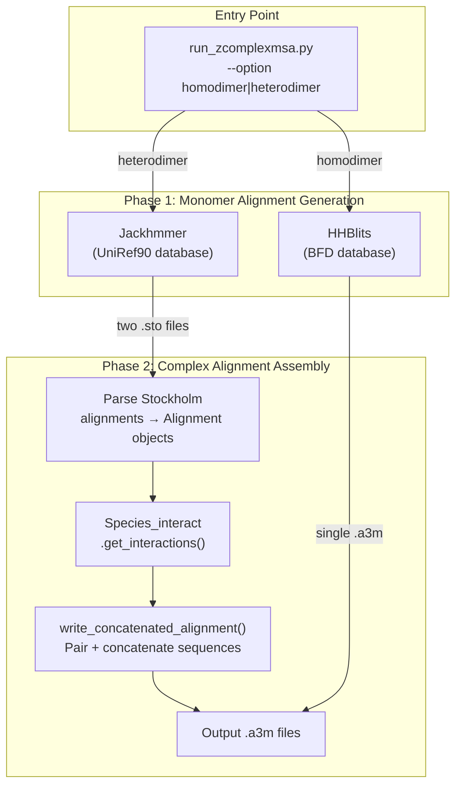
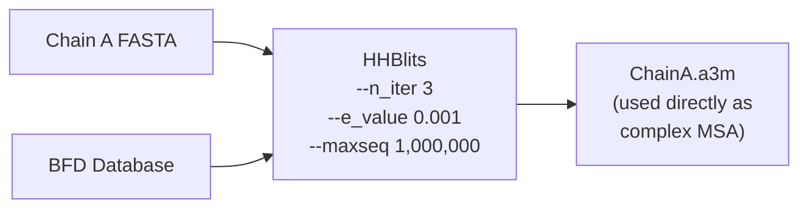
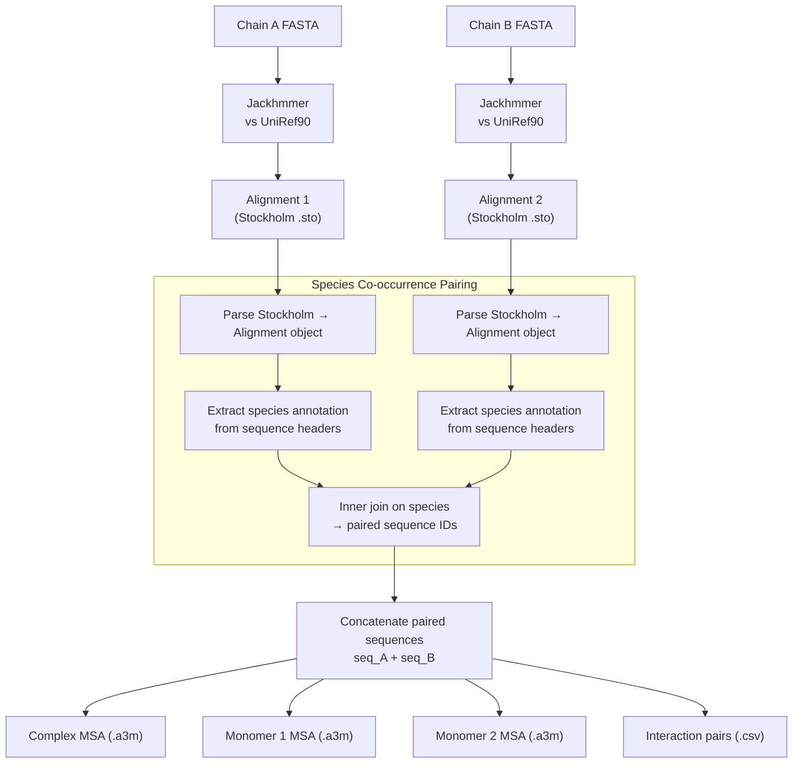
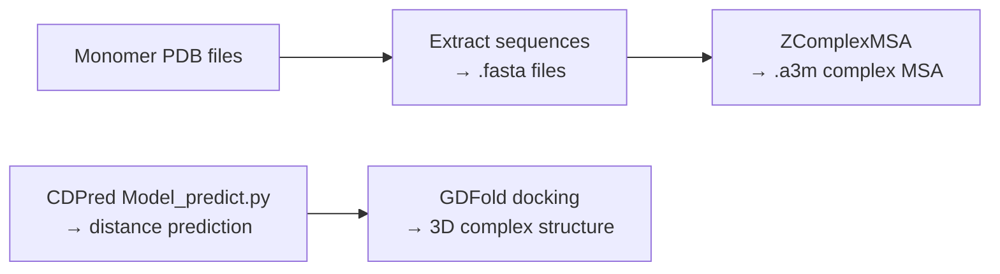

---
slug:10-zcomplexmsa-for-msa-generation
blog_type:normal
---


ZComplexMSA 是内嵌于 CDPred 的外部工具，负责生成**复合体级别的多序列比对（MSA）**——这是链间距离预测的关键进化信号输入。与为单一蛋白质链搜索同源序列的单体 MSA 工具不同，ZComplexMSA 通过配对具有生物相互作用证据的跨链同源序列，将比对搜索扩展至**复合体（二聚体）空间**。它通过不同的算法流水线同时支持**同源二聚体**和**异源二聚体**模式，最终生成供 CDPred 神经网络模型使用的 `.a3m` 比对文件。

## 架构概述

ZComplexMSA 采用两阶段架构：**单体比对生成**和**复合体比对组装**。单体阶段使用基于 HMM 的搜索工具（HHblits 或 Jackhmmer）查询序列数据库，而复合体阶段利用物种共现证据配对跨链的已比对序列，并将其拼接为联合 MSA。整个系统由单一入口点 [`run_zcomplexmsa.py`](external_tool/ZComplexMSA/run_zcomplexmsa.py) 统一调度，该入口点根据 `--option` 标志分发至相应的流水线。



内部库被组织为三个模块化包：`lib/tool/` 封装了外部搜索二进制文件，`lib/monomer_alignment_generation/` 负责比对解析与 I/O 处理，而 `lib/complex_alignment_generation/` 实现了配对与拼接逻辑，这正是 ZComplexMSA 区别于标准单体 MSA 生成器的核心所在。

来源: [run_zcomplexmsa.py](external_tool/ZComplexMSA/run_zcomplexmsa.py#L1-L105), [species_interact.py](external_tool/ZComplexMSA/lib/complex_alignment_generation/species_interact.py#L1-L234)

## 内部模块结构

`run_zcomplexmsa.py` 之下的库被解耦为职责清晰分离的多个模块：

| 模块路径 | 职责 | 关键类/函数 |
|---|---|---|
| `lib/tool/hhblits.py` | HHblits 二进制文件的 Python 封装 | `HHBlits` |
| `lib/tool/jackhmmer.py` | Jackhmmer 二进制文件的 Python 封装 | `Jackhmmer` |
| `lib/tool/utils.py` | 计时与临时目录上下文管理器 | `timing()`, `tmpdir_manager()` |
| `lib/monomer_alignment_generation/alignment.py` | 比对解析、一致性计算、格式转换 | `Alignment`, `read_stockholm()`, `read_a3m()`, `write_a3m()` |
| `lib/monomer_alignment_generation/pipeline.py` | 完整的单体 MSA 流水线（全数据库） | `Monomer_alignment_generation_pipeline` |
| `lib/complex_alignment_generation/species_interact.py` | 物种共现配对逻辑 | `Species_interact` |
| `lib/complex_alignment_generation/pipeline.py` | 拼接比对构建与输出 | `write_concatenated_alignment()`, `fused_msa()`, `write_dimer_a3ms()` |
| `lib/complex_alignment_generation/database/` | 相互作用证据数据库（PDB, STRING, genome） | `uniprot2pdb`, `uniprot2geno`, `uniprot2string` |
| `lib/common/util.py` | CLI 验证、选项文件解析、目录工具 | `read_option_file()`, `is_file()`, `makedir_if_not_exists()` |

<CgxTip>`HHBlits` 与 `Jackhmmer` 封装器均修改自 AlphaFold2 的数据流水线代码。它们继承了相同的参数默认值与子进程管理模式，从而与 AlphaFold2 的数据库格式及惯例保持兼容。</CgxTip>

来源: [hhblits.py](external_tool/ZComplexMSA/lib/tool/hhblits.py#L1-L137), [jackhmmer.py](external_tool/ZComplexMSA/lib/tool/jackhmmer.py#L1-L132), [alignment.py](external_tool/ZComplexMSA/lib/monomer_alignment_generation/alignment.py#L1-L459), [pipeline.py](external_tool/ZComplexMSA/lib/complex_alignment_generation/pipeline.py#L1-L273)

## 同源二聚体流水线

对于同源二聚体（两条相同链），其复合体 MSA 可简化为标准的**单体 MSA**，因为两条链共享相同的进化史。该流水线仅需对 BFD（Big Fantastic Database）运行 HHblits，并直接返回生成的 `.a3m` 文件——无需进行跨链配对。



`run_zcomplexmsa.py` 中的同源二聚体代码路径极为精简：

```python
# Homodimer: single HHblits search against BFD
inparams = [os.path.abspath(args.fasta1), outdir, args.hhblits, params['bfd_database']]
run_hhblits(inparams)
```

HHblits 封装器构建了完整的命令行调用，参数包括 `n_iter=3`（三次迭代搜索）、`e_value=0.001`、`maxseq=1_000_000` 及 `n_cpu=4`。输出被直接写入以输入 FASTA 文件主干名命名的 `.a3m` 文件。该文件随后会被 CDPred 的预测流水线作为同源二聚体的复合体 MSA 消费。

来源: [run_zcomplexmsa.py](external_tool/ZComplexMSA/run_zcomplexmsa.py#L58-L62), [hhblits.py](external_tool/ZComplexMSA/lib/tool/hhblits.py#L40-L137)

## 异源二聚体流水线

异源二聚体流水线是 ZComplexMSA 核心创新所在。它通过识别两条单体比对中源自同一生物体（物种共现）的序列来执行**配对 MSA 生成**，随后拼接这些配对序列以构成联合复合体 MSA。此配对过程捕获了两条链间的共进化信号，而这是独立单体搜索无法察觉的。



### 第 1 步：并行单体搜索

两条链的 FASTA 文件使用 Python 的 `multiprocessing.Pool`（2 个进程）**并行**查询 UniRef90：

```python
process_list.append([os.path.abspath(args.fasta1), outdir, args.jackhmmer, params['uniref90_fasta']])
process_list.append([os.path.abspath(args.fasta2), outdir, args.jackhmmer, params['uniref90_fasta']])
pool = Pool(processes=2)
results = pool.map(run_jackhmmer, process_list)
```

每次 Jackhmmer 运行生成一个 Stockholm 格式（`.sto`）的比对文件。Jackhmmer 封装器使用 `n_iter=1`、`e_value=0.0001`、`n_cpu=8`，以及为大规模敏感性调优的预过滤阈值（`F1=0.0005`、`F2=0.00005`、`F3=0.0000005`）。

来源: [run_zcomplexmsa.py](external_tool/ZComplexMSA/run_zcomplexmsa.py#L65-L76), [jackhmmer.py](external_tool/ZComplexMSA/lib/tool/jackhmmer.py#L33-L132)

### 第 2 步：物种共现配对

`Species_interact.get_interactions()` 方法是异源二聚体流水线的算法核心。它对每个比对独立执行三个子步骤，随后合并结果：

**2a. 头部注释提取** — `extract_header_annotation()` 解析 Stockholm 比对中的每个序列头，通过基于正则表达式的拆分提取 UniProt 元数据字段（`OS` = 生物体，`GN` = 基因，`Tax` = 分类单元，`PE` = 存在证据等）。系统会选择 `OS`（生物体）或 `Tax`（分类单元）字段作为物种注释来源，以提供更多非空值的字段为准。

**2b. 旁系同源检测与过滤** — `load_monomer_info()` 鉴定每个物种中最相似的序列（`most_similar_by_organism()`），随后检测**旁系同源物**——与查询序列来自同一物种且一致性低于 0.95 的序列。`filter_best_reciprocal()` 方法移除那些与旁系同源物相似度高于与查询序列相似度的序列，确保仅保留**最佳相互比对**。此举可防止对碰巧共享物种标签的趋异旁系同源物进行错误配对。

**2c. 跨链合并** — `get_interactions()` 对两条链过滤后的最佳比对表执行基于 `species` 列的**内连接**：

```python
species_intersection = most_similar_in_species_1.merge(
    most_similar_in_species_2,
    how="inner",
    on="species",
    suffixes=("_1", "_2")
)
```

仅有来自对**两条**链均具有同源物的生物体的序列能在此次连接中保留，由此生成驱动拼接操作的配对序列 ID 表（`id_1`，`id_2`）。

来源: [species_interact.py](external_tool/ZComplexMSA/lib/complex_alignment_generation/species_interact.py#L200-L234), [species_interact.py](external_tool/ZComplexMSA/lib/complex_alignment_generation/species_interact.py#L83-L198)

### 第 3 步：拼接比对构建

`write_concatenated_alignment()` 接收配对 ID 表与两个 `Alignment` 对象，随后对每一对 `(id_1, id_2)` 拼接完整的已比对序列：`combined_seq = alignment_1[id_1] + alignment_2[id_2]`。重复的组合序列会被去重。该函数产出四个输出：

| 输出文件 | 格式 | 内容 |
|---|---|---|
| `{name1}_{name2}.a3m` | A3M | **复合体 MSA** — 拼接的配对序列（CDPred 的主要输入） |
| `{name1}_monomer_1.a3m` | A3M | 仅包含配对行的链 1 序列（过滤后的单体视图） |
| `{name2}_monomer_2.a3m` | A3M | 仅包含配对行的链 2 序列（过滤后的单体视图） |
| `{name1}_{name2}_interact.csv` | CSV | 配对序列 ID 及比对索引（`id_1`, `id_2`, `index_1`, `index_2`） |

每条配对序列的复合体 MSA 头部遵循 `{header1}_{header2}` 约定，且目标（查询）序列始终为首个条目，其头部为 `{main_id_1}_{main_id_2}`。

<CgxTip>`write_concatenated_alignment()` 中的去重操作检查的是**组合后**的序列字符串（`seq1 + seq2`）而非单个序列，因此产生相同拼接的不同配对会被正确合并——当不同的 UniRef90 簇代表序列共享相同的比对区域时，这一点至关重要。</CgxTip>

来源: [pipeline.py](external_tool/ZComplexMSA/lib/complex_alignment_generation/pipeline.py#L68-L131), [run_zcomplexmsa.py](external_tool/ZComplexMSA/run_zcomplexmsa.py#L78-L105)

## 比对解析：Alignment 类

`lib/monomer_alignment_generation/alignment.py` 中的 `Alignment` 类是贯穿 ZComplexMSA 的通用比对表示。它通过 `from_file()` 类方法支持三种输入格式：

| 格式 | 解析器 | 输出扩展名 | 用例 |
|---|---|---|---|
| `stockholm` | `read_stockholm()` | `.sto` | Jackhmmer 输出（异源二聚体） |
| `a3m` | `read_a3m()` | `.a3m` | HHblits 输出（同源二聚体） |
| `fasta` | `read_fasta()` | `.fasta` | 原始序列输入 |

`Alignment` 对象的关键属性包括：`main_id` 与 `main_seq`（查询序列）、`ids` 与 `seqs`（命中序列）、`headers`（含注释的完整头部）、`id_to_index`（查找字典）、`matrix`（numpy 字符矩阵）以及 `annotation`（Stockholm GF/GC/GS/GR 特征）。`identities_to()` 方法计算每条序列相对于目标序列的一致性，此方法驱动了 `Species_interact` 中的旁系同源检测与最佳相互比对过滤。

`read_stockholm()` 解析器会剥离查询序列中存在的空位列，确保比对中的所有序列具有相同的有效长度——这是异源二聚体流水线中正确执行拼接的先决条件。

来源: [alignment.py](external_tool/ZComplexMSA/lib/monomer_alignment_generation/alignment.py#L240-L380), [alignment.py](external_tool/ZComplexMSA/lib/monomer_alignment_generation/alignment.py#L84-L200)

## 数据库需求与配置

ZComplexMSA 依赖外部序列数据库，这些数据库必须单独下载与配置。数据库路径在**数据库选项文件**中指定（通过 `--option_file` 引用），该文件采用由 `read_option_file()` 解析的简单 `key = value` 格式。

| 数据库 | 适用模式 | 下载来源 | 选项文件键 |
|---|---|---|---|
| BFD | 同源二聚体 | [bfd.mmseqs.com](https://bfd.mmseqs.com/) | `bfd_database` |
| UniRef90 | 异源二聚体 | `ftp.uniprot.org/pub/databases/uniprot/uniref/uniref90/` | `uniref90_fasta` |
| UniProt2PDB | 异源二聚体（PDB 相互作用证据） | 以 `uniprot2pdb.tar.xz` 捆绑提供 | `uniprot2pdb_dir`, `uniprot2pdb_mapping_file`, `dimers_list` |

`db_option` 文件格式示例：

```
bfd_database = /path/to/bfd_metaclust_clu_complete_id30_c90_final_seq.sorted_opt
uniref90_fasta = /path/to/uniref90/uniref90.fasta
uniprot2pdb_dir = /path/to/uniprot2pdb
uniprot2pdb_mapping_file = /path/to/uniprot2pdb/uniprot2pdb.map
dimers_list = /path/to/uniprot2pdb/dimers_cm.list
```

`external_tool/ZComplexMSA/database/` 目录下捆绑的 `uniprot2pdb.tar.xz` 归档文件提供了预计算的 UniProt 到 PDB 的映射，这些映射编码了已知的复合体结构——这是物种共现之外额外的相互作用证据来源。

来源: [README.md](external_tool/ZComplexMSA/README.md#L1-L58), [util.py](external_tool/ZComplexMSA/lib/common/util.py#L96-L110)

## 环境配置

ZComplexMSA 运行于具有特定生物信息学工具版本的专用 Conda 环境中：

```bash
conda create -p ./env/ -c conda-forge -c bioconda hhsuite python==3.8
conda activate ./env/
conda install -y -c bioconda hmmer==3.3.2 hhsuite==3.3.0
pip install -r requirments.txt
```

Python 依赖项精简且聚焦：

| 包 | 版本 | 用途 |
|---|---|---|
| `biopython` | 1.79 | 序列/生物信息学工具 |
| `numpy` | 1.22.3 | 比对矩阵运算 |
| `pandas` | 4.4.1 | 用于注释表与相互作用对的 DataFrames |
| `tqdm` | 4.63.1 | 长时间数据库操作的进度条 |
| `absl-py` | 1.0.0 | 日志记录（继承自 AlphaFold2 封装器） |

HHblits 与 Jackhmmer 二进制文件默认位于 `{ZComplexMSA_root}/env/bin/hhblits` 与 `{ZComplexMSA_root}/env/bin/jackhmmer`，但可通过 `--hhblits` 与 `--jackhmmer` 命令行参数进行覆盖。

来源: [README.md](external_tool/ZComplexMSA/README.md#L3-L10), [requirments.txt](external_tool/ZComplexMSA/requirments.txt#L1-L5), [run_zcomplexmsa.py](external_tool/ZComplexMSA/run_zcomplexmsa.py#L43-L48)

## 命令行接口

入口点 `run_zcomplexmsa.py` 暴露了以下参数：

| 参数 | 必需 | 默认值 | 描述 |
|---|---|---|---|
| `--option_file` | 是 | — | 数据库配置文件路径 |
| `--fasta1` | 是 | — | 链 A 的 FASTA 文件 |
| `--fasta2` | 否（仅限异源二聚体） | `None` | 链 B 的 FASTA 文件 |
| `--outdir` | 是 | — | 比对文件的输出目录 |
| `--option` | 是 | — | `homodimer` 或 `heterodimer` |
| `--hhblits` | 否 | `{root}/env/bin/hhblits` | HHblits 二进制文件路径 |
| `--jackhmmer` | 否 | `{root}/env/bin/jackhmmer` | Jackhmmer 二进制文件路径 |

### 同源二聚体示例

```bash
python run_zcomplexmsa.py \
  --option_file ./bin/db_option \
  --fasta1 ./test/homo/2FDOA.fasta \
  --outdir ./test/homo \
  --option homodimer
```

此命令将生成包含基于 BFD 的单体 MSA 的 `./test/homo/2FDOA.a3m`。

### 异源二聚体示例

```bash
python run_zcomplexmsa.py \
  --option_file ./bin/db_option \
  --fasta1 ./test/hetero/1AWCA.fasta \
  --fasta2 ./test/hetero/1AWCB.fasta \
  --outdir ./test/hetero \
  --option heterodimer
```

此命令将生成四个文件：`1AWCA_1AWCB.a3m`（复合体 MSA）、`1AWCA_monomer_1.a3m`、`1AWCB_monomer_2.a3m` 以及 `1AWCA_1AWCB_interact.csv`。

来源: [run_zcomplexmsa.py](external_tool/ZComplexMSA/run_zcomplexmsa.py#L38-L55), [README.md](external_tool/ZComplexMSA/README.md#L28-L58)

## 与 CDPred 流水线的集成

当未提供预计算的 `.a3m` 文件时，CDPred 的 shell 编排脚本会自动调用 ZComplexMSA。在 [`run_CDFold.sh`](external_tool/run_CDFold.sh) 中的集成遵循以下模式：



具体而言，shell 脚本执行以下操作：
1. 使用 `pdb_process.py` 从输入 PDB 文件中提取 FASTA 序列
2. 激活 ZComplexMSA Conda 环境
3. 使用适当的 `--option`（homodimer 或 heterodimer）运行 `run_zcomplexmsa.py`
4. 停用 ZComplexMSA 环境并激活 CDPred 环境
5. 通过 `-a` 标志将生成的 `.a3m` 文件传递给 `Model_predict.py`

多聚体编排脚本 [`run_CDFold_multimer.sh`](external_tool/run_CDFold_multimer.sh) 扩展了此模式，通过使用后台 shell 进程（`&` + `wait`）对化学计量解析器识别出的所有同源与异源子复合体**并行**运行 ZComplexMSA。

来源: [run_CDFold.sh](external_tool/run_CDFold.sh#L56-L95), [run_CDFold_multimer.sh](external_tool/run_CDFold_multimer.sh#L56-L105)

## 相互作用证据数据库模块

除了主要的物种共现方法，ZComplexMSA 还在 `lib/complex_alignment_generation/database/` 中附带三个额外的相互作用证据数据库构建器，尽管它们在默认的 `run_zcomplexmsa.py` 入口点中**未被激活**：

| 模块 | 证据来源 | 关键方法 | 状态 |
|---|---|---|---|
| `uniprot2pdb.py` | 已知 PDB 复合体结构 | `uniprot2pdb.update()` | 可用但不在默认流水线中 |
| `uniprot2geno.py` | 基因组邻近性（ENA/EMBL CDS 位置） | `uniprot2geno.update()` | 可用但不在默认流水线中 |
| `uniprot2string.py` | STRING 数据库蛋白质-蛋白质相互作用 | `uniprot2string.update()` | 可用但不在默认流水线中 |

这些模块生成预处理映射文件（UniProt→PDB、UniProt→基因组坐标、STRING→UniProt），可通过结构或功能相互作用证据增强物种共现配对。`pipeline.py` 中的 `Complex_alignment_concatenation_pipeline` 类支持通过 `concatenate_methods` 配置参数插入这些额外方法，该参数接受逗号分隔的列表（例如，`species_interact,pdb_interact,string_interact`）。

来源: [uniprot2pdb.py](external_tool/ZComplexMSA/lib/complex_alignment_generation/database/uniprot2pdb.py#L1-L120), [uniprot2geno.py](external_tool/ZComplexMSA/lib/complex_alignment_generation/database/uniprot2geno.py#L1-L122), [uniprot2string.py](external_tool/ZComplexMSA/lib/complex_alignment_generation/database/uniprot2string.py#L1-L70), [pipeline.py](external_tool/ZComplexMSA/lib/complex_alignment_generation/pipeline.py#L200-L273)

## 流水线对比：同源二聚体 vs 异源二聚体

| 方面 | 同源二聚体 | 异源二聚体 |
|---|---|---|
| **输入** | 1 个 FASTA 文件（`--fasta1`） | 2 个 FASTA 文件（`--fasta1`, `--fasta2`） |
| **搜索工具** | HHblits | Jackhmmer（并行，2 个进程） |
| **数据库** | BFD | UniRef90 |
| **输出格式** | A3M（直接来自 HHblits） | Stockholm → 解析 → 拼接的 A3M |
| **配对逻辑** | 无（链相同） | 物种共现 + 最佳相互比对 |
| **旁系同源过滤** | 不应用 | 应用（一致性阈值 0.95） |
| **输出文件** | 1（`.a3m`） | 4（复合体 `.a3m`，2 个单体 `.a3m`，1 个 `.csv`） |
| **共进化信号** | 隐式（两条链使用相同 MSA） | 显式（跨链配对序列） |

根本洞见在于，对于同源二聚体，单体 MSA **即是**复合体 MSA，因为两条链共享完全相同的进化约束。而对于异源二聚体，复合体 MSA 必须通过配对两个独立比对中的序列来**构建**，此配对的质量直接决定了 CDPred 用于距离预测的链间共进化信号的强度。

来源: [run_zcomplexmsa.py](external_tool/ZComplexMSA/run_zcomplexmsa.py#L56-L105), [species_interact.py](external_tool/ZComplexMSA/lib/complex_alignment_generation/species_interact.py#L95-L198)

## 下一步

通过 ZComplexMSA 生成复合体 MSA 后，流水线将继续使用 GDFold 进行结构对接。请继续阅读 [GDFold for Structure Docking](11-gdfold-for-structure-docking) 以了解预测的距离图谱如何转换为 3D 复合体结构。有关 MSA 特征如何馈入神经网络的更广泛背景，请参阅 [Feature Generation](5-feature-generation) 与 [Prediction Workflow](7-prediction-workflow)。