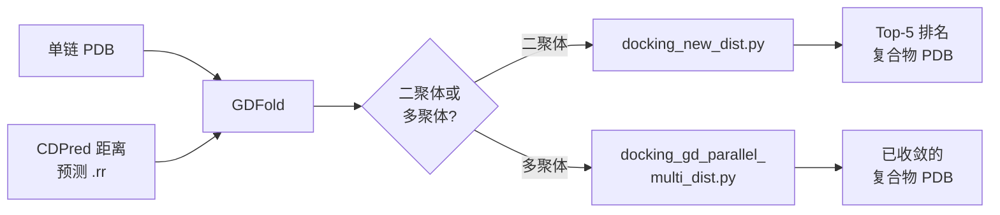
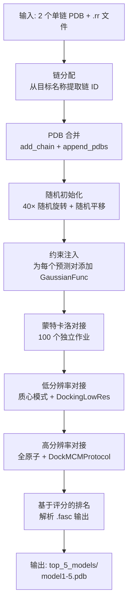

---
slug:11-gdfold-for-structure-docking
blog_type:normal
---


GDFold 是集成到 CDPred 中作为外部工具的**梯度下降对接引擎**。它基于 **PyRosetta** 构建，通过受约束的刚体对接，将 CDPred 预测的链间距离或接触图转化为原子分辨率的复合物结构。GDFold 支持**二聚体**和**多聚体**复合物，并提供两种约束模式——基于接触的（`BoundFunc`）和基于距离的（`GaussianFunc`），其中基于距离的变体是 CDPred 流程中的默认选项。

## 架构及在 CDPred 中的作用

GDFold 占据 CDPred 流程的最后阶段。CDPred 的神经网络首先预测链间距离图（存储为 `.rr` 文件），GDFold 消耗这些预测结果以及单链 PDB 结构，在空间约束下通过 Rosetta 的对接协议组装出完整的复合物。该关系可概括为：

```
单链 PDB + 预测距离图 (.rr)  →  GDFold  →  Top-5 复合物模型 (.pdb)
```

下图展示了 GDFold 在更广泛的 CDPred 工作流程中的位置：



来源：[run_CDFold.sh](/external_tool/run_CDFold.sh#L130-L152)，[run_CDFold_multimer.sh](/external_tool/run_CDFold_multimer.sh#L163-L192)

## 脚本清单与分类

GDFold 的 `scripts/` 目录包含 15 个文件，分为三个功能层级：

| 层级 | 脚本 | 用途 | 调用方 |
|------|--------|---------|------------|
| **核心对接** | `docking_new.py` | 基于**接触**约束的二聚体对接 | 手动 / 自定义脚本 |
| | `docking_new_dist.py` | 基于**距离**约束的二聚体对接 | `run_CDFold.sh` |
| | `docking_gd_parallel.py` | GD 并行二聚体对接（接触） | 手动 |
| | `docking_gd_parallel_dist.py` | GD 并行二聚体对接（距离） | 手动 |
| | `docking_gd_parallel_multi.py` | 多聚体对接（接触） | 手动 |
| | `docking_gd_parallel_multi_dist.py` | 多聚体对接（距离） | `run_CDFold_multimer.sh` |
| **实用工具** | `utils.py` | 旋转/平移矩阵，PDB 操作 | 所有核心脚本 |
| | `talaris2013.wts` | Rosetta 评分函数权重 | 所有核心脚本 |
| **预处理** | `prepare_initial_pdbs.py` | 批量初始 PDB 准备 | 离线 |
| | `rotate_translate_pdbs.py` | 通过 PyMOL 随机化链位置 | `prepare_initial_pdbs.py` |
| | `append_pdbs.py` | 将两个链的 PDB 合并为一个文件 | 离线 |
| | `prepare_pdbs.py` | PDB 预处理 | 离线 |
| **提取** | `extract_contact.py` | 从天然 PDB 提取接触图 | 基准测试 |
| | `extract_distance.py` | 从天然 PDB 提取距离图 | 基准测试 |
| | `extract_targets.py` | 提取目标信息 | 基准测试 |

来源：[ReadMe.md](/external_tool/GDFold/scripts/ReadMe.md#L1-L47)，[utils.py](/external_tool/GDFold/scripts/utils.py#L1-L136)

## 约束机制：接触与距离

这两种约束模式在如何将 `.rr` 预测文件中的空间信息编码到 Rosetta 的约束系统方面有着根本的区别。

### 基于接触的约束（`docking_new.py`）

基于接触的对接读取 `.rr` 文件，其每行格式为 `res_x res_y lb up probability`。它应用 **`BoundFunc`** 约束，强制残基对位于 `[lb, up]` 距离边界内。`probability > threshold` 的残基对获得严格的边界；低概率对的边界上限等于蛋白质直径（实际上从上方不受约束）。`setResFilebyTopNum` 函数可以在对接前进一步筛选前 N 个或前 L/k 个约束。

### 基于距离的约束（`docking_new_dist.py`）

基于距离的对接读取 `.rr` 文件，其每行格式为 `res_x res_y distance`（从第 4 行开始）。它应用 **`GaussianFunc`** 约束，其中 `mean=predicted_distance` 且 `sd=0.1`，在预测的残基间距离周围创建严格的高斯惩罚。只有 `distance ≤ threshold`（默认 12Å）的残基对才会被约束——该阈值作为一个截断值，排除长程预测对对接的影响。

| 属性 | 接触模式 | 距离模式 |
|----------|-------------|---------------|
| 约束函数 | `BoundFunc(lb, up, sd, tag)` | `GaussianFunc(mean, sd=0.1)` |
| `.rr` 格式 | `res_x res_y lb up prob` | `res_x res_y distance` |
| 数据起始行 | 第 2 行 | 第 4 行 |
| 过滤方式 | 按概率阈值 + top-N 选择 | 按距离阈值（`≤ thre`） |
| 默认阈值 | 0.000001（概率） | 12（Å，距离） |
| 原子参考 | CB（GLY 为 CA） | CB（GLY 为 CA） |
| CDPred 使用 | 否（手动） | **是**（默认） |

<CgxTip>距离阈值（`-d` 标志，默认 12Å）是对 GDFold 质量影响最大的单一参数。较低的值会产生更严格、更局部的约束，但可能会遗漏长程链间接触；较高的值会包含更多约束，但会引入来自低置信度长程预测的噪声。</CgxTip>

来源：[docking_new.py](/external_tool/GDFold/scripts/docking_new.py#L80-L140)，[docking_new_dist.py](/external_tool/GDFold/scripts/docking_new_dist.py#L80-L145)

## 二聚体对接流程

由 `run_CDFold.sh` 调用的二聚体对接流程，遵循从链准备到模型排名的明确序列：



### 步骤 1：链分配与 PDB 合并

从目标名称中提取链 ID（例如，`T1084A_T1084B` 产生链 A 和 B）。每个单链 PDB 通过 `add_chain()` 重新标记以分配正确的链标识符，然后通过带有 `TER` 分隔符的 `append_pdbs()` 合并为一个多链 PDB。

### 步骤 2：随机初始化

在对接之前，第一条链会经历强烈的随机化：围绕所有三个轴进行 40 次随机旋转（每个轴 0–360°），随后沿每个轴进行随机平移（0–60 Å）。这确保了两条链从**解耦的空间构型**开始，防止 Rosetta 的对接陷入初始放置附近的局部极小值。

### 步骤 3：约束注入

`add_cons_to_pose()` 函数读取 `.rr` 预测文件，按距离阈值过滤残基对，并在两条链之间的 CB 原子（甘氨酸残基为 CA 原子）上附加 `GaussianFunc` 原子对约束。这些约束被添加到 Rosetta 姿态的约束集中。

### 步骤 4：蒙特卡洛对接（100 个作业）

Rosetta 的 `PyJobDistributor` 运行 100 个独立的对接轨迹。每个轨迹遵循相同的协议：

1. **切换至质心**表示（`SwitchResidueTypeSetMover`）
2. **设置折叠树**用于链伴侣之间的刚体对接
3. **随机化**上游和下游伴侣方向（`RigidBodyRandomizeMover`）
4. **扰动**刚体位置（`RigidBodyPerturbMover`，40° 旋转，20 Å 平移）
5. **滑入接触**（`DockingSlideIntoContact`）
6. **低分辨率对接**（带有 `interchain_cen` + 约束的 `DockingLowRes`）
7. **切换至全原子**表示
8. **高分辨率对接**（带有 `docking_min` + 约束的 `DockMCMProtocol`）

### 步骤 5：基于评分的模型选择

所有 100 个作业完成后，GDFold 解析 `.fasc` 评分文件，按总分对诱饵进行排名，并将前 5 个模型复制到 `top_5_models/model1-5.pdb`。最佳模型也会被单独保存为 `{target_name}_predicted.pdb`。中间诱饵和评分文件将被清理。

来源：[docking_new_dist.py](/external_tool/GDFold/scripts/docking_new_dist.py#L34-L322)，[utils.py](/external_tool/GDFold/scripts/utils.py#L26-L95)

## 多聚体对接流程

多聚体流程——通过 `run_CDFold_multimer.sh` 调用 `docking_gd_parallel_multi_dist.py` 运行——通过在所有链对上进行**迭代梯度下降收敛**，扩展了二聚体的方法。

### 与二聚体对接的关键区别

| 方面 | 二聚体 | 多聚体 |
|--------|-------|----------|
| 入口脚本 | `docking_new_dist.py` | `docking_gd_parallel_multi_dist.py` |
| 链数量 | 2 | N（任意） |
| 约束 `.rr` 格式 | `res_x res_y distance` | `chain_i chain_j res_x res_y distance` |
| 对接策略 | 单次 100 作业 MC 运行 | 跨伴侣对的**迭代 GD** |
| 每次迭代作业数 | 100 | 50 |
| 收敛条件 | 无 | 周期之间 RMSD ≤ 0.1 Å |
| 最大周期数 | 无 | 100 |
| 最小化 | 通过 DockMCMProtocol | 显式 `MinMover`（lbfgs，1000 迭代 × 3 重复） |
| 输出 | `top_5_models/` | `{target}_GD.pdb` + `top_5_models/` |

### 迭代梯度下降收敛

多聚体对接循环构建所有成对的伴侣组合（例如，对于链 A、B、C、D → `A_BCD`、`B_ACD`、`C_ABD`、`D_ABC`）。每个周期迭代每个伴侣对，每对执行一次完整的 50 作业对接运行。在每个周期之后，计算当前最佳模型与先前最佳模型之间的 CA-RMSD。如果 RMSD ≤ 0.1 Å，则结构已收敛并提前终止循环；否则，继续运行最多 100 个周期。

```python
for epoch in range(100):
    # 保存先前最佳模型
    cp {target}_GD.pdb → {target}_GD_prev.pdb
    # 对每个伴侣对进行对接
    for partners in partner_chains:
        do_dock(initial_start, res_path, OUT, weight_file, partners)
    # 检查收敛
    rmsd = CA_rmsd(current_pose, previous_pose)
    if rmsd <= 0.1:
        break
```

### 多聚体特有的约束格式

多聚体 `.rr` 文件使用从第 4 行开始的 5 列格式：`chain_index_i chain_index_j res_x res_y distance`。链索引通过字典（`{1: 'A', 2: 'B', ...}`）映射到链字母，从而允许约束跨越复合物内的任意链对。

来源：[docking_gd_parallel_multi_dist.py](/external_tool/GDFold/scripts/docking_gd_parallel_multi_dist.py#L1-L409)，[run_CDFold_multimer.sh](/external_tool/run_CDFold_multimer.sh#L163-L192)

## 与 CDPred Shell 脚本的集成

GDFold 在预测阶段完成后由 CDPred 的封装脚本自动调用。集成通过命令行参数进行配置：

### 二聚体调用（`run_CDFold.sh`）

```bash
python $workdir/external_tool/GDFold/scripts/docking_new_dist.py \
    $name \                      # 目标名称（如 T1084A_T1084B）
    $pdb_file_list \             # 以空格分隔的单链 PDB 路径
    $rr_file \                   # 预测距离 .rr 文件
    $fold_outdir \               # 输出目录 (models/)
    $weight_file \               # Rosetta 权重 (talaris2013.wts)
    $dist_thred                  # 距离阈值（默认：12）
```

对于同源二聚体，如果仅提供一个 PDB，脚本会自动复制它（`pdb_file_list="$pdb_file_list $pdb_file_list"`）。

来源：[run_CDFold.sh](/external_tool/run_CDFold.sh#L130-L152)

### 多聚体调用（`run_CDFold_multimer.sh`）

```bash
python $workdir/external_tool/GDFold/scripts/docking_gd_parallel_multi_dist.py \
    $name \                      # 目标名称
    ${#pdb_file_arr[@]} \        # 链数量
    $pdb_file_list \             # 所有单链 PDB 路径
    $rr_file \                   # 合并的多聚体距离 .rr 文件
    $fold_outdir \               # 输出目录
    $weight_file \               # Rosetta 权重
    $dist_thred                  # 距离阈值（默认：12）
```

多聚体 `.rr` 文件由 `lib/generate_multimer_rr.py` 生成，该脚本将单独的成对预测合并为带有链索引的多聚体专用格式。

来源：[run_CDFold_multimer.sh](/external_tool/run_CDFold_multimer.sh#L163-L192)

## 实用工具模块：几何操作

`utils.py` 模块提供了所有对接脚本所依赖的几何基元：

| 函数 | 用途 | 实现 |
|----------|---------|----------------|
| `add_chain(pdb_file, letter)` | 重新分配 PDB 中的链 ID | 重写 ATOM 记录的第 22 列 |
| `append_pdbs(pdb1, pdb2)` | 使用 TER 分隔符合并两个 PDB | 过滤 ATOM 行，插入 TER/END |
| `append_multi_pdbs(pdb_files)` | 合并 N 个 PDB | `append_pdbs` 逻辑的迭代扩展 |
| `get_rotation_matrix(axis, degree)` | x/y/z 轴的 3×3 旋转矩阵 | 标准罗德里格斯旋转公式 |
| `rotatePose(pose, R)` | 对链 1 原子应用旋转 | 对 xyz 坐标进行矩阵乘法 |
| `translatePose(pose, t)` | 对链 1 原子应用平移 | 对 xyz 坐标进行向量加法 |
| `setResFilebyTopNum(in, out, n)` | 过滤 top-N 约束 | 将超出 N 的约束概率置零 |

<CgxTip>`rotatePose` 和 `translatePose` 函数仅变换**链 1** 的原子（`chain_begin(1)` 至 `chain_end(1)`）。链 2 作为参考系保持固定。这对于理解随机初始化至关重要：只有一条链被随机化，而另一条链作为空间锚点。</CgxTip>

来源：[utils.py](/external_tool/GDFold/scripts/utils.py#L1-L136)

## Rosetta 评分函数配置

GDFold 使用 **`talaris2013`** 权重集作为其基础评分函数，并显式设置了 `atom_pair_constraint` 权重。约束权重因对接模式而异：

| 对接阶段 | 评分函数 | 约束权重 |
|---------------|--------------|-------------------|
| 二聚体全原子（`docking_new_dist.py`） | `talaris2013` + 约束 | 1.0 |
| 二聚体低分辨率 | `interchain_cen` + 约束 | 1.0 |
| 二聚体高分辨率 | `docking_min` + 约束 | 1.0 |
| GD 并行全原子（`docking_gd_parallel_dist.py`） | `talaris2013` + 约束 | **5.0** |
| GD 并行低分辨率 | `interchain_cen` + 约束 | 1.0 |
| GD 并行高分辨率 | `docking_min` + 约束 | 1.0 |
| 多聚体全原子（`docking_gd_parallel_multi_dist.py`） | `talaris2013` + 约束 | **5.0** |

GD 并行和多聚体变体在全原子评分函数上使用了**5 倍更强的约束权重**，反映出在迭代最小化过程中需要更严格地遵循预测距离。

来源：[docking_new_dist.py](/external_tool/GDFold/scripts/docking_new_dist.py#L202-L220)，[docking_gd_parallel_dist.py](/external_tool/GDFold/scripts/docking_gd_parallel_dist.py#L134-L155)，[docking_gd_parallel_multi_dist.py](/external_tool/GDFold/scripts/docking_gd_parallel_multi_dist.py#L212-L230)

## 输出结构

GDFold 完成后，输出目录包含：

| 路径 | 内容 | 生成方 |
|------|---------|-------------|
| `models/top_5_models/model1.pdb` | 最佳评分复合物结构 | 所有对接脚本 |
| `models/top_5_models/model2-5.pdb` | 第 2–5 佳结构 | 所有对接脚本 |
| `models/{name}_predicted.pdb` | 最佳模型副本（二聚体） | `docking_new_dist.py` |
| `models/{name}_GD.pdb` | 最佳模型（GD 并行/多聚体） | `docking_gd_parallel_*.py` |

中间文件（`.fasc` 评分文件、每个作业的诱饵 PDB、`score.txt`）在 top-5 选择后会被自动清理。

来源：[docking_new_dist.py](/external_tool/GDFold/scripts/docking_new_dist.py#L268-L322)，[docking_gd_parallel_multi_dist.py](/external_tool/GDFold/scripts/docking_gd_parallel_multi_dist.py#L300-L395)

## 命令行参考

### 二聚体对接（距离模式）

```
python docking_new_dist.py <target_name> <pdb1> <pdb2> <rr_file> <output_dir> <weight_file> <dist_threshold>
```

| 参数 | 描述 | 示例 |
|-----------|-------------|---------|
| `target_name` | 目标标识符（如 `T0965A_T0965B`） | `T1084A_T1084B` |
| `pdb1` | 第一个单链 PDB 的路径 | `chains/T1084A.pdb` |
| `pdb2` | 第二个单链 PDB 的路径 | `chains/T1084B.pdb` |
| `rr_file` | 预测距离约束文件 | `T1084A_T1084B_dist.rr` |
| `output_dir` | 模型输出目录 | `./models/` |
| `weight_file` | Rosetta 权重文件 | `talaris2013.wts` |
| `dist_threshold` | 距离截断值（Å） | `12` |

### 多聚体对接（距离模式）

```
python docking_gd_parallel_multi_dist.py <target_name> <num_chains> <pdb1> <pdb2> ... <pdbN> <rr_file> <output_dir> <weight_file> <dist_threshold>
```

| 参数 | 描述 | 示例 |
|-----------|-------------|---------|
| `target_name` | 目标标识符 | `T1034` |
| `num_chains` | 链数量 | `4` |
| `pdb1..pdbN` | N 个单链 PDB 的路径 | `T1034A.pdb T1034B.pdb ...` |
| `rr_file` | 多聚体距离约束文件 | `T1034_dist.rr` |
| `output_dir` | 模型输出目录 | `./models/` |
| `weight_file` | Rosetta 权重文件 | `talaris2013.wts` |
| `dist_threshold` | 距离截断值（Å） | `12` |

来源：[ReadMe.md](/external_tool/GDFold/scripts/ReadMe.md#L1-L47)，[run_CDFold.sh](/external_tool/run_CDFold.sh#L35-L56)，[run_CDFold_multimer.sh](/external_tool/run_CDFold_multimer.sh#L12-L28)

## 依赖项：PyRosetta

GDFold 需要 **PyRosetta**（Rosetta 大分子建模套件的 Python 绑定）。每个核心对接脚本都在模块级别从 `pyrosetta` 和 `rosetta` 导入，并调用 `init()` 来初始化 Rosetta 引擎。使用的关键 Rosetta 组件包括：

- **`pyrosetta.pose_from_pdb`** — 将 PDB 结构加载为 Rosetta 姿态
- **`DockingSlideIntoContact`** — 平移链直到它们接触
- **`RigidBodyPerturbMover`** / **`RigidBodyRandomizeMover`** — 刚体扰动
- **`DockingLowRes`** — 粗粒化（质心）对接
- **`DockMCMProtocol`** — 全原子蒙特卡洛最小化对接
- **`MinMover`** — 基于 LBFGS 的能量最小化
- **`FastRelax`** — Rosetta 弛豫协议
- **`PyJobDistributor`** — 并行作业管理和诱饵输出
- **`GaussianFunc`** / **`BoundFunc`** — 约束泛函形式
- **`AtomPairConstraint`** — 原子间距离约束

来源：[docking_new_dist.py](/external_tool/GDFold/scripts/docking_new_dist.py#L15-L22)，[docking_gd_parallel_multi_dist.py](/external_tool/GDFold/scripts/docking_gd_parallel_multi_dist.py#L15-L26)

---

**下一步**：要了解输入到 GDFold 的距离预测文件，请参见[预测工作流](7-prediction-workflow)。有关 GDFold 生成的输出格式的详细信息，请参见[输出文件与格式](12-output-files-and-formats)。要了解完整流程如何协调 CDPred 预测与 GDFold 对接，请参见[快速开始](2-quick-start)。