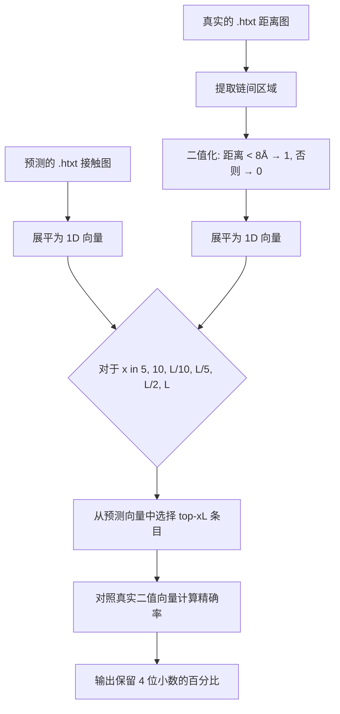

---
slug:13-prediction-evaluation-metrics
blog_type:normal
---


CDPred 通过一个 **precision-at-top-k** 框架评估链间距离和接触预测，该框架将预测的残基对概率与真实接触进行排名对比。评估流程将连续的距离预测转换为二值化接触标签，选择得分最高的残基对，并计算这些选择与真实链间接触匹配的比例。本页将剖析每一个指标、底层计算逻辑，以及将训练目标与评估结果联系起来的设计原理。

## 接触定义与真实值构建

当两个相互作用链上的一对残基 *(i, j)* 之间的最小重原子欧几里得距离严格小于 **8 Å** 时，该残基对被定义为**处于接触状态**。该阈值在评估脚本中是硬编码的，并反映在 `.rr` 接触输出格式中（列 `0 8.0`）。在评估期间，真实的 `.htxt` 距离矩阵会根据此规则进行二值化：

```
true_complex[true_complex < 8]  = 1   (接触)
true_complex[true_complex >= 8] = 0   (非接触)
```

真实矩阵的链间区域通过切片 `true_dist[:lenA, lenA:]` 提取，其中 `lenA` 是较短链的长度（用作 `tar_length`）。这个形状为 *(lenA × lenB)* 的矩形子矩阵，准确捕获了 CDPred 旨在预测的跨链残基对。

来源：[distmap_evaluate.py](lib/distmap_evaluate.py#L62-L72)

## Precision-at-Top-kL 指标

CDPred 报告了**六种精确率指标**，它们共享相同的计算结构，但在考虑的预测对数量上有所不同。通用公式为：

**Precision@Top-xL** = |{预测为 top-xL 且为真实接触的残基对}| / xL

变量 *L* 等于 `min(lenA, lenB)`——即较短链的长度——它根据蛋白质大小对评估的残基对数量进行归一化。辅助函数 `ceil_topxL_to_one()` 将排序后的预测向量转换为二值选择向量：它先将所有条目置零，然后将预测概率最高的 *xL* 个条目置为 1。接着，Scikit-learn 的 `precision_score` 计算这些选择中真实接触的比例。

| 指标 | 评估的残基对数量 | 解释 |
|--------|--------------------------|----------------|
| **Top-5** | 5 | 仅评估最高置信度的预测 |
| **Top-10** | 10 | 略宽的置信度区间 |
| **Top-L/10** | L/10 | 稀疏的长程链间接触 |
| **Top-L/5** | L/5 | 链间界面的中等覆盖度 |
| **Top-L/2** | L/2 | 广泛的界面覆盖度 |
| **Top-L** | L | 全界面尺度的评估 |

从 Top-5 到 Top-L 的演进测试了模型的**精确率-召回率权衡**：Top-5 奖励将概率质量集中在最确定接触上的模型，而 Top-L 奖励在更大规模预测集上保持准确率的模型。

来源：[distmap_evaluate.py](lib/distmap_evaluate.py#L20-L32), [distmap_evaluate.py](lib/distmap_evaluate.py#L77-L90)

## `EvaluateComplex` 函数内部机制

核心评估函数作用于两个展平的向量：`true_complex_vec`（二值化真实值）和 `pred_complex_vec`（连续的预测接触概率）。该函数遍历六个 *x* 值——`5, 10, L/10, L/5, L/2, L`——对于每个 *x*：

1. 调用 `ceil_topxL_to_one(pred_complex_vec, x)` 生成一个标记前 *x* 个预测的二值向量
2. 将真实值向量和选择向量传递给 `sklearn.metrics.precision_score`
3. 乘以 100 得到百分比
4. 格式化为 4 位小数

这种设计确保了**只有预测的排名顺序起作用**，而非它们的绝对概率值。一个概率校准良好的模型和一个概率单调但未校准的模型，如果它们以相同的顺序对残基对进行排名，将获得相同的精确率分数。



来源：[distmap_evaluate.py](lib/distmap_evaluate.py#L20-L32)

## 从多类距离输出到接触概率

CDPred 的神经网络为每个残基对输出一个**多类距离分布**——而非单一标量。在预测期间，模型生成一个包含 13 个以上距离区间的输出张量。接触概率通过**对前 13 个区间的概率求和**得出，这对应于低于约 8 Å 的距离：

```python
hv_con = Y_hat_hdist_npy[:, :, 0:13].sum(axis=-1).squeeze()
```

此求和利用了每个区间代表一个距离间隔的事实，区间 0–12 共同覆盖了定义接触的范围（0–8 Å）。生成的 `hv_con` 矩阵存储每对残基的接触概率，并保存为 `.htxt` 文件，作为评估脚本的输入。实值距离图通过 `npy2distmap()` 单独恢复，该函数使用区间中心值作为权重计算所有区间的加权和。

来源：[Model_predict.py](lib/Model_predict.py#L215-L220), [util.py](lib/util.py#L62-L80)

## 距离离散化方案

在训练期间，连续的重原子距离使用 **选项 'G'** 方案离散化为区间：42 个区间跨越 0–22 Å，**间隔为 0.5 Å**（区间 0 = 0–2 Å，区间 1–40 = 2.0–22.0 Å，步长 0.5 Å，区间 41 = 距离 ≥ 22 Å 或空隙）。该方案决定了训练期间多类分类损失和推理期间 `npy2distmap()` 重建中使用的区间边界：

| 区间索引 | 距离范围 (Å) | 区间中心 (Å) |
|-----------|---------------------|-----------------|
| 0 | 0.0 – 2.0 | 1.0 |
| 1 | 2.0 – 2.5 | 2.25 |
| 2 | 2.5 – 3.0 | 2.75 |
| ... | ... | ... |
| 40 | 21.5 – 22.0 | 21.75 |
| 41 | ≥ 22.0 或空隙 | 22.0 |

8 Å 的接触阈值落在区间 12（7.5–8.0 Å）和区间 13（8.0–8.5 Å）的边界上，这就是为什么**对区间 0–12 求和**能近似表示距离 < 8 Å 的概率。

来源：[Model_training.py](lib/Model_training.py#L67-L85), [util.py](lib/util.py#L62-L80)

## 训练损失：加权均方误差

模型的训练目标不同于评估指标——这是距离预测中的常见模式。CDPred 使用**距离依赖的加权均方误差**（`_weighted_mean_squared_error`），该误差应用了两种加权机制：

- **近程残基对**（真实距离 ≤ 10 Å）：常量权重 `weight`（通常 > 1）放大了损失贡献，迫使模型优先保证短距离预测的准确性
- **远程残基对**（真实距离 > 10 Å）：衰减权重 `1 / (1 + (ŷ / ȳ)²)` 减少了大距离的损失贡献，其中 `ȳ` 是真实平均距离

这种双机制设计反映了**链间接触是短程现象**的生物学现实——在 4–8 Å 处的精确预测远比在 18–20 Å 处有价值。加权 MSE 训练模型专注于评估指标最终测量的距离范围（接触 < 8 Å），尽管损失和评估指标在数学上是不同的。

来源：[Model_construct.py](lib/Model_construct.py#L106-L122)

## Top 预测的平均概率

除了精确率，CDPred 还提供了 `get_top_avg_prob()`，它计算排名前 L/k 的残基对的**平均预测接触概率**。此辅助指标衡量模型的**置信度校准**——即高排名预测是否具有接近 1.0 的概率。它支持三种选择模式：

| 模式 | 选择的残基对 | 用例 |
|------|---------------|----------|
| `topL5` | L/5 个最高概率残基对 | 稀疏界面置信度 |
| `topL2` | L/2 个最高概率残基对 | 广泛界面置信度 |
| `topL`` | L 个最高概率残基对 | 全界面置信度 |

一个校准良好的模型应在 Top-L/5（少量高置信度预测）显示出接近 1.0 的平均概率，并随着向 Top-L 推进而逐渐衰减。

来源：[distmap_evaluate.py](lib/distmap_evaluate.py#L34-L46)

## 运行评估

评估脚本 `distmap_evaluate.py` 需要四个输入：预测的接触图（`.htxt`）、真实的距离图（`.htxt`）以及两条链的 FASTA 文件。该脚本从 FASTA 文件中提取链长，以 8 Å 对真实值进行二值化，并在格式化表格中报告所有六个精确率指标：

```
python ./lib/distmap_evaluate.py \
  -p ./output/T1084A_T1084B/predmap/T1084A_T1084B.htxt \
  -t ./example/ground_truth/T1084A_T1084B.htxt \
  -f1 ./example/ground_truth/T1084A.fasta \
  -f2 ./example/ground_truth/T1084B.fasta
```

示例输出：

```
NAME            LEN_A LEN_B TOP5       TOP10      TOPL/10    TOPL/5     TOPL/2     TOPL      
T1084A_T1084B   71    71    100.0000   100.0000   100.0000   100.0000   94.2857    91.5493
```

同源二聚体示例在 Top-5 到 Top-L/5 范围内达到了完美的精确率（所有排名靠前的残基对都是真实接触），在 Top-L/2 和 Top-L 处随着置信度较低的残基对被纳入考虑，精确率出现平缓下降。异源二聚体示例的整体得分较低，反映了预测不对称链间界面的更大难度。

来源：[distmap_evaluate.py](lib/distmap_evaluate.py#L48-L90), [README.md](README.md#L108-L135)

## 指标关系与解释

```mermaid
graph LR
    subgraph Training
        A[加权 MSE 损失] -->|优化| B[距离区间概率]
    end
    subgraph Inference
        B -->|对区间 0-12 求和| C[接触概率图 .htxt]
        B -->|加权区间中心| D[实值距离图 .dist]
    end
    subgraph Evaluation
        C -->|排名 + 阈值| E[Precision@Top-xL]
        C -->|选择 + 平均| F[Avg prob@Top-L/k]
    end
    D -.->|被 GDFold 使用| G[结构对接]
```

上图展示了完整的生命周期：训练期间的**加权 MSE 损失**产生校准的距离区间概率；在推理时，这些概率被转换为接触概率图（用于评估）和实值距离图（用于下游对接）。精确率指标仅对排序后的接触概率进行操作，使其具有**保序性**——对概率值进行任何单调变换都会产生相同的评估结果。

<CgxTip>8 Å 接触阈值与 'G' 离散化方案中的区间边界对齐（区间 0–12 跨度 0–8 Å）。如果修改此阈值，还必须调整 `Model_predict.py` 中 `hv_con = Y_hat_hdist_npy[:,:,0:13].sum(axis=-1)` 行求和的区间数量，以保持预测输出和评估标准之间的一致性。</CgxTip>

<CgxTip>在评估异源二聚体时，`tar_length` 被设置为 `min(lenA, lenB)`，这意味着 Top-L 指标会缩放到较短链的长度。对于高度不对称的复合物（例如，lenA=50, lenB=200），Top-L 在 10,000 个可能的残基对中仅评估 50 对——这是一个非常稀疏的样本。在这种情况下，考虑使用 Top-L/2 或 Top-L/5 以获得更有意义的覆盖度。</CgxTip>

来源：[distmap_evaluate.py](lib/distmap_evaluate.py#L62-L76), [Model_predict.py](lib/Model_predict.py#L215-L220), [Model_construct.py](lib/Model_construct.py#L106-L122)

## 下一步

了解了评估指标之后，可以进一步探索如何配置由三个模型组成的集成并取平均以生成最终预测，详见[模型配置与集成](14-model-configuration-and-ensemble)，或者回顾预测输出的格式化方式，详见[输出文件与格式](12-output-files-and-formats)。