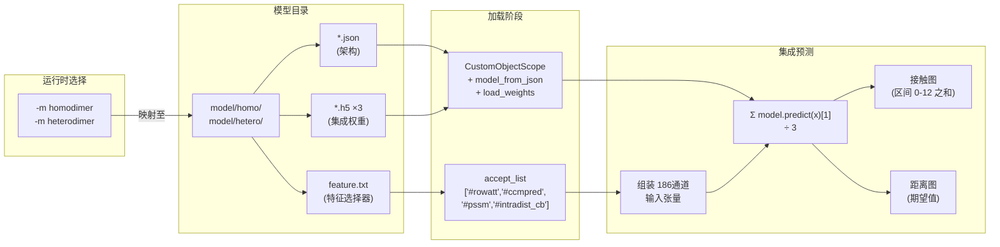

---
slug:14-model-configuration-and-ensemble
blog_type:normal
---


CDPred的预测精度取决于两个紧密耦合的设计决策：**向网络输入什么特征**以及**如何聚合多个独立训练的模型**。模型配置系统统管这两者——通过每种模型类型的`feature.txt`清单选择输入特征通道集，并通过同一目录下多个`.h5`权重文件的存在情况决定集成模型的构成。在预测时，所有共享相同架构定义（`.json`）但仅在习得权重上有所差异的模型，通过算术平均集成对最终的距离图做出同等贡献，该策略在不引入额外可训练参数的前提下，降低了单个模型过拟合带来的方差。

## 模型目录布局

每种预测类型——**同源二聚体**和**异源二聚体**——都在`model/`下维护各自独立的模型目录，包含三类产物：

| 文件类型 | 同源二聚体路径 | 异源二聚体路径 | 用途 |
|-----------|---------------|-----------------|---------|
| 架构（`.json`） | `model/homo/model-train-HomoPred_Net.json` | `model/hetero/model-train-HeteroPred_Net.json` | 通过`model.to_json()`序列化的Keras模型计算图 |
| 权重（`.h5`） | `model/homo/HomoPred1.h5` … `HomoPred3.h5` | `model/hetero/HeteroPred1.h5` … `HeteroPred3.h5` | 独立的训练检查点；每个定义了一个集成成员 |
| 特征清单（`.txt`） | `model/homo/feature.txt` | `model/hetero/feature.txt` | 声明要将哪些特征通道组装到输入张量中 |

架构JSON定义了一个**单一共享计算图**——三个`.h5`文件并非三种不同的架构，而是基于不同随机种子或数据洗牌训练出的**同一**网络拓扑的三个实例。这正是使简单平均有效的根本假设：所有集成成员在相同的概率空间中产生输出。

来源: [Model_predict.py](lib/Model_predict.py#L93-L114)

## 特征清单配置

`feature.txt`文件充当了一个**声明式特征选择器**。以`#`为前缀的行指定了一个被接受的特征通道；未列出的特征在预测时会被从输入张量中排除。目前，两种模型类型声明了完全一致的特征集：

```
# rowatt
# ccmpred
# pssm
# intradist_cb
```

每个声明的特征都映射到组装输入张量中特定的2D通道堆叠，贡献如下通道数：

| 特征标志 | 来源 | 描述 | 通道维度 |
|-------------|--------|-------------|-------------------|
| `# rowatt` | ESM-1b注意力图 | 蛋白质语言模型的逐行注意力 | 128 |
| `# ccmpred` | CCMpred | 共进化耦合分数（plm矩阵） | 1 (L×L) |
| `# pssm` | 基于UniRef90的PSI-BLAST | 位置特异性评分矩阵，重塑为2D | 20 (每个位置的20个AA分数被广播) |
| `# intradist_cb` | 单体PDB结构 | 来自预测单体结构的链内Cβ距离图 | 1 (L×L) |

这些通道沿最后一个轴拼接，生成具有**186个总特征通道**的最终输入张量，与架构JSON中定义的`batch_input_shape: [null, null, null, 186]`相匹配。前三个维度为`None`（可变长度），使CDPred能够处理任意序列长度的蛋白质，而无需填充或裁剪。

来源: [feature.txt](model/homo/feature.txt#L1-L4), [feature.txt](model/hetero/feature.txt#L1-L4), [model-train-HomoPred_Net.json](model/homo/model-train-HomoPred_Net.json#L1-L1)

## 集成加载与自定义层解析

函数`get_model_info()`编排了完整的模型加载流水线。它按顺序分三个阶段执行：

```mermaid
flowchart TD
    A["get_model_info(model_path)"] --> B["发现 .json 架构文件"]
    B --> C["发现所有 .h5 权重文件"]
    C --> D["读取 feature.txt → accept_list"]
    D --> E["对每个 .h5 文件:<br/>1. 从JSON重构计算图<br/>2. 注册自定义层<br/>3. 将权重加载至计算图"]
    E --> F["返回: List&#91;Keras Model&#93;, List&#91;Feature Flags&#93;"]
    
    style A fill:#2d3748,stroke:#4a5568,color:#fff
    style F fill:#2d3748,stroke:#4a5568,color:#fff
```



**自定义层注册**至关重要。序列化的JSON架构引用了三个自定义`Layer`子类——`InstanceNormalization`、`RowNormalization`和`ColumNormalization`——它们没有内置的Keras反序列化支持。若不通过`CustomObjectScope`进行显式注册，Keras的`model_from_json()`将抛出`ValueError`。该作用域还将`tf`（TensorFlow）作为自定义对象注入，因为架构中的某些Lambda层直接引用了它：

```python
with CustomObjectScope({
    'InstanceNormalization': InstanceNormalization,
    'RowNormalization': RowNormalization,
    'ColumNormalization': ColumNormalization,
    'tf': tf
}):
    json_string = open(model_out).read()
    temp_model = model_from_json(json_string)
    temp_model.load_weights(model_weight)
```

每个成功加载的`(architecture, weights)`对都会被追加到`CDPred`列表中，该列表即成为集成模型。特征标志的`accept_list`仅读取一次并在所有集成成员间共享——因为它们共享相同的架构，所以需要相同的输入特征组合。

<CgxTip>当向架构中添加新的自定义归一化层时，你**必须**在`get_model_info()`内部的`CustomObjectScope`字典中注册它。遗漏此项将导致模型加载时出现无声的反序列化失败，产生令人费解的Keras `ValueError`，而非预测错误。</CgxTip>

来源: [Model_predict.py](lib/Model_predict.py#L93-L114)

## 预测时的集成聚合

集成预测循环是对所有已加载模型的**等权算术平均**。其核心逻辑仅跨四行代码，却体现了一个关键的设计选择：

```python
Y_hat_hdist_npy = 0
for temp in CDPred:
    CDPred_prediction = temp.predict([selected_list_2D], batch_size=1)
    Y_hat_hdist_npy += CDPred_prediction[1].squeeze()
Y_hat_hdist_npy /= len(CDPred)
```

此循环中蕴含了若干架构细节：

- **索引`[1]`**：模型具有**两个输出头**——`interdist`（索引0）和`interhdist`（索引1）。集成仅选择**第二个头**（`interhdist`），用于预测多类链间距离分布。第一个头（`interdist`）预测实值距离，但在推理时会被丢弃——它仅作为辅助训练信号。
- **`.squeeze()`**：移除批处理维度，将形状从`(1, L, L, 42)`转换为`(L, L, 42)`。
- **除以`len(CDPred)`**：每种模型类型有三个`.h5`文件，此操作将累加和除以3，得出算术平均值。

平均后，42类距离分布将进行后处理：

| 步骤 | 操作 | 输出形状 | 描述 |
|------|-----------|-------------|-------------|
| 1 | `[:,:,0:13].sum(axis=-1)` | `(L, L)` | 接触概率：前13个距离区间的总和（对应于 < 8Å 的重原子距离） |
| 2 | `npy2distmap()` | `(L, L)` | 期望实值距离：使用softmax概率对区间中心进行加权求和 |
| 3 | 区域提取 | `(L_A, L_B)` | 对于异源二聚体：提取链间象限`[:lenA, lenA:]`；对于同源二聚体：使用完整图 |

来源: [Model_predict.py](lib/Model_predict.py#L214-L227)

## 运行时的模型类型选择

`-m`命令行标志直接映射到模型目录，在同源二聚体和异源二聚体预测流水线之间建立了**完全隔离**：

```python
if model_option == 'homodimer':
    model_path = f'{GLOABL_Path}/model/homo/'
elif model_option == 'heterodimer':
    model_path = f'{GLOABL_Path}/model/hetero/'
```

这意味着每种模型类型都携带其**自身**的架构JSON、**自身**的三个权重文件集以及**自身**的特征清单。尽管目前两种类型声明了相同的特征并共享相同的输入维度（186个通道），但这种隔离边界允许它们发生分化——例如，未来的异源二聚体模型可以纳入额外的链间特征，而不影响同源二聚体的配置。

完整的模型配置生命周期总结如下：



来源: [Model_predict.py](lib/Model_predict.py#L127-L131), [Model_predict.py](lib/Model_predict.py#L208-L218)

## 距离离散化方案

42类距离分箱方案（`option='G'`）是`interhdist`输出头的基础，并决定了softmax预测如何映射到物理距离：

| 区间索引 | 距离范围 | 区间宽度 |
|-----------|---------------|-----------|
| 0 – 3 | 0.0 – 2.0 Å | 0.5 Å |
| 4 – 41 | 2.0 – 22.0 Å | 0.5 Å |
| 41 | > 22.0 Å | 兜底类（间隙/无限大） |

转换公式为`bin = ceil(distance / 0.5 - 4)`，截断至`[0, 41]`。对应于缺失链内距离（输入结构中的间隙）的值被分配至第41区间。接触概率的计算对第0至12区间求和，这对应于低于约8 Å的重原子距离——蛋白质结构预测中的标准接触定义。

来源: [Model_training.py](lib/Model_training.py#L59-L76)

## 网络架构参数

主模型构造器`HomoPredRes_with_paras_2D`暴露了四个定义网络容量的可配置超参数：

| 参数 | 作用 | 预训练模型中的默认值 |
|-----------|------|------------------------------|
| `kernel_size` | 初始卷积滤波器的尺寸 | 通过`filtsize` CLI参数设置 |
| `feature_2D_num` | 输入特征通道数 | 186（由`feature.txt`决定） |
| `filters` | 瓶颈块中的卷积滤波器数量 | 通过`nb_filters` CLI参数设置 |
| `nb_layers` | 膨胀残差块的重复次数 | 通过`nb_layers` CLI参数设置 |
| `predict_method` | 输出头配置 | `realdist_hdist_nointra`（双头：interdist + interhdist） |

该架构遵循**膨胀残差瓶颈**模式，采用多尺度卷积（3×3, 7×1, 1×7）、行列实例归一化（`_rcin_relu_K`）以及`[1, 2, 4, 8, 1] × 4`的膨胀调度。初始投影中的Maxout激活层（带有`output_dim=64`的`MaxoutAct`）在残差块之前提供了一种已学习的分段线性非线性。

<CgxTip>三个`.h5`集成成员是使用不同的`index`值（第13个CLI参数）运行`train_homopred_tune_net.py`生成的。每个索引会触发具有唯一随机种子的独立训练运行，从而生成有效集成所需的权重多样性。`predict_method`标志控制输出头结构——只有`realdist_hdist_nointra`和`realdist_hdist_whole`会生成预测流水线所期望的双头架构。</CgxTip>

来源: [Model_construct.py](lib/Model_construct.py#L348-L396), [train_homopred_tune_net.py](lib/train_homopred_tune_net.py#L27-L39), [train_homopred_tune_net.py](lib/train_homopred_tune_net.py#L97-L99)

## 扩展集成

要添加第四个集成成员（例如`HomoPred4.h5`），请将新的`.h5`权重文件放入相应的模型目录中。函数`get_model_info()`会通过`getFileName(model_path, '.h5')`自动发现**所有**`.h5`文件，并且除以`len(CDPred)`的操作会自动适应——无需修改代码。唯一的约束是，新权重必须与目录中`.json`文件定义的**相同架构**相对应；架构不匹配将在`load_weights()`时引发Keras层形状错误。

要修改特征集，请编辑`feature.txt`并确保`generate_feature.py`中存在相应的特征生成逻辑。总通道数将发生变化，这要求同时提供重新训练的架构JSON（带有更新后的`batch_input_shape`）和重新训练的权重文件。

要深入理解使此架构独一无二的自定义归一化层，请参阅[实例归一化](8-instance-normalization)和[行列归一化](9-row-and-column-normalization)。有关调用此集成的完整预测工作流，请参阅[预测工作流](7-prediction-workflow)。