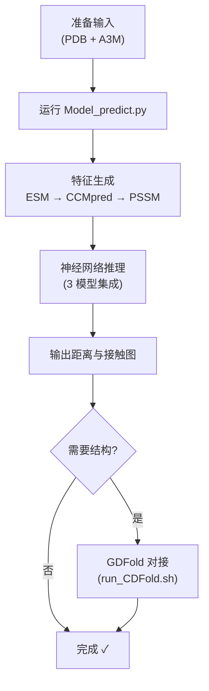

---
slug:2-quick-start
blog_type:normal
---


不到一小时即可让 CDPred 运行起来——从克隆仓库到生成你的第一个链间距离预测。本页将引导你完成**环境搭建**、**数据库配置**，并使用内置示例数据进行**首次预测**。最终，你将成功复现同源二聚体目标的预生成输出，并了解如何调整命令以适配你自己的蛋白质复合物。


## 前置条件一览

在安装 CDPred 之前，请确认你的系统满足以下要求：

| 要求 | 规格 | 说明 |
|---|---|---|
| **操作系统** | Linux (Ubuntu 16.04 或 CentOS 7.9.2009) | 未在 macOS/Windows 上测试 |
| **Python** | 3.6.x | 必需 — 较新版本与 TensorFlow 1.9 不兼容 |
| **磁盘空间** | ~30 GB | 主要被 UniRef90 数据库占用 |
| **内存** | ≥ 8 GB | 特征生成 (ESM, CCMpred, PSSM) 非常消耗内存 |

来源: [README.md](/README.md#L17-L30)

## 第 1 步：克隆仓库

将 CDPred 克隆到一个**短路径**下——过长的路径可能会导致某些内部工具出现问题：

```bash
git clone https://github.com/BioinfoMachineLearning/CDPred.git
cd CDPred
```

你刚刚克隆的顶层项目结构组织如下：

```
CDPred/
├── lib/                    # 核心 Python 脚本 (预测、特征生成、评估)
├── model/                  # 预训练的神经网络权重与配置
│   ├── homo/               # 同源二聚体集成模型 (3 个模型)
│   └── hetero/             # 异源二聚体集成模型 (3 个模型)
├── example/                # 演示输入 + 预期输出 + 真实值
├── external_tool/          # ZComplexMSA (MSA 生成) + GDFold (结构对接)
├── requirments.txt         # Python 依赖
└── LICENSE
```

来源: [README.md](/README.md#L33-L39)

## 第 2 步：创建并激活 Python 环境

CDPred 依赖于 **TensorFlow 1.9.0** 和 **Keras 2.1.6**，它们需要 Python 3.6。请设置一个独立的虚拟环境：

```bash
mkdir env
python3.6 -m venv env/CDPred_virenv
source env/CDPred_virenv/bin/activate
pip install --upgrade pip
pip install -r requirments.txt
```

安装的主要依赖如下：

| 包 | 版本 | 在 CDPred 中的作用 |
|---|---|---|
| `tensorflow` | 1.9.0 | 神经网络推理的后端 |
| `Keras` | 2.1.6 | 高级模型加载与预测 API |
| `fair-esm` | 0.3.1 | Evolutionary Scale Modeling — 生成行注意力特征 |
| `numpy` | 1.16.2 | 整个流程中的数值数组操作 |
| `biopython` | 1.79 | PDB 文件解析与序列提取 |
| `torch` | 1.8.0 | ESM 计算注意力图所需 |

来源: [README.md](/README.md#L42-L51), [requirments.txt](/requirments.txt#L1-L15)

## 第 3 步：下载并配置 UniRef90 数据库

PSSM 特征生成需要 **UniRef90_01_2020** 序列数据库（压缩包约 30 GB）。从 Zenodo 下载：

```bash
aria2c -x 10 https://zenodo.org/record/7650566/files/uniref90_01_2020.tar.xz?download=1
xz -d -T 4 uniref90_01_2020.tar.xz
tar -xvf uniref90_01_2020.tar
```

然后更新 `lib/constants.py` 中的数据库路径，使其指向解压后的 `uniref90` 目录。例如，如果你下载到了 `/data/CDPred_db/`：

```python
# lib/constants.py
unirefdb = '/data/CDPred_db/uniref90_01_2020/uniref90'
```

<CgxTip>如果在特征生成期间遇到共享库错误（尤其是使用 PSI-BLAST 生成 PSSM 时），请在运行 CDPred 之前将相应的库路径添加到你的 `LD_LIBRARY_PATH` 环境变量中。</CgxTip>

来源: [README.md](/README.md#L53-L64), [lib/constants.py](/lib/constants.py#L1-L4)

## 第 4 步：运行你的首次预测

环境激活且数据库配置完成后，你就可以开始预测了。CDPred 的入口点是 `lib/Model_predict.py`。以下流程图展示了完整的预测生命周期：



### 同源二聚体示例

对于**同源二聚体**（两条相同链），你需要 **1 个**单体 PDB 文件和 **1 个** A3M 比对文件：

```bash
python lib/Model_predict.py \
  -n T1084A_T1084B \
  -p ./example/T1084A_T1084B.pdb \
  -a ./example/T1084A_T1084B.a3m \
  -m homodimer \
  -o ./output/T1084A_T1084B/
```

### 异源二聚体示例

对于**异源二聚体**（两条不同链），你需要 **2 个**单体 PDB 文件（链 A 和链 B）以及 **1 个**配对的 A3M 比对文件：

```bash
python lib/Model_predict.py \
  -n H1017A_H1017B \
  -p ./example/H1017A.pdb ./example/H1017B.pdb \
  -a ./example/H1017A_H1017B.a3m \
  -m heterodimer \
  -o ./output/H1017A_H1017B/
```

完整的参数参考如下：

| 标志 | 是否必需 | 描述 |
|---|---|---|
| `-n` | 是 | 蛋白质复合物名称 (例如 `T1084A_T1084B`) |
| `-p` | 是 | 一个 PDB 文件 (同源二聚体) 或两个 PDB 文件 (异源二聚体)，以空格分隔 |
| `-a` | 是 | `.a3m` 格式的 MSA 文件 |
| `-m` | 否 | 模型类型：`homodimer` (默认) 或 `heterodimer` |
| `-o` | 是 | 输出目录 (若不存在则会自动创建) |

在 CPU 上每次预测大约需要 **5 分钟**。该脚本默认在 CPU 上运行 (`CUDA_VISIBLE_DEVICES="-1"`)。

来源: [README.md](/README.md#L69-L94), [lib/Model_predict.py](/lib/Model_predict.py#L121-L131)

## 第 5 步：验证输出

成功运行后，你的输出目录中将包含两个子目录：

```
output/T1084A_T1084B/
├── feature/                # 预测期间生成的中间特征
│   ├── T1084A_T1084B_pssm.txt    # PSI-BLAST 生成的 PSSM
│   ├── T1084A_T1084B.npy         # ESM 行注意力图
│   ├── T1084A_T1084B.mat         # CCMpred 共进化得分
│   ├── T1084A_T1084B.fasta       # FASTA 序列
│   ├── T1084A_T1084B.dist        # 链内 Cβ 距离图
│   ├── T1084A_T1084B.aln         # ALN 格式的 MSA
│   └── T1084A_T1084B.a3m         # A3M 格式的 MSA
└── predmap/                # 最终预测结果
    ├── T1084A_T1084B_dist.rr     # 残基-残基距离 (格式: i, j, dist)
    ├── T1084A_T1084B_con.rr      # 残基-残基接触概率
    ├── T1084A_T1084B.htxt        # 链间接触图 (矩阵)
    └── T1084A_T1084B.dist        # 链间距离图 (矩阵)
```

将你的输出与 `./example/expection_output/` 中的**预生成参考输出**进行对比，以确认正确性。需要重点检查的是 `predmap/` 下的 `*.htxt` 和 `*.dist` 图文件。

来源: [README.md](/README.md#L98-L135)

## 第 6 步：评估预测质量

CDPred 内置了评估脚本，可基于真实接触图计算**精度指标** (Top-5, Top-10, Top-L/10, Top-L/5, Top-L/2, Top-L)：

```bash
# 同源二聚体评估
python ./lib/distmap_evaluate.py \
  -p ./example/expection_output/T1084A_T1084B/predmap/T1084A_T1084B.htxt \
  -t ./example/ground_truth/T1084A_T1084B.htxt \
  -f1 ./example/ground_truth/T1084A.fasta \
  -f2 ./example/ground_truth/T1084B.fasta
```

预期输出：

```
NAME            LEN_A LEN_B TOP5       TOP10      TOPL/10    TOPL/5     TOPL/2     TOPL      
T1084A_T1084B   71    71    100.0000   100.0000   100.0000   100.0000   94.2857    91.5493 
```

来源: [README.md](/README.md#L137-L165)

## 单命令端到端流程

如果你还想要**对接的 3D 结构**（而不仅仅是距离图），请使用 shell 封装脚本 `external_tool/run_CDFold.sh`。该脚本将编排整个流程：MSA 生成 → CDPred 预测 → GDFold 结构对接：

```bash
bash ./external_tool/run_CDFold.sh \
  -n T1084A_T1084B \
  -p ./example/T1084A_T1084B.pdb \
  -m homodimer \
  -o ./output/T1084A_T1084B/
```

这要求 [ZComplexMSA](10-zcomplexmsa-for-msa-generation) 和 [GDFold](11-gdfold-for-structure-docking) 均已安装在 `external_tool/` 下。最终对接的模型将输出在 `./output/T1084A_T1084B/models/top_5_models/`。

来源: [external_tool/run_CDFold.sh](/external_tool/run_CDFold.sh#L1-L152)

## 故障排除

| 症状 | 可能原因 | 解决方案 |
|---|---|---|
| `ModuleNotFoundError: No module named 'keras'` | 虚拟环境未激活 | 运行 `source env/CDPred_virenv/bin/activate` |
| PSSM 生成期间出现 `FileNotFoundError` 找不到 UniRef90 | `lib/constants.py` 中的路径错误 | 验证 `unirefdb` 路径是否指向实际的 `uniref90` 二进制文件 |
| PSI-BLAST 期间出现 `libssl.so` 或共享库错误 | 缺少系统库 | 将库路径添加到 `LD_LIBRARY_PATH` |
| 特征形状不匹配错误 | Python/NumPy 版本不兼容 | 确保为 Python 3.6.x 且 `numpy==1.16.2` |
| ESM 行注意力计算期间出现 OOM | 长序列导致内存不足 | 使用内存 ≥ 16 GB 的机器 |

## 后续进阶

现在你已经拥有了一个可用的 CDPred 安装环境，并在示例数据上完成了验证。以下是推荐的阅读路径，以帮助你进一步深入理解：

1. **[输入数据准备](3-input-data-preparation)** — 了解如何准备你自己的 PDB 和 A3M 文件，或使用 ZComplexMSA 从头生成复合物 MSA
2. **[架构概览](4-architecture-overview)** — 理解端到端的流程设计，从特征生成到集成预测
3. **[特征生成](5-feature-generation)** — 深入了解四个特征通道（ESM 注意力、CCMpred、PSSM、链内距离）及其数学基础
4. **[输出文件与格式](12-output-files-and-formats)** — 用于下游集成的每个输出文件的详细规范
5. **[预测评估指标](13-prediction-evaluation-metrics)** — Top-L 精度与接触阈值是如何计算的