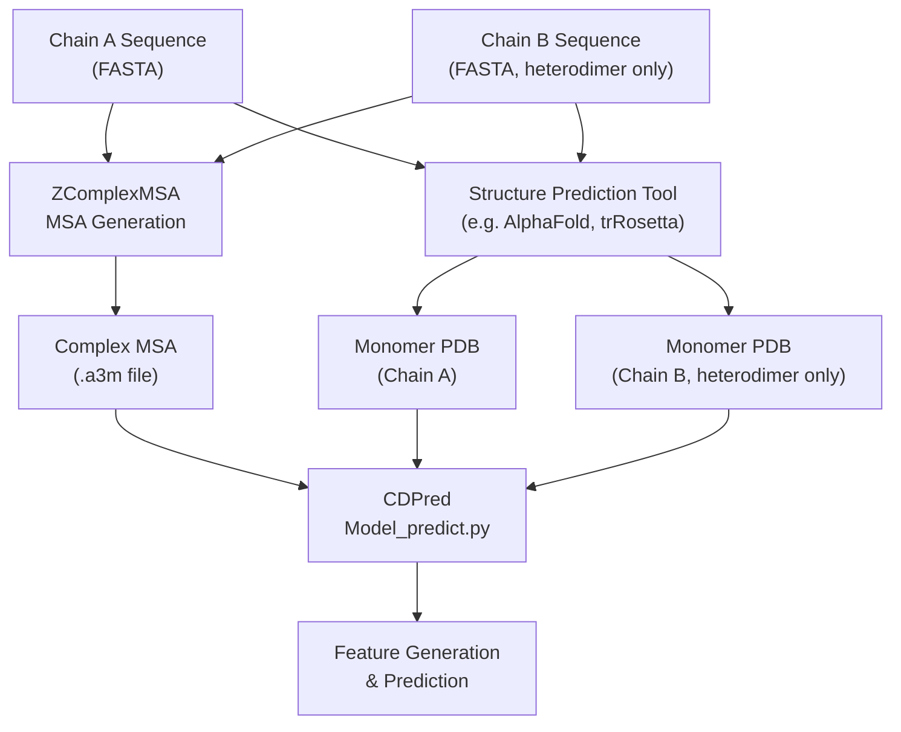
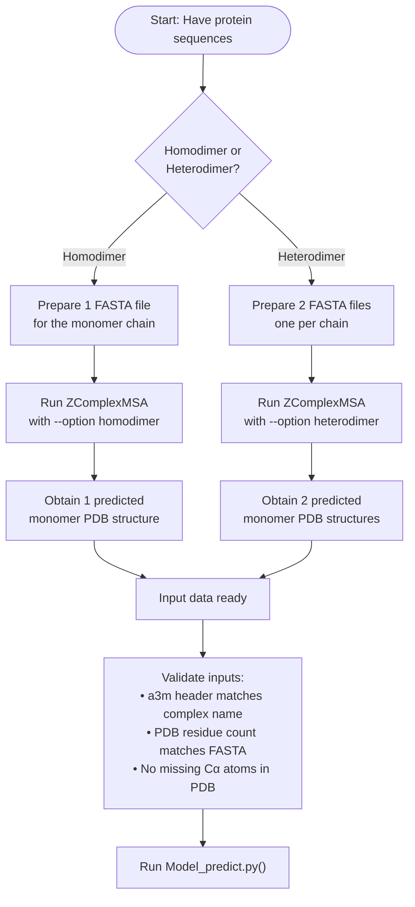

---
slug:3-input-data-preparation
blog_type:normal
---


CDPred 需要三个核心输入项来预测蛋白质二聚体的链间残基-残基距离：**复合物名称**、一个或多个**预测的单体 PDB 结构文件**，以及一个**`.a3m` 格式的多序列比对 (MSA) 文件**。这些输入的类型和数量在**同源二聚体**和**异源二聚体**预测模式下有所不同，并且每一项都必须符合特定的格式约束。本页将详细介绍每个输入项、其格式规范，以及从原始序列到可用于预测的数据的准备流程。

来源: [README.md](/README.md#L1-L172)

## 输入项概述

CDPred 的预测脚本 `lib/Model_predict.py` 接受五个命令行参数，其中三个直接提供输入数据：

| 参数 | 标志 | 描述 | 是否必选 |
|-----------|------|-------------|----------|
| **Name** | `-n` | 蛋白质复合物标识符（自定义名称或 PDB 风格的 ID） | 是 |
| **PDB File(s)** | `-p` | 带有 `.pdb` 后缀的预测单体三级结构文件 | 是 |
| **MSA File** | `-a` | `.a3m` 格式的多序列比对文件 | 是 |
| **Model Option** | `-m` | `homodimer` 或 `heterodimer` — 决定预测模式 | 是 |
| **Output Path** | `-o` | 自定义输出目录（若不存在则自动创建） | 是 |

关键区别在于，**同源二聚体**预测仅需**一个** PDB 文件（因为两条链完全相同），而**异源二聚体**预测需要**两个** PDB 文件——每个不同的链各一个。这一差异贯穿整个输入准备流程。

来源: [README.md](/README.md#L67-L78)

## 输入数据流

下图展示了完整的输入准备流程，即从原始序列到 CDPred 特征生成阶段所消费的数据：



该流程分为两条并行的准备轨道：**MSA 生成**（上方路径）和**单体结构预测**（下方路径）。在调用 CDPred 之前，两者必须全部完成。MSA 文件捕获相互作用链之间的共进化信号，而 PDB 文件则提供链内距离的空间上下文。

来源: [README.md](/README.md#L79-L94), [README.md](/README.md#L52-L64)

## 蛋白质复合物命名约定

`-n` 参数定义复合物标识符，并作为所有输出项的命名空间。CDPred 遵循 **`ChainA_ChainB`** 命名约定，其中每个链标识符通常映像 PDB 命名法：

- **同源二聚体示例**：`T1084A_T1084B` — 两条链均源自同一单体 (T1084)，A 和 B 表示两个副本
- **异源二聚体示例**：`H1017A_H1017B` — 源自不同序列的两条不同链 (H1017A 和 H1017B)

此命名约定不仅是为了美观——它决定了输出文件名（`<name>_dist.rr`、`<name>_con.rr`、`<name>.htxt` 等），并且必须与 `.a3m` 文件中的头部行相匹配以保持一致性。

来源: [README.md](/README.md#L73-L74), [example/T1084A_T1084B.a3m](/example/T1084A_T1084B.a3m#L1-L2), [example/H1017A_H1017B.a3m](/example/H1017A_H1017B.a3m#L1-L2)

## PDB 结构文件

### 格式要求

CDPred 接受标准 **PDB 格式**（`.pdb` 后缀）的预测单体三级结构文件。这些文件必须包含允许提取碳阿尔法 (Cα) 位置的原子坐标记录，链内距离图便是据此计算得出的。PDB 文件表示的是**预测的**（不一定是实验测定的）单体结构——任何能输出有效 PDB 格式的结构预测工具均可接受。

### 同源二聚体：单个 PDB 文件

对于同源二聚体预测，**一个** PDB 文件便足够了，因为两条链共享相同的结构。命令使用单个 `-p` 参数：

```bash
python lib/Model_predict.py -n T1084A_T1084B \
    -p ./example/T1084A_T1084B.pdb \
    -a ./example/T1084A_T1084B.a3m \
    -m homodimer \
    -o ./output/T1084A_T1084B/
```

来源: [README.md](/README.md#L82-L87)

### 异源二聚体：两个 PDB 文件

对于异源二聚体预测，**两条**链的结构都是必需的，并且必须作为 **两个以空格分隔的参数** 提供给 `-p`。这两个 PDB 文件必须分别对应链 A 和链 B，且其残基序列必须与 `.a3m` 文件中编码的序列**保持一致**：

```bash
python lib/Model_predict.py -n H1017A_H1017B \
    -p ./example/H1017A.pdb ./example/H1017B.pdb \
    -a ./example/H1017A_H1017B.a3m \
    -m heterodimer \
    -o ./output/H1017A_H1017B/
```

<CgxTip>异源二聚体模式下 `-p` 参数中 PDB 文件的顺序必须与复合物名称和 MSA 头部所隐含的链顺序相匹配。交换链 A 和链 B 的结构将导致错误的链间距离预测。</CgxTip>

来源: [README.md](/README.md#L89-L94)

### 获取单体 PDB 结构

CDPred 本身并不预测单体结构——你必须从外部结构预测工具获取这些结构。常见选择包括：

| 工具 | 输出格式 | 适用性 |
|------|---------------|-------------|
| **AlphaFold2** | PDB | 高精度，推荐 |
| **trRosetta** | PDB | 良好精度，速度更快 |
| **RoseTTAFold** | PDB | 良好精度 |
| **I-TASSER** | PDB | 成熟的方法 |

预测后，请验证每个 PDB 文件是否包含相应 FASTA 序列中出现的所有残基的完整 Cα 坐标。

来源: [README.md](/README.md#L74-L75)

## A3M 格式的 MSA 文件

### 格式规范

`.a3m` 格式是 HH-suite 及相关工具使用的一种**紧凑 MSA 表示**。它遵循类似 FASTA 的结构，具有两个关键特征：

1. **头部行**：以 `>` 开头，后跟复合物名称（例如，`>T1084A_T1084B`）
2. **序列行**：氨基酸序列，其中**小写字母表示插入**（相对于查询序列），**破折号 (`-`)** 表示缺失/空位。与 `.aln` 格式不同，`.a3m` **保留插入残基**而不是移除它们。

头部之后的第一个序列是**查询序列**（拼接或配对的链序列），随后的条目是通过数据库搜索发现的同源序列。

### 同源二聚体 MSA 示例

同源二聚体示例 `T1084A_T1084B.a3m` 的开头如下：

```
>T1084A_T1084B
AHKGAEHHHKAAEHHEQAAKHHHAAAEHHEKGEHEQAAHHADTAYAHHKHAEEHAAQAAKHDAEHHAPKPH
> 
DHAGVEHHHKAAEHHEQAAKHHREAAKHHESGDHEKAAHHAHSAHGHASHAEEHHAEASRHHAEHHG----
```

查询序列长 71 个残基，MSA 包含数千条提供共进化信号的同源序列。序列末端的空位 (`-`) 表示同源序列的部分覆盖。

来源: [example/T1084A_T1084B.a3m](/example/T1084A_T1084B.a3m#L1-L7)

### 异源二聚体 MSA 示例

异源二聚体示例 `H1017A_H1017B.a3m` 的开头如下：

```
>H1017A_H1017B
LLLNDKQYNELCEAAEGRNLGAVFSYSEPEEPPPLNFSFEERKKIFLWVLTRLLKEGRIKLAKHGKFLEGSVDEQVERFRQAFPKTEEEMEDGIWFFDESCPGGAVWVLEQEVQQQRFDELSKIYDKSHPVGELTVDGQTIRQSSVSNRYGXTKVFESQNLTDKQIHNYAQQLAGDTPLKEVRPGIYTAKLENGTSITLRSLSSSQEQRWTIDIKGNKQLSDIAYKYKDVEIKFK
>UniRef90_UPI0018AF6D8D_UniRef90_A0A6F8TFA5
--------------------------------KDFNFNFNQRKEFFLLLLRMLLETGKIRLGKHGEFLQGSVDELISRYDAAFPKTEGEWET---------------------------EIAELFTKTNSRNTLTIAGLDIKKGYNPVNSQTTVILDSQKLTSNNIKEYAQQLAGTVPLKAVGNGIYVATLGNGQQIRLRSVSSSASQRWTIDIQGNPGIN--------------
```

异源二聚体查询序列拼接了两条链 (110 + 125 = 235 个残基)，带有 UniRef90 前缀的头部表明了每条同源序列的源数据库。许多同源序列在早期位置的大量空位反映了许多数据库匹配仅覆盖第二条链区域。

来源: [example/H1017A_H1017B.a3m](/example/H1017A_H1017B.a3m#L1-L10)

## 使用 ZComplexMSA 生成 MSA

CDPred 提供了 **ZComplexMSA**，这是一个专为蛋白质复合物共进化分析优化的自定义 MSA 生成流程。该工具替代了通用的 MSA 生成器，并生成专门为链间距离预测调优的 `.a3m` 文件。

### 前置条件

ZComplexMSA 需要自带带有 HH-suite 和 HMMER 的 conda 环境：

```bash
conda create -p ./env/ -c conda-forge -c bioconda hhsuite python==3.8
conda activate ./env/
conda install -y -c bioconda hmmer==3.3.2 hhsuite==3.3.0
pip install -r requirments.txt
```

### 数据库设置

MSA 生成流程所需的序列数据库因二聚体类型而异：

| 二聚体类型 | 所需数据库 | 来源 |
|------------|-------------------|--------|
| **同源二聚体** | Big Fantastic Database (BFD) | [bfd.mmseqs.com](https://bfd.mmseqs.com/) |
| **异源二聚体** | UniRef90 + UniProt2PDB 映射 | [FTP:UniRef90](https://ftp.uniprot.org/pub/databases/uniprot/uniref/uniref90/uniref90.fasta.gz) + 捆绑的 `uniprot2pdb.tar.xz` |

下载后，在 `./bin/db_option` 中配置数据库路径：

```
bfd_database = /Your_Download_Path/bfd_metaclust_clu_complete_id30_c90_final_seq.sorted_opt
uniref90_fasta = /Your_Download_Path/uniref90/uniref90.fasta
uniprot2pdb_dir = /Your_Download_Path/uniprot2pdb
uniprot2pdb_mapping_file = /Your_Download_Path/uniprot2pdb/uniprot2pdb.map
dimers_list = /Your_Download_Path/uniprot2pdb/dimers_cm.list
```

来源: [external_tool/ZComplexMSA/README.md](/external_tool/ZComplexMSA/README.md#L1-L35)

### 为同源二聚体生成 MSA

对于同源二聚体目标，提供单体链的**单个 FASTA 文件**：

```bash
python run_zcomplexmsa.py \
    --option_file ./bin/db_option \
    --fasta1 ./test/homo/2FDOA.fasta \
    --outdir ./test/homo \
    --option homodimer
```

`--fasta1` 参数提供单体序列，`--option homodimer` 选择同源二聚体 MSA 构建策略。

来源: [external_tool/ZComplexMSA/README.md](/external_tool/ZComplexMSA/README.md#L49-L57)

### 为异源二聚体生成 MSA

对于异源二聚体目标，提供**两个 FASTA 文件**——每条链一个：

```bash
python run_zcomplexmsa.py \
    --option_file ./bin/db_option \
    --fasta1 ./test/hetero/1AWCA.fasta \
    --fasta2 ./test/hetero/1AWCB.fasta \
    --outdir ./test/hetero \
    --option heterodimer
```

`--fasta2` 参数**专属于异源二聚体模式**，用于提供第二条链的序列。UniProt2PDB 映射数据库使 ZComplexMSA 能够识别涉及两条链同源物的已知异源二聚体复合物，从而用链间共进化信号丰富 MSA。

来源: [external_tool/ZComplexMSA/README.md](/external_tool/ZComplexMSA/README.md#L37-L46)

## FASTA 序列文件

FASTA 文件是 MSA 生成（通过 ZComplexMSA）和评估（通过 `distmap_evaluate.py`）的起点。每个文件以标准 FASTA 格式包含单条链序列：

```
>T1084A
AHKGAEHHHKAAEHHEQAAKHHHAAAEHHEKGEHEQAAHHADTAYAHHKHAEEHAAQAAKHDAEHHAPKPH
```

```
>H1017A
LLLNDKQYNELCEAAEGRNLGAVFSYSEPEEPPPLNFSFEERKKIFLWVLTRLLKEGRIKLAKHGKFLEGSVDEQVERFRQAFPKTEEEMEDGIWFFDESCPGGAVWVLE
```

头部行 (`>`) 包含链标识符，序列行仅包含**大写单字母氨基酸代码**。对于异源二聚体的准备，你需要**两个独立的 FASTA 文件**——每条链一个。

来源: [example/ground_truth/T1084A.fasta](/example/ground_truth/T1084A.fasta#L1-L2), [example/ground_truth/H1017A.fasta](/example/ground_truth/H1017A.fasta#L1-L2)

## PSSM 生成依赖 (UniRef90)

CDPred 的特征生成阶段从输入的 MSA 中计算**位置特异性评分矩阵 (PSSM)**，这需要 **UniRef90_01_2020** 数据库。这是一个与 MSA 生成数据库独立的下载项：

```bash
aria2c -x 10 https://zenodo.org/record/7650566/files/uniref90_01_2020.tar.xz?download=1
xz -d -T 4 uniref90_01_2020.tar.xz
tar -xvf uniref90_01_2020.tar
```

解压后，修改 `./lib/constants.py` 中的 UniRef90 路径：

```python
UNIREF90_PATH = "/Download_Path/uniref90_01_2020/uniref90"
```

根据网速不同，此下载大约需要 40–70 分钟。**如果在特征生成期间遇到共享库错误，请将相应的库添加到你的系统路径中。**

<CgxTip>用于 PSSM 生成的 UniRef90 数据库 (`uniref90_01_2020`) 不同于 ZComplexMSA 用于 MSA 生成的 UniRef90 FASTA。两者均为必需，但在流程中用途不同。</CgxTip>

来源: [README.md](/README.md#L52-L64)

## 训练数据列表格式

对于扩展或重新训练 CDPred 模型的用户，`example/training_datalists/` 目录提供了数据集划分文件。这些列表文件定义了训练、验证和测试划分，不同二聚体类型的格式不同：

### 同源二聚体列表格式

每行包含四个以空格分隔的字段：

```
<complex_name> <chain_A_length> <chain_B_length> <contact_count>
```

示例：`5FGLA_5FGLB 200 200 223.0` — 同源二聚体 5FGL 具有各 200 个残基的链和 223 个链间接触。

### 异源二聚体列表格式

每行包含三个以空格分隔的字段：

```
<complex_name> <chain_A_length> <chain_B_length>
```

示例：`5k39A_5k39B 167 153` — 异源二聚体 5k39 的链 A 有 167 个残基，链 B 有 153 个残基。请注意，某些异源二聚体条目包含 `_1` 或 `_2` 后缀（例如，`1hbuB_1hbuD_1`），以区分同一 PDB 条目内的多个界面区域。

来源: [example/training_datalists/homodimer/train.lst](/example/training_datalists/homodimer/train.lst#L1-L5), [example/training_datalists/heterodimer/train.lst](/example/training_datalists/heterodimer/train.lst#L1-L10)

## 逐步准备流程

以下流程图提供了完整的输入准备过程：



### 准备清单

| 步骤 | 任务 | 同源二聚体 | 异源二聚体 |
|------|------|-----------|-------------|
| 1 | 准备 FASTA 序列文件 | 1 个文件 | 2 个文件 |
| 2 | 通过 ZComplexMSA 生成复合物 MSA | `--option homodimer` | `--option heterodimer` |
| 3 | 从外部预测单体结构 | 1 个 PDB 文件 | 2 个 PDB 文件 |
| 4 | 下载并配置 UniRef90 用于 PSSM | 必需 | 必需 |
| 5 | 使用 `-m` 标志运行 CDPred | `homodimer` | `heterodimer` |

来源: [README.md](/README.md#L67-L94), [external_tool/ZComplexMSA/README.md](/external_tool/ZComplexMSA/README.md#L37-L57)

## 输入验证准则

在运行 CDPred 之前，请验证输入项之间的以下一致性约束：

1. **名称一致性**：`-n` 的值应与 `.a3m` 文件中的头部相匹配（不含 `>` 前缀）
2. **序列长度一致性**：每个 PDB 文件中的残基数必须与 `.a3m` 查询序列中相应区域的残基数相匹配
3. **链顺序一致性**：对于异源二聚体，`-p` 中 PDB 文件的顺序必须对应复合物名称和 MSA 中的链顺序
4. **Cα 原子完整性**：每个 PDB 文件必须包含每个残基的 Cα 原子坐标——缺失原子将导致特征提取失败
5. **A3M 格式有效性**：文件至少须包含头部行和查询序列；额外的同源序列可提高预测质量

未能满足这些约束通常表现为特征生成期间的维度不匹配或隐性预测错误。

来源: [README.md](/README.md#L67-L94)

## 使用自定义 MSA

CDPred 的 `-a` 参数接受**任何有效的 `.a3m` 文件**，不仅限于由 ZComplexMSA 生成的文件。如果你拥有来自 HHblits、JackHMMER 或其他工具的现有 MSA，只要它符合 `.a3m` 格式（小写插入，破折号作为空位字符），就可以直接使用。然而，对于**链间**距离预测，捕获两条链之间**配对共进化信号**的 MSA 所产生的结果明显优于朴素拼接的单链 MSA——这正是 ZComplexMSA 存在的原因。

来源: [README.md](/README.md#L75-L76)

---

**下一步**：输入数据准备完成后，请前往 [特征生成](5-feature-generation) 了解 CDPred 如何将这些输入转换为神经网络特征，或跳转至 [预测流程](7-prediction-workflow) 获取端到端执行指南。有关 ZComplexMSA 工具本身的详细信息，请参阅 [使用 ZComplexMSA 生成 MSA](10-zcomplexmsa-for-msa-generation)。