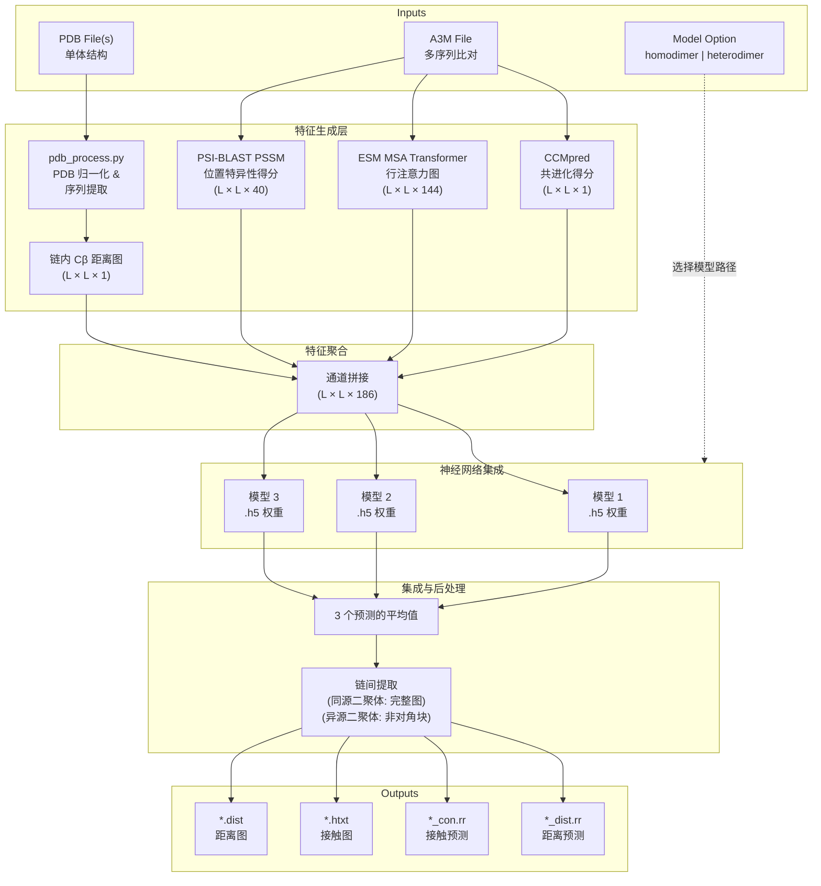
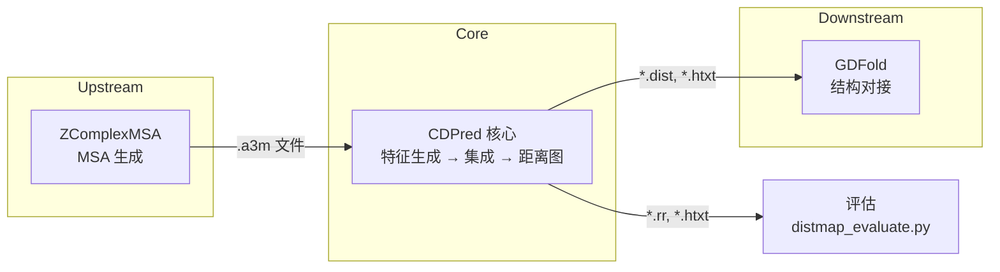

---
slug:4-architecture-overview
blog_type:normal
---


CDPred（复杂距离预测器）是一个**基于二维注意力的深度神经网络**系统，用于预测蛋白质二聚体的链间残基-残基距离。其架构遵循三阶段流水线——**特征生成**、**神经网络集成预测**和**后处理**——并为同源二聚体和异源二聚体复合物提供双路径。本页映射了整个系统的结构拓扑，从入口点经过数据流直至输出产物。

来源：[README.md](/README.md#L1-L172), [lib/Model_predict.py](/lib/Model_predict.py#L1-L240)

## 系统架构图

端到端预测流水线由 `Model_predict.py` 编排，它负责协调特征计算、模型加载、集成推理和结果序列化。下图展示了从原始输入到最终预测的完整数据流：



来源：[lib/Model_predict.py](/lib/Model_predict.py#L146-L240), [lib/generate_feature.py](/lib/generate_feature.py#L228-L313)

## 核心模块拓扑

CDPred 的源代码组织在 `lib/` 目录中，每个模块承担不同的架构角色。下表将每个模块映射到其职责及其在调用图中的位置：

| 模块 | 角色 | 关键函数 | 调用方 |
|---|---|---|---|
| `Model_predict.py` | **编排器 / 入口点** | CLI 解析，特征→预测→保存流水线 | 用户 (CLI) |
| `generate_feature.py` | **特征计算引擎** | `compute_ccmpred()`, `computerowatt()`, `computepssm()`, `get2d_feature_by_list()` | `Model_predict.py` |
| `Model_construct.py` | **网络架构定义** | 自定义层，残差块，squeeze-excite，损失函数 | 训练脚本 |
| `pdb_process.py` | **结构预处理** | `process_pdbfile()`, `get_sequence_from_pdb()` | `Model_predict.py` |
| `util.py` | **后处理与 I/O 工具** | `npy2distmap()`, `gen_rr_file()`, `get_cb_dist_from_pdbfile()` | `Model_predict.py`, `pdb_process.py` |
| `data.py` | **ESM 字母表配置** | 用于 MSA Transformer 标记化的 `Alphabet` 类 | `generate_feature.py` |
| `constants.py` | **全局配置** | `unirefdb` 路径常量 | `generate_feature.py` |
| `distmap_evaluate.py` | **评估指标** | Top-L 精度评分 | 用户 (CLI, 预测后) |

来源：[lib/Model_predict.py](/lib/Model_predict.py#L1-L240), [lib/generate_feature.py](/lib/generate_feature.py#L1-L376), [lib/pdb_process.py](/lib/pdb_process.py#L1-L176), [lib/util.py](/lib/util.py#L1-L234), [lib/constants.py](/lib/constants.py#L1-L4)

## 特征生成架构

特征生成层是计算最密集的阶段，生成四个二维特征通道，这些通道被拼接成一个形状为 **(L, L, 186)** 的单一张量，其中 L 是二聚体的总序列长度。每个特征通道捕获不同的生物信号：

| 特征 | 标签 | 维度 | 来源工具 | 生物信号 |
|---|---|---|---|---|
| **行注意力** | `# rowatt` | (L, L, 144) | ESM MSA Transformer (`esm_msa1_t12_100M_UR50S`) | 跨 MSA 行的共进化注意力模式 |
| **CCMpred** | `# ccmpred` | (L, L, 1) | CCMpred (伪似然最大化) | 残基对的直接耦合分析 |
| **PSSM** | `# pssm` | (L, L, 40) | 基于 UniRef90 的 PSI-BLAST | 位置特异性进化谱 (20 原始 + 20 转置) |
| **链内距离** | `# intradist_cb` | (L, L, 1) | 通过 Cβ–Cβ 距离从输入 PDB 计算得出 | 单体结构约束 |

特征选择由每个模型目录中的 `feature.txt` 文件控制。同源二聚体和异源二聚体模型均使用相同的四特征配置，共计 **186 个通道** (144 + 1 + 40 + 1)。`generate_feature.py` 中的 `get2d_feature_by_list()` 函数读取此清单，并沿最后一个轴通过顺序通道拼接来组装特征张量。

<CgxTip>对于长度超过 1024 个残基的序列，ESM 行注意力特征通过滑动窗口裁剪策略计算：将 MSA 分割为残基数 ≤1000 的重叠窗口，每个窗口独立处理，并将生成的注意力图在平均重叠区域后重新拼接在一起。</CgxTip>

来源：[lib/generate_feature.py](/lib/generate_feature.py#L176-L219), [lib/generate_feature.py](/lib/generate_feature.py#L228-L313), [lib/generate_feature.py](/lib/generate_feature.py#L315-L342), [model/homo/feature.txt](/model/homo/feature.txt#L1-L4), [model/hetero/feature.txt](/model/hetero/feature.txt#L1-L4)

## 双路径模型设计：同源二聚体 vs. 异源二聚体

CDPred 维护**两个并行的模型集成**——一个用于同源二聚体（相同链），另一个用于异源二聚体（不同链）。架构分裂体现在三个层面：

**模型产物。** 每条路径在 `model/` 下都有各自的目录，包含三个独立训练的 Keras 模型（`.h5` 权重文件）、一个共享的 JSON 架构定义以及一个特征清单：

```
model/
├── homo/                          # 同源二聚体集成
│   ├── HomoPred1.h5               # 模型 1 权重
│   ├── HomoPred2.h5               # 模型 2 权重
│   ├── HomoPred3.h5               # 模型 3 权重
│   ├── model-train-HomoPred_Net.json   # 架构定义
│   └── feature.txt                # 特征通道清单
└── hetero/                        # 异源二聚体集成
    ├── HeteroPred1.h5
    ├── HeteroPred2.h5
    ├── HeteroPred3.h5
    ├── model-train-HeteroPred_Net.json
    └── feature.txt
```

**输入处理差异。** 两条路径在特征生成前的输入处理方式上存在显著分歧。对于同源二聚体，单个 PDB 文件即可满足要求（因为两条链相同），且 FASTA 序列仅包含一条链。对于异源二聚体，则需要两个 PDB 文件，且 FASTA 拼接了两条链的序列。链内距离图也不同：同源二聚体使用单个 L×L 矩阵，而异源二聚体将两个独立的 L_A×L_A 和 L_B×L_B 矩阵嵌入到交叉块为零的组合 (L_A+L_B)×(L_A+L_B) 矩阵中。

**输出提取差异。** 集成预测后，必须切分完整的 (L, L) 预测图以分离出链间预测。对于同源二聚体，整个接触/距离图都是链间的（因为两条链相同）。对于异源二聚体，仅非对角块——行 [0:L_A] 和列 [L_A:L_A+L_B]——包含链间信息；此块将被提取并保存。

来源：[lib/Model_predict.py](/lib/Model_predict.py#L146-L228), [model/homo/feature.txt](/model/homo/feature.txt#L1-L4)

## 神经网络架构

预测网络是一个基于 Keras/TensorFlow 1.9 构建的**二维全卷积架构**，旨在处理可变长度的 (L, L, 186) 输入张量。架构定义以 JSON 格式序列化，并在推理时通过 `model_from_json()` 加载，权重则从相应的 `.h5` 文件中加载。

**自定义归一化层。** 网络采用三个非标准归一化层——**InstanceNormalization**、**RowNormalization** 和 **ColumNormalization**——每一层均在二维特征图的不同空间轴上计算矩。它们在模型加载期间通过 `CustomObjectScope` 注册为自定义对象，以确保正确的反序列化：

| 层 | 矩轴 | 语义 |
|---|---|---|
| `InstanceNormalization` | [1, 2] (H, W) | 独立归一化每个特征图（逐样本、逐通道） |
| `RowNormalization` | [1] (仅 H) | 沿行维度归一化——保留列结构 |
| `ColumNormalization` | [2] (仅 W) | 沿列维度归一化——保留行结构 |

这些归一化策略对于基于二维注意力的设计至关重要，因为链间距离图展现出强烈的**逐行和逐列结构相关性**，而批归一化会抑制这种相关性。`Model_construct.py` 中的构建块 `_in_relu`、`_in_elu_conv2D` 和 `_conv_in_relu2D` 将 InstanceNormalization 与激活函数和卷积组合成可复用单元。

**集成推理。** 在预测时，特征张量独立地馈送通过所有三个模型，其原始输出逐元素求平均。每个模型输出距离区间（链间距离为 13 个区间）上的多类概率分布，从中推导出接触概率（区间 0-12 的总和）和期望距离（加权和）。

<CgxTip>模型的 JSON 架构指定了 `batch_input_shape: [null, null, null, 186]`——所有空间维度均无界限，从而无需调整大小或填充即可对任意长度的蛋白质进行预测。</CgxTip>

来源：[lib/Model_predict.py](/lib/Model_predict.py#L25-L84), [lib/Model_predict.py](/lib/Model_predict.py#L96-L119), [lib/Model_predict.py](/lib/Model_predict.py#L214-L220), [lib/Model_construct.py](/lib/Model_construct.py#L26-L74), [lib/Model_construct.py](/lib/Model_construct.py#L107-L165), [model/homo/model-train-HomoPred_Net.json](/model/homo/model-train-HomoPred_Net.json#L1-L1)

## 外部工具集成

CDPred 集成了两个扩展其核心预测流水线能力的扩展工具：

**ZComplexMSA** (`external_tool/ZComplexMSA/`) 生成复合物感知的多序列比对——关键的上游输入。虽然用户可以提供自己的 `.a3m` 文件，但 ZComplexMSA 通过在 UniProt 到 PDB 的映射数据库中搜索复合物级别的同源物，生成专门为链间距离预测优化的共进化信号。

**GDFold** (`external_tool/GDFold/`) 执行基于梯度下降的结构对接，使用 CDPred 预测的链间距离图作为约束，从各个单体模型组装完整的四级结构。Shell 脚本 `run_CDFold.sh` 和 `run_CDFold_multimer.sh` 分别为单个二聚体和多聚体编排 CDPred→GDFold 工作流。



来源：[external_tool/ZComplexMSA/README.md](/external_tool/ZComplexMSA/README.md#L1-L1), [external_tool/run_CDFold.sh](/external_tool/run_CDFold.sh#L1-L1), [external_tool/run_CDFold_multimer.sh](/external_tool/run_CDFold_multimer.sh#L1-L1)

## 项目目录映射

完整的项目结构围绕预测流水线生命周期——输入、处理、模型产物和输出——进行组织：

```
CDPred/
├── lib/                            # ── 核心源代码 ──
│   ├── Model_predict.py            # 入口点：预测编排器
│   ├── Model_construct.py          # 网络架构与自定义层
│   ├── generate_feature.py         # 特征计算 (ESM, CCMpred, PSSM)
│   ├── pdb_process.py              # PDB 文件归一化
│   ├── util.py                     # 距离/接触后处理
│   ├── data.py                     # ESM 字母表配置
│   ├── constants.py                # 全局路径 (UniRef90 DB)
│   ├── distmap(1).py               # 预测评估指标
│   └── pssm/                       # 临时 PSSM 缓存
├── model/                          # ── 训练好的模型产物 ──
│   ├── homo/                       #   同源二聚体集成 (3 个模型)
│   └── hetero/                     #   异源二聚体集成 (3 个模型)
├── external_tool/                  # ── 外部集成 ──
│   ├── ZComplexMSA/                #   复合物感知 MSA 生成器
│   ├── GDFold/                     #   梯度下降结构对接
│   ├── run_CDFold.sh               #   单二聚体对接脚本
│   └── run_CDFold_multimer.sh      #   多聚体对接脚本
├── example/                        # ── 示例数据与输出 ──
│   ├── *.a3m                       #   输入 MSA 文件
│   ├── expection_output/           #   预生成的预测输出
│   ├── ground_truth/               #   用于评估的天然距离图
│   └── training_datalists/         #   训练/测试/验证划分
├── image/                          # README 头图
└── requirments.txt                 # Python 3.6 依赖
```

来源：[README.md](/README.md#L1-L172), [requirments.txt](/requirments.txt#L1-L15)

## 关键设计决策

| 决策 | 理由 |
|---|---|
| **仅 CPU 推理** (`CUDA_VISIBLE_DEVICES="-1"`) | 确保可复现性；ESM 注意力在 CPU 上计算；TF 推理在 CPU 上执行 |
| **可变长度输入** (`batch_input_shape: [null, null, null, 186]`) | 推理时无需填充或裁剪；模型可跨蛋白质大小泛化 |
| **3 模型集成** | 降低预测方差；平均输出比任何单一模型更稳健 |
| **距离区间分类** (13 个区间) | 将距离预测构建为离散区间上的分类问题；`npy2distmap()` 通过加权和将其转换回连续值 |
| **自定义实例/行/列归一化** | 保留二维距离图的空间结构，而批归一化会破坏该结构；行/列归一化捕获链间接触中的方向偏差 |
| **特征缓存** (计算前检查) | 高开销特征（ESM 注意力、CCMpred、PSSM）被保存到磁盘，并在后续对同一目标的运行中复用 |

来源：[lib/Model_predict.py](/lib/Model_predict.py#L129-L131), [lib/Model_predict.py](/lib/Model_predict.py#L190-L197), [lib/Model_predict.py](/lib/Model_predict.py#L214-L218), [lib/util.py](/lib/util.py#L65-L82), [model/homo/model-train-HomoPred_Net.json](/model/homo/model-train-HomoPred_Net.json#L1-L1)

## 接下来去哪

架构概述已映射了完整的系统拓扑。为了加深你的理解，请按以下顺序深入：

1. **[特征生成](5-feature-generation)** — 每个特征通道计算的详细分解、ESM MSA Transformer 集成以及滑动窗口裁剪策略
2. **[神经网络模型设计](6-neural-network-model-design)** — 二维卷积网络、残差块和 squeeze-excite 机制的逐层架构
3. **[预测工作流](7-prediction-workflow)** — 结合具体示例的端到端预测流水线逐步演练
4. **[实例归一化](8-instance-normalization)** / **[行和列归一化](9-row-and-column-normalization)** — 自定义归一化层的数学推导与实现细节
5. **[模型配置与集成](14-model-configuration-and-ensemble)** — 模型权重、架构 JSON 和特征清单的加载与组合方式