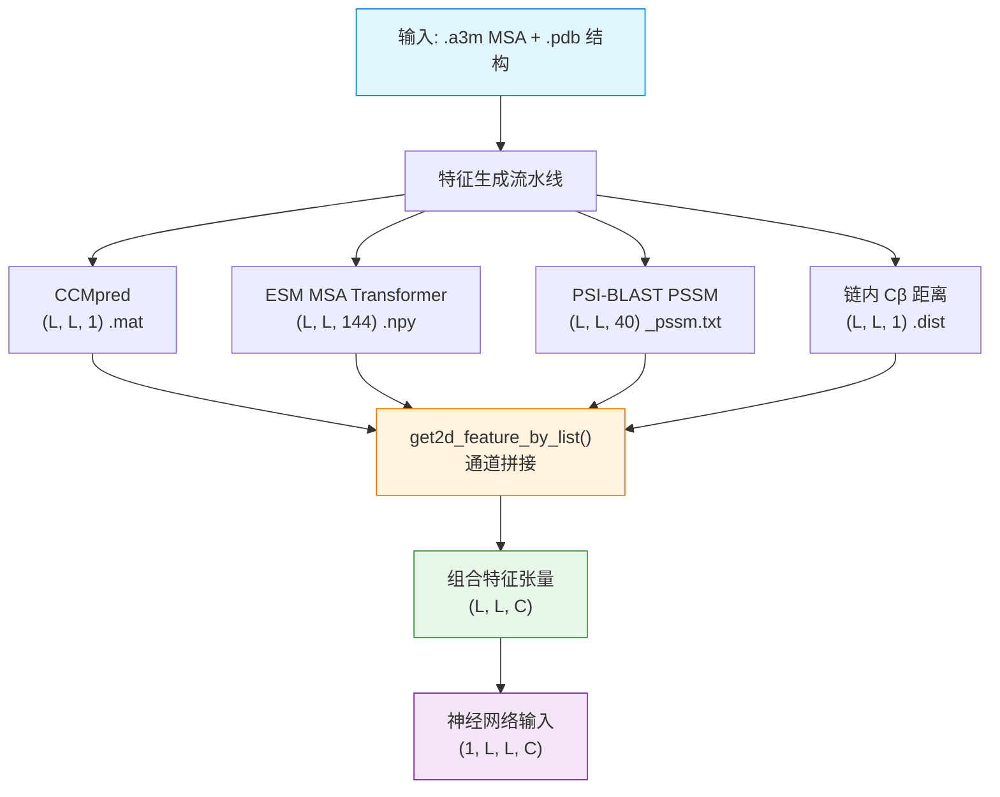
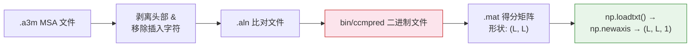
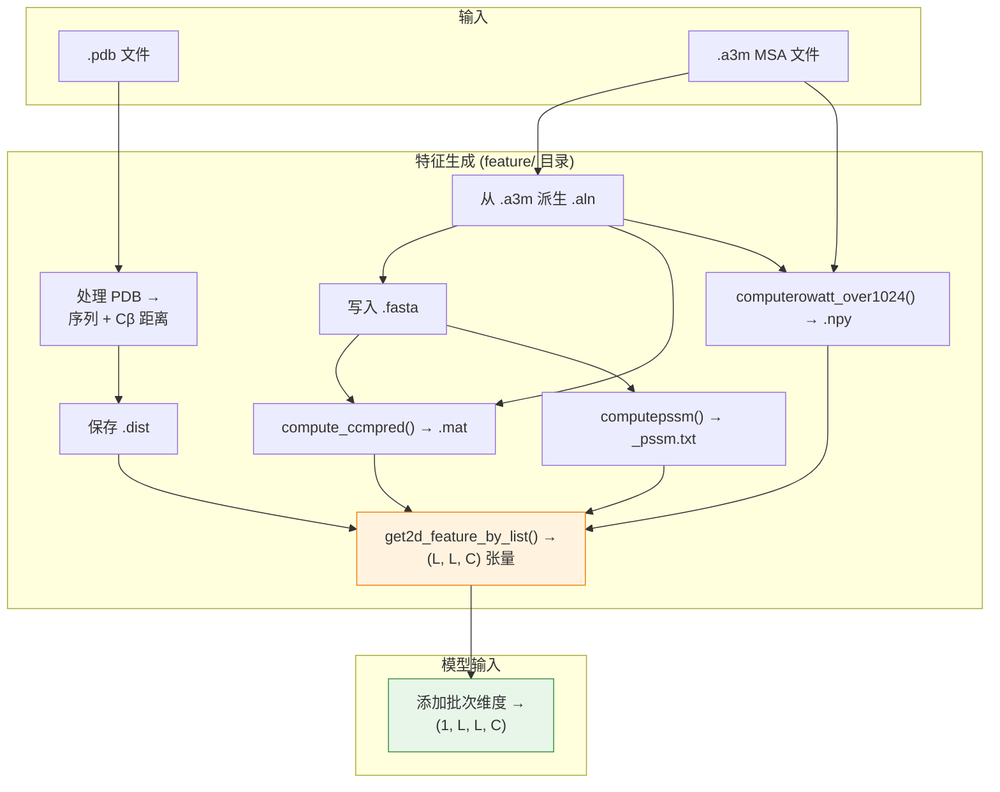

---
slug:5-feature-generation
blog_type:normal
---

特征生成是 CDPred 预测流程的基础阶段，它将原始生物学输入（单体结构和多序列比对）转换为丰富的**二维成对特征**张量，编码了共进化信号、结构先验和基于注意力机制的表征。该阶段决定了输入神经网络的数据质量和维度，使其成为整个工作流程中计算最密集且架构最关键的组件。

## 特征架构概述

CDPred 构建形状为 **(L, L, C)** 的 3D 特征张量，其中 **L** 是二聚体的合并序列长度，**C** 是由所选特征集决定的总通道数。每个通道捕获关于残基-残基关系的独特生物学或统计学信号。特征组装遵循**通道拼接**策略：独立生成各个 2D 特征图，然后通过 `np.concatenate` 沿最后一个轴进行堆叠。

通道维度 **C** 随模型类型而变化——**同源二聚体**和**异源二聚体**模型各自通过 [`model/homo/feature.txt`](model/homo/feature.txt) 和 [`model/hetero/feature.txt`](model/hetero/feature.txt) 处的配置文件指定其特征子集。`cal_feature_num()` 函数将特征名称映射到其通道贡献，以验证维度一致性。

来源: [generate_feature.py](lib/generate_feature.py#L1-L50), [Model_predict.py](lib/Model_predict.py#L127-L170)

## 特征类型与通道维度

下表列举了所有可用的特征类型、其来源及对最终张量的维度贡献：

| 特征键 | 通道数 | 来源工具 | 输出文件 | 生物学信号 |
|---|---|---|---|---|
| `# plm` | 441 | CCMpred (PLM 模式) | `.plm` (二进制) | 伪似然共进化耦合（21×21 残基对） |
| `# ccmpred` | 1 | CCMpred | `.mat` | 标量共进化得分矩阵 |
| `# rowatt` | 144 | ESM MSA Transformer | `.npy` | 12 层 12 头注意力的行注意力图 |
| `# rowatt_diff` | 144 | ESM MSA Transformer | `.npy` | 差分行注意力（链间注意力差异） |
| `# rowatt_inter` | 144 | ESM MSA Transformer | `.npy` | 链间行注意力图 |
| `# pssm` | 40 | PSI-BLAST (通过 `genpssm.pl`) | `_pssm.txt` | 位置特异性得分矩阵，外积展开 |
| `# intradist_cb` | 1 | PDB 结构解析 | `.dist` | 链内 Cβ 原子距离图 |
| `# intradist_hv` | 1 | PDB 结构解析 | `.dist` | 链内重原子距离图 |
| `# interdist` | 1 | PDB 结构解析 | `.dist` | 链间距离先验 |

<CgxTip>`# plm` 特征（441 个通道）是消耗最大的通道贡献者，编码了来自伪似然模型的所有 21×21 成对耦合参数。在生产预测中，CDPred 改用 `# ccmpred`（1 个通道）——相同共进化信号的标量摘要——这极大地减少了内存消耗，同时保留了预测能力。</CgxTip>

来源: [generate_feature.py](lib/generate_feature.py#L308-L330)

## CCMpred：共进化得分矩阵

**CCMpred** 特征捕获了残基对之间的直接耦合，这种耦合源于维持蛋白质复合物界面的进化压力。CDPred 对过滤后的比对文件（`.aln` 格式）调用编译好的 `ccmpred` 二进制文件（位于包根目录的 `bin/ccmpred` 处），以生成标量共进化得分矩阵。

生成函数 `compute_ccmpred()` 将 CCMpred 二进制文件作为子进程执行，生成保存至 `{save_ccmpred_path}/{name}.mat` 的原始得分矩阵。该 `.mat` 文件随后通过 `np.loadtxt()` 加载，并使用 `np.newaxis` 扩展为 (L, L, 1) 的形状，以进行通道拼接。传递给 CCMpred 的比对文件是由 `.a3m` 输入剥离 FASTA 头部并移除小写插入字符派生而来：`grep -v '^>' {a3m} | sed 's/[a-z]//g' > {aln}`。

备选的 `computeplm()` 函数生成完整的伪似然模型（PLM）输出——441 个通道，对应于 21×21 残基类型耦合参数——通过读取二进制 `.plm` 文件并使用 `plm_rawdata.reshape(441, L, L).transpose(1, 2, 0)` 进行重塑。然而，这主要用于训练阶段，而非推理阶段。

来源: [generate_feature.py](lib/generate_feature.py#L47-L68), [Model_predict.py](lib/Model_predict.py#L155-L157)

## ESM MSA Transformer：行注意力图

**行注意力**特征是 CDPred 最独特且最强大的信号——从 ESM-1b MSA Transformer (`esm_msa1_t12_100M_UR50S`) 中提取的 144 个通道的注意力图。此预训练模型处理完整的 MSA，并返回其 12 个 Transformer 层和 12 个注意力头上的逐行注意力模式（12 × 12 = 144 个通道）。

`computerowatt()` 中的核心计算过程如下：读取 `.a3m` 文件最多至 `depth` 条序列（独立运行时默认为 64，预测期间为 128），通过 `msa_batch_converter` 转换为批次 token，并设置 `return_contacts=True` 传入 MSA Transformer。从模型输出中提取 `row_attentions` 键，移至 CPU，并通过转置将形状从 (144, L, L) 重塑为 (L, L, 144)。

### 处理超过 1024 个残基的序列

ESM MSA Transformer 的最大序列长度为 **1024 个 token**。对于更长的序列，`computerowatt_over1024()` 实现了**滑动窗口裁剪策略**：

1. 序列被 `get_crop_index()` 划分为重叠窗口，该函数计算 4 个长度为 1000 且步距均匀的裁剪段。
2. 每个裁剪段生成一个仅包含该窗口内残基的临时 `.a3m` 文件。
3. 独立计算每个裁剪段的行注意力。
4. 相邻裁剪段的重叠区域进行**平均**：`fea[i, j, :] = (fea[i, j, :] + fea_crop[count, :]) / 2`。
5. 第五个“差异”裁剪段填补未被第一和第三窗口重叠覆盖的任何残基。

<CgxTip>当从 `Model_predict.py` 调用特征生成时，MSA 深度设置为 **128** 条序列（而非默认的 64）。这种更深的采样提高了链间接触信号注意力质量。如果可用，ESM 模型会加载到 `cuda:0`，否则回退到 `cpu`——由于注意力传播是性能瓶颈，此处的 GPU 加速提供了最大的单一提速效果。</CgxTip>

来源: [generate_feature.py](lib/generate_feature.py#L108-L145), [generate_feature.py](lib/generate_feature.py#L153-L200), [Model_predict.py](lib/Model_predict.py#L158-L159)

## PSSM：位置特异性得分矩阵

**PSSM** 特征编码了针对 UniRef90 数据库运行 PSI-BLAST 所得的位置特异性进化偏好。CDPred 委托给一个 Perl 脚本 (`bin/genpssm.pl`)，该脚本运行 PSI-BLAST 并提取生成的 PSSM。数据库路径在 [`constants.py`](lib/constants.py) 中配置为 `unirefdb` 变量——用户必须更新此路径以指向其本地的 UniRef90 下载位置。

原始 PSSM 的形状为 (L, 20)——每个残基的每个氨基酸对应一个得分。CDPred 通过**外积展开**将其扩展为形状为 (L, L, 40) 的**二维成对特征**：按行的 (L, 1, 20) PSSM 被广播为 (L, L, 20)，其转置从列角度产生 (L, L, 20)，拼接后得到 (L, L, 40)。这种对称展开在每个残基对位置同时捕获了逐行和逐列的进化上下文。

来源: [generate_feature.py](lib/generate_feature.py#L70-L85), [constants.py](lib/constants.py#L1-L4), [Model_predict.py](lib/Model_predict.py#L160-L161)

## 来自 PDB 结构的链内距离图

**链内距离**特征提供了结构先验——了解每条单体链内的距离可以约束链间距离的搜索空间。CDPred 使用 [`pdb_process`](lib/pdb_process.py) 模块中的 `get_cb_dist_from_pdbfile()` 函数，从预测的单体 PDB 结构中提取 Cβ 原子距离。

距离图的处理方式因二聚体类型而异：

| 二聚体类型 | 距离图构建 |
|---|---|
| **同源二聚体** | 直接使用单链的 (L_chain, L_chain) 图；通过 `np.savetxt(fmt='%.3f')` 保存 |
| **异源二聚体** | 将两条链的图嵌入块对角 (L_A + L_B, L_A + L_B) 矩阵：对角线为链内块，链间块为零 |

这种块对角结构至关重要——它明确标记了哪些残基对属于同一条链（填充距离），哪些属于不同链（零），为神经网络提供了关于链边界的清晰信号。

来源: [Model_predict.py](lib/Model_predict.py#L127-L153), [Model_predict.py](lib/Model_predict.py#L163-L170)

## 特征组装：get2d_feature_by_list

`get2d_feature_by_list()` 函数是核心协调器，它读取模型的特征配置并组装最终张量。它**按固定顺序**处理特征，而不考虑配置文件的排序：`plm → ccmpred → pssm → rowatt → intradist_cb`。每个特征要么即时计算，要么从预生成的文件中加载，然后沿通道轴拼接到不断增长的张量中。

该函数对每种特征类型支持两种模式：
- **预计算模式**：如果提供了文件路径（例如 `rowatt_file`、`ccmpred_file`、`pssm_file`），则直接从磁盘加载特征。
- **即时计算模式**：如果没有提供文件路径，则从原始输入（MSA、FASTA、比对）计算特征。

这种双模式设计使得预测流程在重新运行时可以跳过已生成的特征——在调用其生成函数之前会检查每个特征文件是否存在，从而节省大量计算时间。

来源: [generate_feature.py](lib/generate_feature.py#L220-L295), [Model_predict.py](lib/Model_predict.py#L172-L176)

## 预测流程特征流向

[`Model_predict.py`](lib/Model_predict.py) 中完整的特征生成序列遵循以下精确顺序：

1. **PDB 处理**：处理每个输入 PDB 文件，提取序列，计算链内 Cβ 距离图。
2. **目录设置**：在输出路径下创建 `feature/` 子目录。
3. **MSA 准备**：将输入的 `.a3m` 文件复制到特征目录；通过剥离头部和插入字符派生出 `.aln` 比对文件。
4. **FASTA 生成**：写入 FASTA 文件——同源二聚体包含单链序列，异源二聚体包含拼接的链序列。
5. **CCMpred 生成**：如果 `.mat` 不存在，则调用 `compute_ccmpred()`。
6. **行注意力生成**：如果 `.npy` 不存在，则调用深度为 128 的 `computerowatt_over1024()`。
7. **PSSM 生成**：如果 `_pssm.txt` 不存在，则针对 UniRef90 调用 `computepssm()`。
8. **距离图生成**：链内距离图保存为 `.dist`。
9. **特征组装**：`get2d_feature_by_list()` 将所有特征拼接成最终的 (L, L, C) 张量。
10. **批次扩展**：添加前导维度：`selected_list_2D[np.newaxis, :, :, :]` → 形状 (1, L, L, C)，作为 Keras 模型输入。

来源: [Model_predict.py](lib/Model_predict.py#L100-L176)

## 输出特征文件

特征生成完成后，`feature/` 目录包含以下产物：

| 文件 | 格式 | 描述 |
|---|---|---|
| `{name}.a3m` | FASTA MSA | 输入多序列比对的副本 |
| `{name}.aln` | 纯文本 | 过滤后的比对（无头部，无插入字符） |
| `{name}.fasta` | FASTA | 派生的序列文件（单链或拼接序列） |
| `{name}.mat` | 文本矩阵 | CCMpred 共进化得分矩阵 |
| `{name}.npy` | NumPy 二进制 | ESM 行注意力图，形状 (L, L, 144) |
| `{name}_pssm.txt` | 文本矩阵 | PSI-BLAST PSSM，形状 (L, 20) |
| `{name}.dist` | 文本矩阵 | 链内 Cβ 距离图 |
| `pssm/` | 目录 | 中间 PSI-BLAST 产物（`.pssm`、`.psiblast.output`） |

`.npy` 文件使用 NumPy 的原生二进制格式来高效存储 144 通道注意力张量，而其他特征则使用人类可读的文本格式以便检查和调试。

来源: [Model_predict.py](lib/Model_predict.py#L135-L161), [README.md](README.md#L72-L91)

## 特征配置与通道计数

`cal_feature_num()` 函数提供了从特征名称到通道数的确定性映射，使神经网络能够在加载时验证其输入维度。此映射为：

| 特征 | 通道数 | 计算 |
|---|---|---|
| `# plm` | 441 | 21 × 21 残基耦合参数 |
| `# rowatt` | 144 | 12 层 × 12 个注意力头 |
| `# rowatt_diff` | 144 | 相同架构，差异信号 |
| `# rowatt_inter` | 144 | 相同架构，链间信号 |
| `# pssm` | 40 | 20 (行) + 20 (列) 外积 |
| `# ccmpred` | 1 | 标量得分 |
| `# intradist_cb` | 1 | Cβ 距离 |
| `# intradist_hv` | 1 | 重原子距离 |
| `# interdist` | 1 | 链间距离先验 |

总通道数 **C** 是所有选定特征的通道贡献之和。模型架构的输入层必须与此精确维度匹配——特征配置与模型定义之间的不匹配将导致运行时错误。

有关模型如何使用这些特征的详细信息，请参阅[神经网络模型设计](6-neural-network-model-design)。有关包含特征生成后步骤的完整预测工作流，请参阅[预测工作流](7-prediction-workflow)。