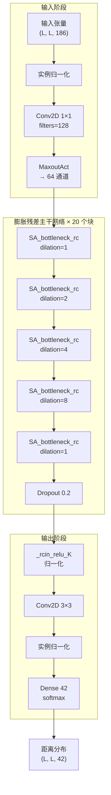
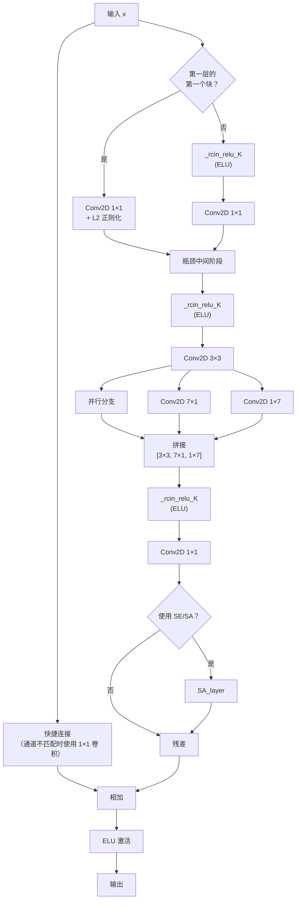

---
slug:6-neural-network-model-design
blog_type:normal
---


CDPred的神经网络是一个**二维膨胀残差网络**，专为蛋白质二聚体的链间残基-残基距离预测而构建。该架构接收形状为`(batch, L, L, 186)`的4D特征张量——其中**L**为拼接后的链长，**186**为特征通道维度——并为每个残基对输出一个基于离散距离区间的**42类softmax分布**。该设计在瓶颈残差块内融合了三种自定义归一化策略（实例、行、列），应用多尺度膨胀卷积进行长距离空间推理，并引入分离注意力门控以实现选择性特征重校准。本页将从输入到输出头，剖析每一个结构组件。

来源: [Model_construct.py](lib/Model_construct.py#L1-L397), [Model_predict.py](lib/Model_predict.py#L1-L240)

## 输入规格与特征通道

模型接受一个单一的4D输入张量，其空间维度为动态形状，通道深度固定为**186**。该通道维度是在[特征生成](5-feature-generation)流程中生成的四个2D特征图的拼接：

| 特征键 | 来源 | 描述 |
|---|---|---|
| `# rowatt` | ESM-1b 行注意力 | 来自 ESM Transformer 的注意力图，捕获共进化信号 |
| `# ccmpred` | CCMpred | 基于伪似然最大化的共进化得分矩阵 |
| `# pssm` | PSI-BLAST | 位置特异性得分矩阵（20个氨基酸列展平为2D） |
| `# intradist_cb` | 单体 PDB | 从预测的单体结构中提取的Cβ链内距离图 |

这四个特征组在模型特定的`feature.txt`文件中声明，并由`get2d_feature_by_list()`组装成统一的`(L, L, 186)`输入。在 Keras 模型 JSON 中，输入形状声明为`[null, null, null, 186]`，这意味着两个空间维度都是可变的——该网络是全卷积网络，能够处理任意长度的蛋白质链。

来源: [feature.txt](model/homo/feature.txt#L1-L4), [feature.txt](model/hetero/feature.txt#L1-L4), [Model_construct.py](lib/Model_construct.py#L286-L290)

## 架构概述

下图展示了从特征输入，经过膨胀残差主干网络，到距离输出头的端到端数据流：



膨胀模式`[1, 2, 4, 8, 1]`重复**4次**，总共产生**20个瓶颈块**，每个块后接一个`Dropout(0.2)`层。这种膨胀调度逐步扩展了有效感受野——从膨胀率为1时的局部3×3邻域，扩展到膨胀率为8时的17×17感受野——同时通过共享卷积核权重保持了参数效率。

来源: [Model_construct.py](lib/Model_construct.py#L286-L340)

## 前端：实例归一化 → Conv1×1 → MaxoutAct

输入阶段在进入残差主干网络之前应用了三种变换。首先，`InstanceNormalization`独立地稳定了每个样本在空间维度上的特征分布。接下来，一个具有128个滤波器的**1×1 Conv2D**执行逐点通道混合——将186个输入通道投影到128通道的表示中。最后，`MaxoutAct`应用**maxout激活**，在引入非线性的同时将通道维度进一步降低至**64**：

`MaxoutAct`函数迭代`output_dim`次，每次在`filters`个并行卷积中取 Conv2D + ELU 激活的通道最大值，生成一个单通道特征图。这充当了一个可学习的分段线性激活，比单独使用 ReLU 更具表达力，并在网络入口处实现了从128到64通道的激进但保信息的降维。

来源: [Model_construct.py](lib/Model_construct.py#L93-L101), [Model_construct.py](lib/Model_construct.py#L286-L295)

## 核心构建块：SA_bottleneck_rc

`SA_bottleneck_rc`函数定义了整个主干网络中使用的基础残差单元。它遵循**瓶颈**设计模式，通过多尺度卷积和跳跃连接实现了扩展的中间表示：



此块中的关键设计选择包括：

**多尺度卷积融合。** 3×3卷积的输出被分支到两个额外的非对称卷积中——一个**7×1**和一个**1×7**卷积核——然后将这三者拼接起来。这种受 Inception 风格架构启发的模式，同时捕获了各向同性的局部模式（3×3）以及沿行（7×1）和列（1×7）的各向异性条带模式。对于链间信号通常表现为行或列走廊的距离图而言，这些非对称卷积核提供了与数据几何结构相匹配的归纳偏置。

**通过`_rcin_relu_K`实现的三重归一化。** 该函数并非使用单一的归一化层，而是并行应用了**三种归一化**——实例归一化、行归一化和列归一化——并在激活前拼接它们的输出。这使每个归一化点的通道数增加了两倍，但确保了网络能够关注在三种不同粒度上归一化的特征：逐样本（实例）、逐行和逐列。有关详细的数学定义，请参阅[实例归一化](8-instance-normalization)和[行列归一化](9-row-and-column-normalization)。

**全程使用 ELU 激活。** 与使用 ReLU 的`dilated_bottleneck_rc`变体不同，`SA_bottleneck_rc`专门使用**ELU**激活，包括残差相加后的最终 ELU。ELU 的负饱和特性避免了 ReLU 的“神经元死亡”问题，并提供更平滑的梯度，这对于距离图的密集预测场景尤为有益，因为该场景中许多输出值接近于零。

来源: [Model_construct.py](lib/Model_construct.py#L258-L284)

## 膨胀调度与感受野分析

重复4次的膨胀序列`[1, 2, 4, 8, 1]`构成了主干网络的空间信息骨架。每个膨胀率都会扩展标准3×3卷积的有效卷积核大小：

| 膨胀率 | 有效卷积核大小 | 有效感受野 |
|---|---|---|
| 1 | 3×3 | 局部邻域 |
| 2 | 5×5 | 短距离 |
| 4 | 9×9 | 中距离 |
| 8 | 17×17 | 长距离 |

在每个周期内，将膨胀率1放置在膨胀率8之后，能够在每次长距离扫描后**重新锚定**感受野至局部细节，从而防止膨胀卷积在其采样网格中留下间隙的“网格伪影”。通过这种调度在20个块中的应用，网络实现了覆盖整个L×L距离图的**全局感受野**，同时通过循环出现的膨胀率1块保持了细粒度的局部敏感性。

来源: [Model_construct.py](lib/Model_construct.py#L244-L255), [Model_construct.py](lib/Model_construct.py#L296-L300)

## 注意力机制

CDPred 实现了两种互补的注意力机制，可通过`use_SE`标志在瓶颈块中选择性应用。

### 通道压缩与激励 (SE)

`squeeze_excite_block`实现了标准的 SE 设计：**全局平均池化**将每个通道压缩为一个标量，随后是两个 Dense 层（缩减比为16）用于学习通道间的相互依赖关系，输出由 sigmoid 门控的缩放因子，以乘法方式逐通道重校准输入特征图。这使得网络能够抑制无关通道并放大信息通道——当四种异构特征类型（rowatt、ccmpred、pssm、intradist）占据相同的通道空间时，这一点至关重要。

来源: [Model_construct.py](lib/Model_construct.py#L207-L224)

### 分离注意力层 (SA_layer)

`SA_layer`提供了一种更复杂的混合注意力方案。它沿通道轴将输入张量**分割**为两半：

- **前半部分** → `squeeze_excite_block`（通道注意力）
- **后半部分** → `spatial_attention`（空间注意力）

`spatial_attention`函数跨通道计算平均池化和最大池化的空间图，将它们拼接后，应用一个**具有 sigmoid 激活的7×7 Conv2D**来生成空间加权掩码。两个注意力输出随后被重新拼接在一起。这种分离设计确保了**一半的通道受益于逐通道重校准，而另一半受益于逐位置重校准**，而无需承担将两者同时应用于所有通道的参数成本。

来源: [Model_construct.py](lib/Model_construct.py#L240-L252), [Model_construct.py](lib/Model_construct.py#L226-L239)

## 输出头与距离离散化

在残差主干网络之后，网络应用了最终的`_rcin_relu_K`归一化、一个**3×3 Conv2D**和一个实例归一化，然后分支到特定任务的输出头。输出架构取决于`predict_method`参数：

| `predict_method` | 输出头 | 用例 |
|---|---|---|
| `realdist_hdist` | `intradist` + `interdist` + `interhdist`（各 Dense 42, softmax） | 完整预测：链内 + 链间真实距离 + 链间重原子距离 |
| `realdist_hdist_nointra` | `interdist` + `interhdist`（各 Dense 42, softmax） | 仅链间：真实距离 + 重原子距离 |
| `realdist_hdist_whole` | `interdist` + `interhdist`（各 Dense 42, softmax） | 全矩阵链间预测 |
| 默认 (如 `realdist_nointra`) | `intradist`（Dense 42, softmax） | 单一距离图 |

每个输出头根据**'G'分箱方案**，在离散距离区间上产生一个**42类softmax分布**：区间间隔为0.5Å，覆盖2Å–22Å的范围（区间0–40），加上一个用于距离>22Å或未定义位置的间隔/区间41。这种分箱方式通过设置`option='G'`在`real_value2mul_class`中实现。

在推理期间（如[预测工作流](7-prediction-workflow)所示），预测的概率分布通过`npy2distmap()`转换回实值距离图，链间接触则通过累加区间0–12（对应距离<8Å）的概率来提取。

来源: [Model_construct.py](lib/Model_construct.py#L310-L340), [Model_training.py](lib/Model_training.py#L86-L106), [Model_predict.py](lib/Model_predict.py#L208-L218)

## 加权均方误差损失

自定义损失函数`_weighted_mean_squared_error`实现了一个**距离感知加权方案**，以解决距离图中严重的类别不平衡问题：

- **近距离**（真实距离 ≤ 10Å）：由标量`weight`参数加权（高权重，通常>1.0），确保网络优先进行准确的短距离预测，因为这些预测决定了接触关系
- **远距离**（真实距离 > 10Å）：由`1 / (1 + (ŷ/ȳ)²)`加权，这是一个相对于平均距离的逆平方衰减——它平滑地降低了远距离残基对的预测权重，同时防止了中等距离残基的梯度消失

这种双重加权策略至关重要，因为二聚体中绝大多数残基对相距甚远（>20Å），如果没有差异化加权，网络将退化成对所有残基对都预测为“远”。

来源: [Model_construct.py](lib/Model_construct.py#L78-L92)

## 模型集成策略

CDPred 采用**3模型集成**进行最终预测。三个独立训练的模型（例如，`HomoPred1.h5`、`HomoPred2.h5`、`HomoPred3.h5`）共享相同的 JSON 架构定义，但由于随机初始化或训练调度不同，其学习到的权重也有所差异。在推理期间，会加载所有三个模型，并将它们的**重原子距离预测（interhdist 输出，索引 [1]）**取平均：

```
Y_hat = (pred_model1 + pred_model2 + pred_model3) / 3
```

这种对 softmax 输出的简单算术平均提供了一种模型不确定性缩减的形式——单个模型可能会过拟合到不同的伪影，但它们的平均值往往更具鲁棒性。集成在`get_model_info()`中组装，该函数加载架构 JSON，通过`CustomObjectScope`注册自定义层（`InstanceNormalization`、`RowNormalization`、`ColumNormalization`），并加载每个`.h5`权重文件。

来源: [Model_predict.py](lib/Model_predict.py#L87-L104), [Model_predict.py](lib/Model_predict.py#L204-L210)

## HomoPred 与 HeteroPred 架构

同源二聚体和异源二聚体模型共享**完全相同的网络架构**——相同的 JSON 定义（具有`batch_input_shape: [null, null, null, 186]`）和相同的层拓扑结构。两者的区别完全在于其**训练后的权重**以及预测的**后处理**：

| 方面 | 同源二聚体 | 异源二聚体 |
|---|---|---|
| 输入长度 L | 单链长度（对称） | 两条链长之和 |
| 特征组装 | 一个单体距离图 | 块对角形式的两个单体距离图 |
| 输出提取 | 完整的 L×L 链间区域 | 仅跨链象限：`[:lenA, lenA:]` |
| 权重文件 | `HomoPred{1,2,3}.h5` | `HeteroPred{1,2,3}.h5` |

对于异源二聚体，特征张量将两条链编码在一个单一的 L×L 矩阵中（其中 L = lenA + lenB），链内距离特征形成块对角模式。网络在整个矩阵上进行预测，但仅保留非对角线的跨链象限作为链间预测。

来源: [Model_predict.py](lib/Model_predict.py#L173-L199), [Model_predict.py](lib/Model_predict.py#L218-L226)

<CgxTip>当使用新特征通道扩展模型时，请同时更新`feature.txt`和模型 JSON 中的`batch_input_shape`通道维度——特征数量（186）在架构定义中是硬编码的，必须与拼接后的特征维度完全匹配。</CgxTip>

<CgxTip>`_rcin_relu_K`归一化在每次应用时都会使通道数增加两倍（实例 + 行 + 列输出拼接）。对于大尺寸蛋白质，这种快速的通道扩展是内存消耗的主要驱动因素——在调整滤波器数量或瓶颈重复次数时，请谨慎考虑通道预算。</CgxTip>

## 架构设计原理

CDPred 网络做出了几项独特的架构选择，使其有别于用于接触/距离预测的标准2D CNN：

**为什么选择实例 + 行 + 列归一化而不是批量归一化？** 蛋白质长度差异巨大（训练集中为30–450个残基），并且在单个批次中，距离图具有截然不同的空间统计特征。批量归一化在批次维度上计算统计量，混合了不同大小图的统计信息。实例归一化、行归一化和列归一化分别在单个样本内的不同空间粒度上计算统计量，提供了长度无关的归一化。将三者拼接起来，赋予了后续层按通道选择最合适归一化尺度的自由。

**为什么使用非对称的 7×1 / 1×7 卷积？** 二聚体的链间距离图表现出强烈的方向结构——行对应于链A上的残基，列对应于链B上的残基（反之亦然）。非对称卷积核能够用少量参数检测跨越整行或整列的模式，这对于检测在 ESM 注意力图中表现为行或列注意力模式的协同突变信号尤为有效。

**为什么使用膨胀而不是池化进行空间扩展？** 基于池化的下采样破坏了残基对之间精确的空间对应关系，这对于距离预测是灾难性的，因为每个位置都有其独立的目标。膨胀卷积在不降低空间分辨率的情况下扩展了感受野，保留了输入和输出位置之间的一一映射。