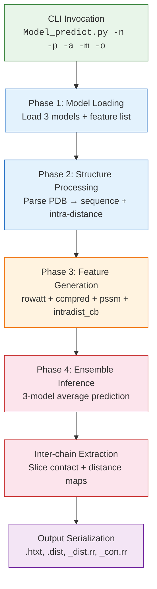
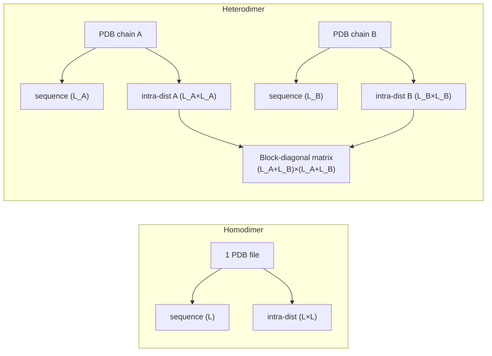

---
slug:7-prediction-workflow
blog_type:normal
---


预测工作流是 CDPred 的运行核心 —— 这是一个编排式的流水线，负责将原始生物学输入（单体 PDB 结构和 MSA 比对）转换为链间残基-残基距离和接触预测。本页将追溯从命令调用、模型推理到输出持久化的完整执行路径，揭示控制数据流、特征组装、集成聚合和结果提取的架构决策。

## 流水线概述

CDPred 的预测工作流通过单一入口点 `Model_predict.py` 执行，该入口点编排了四个顺序阶段：**模型加载**、**结构处理**、**特征生成**和**集成推理与输出序列化**。该流水线本质上是一个批次大小为 1 的推理图 —— 每个目标独立处理，并在送入神经网络集成之前，构建好一个蛋白质复合物的完整特征张量。



<CgxTip>特征生成是瓶颈 —— 通过 PSI-BLAST 针对 UniRef90 计算 PSSM 是最慢的步骤，而 ESM-MSA-1b 行注意力和 CCMpred 相对较快。通过存在性检查，已存在的特征文件会被自动跳过。</CgxTip>

来源: [Model_predict.py](lib/Model_predict.py#L1-L240), [generate_feature.py](lib/generate_feature.py#L1-L376)

## 阶段 1 — 模型加载与配置

预测工作流首先根据 `-m` 标志解析模型目录。对于 `homodimer`，模型从 `model/homo/` 加载；对于 `heterodimer`，则从 `model/hetero/` 加载。`get_model_info` 函数在该目录内执行三个关键操作：

1. **架构反序列化**：读取包含 Keras 模型图定义的单个 `.json` 文件（例如 `model-train-HomoPred_Net.json`）。
2. **权重加载**：将所有三个 `.h5` 权重文件（例如 `HomoPred1.h5`、`HomoPred2.h5`、`HomoPred3.h5`）加载到共享相同架构的独立模型实例中。
3. **特征列表解析**：读取 `feature.txt` 以确定模型在推理时期望的特征通道。

同源和异源二聚体模型均使用相同的特征规范：`# rowatt`、`# ccmpred`、`# pssm`、`# intradist_cb` —— 共计 **186 个输入通道**（144 + 1 + 40 + 1）。自定义归一化层（`InstanceNormalization`、`RowNormalization`、`ColumNormalization`）必须在 `CustomObjectScope` 上下文中注册，以便 Keras 正确反序列化模型图。

| 模型变体 | 目录 | 权重文件 | 架构 JSON | 输入通道 |
|---|---|---|---|---|
| 同源二聚体 | `model/homo/` | `HomoPred{1,2,3}.h5` | `model-train-HomoPred_Net.json` | 186 |
| 异源二聚体 | `model/hetero/` | `HeteroPred{1,2,3}.h5` | `model-train-HeteroPred_Net.json` | 186 |

来源: [Model_predict.py](lib/Model_predict.py#L82-L110), [feature.txt](model/homo/feature.txt#L1-L4)

## 阶段 2 — PDB 结构处理与链内距离提取

模型加载后，流水线遍历每个输入 PDB 文件以提取两项结构信息：**氨基酸序列**和**链内 Cβ 距离图**。`process_pdbfile` 函数对每个 PDB 进行规范化，包括移除 `TER` 记录、将所有原子重新分配至 A 链、从 1 开始对残基重新编号，以及从 1 开始对原子序列号重新编号 —— 从而确保无论输入 PDB 的格式约定如何，都能获得统一的结构表示。

`get_sequence_from_pdb` 函数使用 Biopython 的 `SeqIO` 解析器提取残基序列，该序列具有双重目的：验证单体假设（每个 PDB 恰好包含一条链），以及为下游 PSSM 生成构建 FASTA 文件。`get_cb_dist_from_pdbfile` 函数使用 Cβ 原子计算 L×L 的链内距离图（当 Cβ 不可用时退回到 Cα，例如甘氨酸），从而生成 `intradist_cb` 特征通道。

对于**同源二聚体**，一个 PDB 文件即可 —— 单个链内距离图被直接保存。对于**异源二聚体**，需要两个 PDB 文件，其链内距离图被嵌入到一个 (L_A + L_B) × (L_A + L_B) 的分块对角矩阵中，其中对角线外的链间块保持为零，这反映了链内距离仅在各链内部定义。



来源: [Model_predict.py](lib/Model_predict.py#L130-L160), [pdb_process.py](lib/pdb_process.py#L114-L145), [util.py](lib/util.py#L108-L145)

## 阶段 3 — 特征生成

特征生成负责组装形状为 (L, L, 186) 的 4 通道特征张量，作为神经网络的输入。每个特征独立计算，并通过 `get2d_feature_by_list` 沿最后一维拼接。流水线包含存在性检查 —— 如果特征文件已存在于输出 `feature/` 目录中，则会完全跳过其（可能代价高昂的）计算。

### 特征通道分解

| 特征 | 键 | 形状 | 来源 | 生成方法 |
|---|---|---|---|---|
| **行注意力** | `# rowatt` | (L, L, 144) | ESM-MSA-1b transformer | `computerowatt_over1024` — 12 层 MSA Transformer 行注意力 |
| **CCMpred** | `# ccmpred` | (L, L, 1) | CCMpred (PLM) | `compute_ccmpred` — 伪似然最大化耦合 |
| **PSSM** | `# pssm` | (L, L, 40) | 基于 UniRef90 的 PSI-BLAST | `computepssm` — 位置特异性得分矩阵，广播至 2D |
| **链内距离** | `# intradist_cb` | (L, L, 1) | 输入 PDB 结构 | 在阶段 2 中提取的 Cβ–Cβ 距离 |

**行注意力（144 通道）**：ESM-MSA-1b 模型（`esm_msa1_t12_100M_UR50S`）处理深度为 128 条序列的 MSA。对于超过 1024 个残基的序列（MSA Transformer 的最大限制），裁剪策略将序列划分为长度为 1000 的重叠窗口，计算每个窗口的注意力图，并通过平均重叠区域将它们拼接回去。12 个注意力头跨越 12 层产生了 144 通道的图。

**CCMpred（1 通道）**：CCMpred 二进制文件从 MSA 比对文件计算协同进化耦合分数。输出 `.mat` 文件包含单个 L×L 接触分数矩阵。

**PSSM（40 通道）**：使用 Perl 包装脚本（`genpssm.pl`）针对 UniRef90 数据库运行 PSI-BLAST。生成的 20 位置得分矩阵被广播为 2D 表示：对于每个位置 i，PSSM 行在所有位置 j 上复制，位置 j 同理，然后拼接以产生每对 (i, j) 共 40 个通道。

**链内距离（1 通道）**：直接复用阶段 2 中 PDB 处理期间计算的 Cβ 距离图。

<CgxTip>当序列长度超过 1024 时，`computerowatt_over1024` 函数采用滑动窗口裁剪策略，包含 4 个长度为 1000 残基的重叠窗口。重叠区域取平均值，确保拼接的行注意力图不存在位置偏差。</CgxTip>

来源: [generate_feature.py](lib/generate_feature.py#L67-L199), [generate_feature.py](lib/generate_feature.py#L215-L310), [Model_predict.py](lib/Model_predict.py#L162-L192)

## 阶段 4 — 集成推理与链间提取

利用组装好的形状为 (1, L, L, 186) 的特征张量（前置批次维度），流水线执行 **3 模型集成平均**：

```python
Y_hat_hdist_npy = 0
for temp in CDPred:
    CDPred_prediction = temp.predict([selected_list_2D], batch_size=1)
    Y_hat_hdist_npy += CDPred_prediction[1].squeeze()
Y_hat_hdist_npy /= len(CDPred)
```

每个模型产生一个多输出预测。索引 `[1]` 选取距离图输出（第二个模型输出）。三个预测结果累加后除以 3，实现了简单的算术平均集成。这种集成策略在不要求任何加权方案的情况下，减少了单个模型预测的方差。

### 接触与距离图推导

原始集成输出 `Y_hat_hdist_npy` 的形状为 (L, L, N_classes)，其中 N_classes 表示距离分箱。由此计算两个导出图：

- **接触概率图**：`hv_con = Y_hat_hdist_npy[:,:,0:13].sum(axis=-1)` —— 前 13 个距离分箱概率之和（对应距离 < 8Å）得出每对残基的链间接触概率。
- **实值距离图**：`hv_real_dist = npy2distmap(Y_hat_hdist_npy)` —— 跨所有距离分箱的加权和，其中每个分箱的概率乘以其距离阈值中心，然后进行对称平均。

### 链间区域提取

对于**同源二聚体**，完整的 L×L 预测图直接就是链间图（因为模型被训练用于预测对称二聚体的链间距离）。对于**异源二聚体**，通过切片组合预测图来提取链间区域：

```python
hcon_inter = hv_con[:lenA, lenA:]
hdist_inter = hv_real_dist[:lenA, lenA:]
```

这提取了 (L_A + L_B) × (L_A + L_B) 图的右上角块，对应于链 A（行）和链 B（列）之间的链间残基对。

来源: [Model_predict.py](lib/Model_predict.py#L194-L224), [util.py](lib/util.py#L56-L80)

## 输出序列化

最后阶段将四个输出文件写入用户指定输出路径的 `predmap/` 子目录中：

| 文件 | 格式 | 内容 |
|---|---|---|
| `{name}.dist` | 空格分隔矩阵 | 链间距离图 (L_A × L_B)，实值埃（Å）距离 |
| `{name}.htxt` | 空格分隔矩阵 | 链间接触概率图 (L_A × L_B)，值在 [0, 1] 内 |
| `{name}_dist.rr` | 基于行的 `i j dist` | 按距离排序（升序）的 Top-1000 预测残基对 |
| `{name}_con.rr` | 基于行的 `i j 0 8.0 prob` | 按概率排序（降序）的 Top-1000 预测接触 |

`.rr` 文件由 `gen_rr_file` 生成，该函数按相关指标对所有残基对排序，取前 1000 个，并以标准化格式写入。距离 `.rr` 文件使用从 1 开始的残基索引，格式为 `i j dist`，而接触 `.rr` 文件包含距离边界 `0 8.0` 及接触概率。

来源: [Model_predict.py](lib/Model_predict.py#L226-L240), [util.py](lib/util.py#L82-L106)

## 完整工作流序列

下表总结了预测工作流中的每个步骤及其数据转换和中间产物：

| 步骤 | 操作 | 输入 | 输出 | 产物位置 |
|---|---|---|---|---|
| 1 | 解析 CLI 参数 | 命令行标志 | 验证后的路径与选项 | — |
| 2 | 加载模型集成 | `.json` + `.h5` + `feature.txt` | 3 个 Keras 模型实例 + 特征列表 | `model/{homo,hetero}/` |
| 3 | 处理 PDB 文件 | `.pdb` 文件 | 规范化 PDB、序列、链内距离图 | `{out_path}/feature/` |
| 4 | 复制并转换 MSA | `.a3m` 文件 | `.a3m` 副本 + `.aln`（无插入） | `{out_path}/feature/` |
| 5 | 生成 FASTA | 来自 PDB 的序列 | `.fasta` 文件 | `{out_path}/feature/` |
| 6 | 计算 CCMpred | `.aln` 文件 | `.mat` 协同进化分数 | `{out_path}/feature/` |
| 7 | 计算行注意力 | `.a3m` 文件 | `.npy` 注意力图 (144 ch) | `{out_path}/feature/` |
| 8 | 计算 PSSM | `.fasta` + UniRef90 | `_pssm.txt` 得分矩阵 | `{out_path}/feature/` |
| 9 | 组装特征张量 | 所有特征 | (1, L, L, 186) ndarray | 仅内存 |
| 10 | 集成推理 | 特征张量 | 原始多分箱预测 | 仅内存 |
| 11 | 提取接触 + 距离 | 原始预测 | 链间图 | 仅内存 |
| 12 | 写入输出文件 | 链间图 | `.dist`, `.htxt`, `_dist.rr`, `_con.rr` | `{out_path}/predmap/` |

## 接下来去哪

- 有关每个特征的数学基础和实现的详细信息，请参见 [特征生成](5-feature-generation)。
- 有关使用 186 通道张量的神经网络架构，请参见 [神经网络模型设计](6-neural-network-model-design)。
- 有关模型反序列化所需的自定义归一化层，请参见 [实例归一化](8-instance-normalization) 和 [行与列归一化](9-row-and-column-normalization)。
- 有关解读输出文件及其格式的信息，请参见 [输出文件与格式](12-output-files-and-formats)。
- 有关针对真值评估预测的信息，请参见 [预测评估指标](13-prediction-evaluation-metrics)。