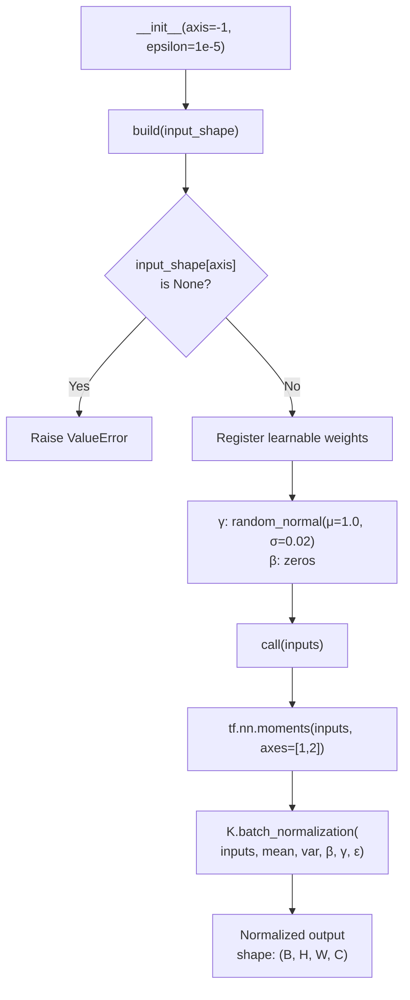
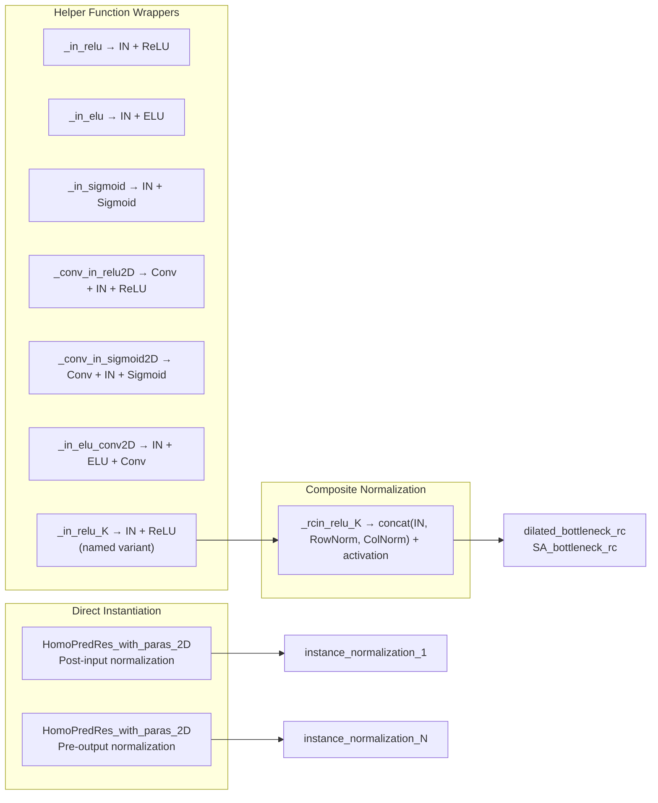

---
slug:8-instance-normalization
blog_type:normal
---


**实例归一化**（Instance Normalization）是 CDPred 神经网络架构核心的自定义归一化层。标准的批归一化会在整个批次和空间维度上计算统计量，与此不同，CDPred 的 `InstanceNormalization` **逐样本、逐通道**地独立归一化每个特征图——这一设计选择对于处理变长蛋白质距离图至关重要，因为批次级统计量会将结构上无关联的蛋白质混淆在一起。

## 数学基础

对于形状为 `(B, H, W, C)` 的输入张量——其中 *B* 为批次大小，*H* 和 *W* 为空间维度（距离图中的残基对位置），*C* 为通道维度——实例归一化针对每个样本 *b* 和通道 *c* 计算如下：

$$\mu_{b,c} = \frac{1}{HW} \sum_{h=1}^{H} \sum_{w=1}^{W} x_{b,h,w,c}$$

$$\sigma_{b,c}^{2} = \frac{1}{HW} \sum_{h=1}^{H} \sum_{w=1}^{W} (x_{b,h,w,c} - \mu_{b,c})^{2}$$

$$\hat{x}_{b,h,w,c} = \gamma_c \cdot \frac{x_{b,h,w,c} - \mu_{b,c}}{\sqrt{\sigma_{b,c}^{2} + \epsilon}} + \beta_c$$

可学习参数 **γ**（缩放）和 **β**（平移）在空间位置上共享，但在各通道间独立，从而在归一化后恢复网络的表征能力。这是与缺乏仿射参数的简单归一化方案的关键区别。

来源: [Model_construct.py](lib/Model_construct.py#L84-L99), [Model_predict.py](lib/Model_predict.py#L28-L43)

## 实现架构

`InstanceNormalization` 类继承自 Keras 的 `Layer` 基类，由遵循 Keras 层契约的三个生命周期方法组成：



**`__init__`** 方法存储归一化轴（默认为 `axis=-1`，即通道维度）和数值稳定性常量 `epsilon=1e-5`。**`build`** 方法构建两个可训练的权重张量——`gamma` 和 `beta`——它们的形状均为 `(dim,)`，其中 `dim` 是从 `input_shape[self.axis]` 获取的通道数。`gamma` 的初始化器为 `random_normal(mean=1.0, stddev=0.02)`，将初始值置于 1 附近，使该层在初始时近似于恒等变换；`beta` 初始化为零。**`call`** 方法使用 `tf.nn.moments` 在空间轴 `[1, 2]`（即 H 和 W 维度）上计算实例级的矩，然后委托给 `K.batch_normalization` 进行仿射变换。

<CgxTip>在 `call` 方法中，归一化轴**被硬编码为 `[1, 2]`**——这是针对 NHWC 格式 4D 张量的纯空间归一化。`self.axis` 参数仅控制**用于权重形状的通道轴**，而不控制矩计算的轴。这意味着 `axis` 参数不会改变被归一化的维度，而仅决定参数分配时通道维度所在的位置。</CgxTip>

来源: [Model_construct.py](lib/Model_construct.py#L84-L99)

## 为何选择实例归一化而非批归一化

CDPred 处理表示链间残基-残基关系的 2D 特征图，其中每个输入样本是具有潜在不同维度（L×L，其中 L 为蛋白质长度）的距离图。这与批归一化产生了根本性冲突：

| 属性 | 批归一化 | 实例归一化 |
|---|---|---|
| **矩轴** | `[0, 1, 2]`（批次、H、W） | `[1, 2]`（仅 H、W） |
| **统计粒度** | 跨整个批次的每个通道一个 μ/σ | 逐样本逐通道各一个 μ/σ |
| **批次大小敏感性** | 需要足够大的批次以获得稳定的统计量 | 与批次大小无关 |
| **变长输入** | 不兼容——不同样本的 H、W 不同会破坏批次矩 | 兼容——逐样本计算矩 |
| **训练/推理差异** | 推理时使用运行平均值 | 训练和测试时计算方式相同 |
| **蛋白质结构域对齐** | 统计量会混淆不相关的蛋白质结构 | 每个蛋白质的特征图独立归一化 |

变长输入问题是决定性的：由于每个蛋白质具有独特的残基数 L，模型配置中指定的输入形状 `(None, None, None, 186)` 意味着批次级矩是未定义的。实例归一化将每个样本视为其独立的统计宇宙，从而完全避开了这一问题。

来源: [model-train-HomoPred_Net.json](model/homo/model-train-HetNet.json#L1-L1), [Model_construct.py](lib/Model_construct.py#L84-L99)

## 网络中的集成点

实例归一化通过多个可组合的辅助函数渗透在 CDPred 架构中，并在主模型构建器中直接实例化。下图映射了所有的集成位置：



### 输入后归一化

应用于原始 186 通道特征输入的最先变换是实例归一化——**在任何卷积之前**。它将占据截然不同数值范围的各种异构输入特征（共进化分数、PSSM、行注意力、链内距离）归一化到统一的尺度：

```python
HomoPred_2D_conv = InstanceNormalization(axis=-1)(HomoPred_2D_conv)  # Line ~325
HomoPred_2D_conv = Conv2D(128, 1, padding='same')(HomoPred_2D_conv)
```

### 输出前归一化

在最终的 `Dense` 预测层（为 `intradist`、`interdist` 和 `interhdist` 输出 42 类距离分布）之前，在最后一个卷积之后应用实例归一化，以稳定进入分类器的特征表示：

```python
HomoPred_2D_conv = Conv2D(filters=filters, kernel_size=(3,3), ...)(HomoPred_2D_conv)
HomoPred_2D_conv = InstanceNormalization(axis=-1)(HomoPred_2D_conv)  # Line ~345
intradist = Dense(42, activation='softmax', name='intradist')(HomoPred_2D_conv)
```

### 残差瓶颈块内部

最普遍的使用发生在 `_rcin_relu_K` 中，该函数拼接**三种**归一化输出——实例、行和列——生成具有 3× 通道宽度的三重归一化表示。这种复合归一化为 `dilated_bottleneck_rc` 和 `SA_bottleneck_rc` 残差块内的每个内部变换提供输入：

```python
def _rcin_relu_K(x, bn_name=None, relu_name=None, activation='relu'):
    norm1 = InstanceNormalization(axis=-1)(x)
    norm2 = RowNormalization(axis=-1)(x)
    norm3 = ColumNormalization(axis=-1)(x)
    norm  = concatenate([norm1, norm2, norm3])
    return Activation(activation)(norm)
```

此设计确保每个残差块都能接收多视角的归一化：实例归一化捕获逐样本的全局统计量，行归一化捕获逐行（残基-i）模式，列归一化捕获逐列（残基-j）模式。三者共同为网络提供了具备空间感知的归一化特征，且符合链间距离图的非对称特性。

来源: [Model_construct.py](lib/Model_construct.py#L30-L55), [Model_construct.py](lib/Model_construct.py#L232-L237), [Model_construct.py](lib/Model_construct.py#L305-L380)

## 模型反序列化与自定义对象注册

由于 `InstanceNormalization` 是未包含在标准 Keras 中的自定义层，因此在加载序列化模型时必须显式注册。CDPred 在预测流程中通过 Keras 的 `CustomObjectScope` 上下文管理器来处理此问题：

```python
with CustomObjectScope({'InstanceNormalization': InstanceNormalization,
                        'RowNormalization': RowNormalization,
                        'ColumNormalization': ColumNormalization,
                        'tf': tf}):
    json_string = open(model_out).read()
    temp_model = model_from_json(json_string)
    temp_model.load_weights(model_weight)
```

该层在 `Model_construct.py`（用于训练）和 `Model_predict.py`（用于推理）中均被**重新声明**——这种有意为之的重复解耦了训练和预测的依赖关系，使得预测运行时无需导入完整的模型构建模块。序列化模型的 JSON（如 `model-train-HomoPred_Net.json`）通过类名 `"InstanceNormalization"` 引用该层，`CustomObjectScope` 在反序列化时将其映射到具体的类。

<CgxTip>`tf` 模块也被注册在 `CustomObjectScope` 中，因为序列化模型中的 lambda 层引用了 TensorFlow 操作。如果你修改了 `InstanceNormalization` 类（例如更改矩计算轴），则必须重新训练并重新序列化模型——JSON 架构文件仅通过名称而非实现来嵌入该层。</CgxTip>

来源: [Model_predict.py](lib/Model_predict.py#L28-L43), [Model_predict.py](lib/Model_predict.py#L80-L89)

## 与 CDPred 其他归一化层的比较

CDPred 实现了三个自定义归一化层，它们构成了一个归一化族，各自在 4D 输入张量 `(B, H, W, C)` 的不同空间轴上计算矩：

| 层 | 矩轴 | 语义 | 可学习参数 |
|---|---|---|---|
| **InstanceNormalization** | `[1, 2]` | 逐样本逐通道跨两个空间维度（整个特征图）进行归一化 | γ, β ∈ ℝ^C |
| **RowNormalization** | `[1]` | 逐样本逐通道逐列跨 H 维度（残基-i 轴）进行归一化 | γ, β ∈ ℝ^C |
| **ColumNormalization** | `[2]` | 逐样本逐通道逐行跨 W 维度（残基-j 轴）进行归一化 | γ, β ∈ ℝ^C |

三者共享相同的 `__init__` 和 `build` 方法——**唯一的区分代码**是传递给 `tf.nn.moments` 的 `axes` 参数。行归一化生成的统计量在各列间不同（每列获得各自的均值/方差），而列归一化生成的统计量在各行间不同。实例归一化通过同时在两个空间轴上计算矩，在每个通道的每个样本中产生单一的全局均值和方差——这是三者中最为强烈的归一化方式。

有关行归一化和列归一化如何利用距离图空间结构的深入探讨，请参阅 [行与列归一化](9-row-and-column-normalization)。

来源: [Model_construct.py](lib/Model_construct.py#L84-L130), [Model_predict.py](lib/Model_predict.py#L28-L75)

## 蛋白质距离预测语境下的设计原理

CDPred 的输入特征张量编码了链间残基对信息，其中每个空间位置 `(i, j)` 表示来自两个相互作用蛋白质链的一对特定残基。186 个输入通道结合了性质迥异的信号：来自 CCMpred 的共进化耦合分数、来自 PSSM 的位置特异性得分矩阵、来自 ESM 的注意力图以及链内 Cβ 距离特征。这些通道的原始数值范围跨越了多个数量级。

在此语境下，实例归一化具有双重目的。**首先**，它执行逐样本的特征白化——将每个通道的激活分布归一化为零均值和单位方差（在仿射变换之前），从而防止天然幅度较大的通道在反向传播期间主导梯度信号。**其次**，通过独立计算每个蛋白质的统计量，它尊重了基本的生物学现实，即不同的蛋白质复合物具有不同的统计特征——一个包含 30 个残基的小型同源二聚体与一个包含 500 个残基的大型异源二聚体在共进化信号分布上存在根本差异，将它们的统计量混合在一起（如批归一化所做的那样）会模糊这些有意义的差异。

为 gamma 选择 `random_normal(1.0, 0.02)` 初始化——而非 `ones`——在各通道的初始缩放因子中引入了轻微的不对称性，这有助于在早期训练阶段打破对称性，此时所有通道从归一化输入中接收到相似的梯度信号。

来源: [Model_construct.py](lib/Model_construct.py#L84-L99), [model-train-HomoPred_Net.json](model/homo/model-train-HomoPred_Net.json#L1-L1)

## 后续步骤

- 了解实例归一化如何在瓶颈块中与行归一化和列归一化组合：[行与列归一化](9-row-and-column-normalization)
- 查看归一化后的特征如何流经完整的预测流程：[预测工作流](7-prediction-workflow)
- 探索嵌入实例归一化的完整神经网络架构：[神经网络模型设计](6-neural-network-model-design)