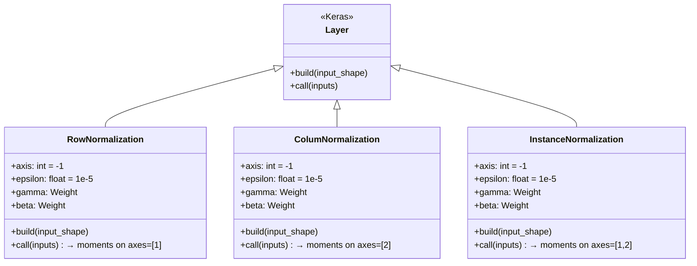
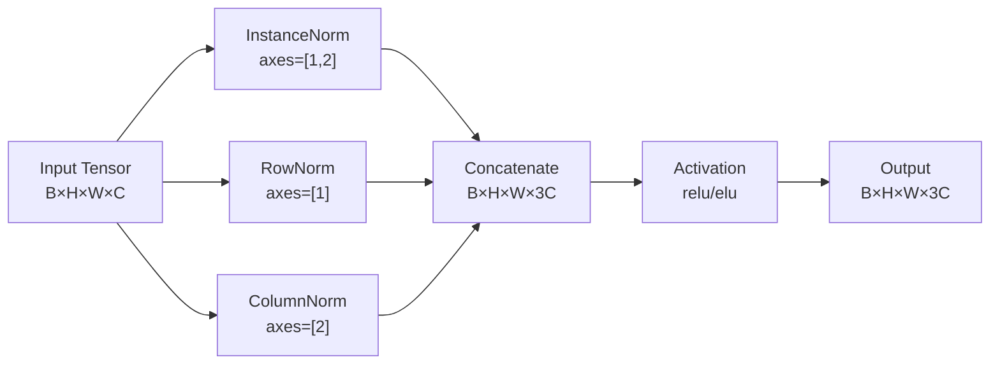
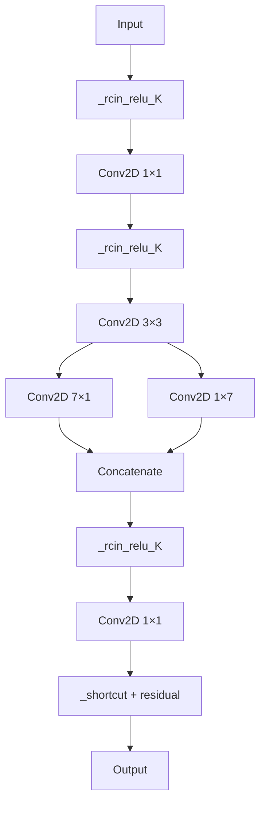

---
slug:9-row-and-column-normalization
blog_type:normal
---


行归一化与列归一化是 CDPred 中的自定义 Keras 层，它们对 2D 特征图的空间维度执行方向感知归一化。实例归一化会同时在两个空间轴上聚合统计量，而这些层不同于实例归一化，它们沿着**单一空间轴**计算归一化统计量，从而保留了具有方向性的结构信号。这对于链间距离预测至关重要，因为在接触/距离图的行和列中，残基-残基关系承载着不同的生物学语义。

## 数学基础

对于 NHWC 格式中形状为 `(B, H, W, C)` 的输入张量 **x**，这三种归一化变体仅在计算矩的轴上有所不同：

| 归一化 | 矩轴 | 统计范围 | μ, σ² 的输出形状 |
|---|---|---|---|
| InstanceNormalization | `[1, 2]` | 逐实例、逐通道、双空间维度 | `(B, 1, 1, C)` |
| RowNormalization | `[1]` | 逐实例、逐通道、逐列 | `(B, 1, W, C)` |
| ColumNormalization | `[2]` | 逐实例、逐通道、逐行 | `(B, H, 1, C)` |

这三种归一化的输出均遵循带有可学习参数的标准批归一化公式：

```
ŷ = γ · (x - μ) / √(σ² + ε) + β
```

其中 **γ** (gamma) 和 **β** (beta) 是形状为 `(C,)` 的逐通道可学习权重，分别从 `random_normal(1.0, 0.02)` 和 `zeros` 初始化，**ε** = 1e-5 是用于保证数值稳定性的常数。

<CgxTip>RowNormalization 沿轴 1（行/高度维度）计算统计量，为每个列位置生成唯一的 μ 和 σ²——实际上是在“每列内跨行”进行归一化。ColumNormalization 则执行相反的操作，在“每行内跨列”进行归一化。正是这种方向不对称性，在 2D 残基-残基图中捕获了具有结构意义的信号。</CgxTip>

来源: [Model_construct.py](lib/Model_construct.py#L107-L141), [Model_predict.py](lib/Model_predict.py#L67-L101)

## 实现架构

`RowNormalization` 和 `ColumNormalization` 均作为自定义 Keras `Layer` 子类实现，具有相同的结构骨架——仅在 `call` 方法中传递给 `tf.nn.moments` 的 `axes` 参数有所不同：



`build` 方法构建两个可训练权重：**gamma** (`random_normal(1.0, 0.02)`) 和 **beta** (`zeros`)，它们的形状均为 `(dim,)`，其中 `dim = input_shape[self.axis]`。`call` 方法在通过 `tf.nn.moments` 计算矩后委托给 `K.batch_normalization`，确保归一化操作完全可微且兼容 GPU。

来源: [Model_construct.py](lib/Model_construct.py#L107-L141)

## RCIN 组合模式

行归一化与列归一化的真正威力体现在 **`_rcin_relu_K`** 组合函数中，该函数在激活前将三种归一化流融合为单一表示：

```python
def _rcin_relu_K(x, bn_name=None, relu_name=None, activation='relu'):
    norm1 = InstanceNormalization(axis=-1, name=bn_name)(x)
    norm2 = RowNormalization(axis=-1, name=bn_name)(x)
    norm3 = ColumNormalization(axis=-1, name=bn_name)(x)
    norm  = concatenate([norm1, norm2, norm3])
    return Activation(activation, name=relu_name)(norm)
```

这种拼接使通道维度扩充至三倍：具有 C 个通道的输入在激活前会产生具有 **3C 个通道**的输出。这三个流分别捕获：

- **InstanceNormalization 流**：全局空间统计量——每个通道的整体特征幅度
- **RowNormalization 流**：列特定统计量——沿列维度变化的信号（即相对于一个残基在链 B 中位置的模式）
- **ColumNormalization 流**：行特定统计量——沿行维度变化的信号（即相对于一个残基在链 A 中位置的模式）



<CgxTip>`_rcin_relu_K` 的通道三倍化效应意味着下游卷积层必须适应 3 倍的输入通道数。这由瓶颈块中的滤波器数量隐式处理，这些瓶颈块直接接收拼接后的 3C 通道张量。</CgxTip>

来源: [Model_construct.py](lib/Model_construct.py#L259-L263)

## 在残差瓶颈块中的集成

`_rcin_relu_K` 函数被嵌入到构成 CDPred 预测网络核心的两种瓶颈架构中：

### `dilated_bottleneck_rc` — 标准膨胀残差块



`_rcin_relu_K` 在每个瓶颈块内被应用**三次**：在 1×1 瓶颈卷积之前、3×3 中间卷积之后，以及最终 1×1 扩展卷积之前。这意味着行和列归一化统计量会在每个阶段重新计算，使网络能够在表示随块演进时重新校准方向特征。

### `SA_bottleneck_rc` — 挤压-注意力变体

此变体使用 `elu` 激活而非 `relu`，并用联合的**挤压-激励 + 空间注意力**（`SA_layer`）机制替换了挤压-激励通道注意力。`_rcin_relu_K` 调用的位置相同，但传入 `activation='elu'`：

```python
conv_1_1 = _rcin_relu_K(input, activation='elu')
conv_3_3 = _rcin_relu_K(conv_1_1, activation='elu')
residual = _rcin_relu_K(conv_3_3, activation='elu')
```

这是最终 `HomoPredRes_with_paras_2D` 模型构造器中使用的瓶颈变体，跨 4 个重复组应用，膨胀卷积率为 `[1, 2, 4, 8, 1] × 4`。

来源: [Model_construct.py](lib/Model_construct.py#L274-L320), [Model_construct.py](lib/Model_construct.py#L322-L360)

## 模型反序列化与自定义对象注册

由于 `RowNormalization` 和 `ColumNormalization` 是标准 Keras 命名空间中未包含的自定义 Keras 层，因此必须在模型加载期间显式注册。CDPred 通过 `get_model_info` 函数中的 `CustomObjectScope` 处理此问题：

```python
with CustomObjectScope({
    'InstanceNormalization': InstanceNormalization,
    'RowNormalization': RowNormalization,
    'ColumNormalization': ColumNormalization,
    'tf': tf
}):
    json_string = open(model_out).read()
    temp_model = model_from_json(json_string)
    temp_model.load_weights(model_weight)
```

这些类在两个文件——[`Model_construct.py`](lib/Model_construct.py)（用于模型构建和训练）与 [`Model_predict.py`](lib/Model_predict.py)（用于推理）——中被**复制**，以避免循环导入依赖。两者的实现完全相同，确保了反序列化时的权重兼容性。

| 文件 | 用途 | 行数 |
|---|---|---|
| `Model_construct.py` | 模型架构定义与训练 | L107–L141 |
| `Model_predict.py` | 预测/推理流水线 | L67–L101 |

来源: [Model_predict.py](lib/Model_predict.py#L103-L113), [Model_construct.py](lib/Model_construct.py#L107-L141)

## 设计原理：面向接触图的方向感知归一化

标准归一化技术（BatchNorm、InstanceNorm）对称地处理空间维度，假设特征分布是各向同性的。对于 2D 残基-残基距离/接触图，此假设不成立：

- **行**对应于**链 A** 中的残基——其统计量编码了 A 侧的序列上下文
- **列**对应于**链 B** 中的残基——其统计量编码了 B 侧的序列上下文
- **对角线及近对角线区域**携带链内信息，而**非对角线区域**携带链间信号

通过独立计算行方向和列方向的统计量，`RowNormalization` 和 `ColumNormalization` 使网络能够区分沿一条链的残基轴显著的特征与沿另一条链的残基轴显著的特征。这种方向分解对于**异二聚体**预测尤为有价值，因为在异二聚体中，链 A 和链 B 具有不同的氨基酸组成和结构上下文。

| 方面 | InstanceNorm | RowNorm | ColumnNorm |
|---|---|---|---|
| 统计粒度 | 整个空间图 | 逐列切片 | 逐行切片 |
| 捕获内容 | 全局特征尺度 | 每列的跨行变化 | 每行的跨列变化 |
| 生物学信号 | 整体链间模式 | 链 B 残基特异性信号 | 链 A 残基特异性信号 |
| 不变性 | 空间平移 | 沿行平移 | 沿列平移 |

来源: [Model_construct.py](lib/Model_construct.py#L107-L141), [Model_predict.py](lib/Model_predict.py#L67-L101)

## 与其他归一化层的关系

行归一化与列归一化层与[实例归一化](8-instance-normalization)共同构成了一个三元组，通过 `_rcin_relu_K` 组合函数统一起来。实例归一化提供全局空间基线，而行归一化与列归一化则以生物学动机注入打破空间对称性的方向先验。这种三重归一化模式取代了标准 ResNet 架构中使用的传统 BatchNormalization → ReLU 范式，是 CDPred [神经网络模型设计](6-neural-network-model-design)的标志性特征。