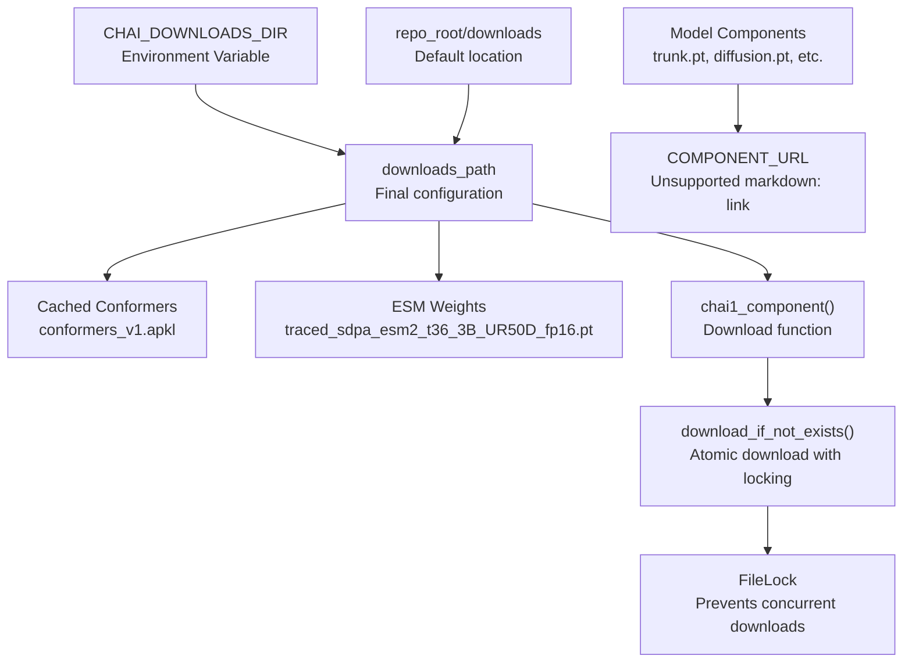
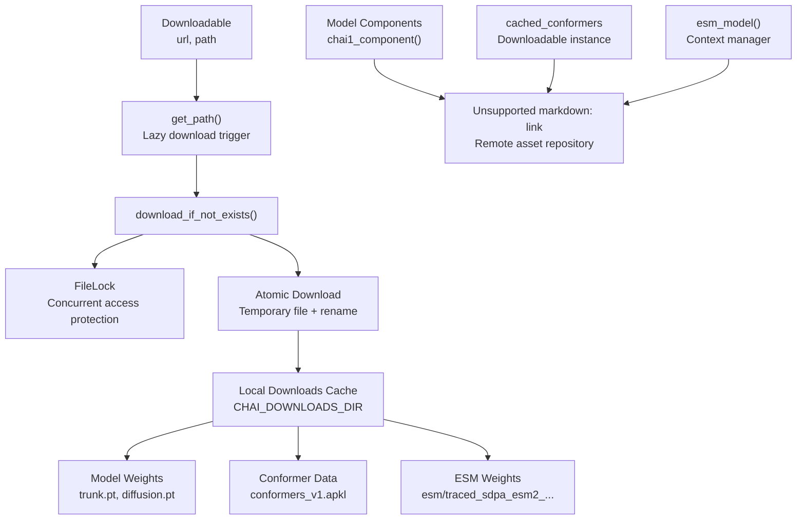
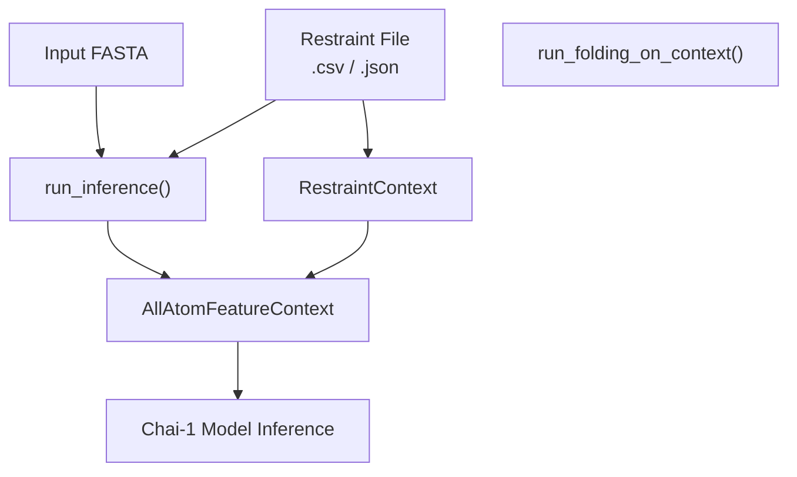

# Advanced Usage

> **Relevant source files**
> * [README.md](https://github.com/chaidiscovery/chai-lab/blob/66c38d1f/README.md?plain=1)
> * [chai_lab/data/dataset/embeddings/esm.py](https://github.com/chaidiscovery/chai-lab/blob/66c38d1f/chai_lab/data/dataset/embeddings/esm.py)
> * [chai_lab/utils/paths.py](https://github.com/chaidiscovery/chai-lab/blob/66c38d1f/chai_lab/utils/paths.py)

This document covers advanced configuration options and usage patterns for experienced users of `chai-lab`. It focuses on environment customization, performance optimization, and specialized workflows that go beyond basic structure prediction.

For basic inference usage, see [Getting Started](/chaidiscovery/chai-lab/2-getting-started). For details on individual feature systems, see [Feature Generation](/chaidiscovery/chai-lab/5-feature-generation).

## Child Pages

* [Asset Management](/chaidiscovery/chai-lab/7.1-asset-management) — Managing model weights, cached data, and download configurations. Documents `CHAI_DOWNLOADS_DIR`, `CHAI_TEMPLATE_CIF_FOLDER`, `paths.py`, and the antipickle-based conformer cache.
* [Custom Restraints](/chaidiscovery/chai-lab/7.2-custom-restraints) — Advanced usage of restraints including file formats and integration examples. Documents contact and pocket restraint file formats, covalent bond specification, and the `predict_with_restraints` example.

## Environment Configuration

The `chai-lab` system provides several environment variables and configuration options for advanced users to customize behavior, particularly around asset management and resource utilization.

### Download Directory Configuration

The system uses a configurable download directory for storing model weights and cached data. By default, assets are stored in the repository's `downloads` directory [chai_lab/utils/paths.py L21](https://github.com/chaidiscovery/chai-lab/blob/66c38d1f/chai_lab/utils/paths.py#L21-L21)

 but this can be customized using the `CHAI_DOWNLOADS_DIR` environment variable [chai_lab/utils/paths.py L22](https://github.com/chaidiscovery/chai-lab/blob/66c38d1f/chai_lab/utils/paths.py#L22-L22)

```javascript
export CHAI_DOWNLOADS_DIR=/path/to/custom/downloads
```

The download system implements atomic downloads with file locking to prevent corruption during concurrent access, as shown in the `download_if_not_exists` function [chai_lab/utils/paths.py L29-L49](https://github.com/chaidiscovery/chai-lab/blob/66c38d1f/chai_lab/utils/paths.py#L29-L49)

**Download System Architecture:**



Sources: [chai_lab/utils/paths.py L19-L23](https://github.com/chaidiscovery/chai-lab/blob/66c38d1f/chai_lab/utils/paths.py#L19-L23)

 [chai_lab/utils/paths.py L29-L49](https://github.com/chaidiscovery/chai-lab/blob/66c38d1f/chai_lab/utils/paths.py#L29-L49)

 [chai_lab/utils/paths.py L67-L82](https://github.com/chaidiscovery/chai-lab/blob/66c38d1f/chai_lab/utils/paths.py#L67-L82)

 [chai_lab/data/dataset/embeddings/esm.py L21-L34](https://github.com/chaidiscovery/chai-lab/blob/66c38d1f/chai_lab/data/dataset/embeddings/esm.py#L21-L34)

## Asset Management Overview

The `chai-lab` system implements a sophisticated asset management system for handling model weights, cached conformers, and ESM language model embeddings. This system provides automatic downloading, caching, and version management.

### Downloadable Asset System

The `Downloadable` class provides a lazy-loading mechanism for remote assets [chai_lab/utils/paths.py L51-L60](https://github.com/chaidiscovery/chai-lab/blob/66c38d1f/chai_lab/utils/paths.py#L51-L60)

 Assets are downloaded only when first accessed, with automatic caching and integrity checking.

For details, see [Asset Management](/chaidiscovery/chai-lab/7.1-asset-management).

**Asset Management Architecture:**



Sources: [chai_lab/utils/paths.py L51-L65](https://github.com/chaidiscovery/chai-lab/blob/66c38d1f/chai_lab/utils/paths.py#L51-L65)

 [chai_lab/utils/paths.py L72-L82](https://github.com/chaidiscovery/chai-lab/blob/66c38d1f/chai_lab/utils/paths.py#L72-L82)

 [chai_lab/data/dataset/embeddings/esm.py L21-L35](https://github.com/chaidiscovery/chai-lab/blob/66c38d1f/chai_lab/data/dataset/embeddings/esm.py#L21-L35)

## Advanced Restraints and Customization

Chai-1 allows users to guide the folding process using experimental or hypothesized restraints. This is particularly useful for complex assemblies or when specific biochemical knowledge is available.

### Restraint Types

The system supports several advanced restraint configurations:

* **Contact Restraints**: Distance constraints between specific atom pairs.
* **Pocket Restraints**: Guidance for ligand binding site placement.
* **Covalent Bonds**: Explicit specification of chemical bonds, including branched ligands or non-standard linkages.

For detailed file formats and integration examples, see [Custom Restraints](/chaidiscovery/chai-lab/7.2-custom-restraints).

**Restraint Integration Flow:**



Sources: [README.md L91-L94](https://github.com/chaidiscovery/chai-lab/blob/66c38d1f/README.md?plain=1#L91-L94)

 [README.md L113-L118](https://github.com/chaidiscovery/chai-lab/blob/66c38d1f/README.md?plain=1#L113-L118)

## Performance and Resource Management

### ESM Embedding Management

The ESM language model is used to generate protein sequence embeddings. The system manages the 3B parameter model by transiently loading it onto the GPU and moving it back to the CPU when not in use to save VRAM [chai_lab/data/dataset/embeddings/esm.py L27-L52](https://github.com/chaidiscovery/chai-lab/blob/66c38d1f/chai_lab/data/dataset/embeddings/esm.py#L27-L52)

### Concurrent Access

The asset download system uses `FileLock` to safely handle concurrent access, allowing multiple processes to share the same download directory without corruption [chai_lab/utils/paths.py L33-L48](https://github.com/chaidiscovery/chai-lab/blob/66c38d1f/chai_lab/utils/paths.py#L33-L48)

Sources: [chai_lab/data/dataset/embeddings/esm.py L27-L52](https://github.com/chaidiscovery/chai-lab/blob/66c38d1f/chai_lab/data/dataset/embeddings/esm.py#L27-L52)

 [chai_lab/utils/paths.py L33-L48](https://github.com/chaidiscovery/chai-lab/blob/66c38d1f/chai_lab/utils/paths.py#L33-L48)