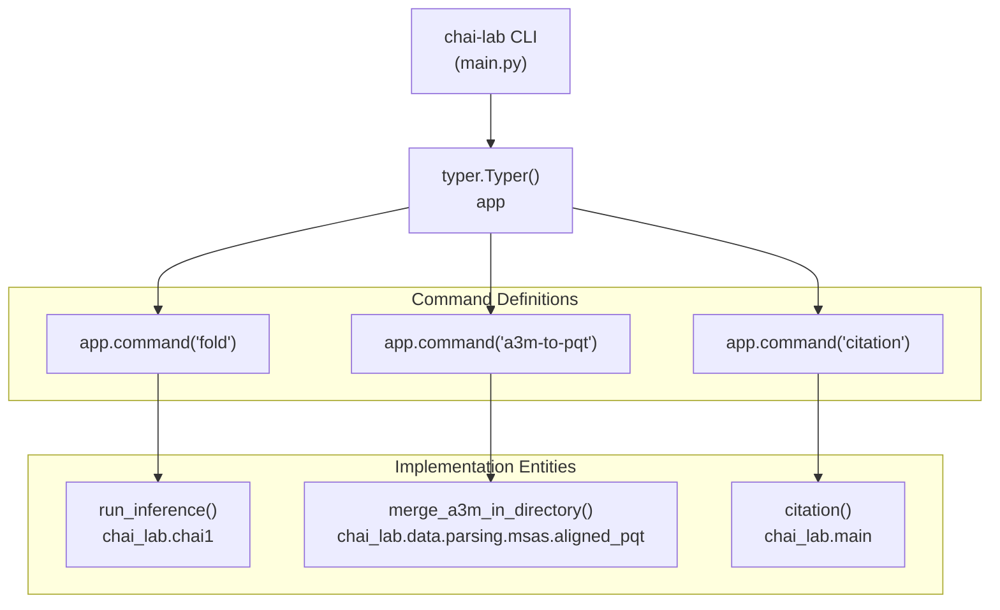

# Command Line Interface

> **Relevant source files**
> * [README.md](https://github.com/chaidiscovery/chai-lab/blob/66c38d1f/README.md?plain=1)
> * [chai_lab/main.py](https://github.com/chaidiscovery/chai-lab/blob/66c38d1f/chai_lab/main.py)
> * [examples/restraints/predict_with_restraints.py](https://github.com/chaidiscovery/chai-lab/blob/66c38d1f/examples/restraints/predict_with_restraints.py)

This document provides a comprehensive guide to the Chai-1 command line interface (CLI). It covers the installation, basic usage, available commands, and technical implementation for running molecular structure prediction tasks from the terminal. For information about using Chai-1 programmatically, see [Python API](https://github.com/chaidiscovery/chai-lab/blob/66c38d1f/Python API)

## Installation

The Chai-1 CLI is installed automatically when you install the `chai_lab` package. After installation, the `chai-lab` command becomes available in your terminal environment.

```python
# Install from PyPIpip install chai_lab==0.6.1 # Or install the latest development versionpip install git+https://github.com/chaidiscovery/chai-lab.git
```

Sources: [README.md L11-L19](https://github.com/chaidiscovery/chai-lab/blob/66c38d1f/README.md?plain=1#L11-L19)

## CLI Architecture

The Chai-1 command line interface is implemented using the `typer` library in [chai_lab/main.py L36-L44](https://github.com/chaidiscovery/chai-lab/blob/66c38d1f/chai_lab/main.py#L36-L44)

 The `cli()` function initializes a `typer.Typer()` application and registers commands that map directly to backend inference and utility functions.

### CLI Entity Mapping

This diagram bridges the CLI command space to the internal Python function space.



The entry point is defined in [chai_lab/main.py L47-L48](https://github.com/chaidiscovery/chai-lab/blob/66c38d1f/chai_lab/main.py#L47-L48)

 and is typically invoked via the `chai-lab` alias created during package installation.

Sources: [chai_lab/main.py L36-L48](https://github.com/chaidiscovery/chai-lab/blob/66c38d1f/chai_lab/main.py#L36-L48)

## Available Commands

The CLI provides three primary utilities:

| Command | Backend Function | Module | Purpose |
| --- | --- | --- | --- |
| `fold` | `run_inference` | `chai_lab.chai1` | Core prediction engine for molecular complexes |
| `a3m-to-pqt` | `merge_a3m_in_directory` | `chai_lab.data.parsing.msas.aligned_pqt` | MSA preprocessing utility |
| `citation` | `citation` | `chai_lab.main` | Displays BibTeX for technical report |

### Command Registration Implementation

The registration logic in [chai_lab/main.py L38-L43](https://github.com/chaidiscovery/chai-lab/blob/66c38d1f/chai_lab/main.py#L38-L43)

 uses Typer decorators to bind CLI strings to Python functions:

```
app.command("fold", help="Run Chai-1 to fold a complex.")(run_inference)app.command(    "a3m-to-pqt",    help="Convert all a3m files in a directory for a *single sequence* into a aligned parquet file",)(merge_a3m_in_directory)app.command("citation", help="Print citation information")(citation)
```

Sources: [chai_lab/main.py L38-L43](https://github.com/chaidiscovery/chai-lab/blob/66c38d1f/chai_lab/main.py#L38-L43)

## The 'fold' Command

The `fold` command is the primary interface for running the Chai-1 model. It takes a FASTA file and produces 3D structures.

### Basic Execution

```
chai-lab fold input.fasta output_folder
```

By default, this command generates 5 sample predictions and uses ESM embeddings without MSAs or templates.

Sources: [README.md L27-L32](https://github.com/chaidiscovery/chai-lab/blob/66c38d1f/README.md?plain=1#L27-L32)

### Parameter Mapping

The CLI options are derived from the signature of `run_inference`. This diagram maps CLI flags to the internal parameters used by the inference engine.

```mermaid
flowchart TD

FASTA_ARG["[input.fasta]"]
OUT_ARG["[output_dir]"]
MSA_FLAG["--use-msa-server"]
TEMP_FLAG["--use-templates-server"]
REST_FLAG["--constraint-path"]
P_FASTA["fasta_file: Path"]
P_OUT["output_dir: Path"]
P_MSA["use_msa_server: bool"]
P_TEMP["use_templates_server: bool"]
P_REST["constraint_path: Path"]

FASTA_ARG --> P_FASTA
OUT_ARG --> P_OUT
MSA_FLAG --> P_MSA
TEMP_FLAG --> P_TEMP
REST_FLAG --> P_REST

subgraph run_inference(chai_lab.chai1) ["run_inference(chai_lab.chai1)"]
    P_FASTA
    P_OUT
    P_MSA
    P_TEMP
    P_REST
end

subgraph subGraph0 ["CLI Inputs"]
    FASTA_ARG
    OUT_ARG
    MSA_FLAG
    TEMP_FLAG
    REST_FLAG
end
```

Sources: [chai_lab/main.py L38](https://github.com/chaidiscovery/chai-lab/blob/66c38d1f/chai_lab/main.py#L38-L38)

 [examples/restraints/predict_with_restraints.py L25-L35](https://github.com/chaidiscovery/chai-lab/blob/66c38d1f/examples/restraints/predict_with_restraints.py#L25-L35)

### Advanced Flags

| Flag | Description |
| --- | --- |
| `--use-msa-server` | Enables automatic MSA generation via ColabFold MMseqs2 server. |
| `--msa-server-url` | Specifies a custom ColabFold server URL (e.g., internal hosting). |
| `--use-templates-server` | Enables template search and download from RCSB. |
| `--constraint-path` | Path to a file containing residue-residue or pocket restraints. |
| `--num-trunk-recycles` | Number of recycling iterations (default is 3). |
| `--num-diffn-timesteps` | Number of diffusion steps (default is 200). |
| `--use-esm-embeddings` | Whether to use ESM language model embeddings (default is True). |

Sources: [README.md L34-L44](https://github.com/chaidiscovery/chai-lab/blob/66c38d1f/README.md?plain=1#L34-L44)

 [examples/restraints/predict_with_restraints.py L30-L34](https://github.com/chaidiscovery/chai-lab/blob/66c38d1f/examples/restraints/predict_with_restraints.py#L30-L34)

## Utility Commands

### MSA Preprocessing (a3m-to-pqt)

Chai-1 uses a custom Parquet format (`.aligned.pqt`) for MSAs to store metadata like source databases and sequence pairing keys. The `a3m-to-pqt` command converts standard `a3m` files into this optimized format.

```
chai-lab a3m-to-pqt /path/to/a3m_files/
```

This invokes `merge_a3m_in_directory` in [chai_lab/data/parsing/msas/aligned_pqt.py](https://github.com/chaidiscovery/chai-lab/blob/66c38d1f/chai_lab/data/parsing/msas/aligned_pqt.py)

Sources: [chai_lab/main.py L39-L42](https://github.com/chaidiscovery/chai-lab/blob/66c38d1f/chai_lab/main.py#L39-L42)

 [README.md L77-L82](https://github.com/chaidiscovery/chai-lab/blob/66c38d1f/README.md?plain=1#L77-L82)

### Citation (citation)

To ensure proper attribution, the `citation` command prints the BibTeX entry for the Chai-1 technical report.

```
chai-lab citation
```

The citation string is defined as a constant `CITATION` in [chai_lab/main.py L16-L28](https://github.com/chaidiscovery/chai-lab/blob/66c38d1f/chai_lab/main.py#L16-L28)

Sources: [chai_lab/main.py L31-L34](https://github.com/chaidiscovery/chai-lab/blob/66c38d1f/chai_lab/main.py#L31-L34)

## Environment Variables

The CLI behavior can be modified using environment variables, which is particularly useful in containerized environments (Docker/Apptainer).

| Variable | Default | Role |
| --- | --- | --- |
| `CHAI_DOWNLOADS_DIR` | `<package_root>/downloads` | Controls where model weights are stored. |
| `CHAI_TEMPLATE_CIF_FOLDER` | None | Directory to look for custom `.cif.gz` template files. |

Example usage:

```
CHAI_DOWNLOADS_DIR=/mnt/data/chai_weights chai-lab fold input.fasta output/
```

Sources: [README.md L64-L74](https://github.com/chaidiscovery/chai-lab/blob/66c38d1f/README.md?plain=1#L64-L74)

 [README.md L96-L103](https://github.com/chaidiscovery/chai-lab/blob/66c38d1f/README.md?plain=1#L96-L103)