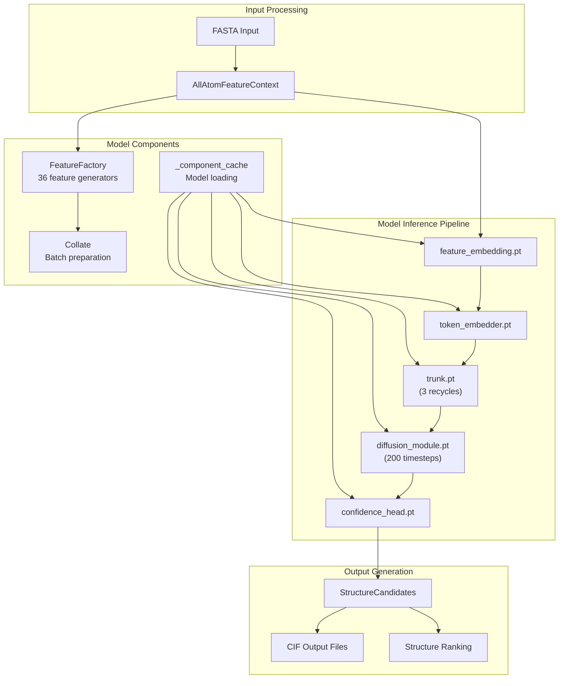
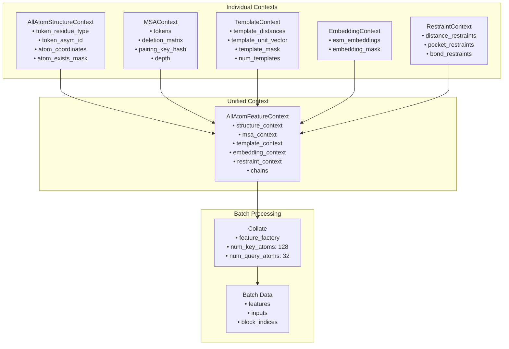
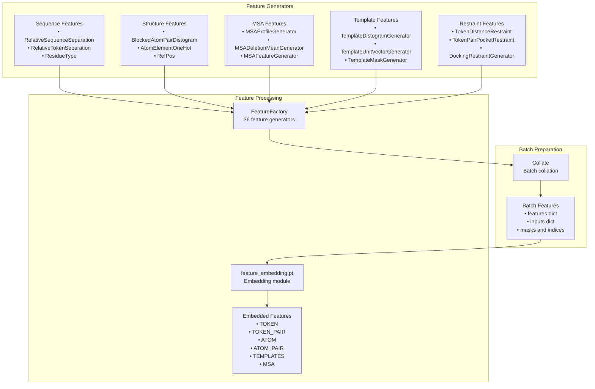
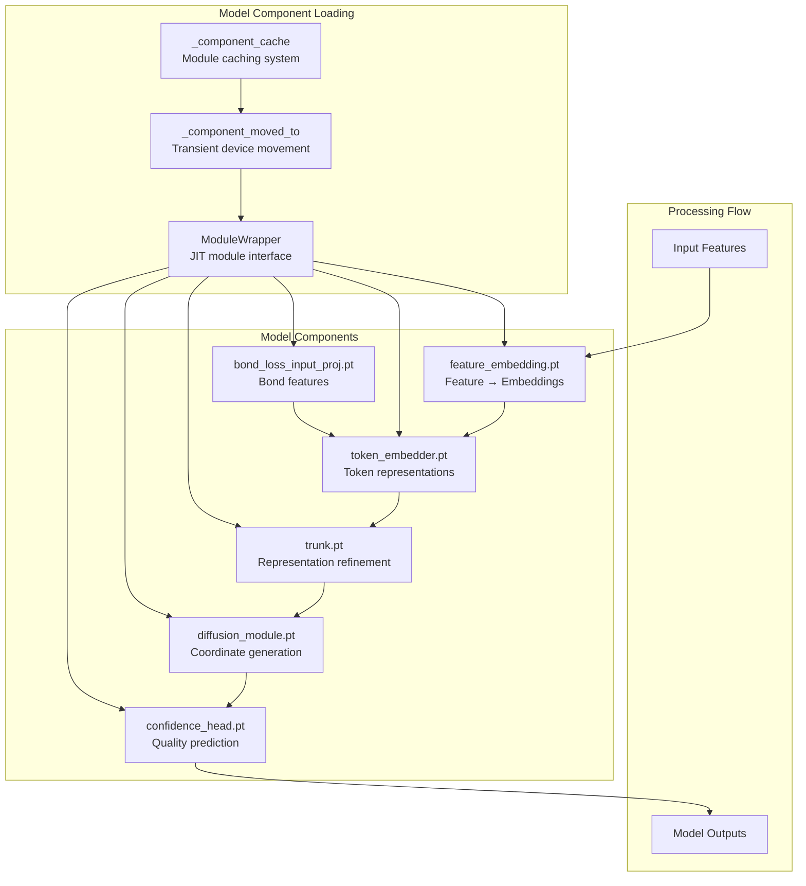
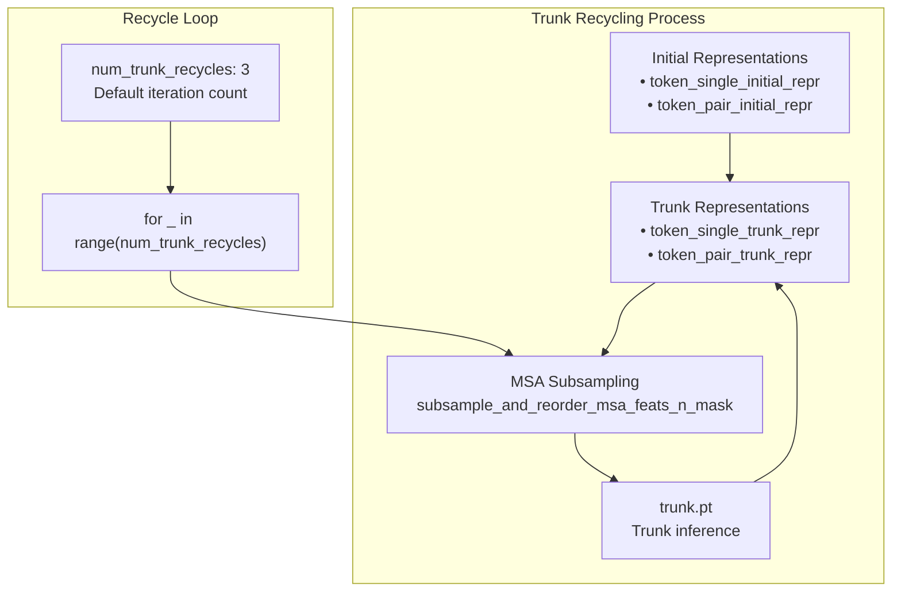
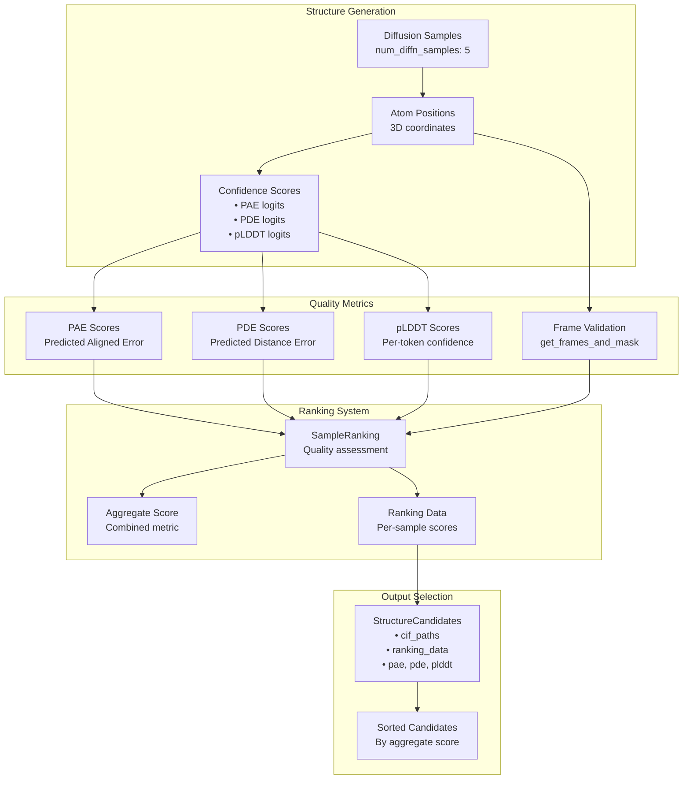

# Core Systems

> **Relevant source files**
> * [chai_lab/chai1.py](https://github.com/chaidiscovery/chai-lab/blob/66c38d1f/chai_lab/chai1.py)
> * [chai_lab/data/dataset/all_atom_feature_context.py](https://github.com/chaidiscovery/chai-lab/blob/66c38d1f/chai_lab/data/dataset/all_atom_feature_context.py)
> * [chai_lab/data/dataset/msas/utils.py](https://github.com/chaidiscovery/chai-lab/blob/66c38d1f/chai_lab/data/dataset/msas/utils.py)

This page documents the fundamental systems that comprise the Chai-1 inference engine. These core systems orchestrate the entire structure prediction pipeline, from input processing through model inference to output generation.

For details on the sequential execution flow, see [Inference Engine](/chaidiscovery/chai-lab/3.1-inference-engine). For documentation on core classes like `PDBContext` and `Chain`, see [Data Structures](/chaidiscovery/chai-lab/3.2-data-structures). For information on how the `FeatureFactory` assembles features, see [Feature Context Assembly](/chaidiscovery/chai-lab/3.3-feature-context-assembly). For details on confidence metrics like PAE and pLDDT, see [Structure Ranking](/chaidiscovery/chai-lab/3.4-structure-ranking).

## Core Inference Pipeline

The Chai-1 inference engine operates through a multi-stage pipeline that transforms molecular inputs into 3D structure predictions. The pipeline consists of feature embedding, trunk recycling, diffusion denoising, and confidence prediction stages.

### Pipeline Architecture

Sources: [chai_lab/chai1.py L498-L572](https://github.com/chaidiscovery/chai-lab/blob/66c38d1f/chai_lab/chai1.py#L498-L572)

 [chai_lab/chai1.py L579-L1059](https://github.com/chaidiscovery/chai-lab/blob/66c38d1f/chai_lab/chai1.py#L579-L1059)

### Main Inference Functions

The core inference logic is implemented in two primary functions:

* `run_inference`: Main entry point that handles input processing, feature context creation, and coordinates multiple trunk samples. [chai_lab/chai1.py L498-L572](https://github.com/chaidiscovery/chai-lab/blob/66c38d1f/chai_lab/chai1.py#L498-L572)
* `run_folding_on_context`: Core folding logic that executes the model inference pipeline on a prepared feature context. [chai_lab/chai1.py L579-L1059](https://github.com/chaidiscovery/chai-lab/blob/66c38d1f/chai_lab/chai1.py#L579-L1059)

The pipeline processes inputs through five sequential stages:

1. **Feature Embedding**: Converts raw features into embedded representations. [chai_lab/chai1.py L679-L685](https://github.com/chaidiscovery/chai-lab/blob/66c38d1f/chai_lab/chai1.py#L679-L685)
2. **Token Embedding**: Processes token-level features and creates initial representations. [chai_lab/chai1.py L721-L738](https://github.com/chaidiscovery/chai-lab/blob/66c38d1f/chai_lab/chai1.py#L721-L738)
3. **Trunk Recycling**: Iteratively refines representations through multiple recycles. [chai_lab/chai1.py L748-L777](https://github.com/chaidiscovery/chai-lab/blob/66c38d1f/chai_lab/chai1.py#L748-L777)
4. **Diffusion Denoising**: Generates 3D coordinates through a denoising process. [chai_lab/chai1.py L844-L886](https://github.com/chaidiscovery/chai-lab/blob/66c38d1f/chai_lab/chai1.py#L844-L886)
5. **Confidence Prediction**: Predicts confidence scores for generated structures. [chai_lab/chai1.py L894-L915](https://github.com/chaidiscovery/chai-lab/blob/66c38d1f/chai_lab/chai1.py#L894-L915)

Sources: [chai_lab/chai1.py L498-L572](https://github.com/chaidiscovery/chai-lab/blob/66c38d1f/chai_lab/chai1.py#L498-L572)

 [chai_lab/chai1.py L579-L1059](https://github.com/chaidiscovery/chai-lab/blob/66c38d1f/chai_lab/chai1.py#L579-L1059)

## Data Structure Architecture

The core data structures form a hierarchical system where individual contexts are assembled into a unified feature representation for model inference.

### Core Data Structure Hierarchy

Sources: [chai_lab/data/dataset/all_atom_feature_context.py L25-L40](https://github.com/chaidiscovery/chai-lab/blob/66c38d1f/chai_lab/data/dataset/all_atom_feature_context.py#L25-L40)

 [chai_lab/data/dataset/structure/all_atom_structure_context.py L38-L55](https://github.com/chaidiscovery/chai-lab/blob/66c38d1f/chai_lab/data/dataset/structure/all_atom_structure_context.py#L38-L55)

 [chai_lab/data/collate/collate.py L26-L38](https://github.com/chaidiscovery/chai-lab/blob/66c38d1f/chai_lab/data/collate/collate.py#L26-L38)

### Structure Context Integration

The `AllAtomStructureContext` serves as the foundational data structure containing atomic coordinates, molecular topology, and metadata. Multiple structure contexts are merged using `AllAtomStructureContext.merge()` to create a unified representation for complex molecular systems. [chai_lab/data/dataset/structure/all_atom_structure_context.py L164-L214](https://github.com/chaidiscovery/chai-lab/blob/66c38d1f/chai_lab/data/dataset/structure/all_atom_structure_context.py#L164-L214)

Key operations include:

* Token-level masking and indexing.
* Atomic coordinate management.
* Covalent bond tracking.
* Glycan leaving atom handling via `drop_glycan_leaving_atoms_inplace()`. [chai_lab/chai1.py L483](https://github.com/chaidiscovery/chai-lab/blob/66c38d1f/chai_lab/chai1.py#L483-L483)

Sources: [chai_lab/chai1.py L377-L379](https://github.com/chaidiscovery/chai-lab/blob/66c38d1f/chai_lab/chai1.py#L377-L379)

 [chai_lab/chai1.py L483](https://github.com/chaidiscovery/chai-lab/blob/66c38d1f/chai_lab/chai1.py#L483-L483)

## Feature Context Assembly

The feature context assembly system combines diverse molecular features into a unified representation suitable for model inference. This process involves feature generation, embedding, and batch preparation.

### Feature Generation Pipeline

Sources: [chai_lab/chai1.py L172-L236](https://github.com/chaidiscovery/chai-lab/blob/66c38d1f/chai_lab/chai1.py#L172-L236)

 [chai_lab/chai1.py L636-L647](https://github.com/chaidiscovery/chai-lab/blob/66c38d1f/chai_lab/chai1.py#L636-L647)

 [chai_lab/chai1.py L679-L716](https://github.com/chaidiscovery/chai-lab/blob/66c38d1f/chai_lab/chai1.py#L679-L716)

### Feature Factory Configuration

The system uses a comprehensive `FeatureFactory` with 36 different feature generators organized by type:

* **Sequence Features**: Relative separations, entity relationships, residue types. [chai_lab/chai1.py L173-L179](https://github.com/chaidiscovery/chai-lab/blob/66c38d1f/chai_lab/chai1.py#L173-L179)
* **Structure Features**: Atom distances, elements, coordinates, charges. [chai_lab/chai1.py L180-L190](https://github.com/chaidiscovery/chai-lab/blob/66c38d1f/chai_lab/chai1.py#L180-L190)
* **MSA Features**: Profile statistics, deletion patterns, pairing information. [chai_lab/chai1.py L199-L210](https://github.com/chaidiscovery/chai-lab/blob/66c38d1f/chai_lab/chai1.py#L199-L210)
* **Template Features**: Structural templates, distance constraints, unit vectors. [chai_lab/chai1.py L211-L216](https://github.com/chaidiscovery/chai-lab/blob/66c38d1f/chai_lab/chai1.py#L211-L216)
* **Restraint Features**: Distance restraints, pocket constraints, docking restraints. [chai_lab/chai1.py L221-L235](https://github.com/chaidiscovery/chai-lab/blob/66c38d1f/chai_lab/chai1.py#L221-L235)

Sources: [chai_lab/chai1.py L172-L236](https://github.com/chaidiscovery/chai-lab/blob/66c38d1f/chai_lab/chai1.py#L172-L236)

 [chai_lab/data/features/feature_factory.py L17-L26](https://github.com/chaidiscovery/chai-lab/blob/66c38d1f/chai_lab/data/features/feature_factory.py#L17-L26)

## Model Components

The Chai-1 model consists of primary components loaded as JIT-compiled modules. Each component is managed through a caching system that optimizes memory usage during inference.

### Component Architecture

Sources: [chai_lab/chai1.py L115-L166](https://github.com/chaidiscovery/chai-lab/blob/66c38d1f/chai_lab/chai1.py#L115-L166)

 [chai_lab/chai1.py L679-L916](https://github.com/chaidiscovery/chai-lab/blob/66c38d1f/chai_lab/chai1.py#L679-L916)

### Component Management

The model components are managed through a caching and device movement system:

* **ModuleWrapper**: Provides a unified interface for JIT modules with device management. [chai_lab/chai1.py L115-L137](https://github.com/chaidiscovery/chai-lab/blob/66c38d1f/chai_lab/chai1.py#L115-L137)
* **Component Caching**: Global cache `_component_cache` stores loaded modules to avoid repeated disk I/O. [chai_lab/chai1.py L151](https://github.com/chaidiscovery/chai-lab/blob/66c38d1f/chai_lab/chai1.py#L151-L151)
* **Transient Movement**: `_component_moved_to` context manager temporarily moves modules to GPU for inference. [chai_lab/chai1.py L154-L166](https://github.com/chaidiscovery/chai-lab/blob/66c38d1f/chai_lab/chai1.py#L154-L166)

Sources: [chai_lab/chai1.py L115-L166](https://github.com/chaidiscovery/chai-lab/blob/66c38d1f/chai_lab/chai1.py#L115-L166)

 [chai_lab/chai1.py L151](https://github.com/chaidiscovery/chai-lab/blob/66c38d1f/chai_lab/chai1.py#L151-L151)

### Trunk Recycling System

The trunk component implements an iterative refinement process where representations are recycled:

Sources: [chai_lab/chai1.py L744-L777](https://github.com/chaidiscovery/chai-lab/blob/66c38d1f/chai_lab/chai1.py#L744-L777)

 [chai_lab/data/dataset/msas/utils.py L51-L86](https://github.com/chaidiscovery/chai-lab/blob/66c38d1f/chai_lab/data/dataset/msas/utils.py#L51-L86)

## Structure Ranking System

The structure ranking system evaluates generated structure candidates using multiple quality metrics to identify the most confident predictions.

### Ranking Pipeline

Sources: [chai_lab/chai1.py L283-L335](https://github.com/chaidiscovery/chai-lab/blob/66c38d1f/chai_lab/chai1.py#L283-L335)

 [chai_lab/chai1.py L984-L1050](https://github.com/chaidiscovery/chai-lab/blob/66c38d1f/chai_lab/chai1.py#L984-L1050)

 [chai_lab/ranking/rank.py L101-L135](https://github.com/chaidiscovery/chai-lab/blob/66c38d1f/chai_lab/ranking/rank.py#L101-L135)

### Confidence Metrics

The system computes three primary confidence metrics:

1. **PAE (Predicted Aligned Error)**: Inter-residue position error predictions. [chai_lab/chai1.py L931-L935](https://github.com/chaidiscovery/chai-lab/blob/66c38d1f/chai_lab/chai1.py#L931-L935)
2. **PDE (Predicted Distance Error)**: Distance-based error predictions. [chai_lab/chai1.py L937-L941](https://github.com/chaidiscovery/chai-lab/blob/66c38d1f/chai_lab/chai1.py#L937-L941)
3. **pLDDT (Per-residue confidence)**: Local confidence scores converted from per-atom to per-token. [chai_lab/chai1.py L943-L958](https://github.com/chaidiscovery/chai-lab/blob/66c38d1f/chai_lab/chai1.py#L943-L958)

Sources: [chai_lab/chai1.py L920-L958](https://github.com/chaidiscovery/chai-lab/blob/66c38d1f/chai_lab/chai1.py#L920-L958)

 [chai_lab/chai1.py L1001-L1015](https://github.com/chaidiscovery/chai-lab/blob/66c38d1f/chai_lab/chai1.py#L1001-L1015)

### Candidate Selection

The `StructureCandidates` class manages multiple structure predictions with associated quality metrics:

* **Sorting**: Candidates are sorted by aggregate score in descending order. [chai_lab/chai1.py L307-L318](https://github.com/chaidiscovery/chai-lab/blob/66c38d1f/chai_lab/chai1.py#L307-L318)
* **Concatenation**: Multiple trunk samples can be combined using `StructureCandidates.concat()`. [chai_lab/chai1.py L320-L335](https://github.com/chaidiscovery/chai-lab/blob/66c38d1f/chai_lab/chai1.py#L320-L335)

Sources: [chai_lab/chai1.py L283-L335](https://github.com/chaidiscovery/chai-lab/blob/66c38d1f/chai_lab/chai1.py#L283-L335)

 [chai_lab/chai1.py L1052-L1059](https://github.com/chaidiscovery/chai-lab/blob/66c38d1f/chai_lab/chai1.py#L1052-L1059)