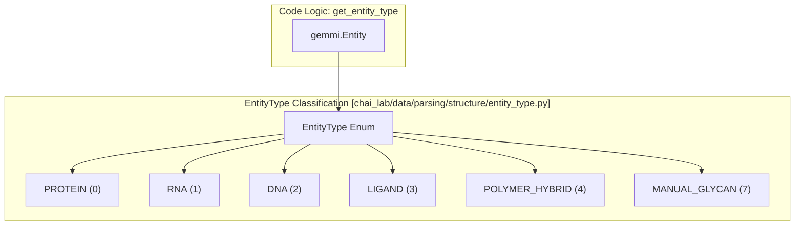
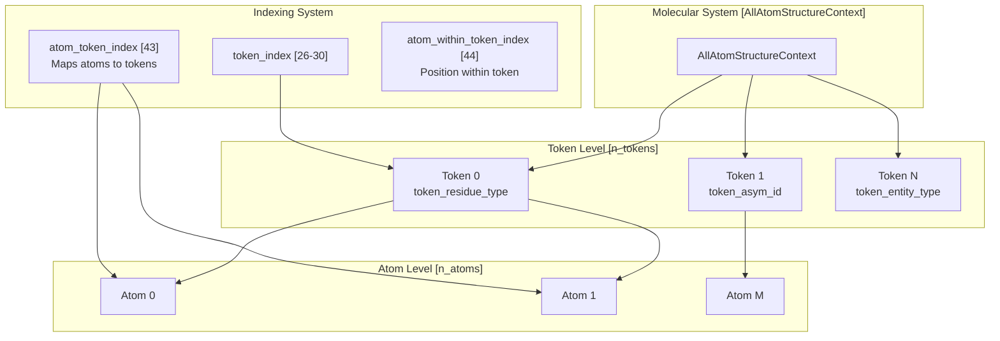
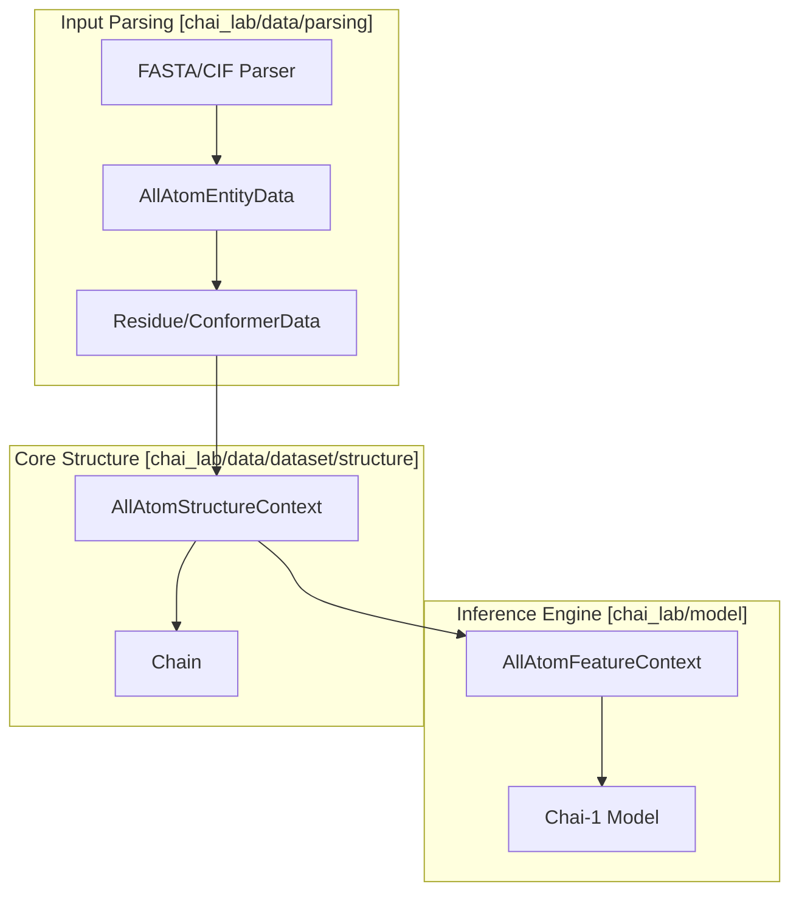

# Data Structures

> **Relevant source files**
> * [chai_lab/data/dataset/structure/all_atom_structure_context.py](https://github.com/chaidiscovery/chai-lab/blob/66c38d1f/chai_lab/data/dataset/structure/all_atom_structure_context.py)
> * [chai_lab/data/dataset/structure/chain.py](https://github.com/chaidiscovery/chai-lab/blob/66c38d1f/chai_lab/data/dataset/structure/chain.py)
> * [chai_lab/data/features/token_utils.py](https://github.com/chaidiscovery/chai-lab/blob/66c38d1f/chai_lab/data/features/token_utils.py)
> * [chai_lab/data/parsing/structure/all_atom_entity_data.py](https://github.com/chaidiscovery/chai-lab/blob/66c38d1f/chai_lab/data/parsing/structure/all_atom_entity_data.py)
> * [chai_lab/data/parsing/structure/entity_type.py](https://github.com/chaidiscovery/chai-lab/blob/66c38d1f/chai_lab/data/parsing/structure/entity_type.py)
> * [chai_lab/data/parsing/structure/residue.py](https://github.com/chaidiscovery/chai-lab/blob/66c38d1f/chai_lab/data/parsing/structure/residue.py)
> * [requirements.dev](https://github.com/chaidiscovery/chai-lab/blob/66c38d1f/requirements.dev)

## Purpose and Scope

This document covers the core data structures used throughout the Chai-1 system, with a particular focus on the `AllAtomStructureContext` class. This class serves as the central data container for molecular structure information, bridging input processing, feature generation, and model inference. It also documents supporting structures like `AllAtomEntityData`, `Chain`, and `Residue` that facilitate the transition from raw structural files to tensorized representations.

## Core Data Entities

The system uses a hierarchy of data structures to represent molecular information from raw sequence/structure data down to atom-level tensors.

### Entity and Residue Representation

Before data is tensorized into a context, it is managed as Python objects that preserve chemical metadata.

| Class | File Path | Purpose |
| --- | --- | --- |
| `AllAtomEntityData` | [chai_lab/data/parsing/structure/all_atom_entity_data.py L34-L51](https://github.com/chaidiscovery/chai-lab/blob/66c38d1f/chai_lab/data/parsing/structure/all_atom_entity_data.py#L34-L51) | Stores metadata for a unique chemical entity (protein, ligand, etc.), including its full sequence and source PDB info. |
| `Chain` | [chai_lab/data/dataset/structure/chain.py L14-L20](https://github.com/chaidiscovery/chai-lab/blob/66c38d1f/chai_lab/data/dataset/structure/chain.py#L14-L20) | A container linking `AllAtomEntityData` with its tokenized `AllAtomStructureContext`. |
| `Residue` | [chai_lab/data/parsing/structure/residue.py L72-L82](https://github.com/chaidiscovery/chai-lab/blob/66c38d1f/chai_lab/data/parsing/structure/residue.py#L72-L82) | Represents a single monomer (amino acid, nucleotide, or ligand) and its associated `ConformerData`. |
| `ConformerData` | [chai_lab/data/parsing/structure/residue.py L19-L26](https://github.com/chaidiscovery/chai-lab/blob/66c38d1f/chai_lab/data/parsing/structure/residue.py#L19-L26) | Stores 3D positions, elements, charges, and symmetries for atoms within a residue. |

**Sources:** [chai_lab/data/parsing/structure/all_atom_entity_data.py L34-L51](https://github.com/chaidiscovery/chai-lab/blob/66c38d1f/chai_lab/data/parsing/structure/all_atom_entity_data.py#L34-L51)

 [chai_lab/data/dataset/structure/chain.py L14-L20](https://github.com/chaidiscovery/chai-lab/blob/66c38d1f/chai_lab/data/dataset/structure/chain.py#L14-L20)

 [chai_lab/data/parsing/structure/residue.py L19-L82](https://github.com/chaidiscovery/chai-lab/blob/66c38d1f/chai_lab/data/parsing/structure/residue.py#L19-L82)

### Molecular Entity Types

The system classifies entities using the `EntityType` enum, which dictates how they are tokenized and processed.

**Sources:** [chai_lab/data/parsing/structure/entity_type.py L13-L48](https://github.com/chaidiscovery/chai-lab/blob/66c38d1f/chai_lab/data/parsing/structure/entity_type.py#L13-L48)

## AllAtomStructureContext

The `AllAtomStructureContext` is the primary tensorized data structure. It organizes molecular data using a hierarchical token-atom relationship, where tokens typically represent residues or small molecular fragments.

### Data Organization Hierarchy

**Sources:** [chai_lab/data/dataset/structure/all_atom_structure_context.py L26-L73](https://github.com/chaidiscovery/chai-lab/blob/66c38d1f/chai_lab/data/dataset/structure/all_atom_structure_context.py#L26-L73)

### Field Categories

| Category | Purpose | Key Fields |
| --- | --- | --- |
| **Token-level** | Residue/monomer properties | `token_residue_type`, `token_asym_id`, `token_entity_type`, `token_residue_index` |
| **Atom-level** | Individual atom properties | `atom_ref_pos`, `atom_ref_element`, `atom_ref_charge`, `atom_ref_name_chars` |
| **Indexing** | Token-atom relationships | `atom_token_index`, `atom_within_token_index`, `token_centre_atom_index` |
| **Structure-level** | Global metadata | `pdb_id`, `resolution`, `is_distillation` |
| **Connectivity** | Molecular bonds | `atom_covalent_bond_indices`, `symmetries` |

**Sources:** [chai_lab/data/dataset/structure/all_atom_structure_context.py L27-L73](https://github.com/chaidiscovery/chai-lab/blob/66c38d1f/chai_lab/data/dataset/structure/all_atom_structure_context.py#L27-L73)

## Core Operations

### Data Manipulation

`AllAtomStructureContext` provides methods for subsetting and combining molecular systems.

* **`index_select(idxs)`**: Selects a subset of tokens. It reindexes both tokens and their associated atoms, ensuring that `atom_token_index` and `atom_covalent_bond_indices` remain valid for the new subset [chai_lab/data/dataset/structure/all_atom_structure_context.py L99-L194](https://github.com/chaidiscovery/chai-lab/blob/66c38d1f/chai_lab/data/dataset/structure/all_atom_structure_context.py#L99-L194)
* **`merge(contexts)`**: A class method that concatenates multiple contexts into one. It calculates offsets for token and atom indices to maintain the global mapping [chai_lab/data/dataset/structure/all_atom_structure_context.py L360-L495](https://github.com/chaidiscovery/chai-lab/blob/66c38d1f/chai_lab/data/dataset/structure/all_atom_structure_context.py#L360-L495)
* **`to(device)`**: Transfers all constituent tensors to the specified hardware (CPU/GPU) [chai_lab/data/dataset/structure/all_atom_structure_context.py L497-L503](https://github.com/chaidiscovery/chai-lab/blob/66c38d1f/chai_lab/data/dataset/structure/all_atom_structure_context.py#L497-L503)

### Reference Atom Utilities

The system uses specific atoms as "anchors" for tokens (e.g., C-alpha for proteins). The utility `token_utils.py` provides functions to extract these:

* `get_centre_positions_and_mask`: Retrieves coordinates for the atom defined by `token_centre_atom_index` [chai_lab/data/features/token_utils.py L13-L30](https://github.com/chaidiscovery/chai-lab/blob/66c38d1f/chai_lab/data/features/token_utils.py#L13-L30)
* `get_token_reference_atom_positions_and_mask`: Retrieves positions for reference atoms (like CB for proteins or C2/C4 for nucleic acids) [chai_lab/data/features/token_utils.py L34-L54](https://github.com/chaidiscovery/chai-lab/blob/66c38d1f/chai_lab/data/features/token_utils.py#L34-L54)

**Sources:** [chai_lab/data/dataset/structure/all_atom_structure_context.py L99-L503](https://github.com/chaidiscovery/chai-lab/blob/66c38d1f/chai_lab/data/dataset/structure/all_atom_structure_context.py#L99-L503)

 [chai_lab/data/features/token_utils.py L13-L54](https://github.com/chaidiscovery/chai-lab/blob/66c38d1f/chai_lab/data/features/token_utils.py#L13-L54)

## Validation and Integrity

The `__post_init__` method of `AllAtomStructureContext` enforces structural constraints:

1. **Coordinate Check**: Errors if no valid coordinates are found while `num_atoms > 0` [chai_lab/data/dataset/structure/all_atom_structure_context.py L78-L80](https://github.com/chaidiscovery/chai-lab/blob/66c38d1f/chai_lab/data/dataset/structure/all_atom_structure_context.py#L78-L80)
2. **Mask Consistency**: Verifies that if an atom exists, its parent token must also be marked as existing [chai_lab/data/dataset/structure/all_atom_structure_context.py L84-L88](https://github.com/chaidiscovery/chai-lab/blob/66c38d1f/chai_lab/data/dataset/structure/all_atom_structure_context.py#L84-L88)
3. **Bond Validity**: Ensures `atom_covalent_bond_indices` do not exceed the total atom count [chai_lab/data/dataset/structure/all_atom_structure_context.py L91-L92](https://github.com/chaidiscovery/chai-lab/blob/66c38d1f/chai_lab/data/dataset/structure/all_atom_structure_context.py#L91-L92)

**Sources:** [chai_lab/data/dataset/structure/all_atom_structure_context.py L74-L93](https://github.com/chaidiscovery/chai-lab/blob/66c38d1f/chai_lab/data/dataset/structure/all_atom_structure_context.py#L74-L93)

## Integration with System Architecture

The data structures bridge the gap between input parsing and the inference engine.

**Sources:** [chai_lab/data/dataset/structure/all_atom_structure_context.py L1-L536](https://github.com/chaidiscovery/chai-lab/blob/66c38d1f/chai_lab/data/dataset/structure/all_atom_structure_context.py#L1-L536)

 [chai_lab/data/parsing/structure/all_atom_entity_data.py L1-L134](https://github.com/chaidiscovery/chai-lab/blob/66c38d1f/chai_lab/data/parsing/structure/all_atom_entity_data.py#L1-L134)

 [chai_lab/data/dataset/structure/chain.py L1-L27](https://github.com/chaidiscovery/chai-lab/blob/66c38d1f/chai_lab/data/dataset/structure/chain.py#L1-L27)