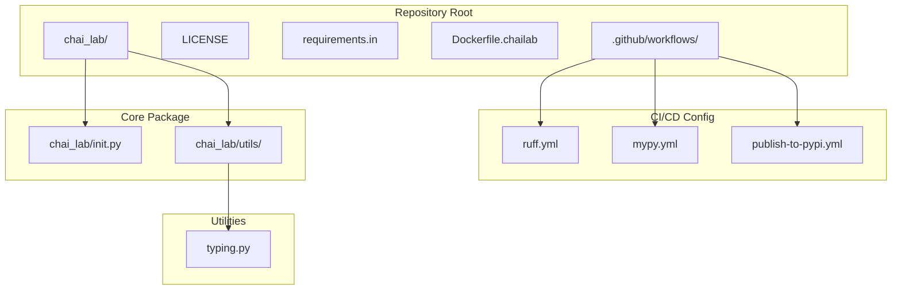
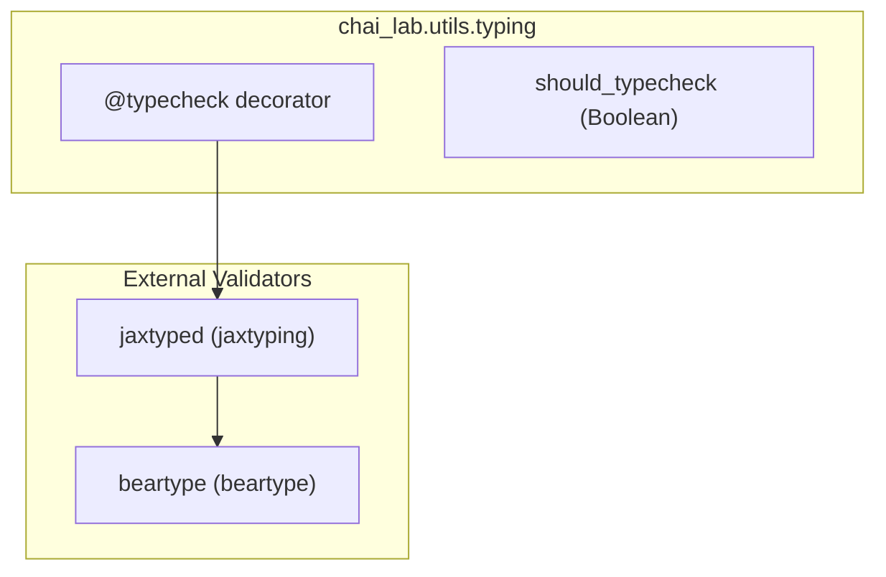
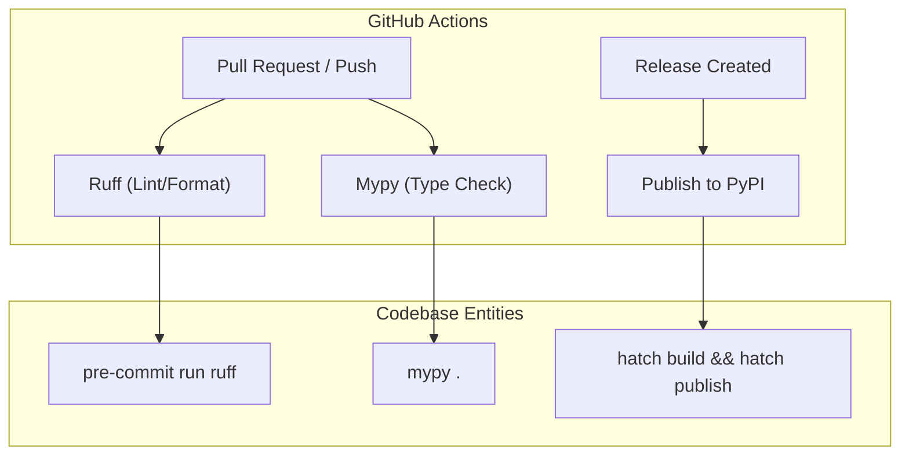

# Development

> **Relevant source files**
> * [.github/workflows/mypy.yml](https://github.com/chaidiscovery/chai-lab/blob/66c38d1f/.github/workflows/mypy.yml)
> * [.github/workflows/publish-to-pypi.yml](https://github.com/chaidiscovery/chai-lab/blob/66c38d1f/.github/workflows/publish-to-pypi.yml)
> * [.github/workflows/ruff.yml](https://github.com/chaidiscovery/chai-lab/blob/66c38d1f/.github/workflows/ruff.yml)
> * [Dockerfile.chailab](https://github.com/chaidiscovery/chai-lab/blob/66c38d1f/Dockerfile.chailab)
> * [LICENSE](https://github.com/chaidiscovery/chai-lab/blob/66c38d1f/LICENSE)
> * [chai_lab/__init__.py](https://github.com/chaidiscovery/chai-lab/blob/66c38d1f/chai_lab/__init__.py)
> * [chai_lab/utils/typing.py](https://github.com/chaidiscovery/chai-lab/blob/66c38d1f/chai_lab/utils/typing.py)

This page provides essential information for developers contributing to the `chai-lab` codebase. It covers the repository structure, development environment setup, key utilities, and coding standards. This guide assumes you are familiar with Python development and want to contribute code, fix bugs, or extend the system.

For end-users looking to use Chai-1 for structure prediction, please refer to [Getting Started](/chaidiscovery/chai-lab/2-getting-started). For detailed information on specific development topics, see the subsections: [Type System](/chaidiscovery/chai-lab/9.1-type-system), [Testing Framework](/chaidiscovery/chai-lab/9.2-testing-framework), and [CI/CD Pipeline](/chaidiscovery/chai-lab/9.3-cicd-pipeline).

## Repository Structure

The Chai Lab repository follows a modular organization designed to separate concerns and maintain clean interfaces between components.

**Repository Organization Diagram**



Sources: [chai_lab/__init__.py L1-L6](https://github.com/chaidiscovery/chai-lab/blob/66c38d1f/chai_lab/__init__.py#L1-L6)

 [chai_lab/utils/typing.py L1-L49](https://github.com/chaidiscovery/chai-lab/blob/66c38d1f/chai_lab/utils/typing.py#L1-L49)

 [.github/workflows/ruff.yml L1-L29](https://github.com/chaidiscovery/chai-lab/blob/66c38d1f/.github/workflows/ruff.yml#L1-L29)

## Development Environment

To work on the `chai-lab` codebase, you can use the provided `Dockerfile.chailab` to ensure a consistent environment. The environment is based on Ubuntu 22.04 and uses `uv` for fast dependency management [Dockerfile.chailab L1-L75](https://github.com/chaidiscovery/chai-lab/blob/66c38d1f/Dockerfile.chailab#L1-L75)

### Docker Environment Configuration

The development container sets up several important environment variables to manage caches and Python behavior:

| Variable | Value | Purpose |
| --- | --- | --- |
| `MYPY_CACHE_DIR` | `/tmp/.chai_lab_mypy_cache` | Keeps large mypy cache outside the working tree [Dockerfile.chailab L11](https://github.com/chaidiscovery/chai-lab/blob/66c38d1f/Dockerfile.chailab#L11-L11) |
| `PYTHONPYCACHEPREFIX` | `/tmp/.chai_lab_pycache` | Keeps `__pycache__` out of the source tree [Dockerfile.chailab L17](https://github.com/chaidiscovery/chai-lab/blob/66c38d1f/Dockerfile.chailab#L17-L17) |
| `PYTHONFAULTHANDLER` | `1` | Prints tracebacks after segfaults [Dockerfile.chailab L15](https://github.com/chaidiscovery/chai-lab/blob/66c38d1f/Dockerfile.chailab#L15-L15) |
| `VIRTUAL_ENV` | `/opt/venv` | Location of the virtual environment [Dockerfile.chailab L60](https://github.com/chaidiscovery/chai-lab/blob/66c38d1f/Dockerfile.chailab#L60-L60) |

Sources: [Dockerfile.chailab L1-L85](https://github.com/chaidiscovery/chai-lab/blob/66c38d1f/Dockerfile.chailab#L1-L85)

## Type System

Chai-1 uses a robust static and runtime type checking system to ensure code correctness, especially for tensor operations.

### Type Checking Architecture

The codebase uses a combination of `beartype` and `jaxtyping` for runtime type validation and array shape verification. This is controlled by a central `typecheck` decorator.



Sources: [chai_lab/utils/typing.py L23-L33](https://github.com/chaidiscovery/chai-lab/blob/66c38d1f/chai_lab/utils/typing.py#L23-L33)

For details, see [Type System](/chaidiscovery/chai-lab/9.1-type-system).

## Testing Framework

The testing infrastructure ensures that changes do not break existing functionality. It includes unit tests and integration tests that are run locally and in CI.

* **Local Testing**: Developers are encouraged to run `pytest` before submitting PRs.
* **Static Analysis**: The project uses `mypy` for static type checking and `ruff` for linting and formatting.

For details, see [Testing Framework](/chaidiscovery/chai-lab/9.2-testing-framework).

## CI/CD Pipeline

The codebase employs GitHub Actions to automate quality checks and deployment.

### Workflow Integration



Sources: [.github/workflows/ruff.yml L24-L28](https://github.com/chaidiscovery/chai-lab/blob/66c38d1f/.github/workflows/ruff.yml#L24-L28)

 [.github/workflows/mypy.yml L29](https://github.com/chaidiscovery/chai-lab/blob/66c38d1f/.github/workflows/mypy.yml#L29-L29)

 [.github/workflows/publish-to-pypi.yml L35](https://github.com/chaidiscovery/chai-lab/blob/66c38d1f/.github/workflows/publish-to-pypi.yml#L35-L35)

For details, see [CI/CD Pipeline](/chaidiscovery/chai-lab/9.3-cicd-pipeline).

## Licensing and Contributions

Chai-1 is licensed under the Apache License 2.0 [LICENSE L1-L5](https://github.com/chaidiscovery/chai-lab/blob/66c38d1f/LICENSE#L1-L5)

### Copyright Header

All source files must include the standard copyright header:

```markdown
# Copyright (c) 2024 Chai Discovery, Inc.# Licensed under the Apache License, Version 2.0.# See the LICENSE file for details.
```

Sources: [chai_lab/__init__.py L1-L3](https://github.com/chaidiscovery/chai-lab/blob/66c38d1f/chai_lab/__init__.py#L1-L3)

 [chai_lab/utils/typing.py L1-L3](https://github.com/chaidiscovery/chai-lab/blob/66c38d1f/chai_lab/utils/typing.py#L1-L3)